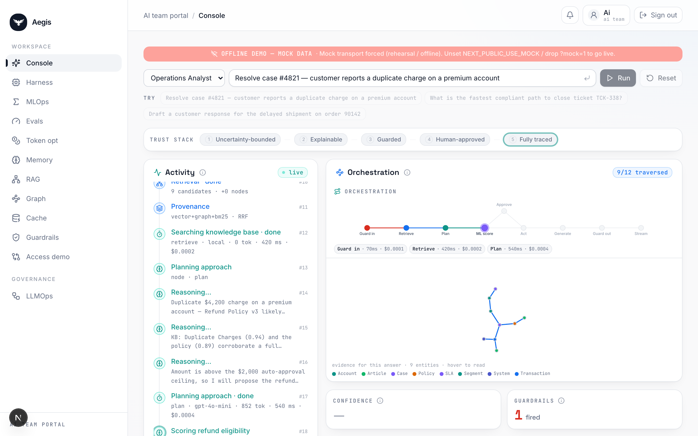
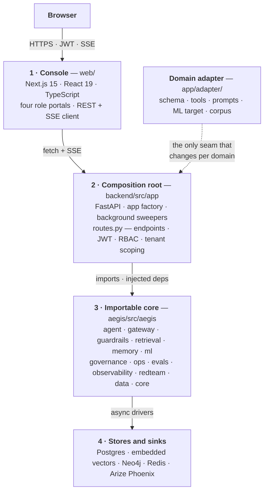
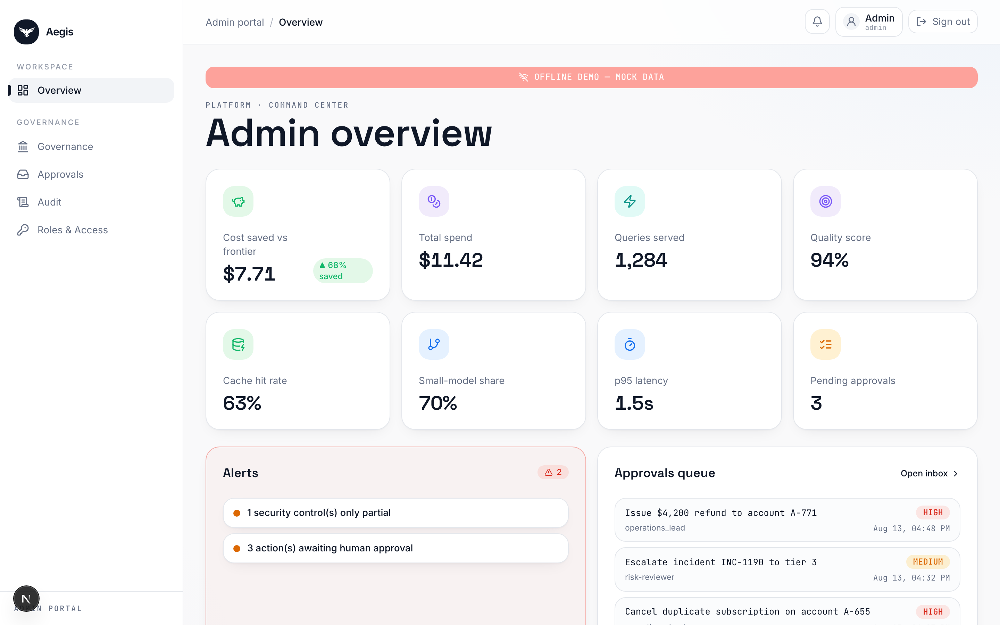
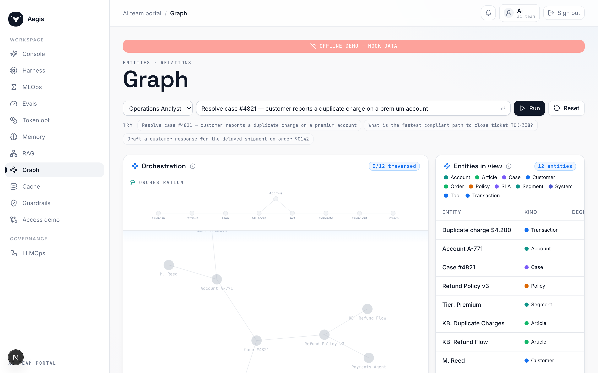
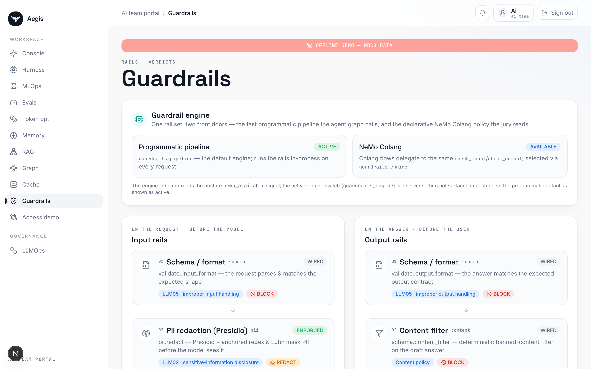
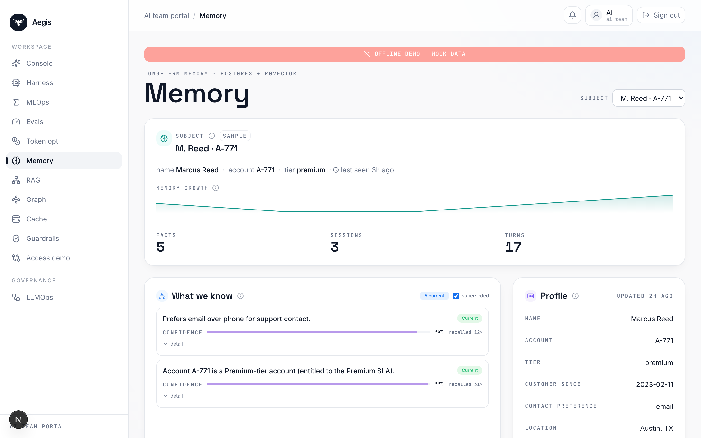

<div align="center">


# Aegis

**Autonomy you can audit.**

A domain-agnostic enterprise agentic-AI platform. Every autonomous action is
uncertainty-bounded, explainable, guarded, human-approved and fully traced.

</div>



> The console mid-run: live reasoning, the orchestration graph with per-node
> timings and cost, retrieval provenance, and the human gate. Screenshots in this
> README are captured on **offline demo data** — the console's own red banner in
> each shot says so, and it is left uncropped on purpose.

---

## What Aegis is

Most agent stacks are a framework plus glue: they can call tools, but they cannot
tell you *why* they acted, *what* they read, *who* approved it, or *what it cost*.
Aegis is built the other way around — the instrumentation is the product.

- **Cheap enough to scale.** Every model call funnels through one gateway with
  per-tenant budgets enforced *before* spend, role→model routing, and a durable
  usage ledger.
- **Measurable enough to trust.** Calibrated conformal intervals and SHAP drivers
  on the ML signal; an offline evaluation gate and a CI regression gate on
  retrieval quality; OpenTelemetry traces on every run.
- **Secure enough to buy.** Multi-tenant RBAC with Postgres row-level security,
  six guardrail layers, and an append-only audit log.
- **It takes real actions** — behind a risk-tiered human gate.

**The core is a package you import, not an application you fork.** Point Aegis at
a new domain by writing one adapter; the core never learns the domain.

---

## Quickstart

```bash
git clone https://github.com/yrevash/aegis.git && cd aegis

# macOS / Linux
./scripts/bootstrap.sh && ./scripts/dev-native.sh
cd web && npm run dev

# Windows (elevated PowerShell) — toolchain, native stores, dependencies
.\scripts\install-windows.ps1
.\scripts\start.ps1 -Mode full
```

Then open **http://localhost:3000**. Demo logins: `admin` / `ai` / `devops` /
`client`, password `demo`.

Three run modes, so a demo never depends on infrastructure being healthy:

| Mode | What runs | Needs |
|---|---|---|
| `safe` | Console only, in-browser mock transport | nothing |
| `lite` | Real agent, no databases (SQLite audit) | a model API key |
| `full` | Everything, all three server stores | key + Postgres, Neo4j, Redis (vectors are embedded) |

No Docker, no GPU, no WSL anywhere. Every store is a native local install.
On Windows, Redis is **Memurai** — same wire protocol, same port, no config change.

---

## The twelve modules

Every capability is a first-class **Aegis module**: a branded name paired with its
**honest underlying tech**. Branding, never hiding. This table mirrors the live
manifest in `backend/src/app/capabilities.py`, served publicly at
`GET /platform/capabilities`.

| Module | Tech underneath | What it is |
|---|---|---|
| **Aegis Gateway** | LiteLLM | Single model chokepoint: routing, budgets, timeout, retry, usage ledger |
| **Aegis Router** | LangGraph | Multi-agent supervisor — routes a turn to the right specialist |
| **Aegis Memory** | Postgres + embedded Chroma | Episodic · semantic · procedural, bitemporal, consolidated |
| **Aegis Cache** | Redis / Memurai | Semantic response cache |
| **Aegis Retrieval** | Neo4j/LightRAG + embedded NanoVectorDB | Hybrid RAG: vector + graph + BM25 → RRF → LLM rerank |
| **Aegis Signal** | XGBoost + MAPIE + SHAP | Ensemble + calibrated conformal intervals + SHAP |
| **Aegis Guardrails** | programmatic + NeMo Colang | Input/output rails: injection, PII, schema, content |
| **Aegis Evals** | RAGAS-style proxies + LLM judge | Trace-level and answer evaluation |
| **Aegis Loop** | native | LLM-Ops self-improvement: trace → eval → diagnose → tiered release |
| **Aegis Governance** | Postgres RLS + JWT | Multi-tenant RBAC, budgets, RLS, audit log |
| **Aegis Trace** | OpenTelemetry → Phoenix | End-to-end glass-box tracing |
| **Aegis Tools / MCP** | native + MCP SDK | Risk-tiered tool registry + human gate, exposed over MCP |

---

## Architecture



### The request path

`POST /query` → `guard_input` → `route` → `recall_memory` → `retrieve` →
`ml_predict` → `plan` → `gate` → *(approval interrupt)* → `act` → `reflect` →
`generate` → `guard_output` → `persist_memory`

Two rules the whole design hangs on:

1. **ML informs, it never gates.** The prediction and its conformal interval are
   evidence injected into the plan. The human gate fires on a **tool's risk
   tier** — never on model confidence.
2. **A gated run checkpoints durably** and resumes on any worker from a persisted
   approvals-inbox row.

---

## The trust stack

Six checkpoints stand between the model and a real action:

| # | Checkpoint | Mechanism |
|---|---|---|
| 01 | Input rails | injection classification · PII · schema · topical scope, fail-closed |
| 02 | Retrieval | vector + graph + BM25 → RRF → rerank, every claim cited |
| 03 | Signal | conformal interval + SHAP drivers |
| 04 | Human gate | by tool risk tier |
| 05 | Governance | budget enforced before spend · row-level security |
| 06 | Audit | OpenTelemetry trace + append-only audit row |

---

## The console

Four role-scoped portals — `admin`, `ai_team`, `devops`, `client` — each a focused
subset of surfaces. Every claim the platform makes has a screen behind it.

| | |
|---|---|
|  |  |
| **Command centre** — spend, approvals, security posture, latency | **Knowledge graph** — the entities a run touched, from Neo4j |
|  |  |
| **Guardrails** — six layers, each with its own pass/block record | **Memory** — episodic, semantic and procedural recall |

---

## Pointing Aegis at a new domain

Only `backend/src/app/adapter/` changes. The core reaches the domain exclusively
through injected callables, so the seam stays isolated. Full checklist in
`backend/src/app/adapter/SWAP.md`.

| File | What it defines |
|---|---|
| `schema.py` | Entities and enums — the shared vocabulary |
| `ml_spec.py` | `FEATURES` / `TARGET` and the prediction narrative |
| `generator.py` | Synthetic records: procedural draws + LLM fabrication |
| `tools.py` | Domain actions — typed, idempotent, reversible, audited, risk-tiered |
| `personas.py` · `prompts.py` | Personas, data scope, system prompts |
| `corpus/` | Seed knowledge documents |

Domain logic never leaks into the core.

---

## Repository layout

```
aegis/          # the importable core — 14 modules, 723 tests
backend/        # FastAPI composition root — 51 endpoints, 593 tests
  src/app/
    api/        # routes + Pydantic contracts + SSE event schema
    agent/      # LangGraph orchestration
    adapter/    # the domain seam
    platform/   # role-portal read surfaces
web/            # Next.js console — landing page + four role portals
docs/           # teaching path, ADRs, module reference, threat model
scripts/        # bootstrap · preflight · start  (.sh and .ps1)
```

## Verification

```bash
cd backend && .venv/bin/python -m pytest -q      # 593 passed
cd web && npx tsc --noEmit && npx next build     # clean
```

## Documentation

Start with **[`docs/learn/00-what-aegis-is.md`](docs/learn/00-what-aegis-is.md)** —
a six-file path from zero to the whole system. `INSTALL.md` is the setup manual;
[`docs/README.md`](docs/README.md) indexes everything else.

| | |
|---|---|
| [`docs/learn/`](docs/learn/) | The teaching path — architecture, backend, frontend, pipelines |
| [`docs/module/`](docs/module/) | Per-module reference for the importable core |
| [`docs/adr/`](docs/adr/) | Eight architecture decision records |
| [`docs/security/`](docs/security/) | Threat model and OWASP Agentic Top-10 mapping |
| [`docs/operations/runbook.md`](docs/operations/runbook.md) | One-page operations guide and fallback ladder |

Live, self-describing surfaces: `GET /docs` (OpenAPI), `GET /platform/capabilities`
(the module manifest as data, public), `GET /about`.
