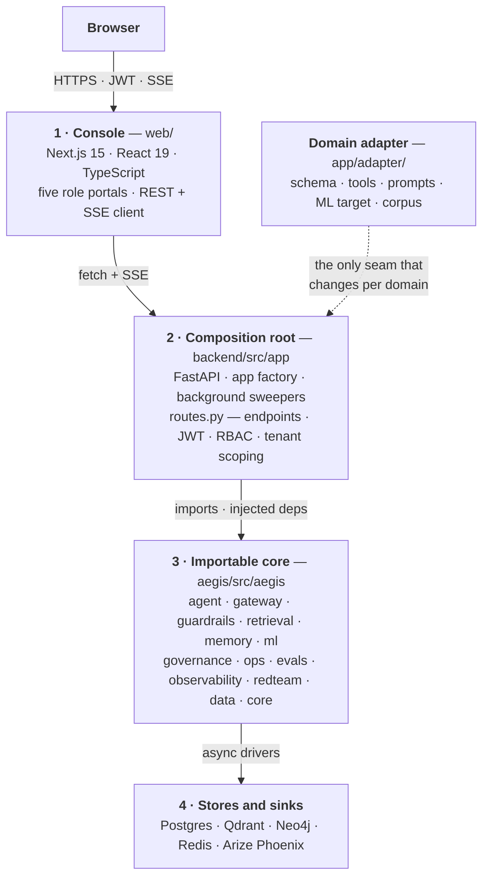

<div align="center">


# Aegis

**Autonomy you can audit.**

A domain-agnostic enterprise agentic-AI platform. Every autonomous action is
uncertainty-bounded, explainable, guarded, human-approved and fully traced.

</div>

> **There are no screenshots in this README, on purpose.** Five were embedded here
> until `7e218909` ("take ML out of the agent graph, and delete every invented
> thing") deleted the image files, and they were pictures of a console that this
> repository no longer builds. A stale screenshot is the one claim in a README
> nobody can check by reading the code, so it is the last one that should be
> allowed to rot. Run `./scripts/bootstrap.sh && ./scripts/dev-native.sh`, open
> <http://localhost:3000>, and the console shows you the current thing: live
> reasoning, the orchestration graph with per-node timings and cost, retrieval
> provenance, and the human gate.

---

## What Aegis is

Most agent stacks are a framework plus glue: they can call tools, but they cannot
tell you *why* they acted, *what* they read, *who* approved it, or *what it cost*.
Aegis is built the other way around — the instrumentation is the product.

- **Cheap enough to scale.** Every model call funnels through one gateway with
  per-tenant budgets enforced *before* spend, role→model routing, and a durable
  usage ledger.
- **Measurable enough to trust.** Calibrated conformal intervals and SHAP drivers
  on the ML signal; a deterministic offline eval gate and a CI regression gate on
  retrieval quality, plus real `ragas` metrics on demand — metered through the same
  gateway as everything else; OpenTelemetry traces on every run.
- **Secure enough to buy.** Multi-tenant RBAC with Postgres row-level security,
  six guardrail layers, and a hash-chained audit log anyone can re-verify.
- **It takes real actions** — behind a risk-tiered human gate.

**The core is a package you import, not an application you fork.** Point Aegis at
a new domain by writing one adapter; the core never learns the domain.

---

## Quickstart

```bash
git clone https://github.com/yrevash/aegis.git && cd aegis

# macOS / Linux
./scripts/bootstrap.sh && ./scripts/dev-native.sh
cd web && npm run dev

# Windows (elevated PowerShell) — toolchain, native stores, dependencies
.\scripts\install-windows.ps1
.\backend\scripts\start-windows.ps1
```

Then open **http://localhost:3000**. Seed the accounts first — `cd backend &&
PYTHONPATH=src:../aegis/src .venv/bin/python -m app.seed` — there is no fallback login
table, so an unseeded backend answers 503 and says exactly that. Logins:
`admin` / `ai` / `devops` / `client` (platform staff) and `northwind.admin` /
`vertex.admin` (the two seeded tenants), password `demo`.

**Ask a corpus question as `northwind.admin`, not as `admin`.** The platform accounts
carry no `tenant_id` and own no documents, so a retrieval run as one of them returns
zero candidates — that is row-level security working, not a broken index. `INSTALL.md`
spells it out, because it has cost real debugging time.

Three run modes, so a demo never depends on infrastructure being healthy:

| Mode | What runs | Needs |
|---|---|---|
| `safe` | Console only, in-browser mock transport | nothing |
| `lite` | Real agent, no databases (SQLite audit) | a model API key |
| `full` | Everything, all four server stores | key + Postgres, Neo4j, Redis, Qdrant |

No Docker, no GPU, no WSL anywhere. Every store is a native local install.
On Windows, Redis is **Memurai** — same wire protocol, same port, no config change.

---

## The fifteen modules

Every capability is a first-class **Aegis module**: a branded name paired with its
**honest underlying tech**. Branding, never hiding. This table mirrors the live
manifest in `backend/src/app/capabilities.py`, served publicly at
`GET /v1/platform/capabilities` — which counts itself, so the number above is checkable.

| Module | Tech underneath | What it is |
|---|---|---|
| **Aegis Gateway** | LiteLLM | Single model chokepoint: routing, budgets, timeout, retry, usage ledger |
| **Aegis Router** | LangGraph | Multi-agent supervisor — routes a turn to the right specialist |
| **Aegis Memory** | Postgres + Qdrant | Episodic · semantic · procedural, bitemporal, consolidated |
| **Aegis Cache** | Redis / Memurai | Semantic response cache |
| **Aegis Retrieval** | Neo4j/LightRAG + Qdrant | Hybrid RAG: vector + graph + keyword → RRF → local cross-encoder rerank |
| **Aegis Signal** | XGBoost + MAPIE + SHAP | Ensemble + calibrated conformal intervals + SHAP |
| **Aegis Voice** | hosted Whisper via LiteLLM | Speech to text, chunked on silence, behind the full text rails |
| **Aegis Forecast** | Nixtla `statsforecast` + conformal intervals | Time-series forecasts whose interval coverage is measured (optional) |
| **Aegis Guardrails** | programmatic + NeMo Colang | Input/output rails: injection, PII, schema, content |
| **Aegis Evals** | Deterministic proxies offline, real `ragas` metrics live | Trace-level and answer evaluation |
| **Aegis Loop** | native | LLM-Ops self-improvement: trace → eval → diagnose → tiered release |
| **Aegis Governance** | Postgres RLS + JWT | Multi-tenant RBAC, budgets, RLS, hash-chained audit log |
| **Aegis Trace** | OpenTelemetry → Phoenix | End-to-end glass-box tracing |
| **Aegis Vision** | hosted Llama-3.2-90B-Vision + Presidio image redactor | Image understanding with the injection screen ahead of the model |
| **Aegis Tools / MCP** | native + MCP SDK | Risk-tiered tool registry + human gate, exposed over MCP (optional) |

---

## Architecture



### The request path

`POST /v1/query` → `guard_input` → `route` → `recall_memory` → `retrieve` →
`ml_predict` → `plan` → `gate` → *(approval interrupt)* → `act` → `verify` →
`reflect` → *(back to `plan`, or on to)* → `generate` → `guard_output` →
`persist_memory`

Three rules the whole design hangs on:

1. **ML informs, it never gates.** The prediction and its conformal interval are
   evidence injected into the plan. The human gate fires on a **tool's risk
   tier** — never on model confidence.
2. **A gated run checkpoints durably** and resumes on any worker from a persisted
   approvals-inbox row.
3. **`act` does not report its own success.** `verify` sits between `act` and
   `reflect` and decides against something outside the model, in three tiers,
   cheapest first: **deterministic** (tool rows and rail verdicts), **read-back**
   (one read-only call proving the write landed), then a single reasoning call
   only where neither settled it. Where nothing in the deployment can confirm the
   write, the verdict is `unverifiable` and says so rather than assuming. There is
   no self-critique tier — asking a model to grade its own work is not
   verification. The loop stops on the **third identical failing attempt**, because
   the second is the retry this loop exists to perform.

---

## The trust stack

Six checkpoints stand between the model and a real action:

| # | Checkpoint | Mechanism |
|---|---|---|
| 01 | Input rails | injection classification · PII · schema · topical scope, fail-closed |
| 02 | Retrieval | vector + graph + keyword → RRF → rerank, every claim cited |
| 03 | Signal | conformal interval + SHAP drivers |
| 04 | Human gate | by tool risk tier |
| 05 | Governance | budget enforced before spend · row-level security |
| 06 | Audit | OpenTelemetry trace + hash-chained audit row, verifiable at `GET /v1/audit/verify` |

Two bounds sit across all six, because an agent that cannot be stopped is not
guarded: `agent.max_trajectory_tokens` (36000) caps one lane's whole trajectory and
`agent.max_tool_result_tokens` (4000) caps a single tool result's contribution to it.
Both are settings-catalogue keys a tenant may tighten and never loosen, and both are
enforced on the main graph *and* on every sub-agent lane. A lane cut at its ceiling
ends in `SubAgentStatus.CEILING` — a designed terminal state that keeps what it found
and is reported as itself on the wire, not dressed up as `done`.

---

## Standards and compliance readiness

> **Compliance-readiness evidence — not certification.**
> Aegis holds **no** ISO 27001 certificate, **no** ISO/IEC 42001 certificate, **no**
> SOC 2 report and **no** EU AI Act conformity assessment. Nobody independent has
> audited any of it. What follows is a control-by-control map from published
> frameworks to **files, routes and tests in this repository** — the kind of thing a
> buyer's security reviewer can open and check, not a badge.

Thirteen frameworks are mapped, India's law first because for a deployment in India the
DPDP Act is *law* and the rest is practice:

| Jurisdiction | Frameworks |
|---|---|
| **India** | DPDP Act 2023 + Rules 2025 · CERT-In Directions · MeitY IAGG, RBI ITGRCA, SEBI CSCRF, BIS IS 17428 |
| **International** | OWASP LLM Top 10 · OWASP Agentic Top 10 · OWASP Top 10 · MITRE ATLAS · NIST AI RMF · ISO/IEC 42001 · ISO/IEC 27001 · EU AI Act · SOC 2 TSC · GDPR |

Every control sits in one of **four** states — `enforced`, `partial`,
`not_implemented`, `not_applicable` — and the last two are stated plainly rather than
dressed up. `enforced` costs the most to claim: it needs a *file* reference **and** a
*test* reference, and the test suite refuses one without the other.

**The totals are deliberately not printed here.** They change whenever a control
changes state, and a number typed into a README is a number nobody re-derives. Read
them from the surfaces that count them on every request:

| Where | What it gives | Who can read it |
|---|---|---|
| [`docs/compliance/README.md`](docs/compliance/README.md) | The written authority — every control, its state, its evidence and what is missing | anyone with the repo |
| `GET /v1/platform/standards` | Framework names, jurisdictions and the four derived counts | **public**, no token — this is what the landing page renders |
| `GET /v1/compliance` | The full control-by-control map with every file, route and test | platform staff only — a public gap map is a target list |

`backend/tests/api/test_compliance.py` resolves **every** evidence reference against
the real filesystem, the real served route table and the real pytest node ids on each
run, so a claim naming a file that no longer exists fails the suite rather than
reaching a reviewer.

---

## What the stack actually runs on

The mechanisms behind the pitch, each with the file it lives in. Every row but the
last is also a cell on the landing page, where `web/tests/landing/stackClaims.test.mjs`
resolves its path against the repository on each run — so a renamed module breaks a
test instead of leaving a claim standing. Row-level security is off that band only
because the page already draws it as its own exhibit, and a page should not make one
argument twice.

| | Mechanism | In the repository |
|---|---|---|
| **LangGraph** | A parked run resumes on a fresh worker, from a durable Postgres checkpoint | `backend/src/app/agent/checkpointer.py` |
| **Temporal** | Ingestion, reindex and reconcile run as durable workflows | `backend/src/app/jobs/flows/ingest.py` |
| **Qdrant** | The vector arm of a retrieve — one engine, never an in-memory dict | `aegis/src/aegis/retrieval/vector_store.py` |
| **LightRAG + Neo4j** | The graph arm, over an entity graph extracted from the corpus | `aegis/src/aegis/retrieval/lightrag_backend.py` |
| **Reciprocal Rank Fusion** | One ranking out of the arms, each passage keeping its origin | `aegis/src/aegis/retrieval/fusion.py` |
| **ONNX cross-encoder** | Reorders the fused pool locally — deterministic, and off the gateway | `aegis/src/aegis/retrieval/local_reranker.py` |
| **Presidio** | PII detected and masked on input, on output and on tool results | `aegis/src/aegis/guardrails/pii.py` |
| **NeMo Guardrails** | Colang rails layered over the always-on programmatic pipeline | `aegis/src/aegis/guardrails/nemo.py` |
| **MAPIE** | Conformal intervals whose coverage is measured, not asserted | `aegis/src/aegis/ml/model.py` |
| **SHAP** | Per-prediction drivers, so a signal can be argued with | `aegis/src/aegis/ml/model.py` |
| **Offline eval gate** | Deterministic lexical proxies — no LLM call, no network | `aegis/src/aegis/evals/metrics.py` |
| **Live eval** | **Real `ragas` metrics**, every judge call metered through the Aegis gateway | `aegis/src/aegis/evals/libs/gateway_adapters.py` |
| **OpenTelemetry + OpenInference** | GenAI semantic-convention spans across every run | `aegis/src/aegis/observability/semconv.py` |
| **Apache Superset** | Embedded dashboards behind a guest token carrying the tenant RLS | `aegis/src/aegis/analytics/rls.py` |
| **Postgres RLS** | `FORCE ROW LEVEL SECURITY`, and a `NOSUPERUSER NOBYPASSRLS` serving role | `aegis/src/aegis/governance/rls.py` |

The proof for the first row is
`backend/tests/agent/test_durable_approvals.py::test_fresh_worker_rehydrates_and_resumes_by_thread_id`
— park the run, restart the worker, resume from the checkpoint.

**One correction this README owes its own retrieval claim.** The third arm beside
vector and graph is a keyword arm, and it is **PostgreSQL `ts_rank`, not Okapi BM25**.
It has term frequency and length normalisation and it has **no IDF**, so a rare term
and a common one weigh the same. That is a real difference in ranking behaviour, and it
is bought deliberately: the tenant predicate and the full-text predicate sit on the same
row of the same table, so tenant isolation is a `WHERE` clause rather than a second
index to keep in sync. `aegis/src/aegis/retrieval/lightrag_backend.py` states it in the
same words, and the console labels the arm "Keyword (ts_rank)".

Both of these sections are rendered on the public landing page, and **both are
removable by one constant** in `web/src/components/landing/bands.config.ts`, whose
docstring says exactly what each switch takes off the page.

---

## The console

Five role-scoped portals — `platform_admin`, `tenant_admin`, `ai_team`, `devops`,
`client` — each a focused subset of surfaces, listed in
`web/src/lib/portal.ts::ROLE_SECTIONS`. The two admin tiers are separate portals on
purpose: administering one tenant and operating the platform are different jobs, and
signing in is what decides which. Every claim the platform makes has a screen behind it.

Four screens worth opening first, and where each one lives:

| Screen | Where | What it shows |
|---|---|---|
| **Command centre** | `/app/platform_admin/dashboard` | Spend, approvals, security posture, latency |
| **Knowledge graph** | `/app/ai_team/graph` | The entities a run touched, read from Neo4j |
| **Guardrails** | `/app/ai_team/guardrails` | Six layers, each with its own pass/block record — and a live rail that fires real adversarial payloads at `GET /v1/stream/guardrail-demo` rather than replaying a stored verdict |
| **Interop** | `/app/devops/interop` | The four published standards, probed live |

Every screen is governed by two rules written out in `DESIGN.md` §4: **a listing opens
closed** (hover reveals, click pins), and **a page explains itself without prose**. The
forcing function is a ten-to-fifteen minute demo of the whole platform — a screen a
reviewer cannot read in seconds has failed, however correct it is. What that never
licenses is deleting evidence: a `Receipt`, an `Absence` and an active failure's
remediation always stay. Quiet comes from relocating, never removing.

---

## Interoperability — four published standards, all four checkable

The parts of Aegis that a buyer's own tooling can talk to without asking us for
anything. Each is served, not described; the paths below are the whole claim.

| Standard | Where | What it is |
|---|---|---|
| **A2A 1.0** | `GET /.well-known/agent-card.json` · `GET /.well-known/jwks.json` · `POST /v1/a2a` | Another agent discovers this one and sends it work. JSON-RPC, two methods in the 1.0 PascalCase spelling: `SendMessage` and `GetTask` |
| **MCP** | `POST /mcp/mcp` (Streamable HTTP) | This agent's risk-tiered tools, exposed to any MCP client. Server name `aegis-adapter-tools` — it was `tcs-adapter-tools` |
| **CycloneDX 1.6** | `GET /v1/platform/agbom` | The agent bill of materials — 25 components, served as `application/vnd.cyclonedx+json` |
| **OpenTelemetry** | every run | GenAI semantic-convention spans, exported to Phoenix |

The console renders all four on **Interop**, reachable from the `platform_admin`,
`ai_team` and `devops` portals. The A2A block on that page is a **live probe, not a
claim**: the protocol version, the interfaces and the skill list are read from the
running deployment on mount, so a card that stops answering leaves the page saying
nothing rather than continuing to advertise.

Three things stated plainly, because each is the kind of thing a standards page is
usually quiet about:

- **The card's `capabilities` are all `false`.** `streaming`, `pushNotifications` and
  `extendedAgentCard` each name a method this surface does not implement, and two of
  them were `true` for a release. A peer routes its call on these flags, so an unearned
  `true` is worse than a `false` — it sends a working client into a method that answers
  `-32601`.
- **The card is unsigned unless `a2a_public_origin` is configured.** The origin is read
  from configuration and *never* from `request.base_url`: a `Host:` header once put an
  attacker's URL inside a signature this platform's own key had certified. With no
  configured identity the card is served honestly with relative URLs and no
  `signatures` array, rather than signed over a guessed origin.
- **A2A's `tenant` field never sets database scope.** It arrives before authentication
  and is entirely caller-controlled; Aegis's tenancy is a Postgres GUC set from a
  verified bearer token. When the two disagree the request is refused, and the refusal
  is byte-identical whichever tenant was named — so the error cannot be used to
  enumerate which tenants exist.

The AgBOM is deterministic apart from its `metadata.timestamp`, and its `serialNumber`
is derived from the content, so two builds of the same platform produce the same
identifier and a changed component changes it.

---

## Pointing Aegis at a new domain

Only `backend/src/app/adapter/` changes. The core reaches the domain exclusively
through injected callables, so the seam stays isolated. **The full procedure —
which file to edit, in what order, and the command that proves each step — is
[`SKILL.md`](SKILL.md).**

Ten pieces: eight modules plus two content directories.

| # | Piece | What it defines |
|---|---|---|
| 1 | `schema.py` | Entities and enums — the shared vocabulary |
| 2 | `ml_spec.py` | `FEATURES` / `TARGET`, the latent signal, and the prediction narrative |
| 3 | `generator.py` | Synthetic records: procedural draws + LLM fabrication + templated fallback |
| 4 | `tools.py` | Domain actions — typed, idempotent, reversible, audited, risk-tiered |
| 5 | `personas.py` | Who is served: data scope + tool allowlist per persona |
| 6 | `prompts.py` | The system prompt per persona (paired with 5) |
| 7 | `memory_spec.py` | What counts as a durable fact, and who it is scoped to |
| 8 | `roster.py` | Which specialists the supervisor may route to |
| 9 | `corpus/` | Seed knowledge documents |
| 10 | `skills/` | Procedural how-to-act playbooks |

`__init__.py` is not a piece — it is the registry, and its `__all__` is the
contract to keep stable. Domain logic never leaks into the core;
`backend/tests/adapter/test_piece_manifest.py` counts the pieces on disk and
fails if any document disagrees with it.

---

## Repository layout

```
aegis/          # the importable core — 29 subpackages, 2438 tests
backend/        # FastAPI composition root — 122 documented routes, 2210 tests
  src/app/
    api/        # routes + Pydantic contracts + SSE event schema
    a2a/        # the Agent2Agent surface — card, signing, JSON-RPC
    agent/      # LangGraph orchestration
    adapter/    # the domain seam
    platform/   # role-portal read surfaces, and the CycloneDX AgBOM
web/            # Next.js console — landing page + five role portals
docs/           # learn path, teaching course, ADRs, module reference, threat model
scripts/        # bootstrap · preflight · start  (.sh and .ps1)
```

The route count is `paths` in the committed `backend/openapi.json`; the three
infrastructure probes (`/health`, `/ready`, `/readyz`) and the two A2A well-known paths
are served outside the schema and are not in it.

## Verification

Measured on this tree, 2026-08-28:

```bash
cd aegis   && PYTHONPATH=src ../backend/.venv/bin/python -m pytest -q   # 2424 passed, 14 skipped
cd backend && PYTHONPATH=src:../aegis/src .venv/bin/python -m pytest -q # 2209 passed, 1 skipped
cd web     && npx tsc --noEmit && npx next lint --dir src && npm test   # 406 passed
cd web     && npx next build                                           # 70/70 pages
```

## Documentation

Start with
**[`docs/architecture/system-architecture.md`](docs/architecture/system-architecture.md)** —
the whole platform, top to bottom, in one file. `docs/install/` is the setup path;
[`docs/README.md`](docs/README.md) indexes everything else.

| | |
|---|---|
| [`docs/architecture/system-architecture.md`](docs/architecture/system-architecture.md) | The system, end to end — layers, stores, gateway, security model, one question traced through |
| [`docs/install/`](docs/install/README.md) | Bring-up: prerequisites, the ordered runbook, the demo seeders |
| [`docs/teaching/`](docs/teaching/README.md) | The course — one file per `aegis.*` module, from no prior knowledge to defending every design decision |
| [`docs/module/MODULE_REFERENCE.md`](docs/module/MODULE_REFERENCE.md) | The Module Contract, the streaming spine, and the module map for the importable core |
| [`docs/adr/`](docs/adr/) | Nine architecture decision records |
| [`docs/security/`](docs/security/) | Threat model and OWASP Agentic Top-10 mapping |
| [`docs/operations/runbook.md`](docs/operations/runbook.md) | One-page operations guide and fallback ladder |

Live, self-describing surfaces: `GET /docs` (OpenAPI, at the root — it is not a
versioned product route), `GET /v1/platform/capabilities` (the module manifest as data,
public) and `GET /v1/about`.
