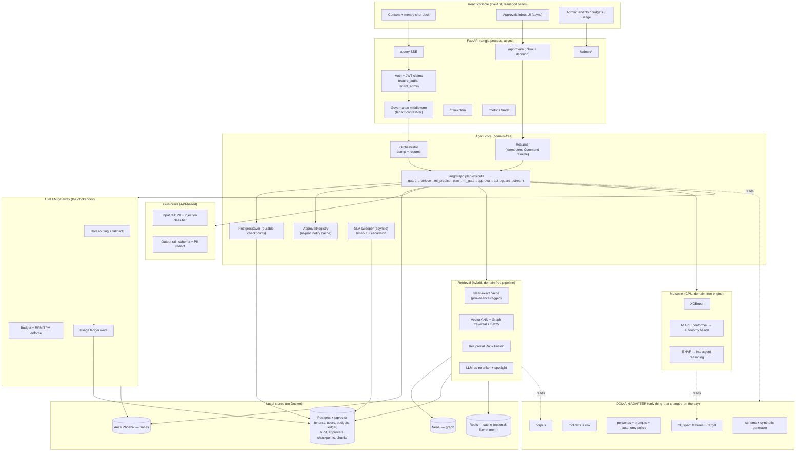

# ARCHITECTURE_REVIEW.md — TAIF S2 Principal Architecture Review

> **Scope.** A production-grade design review of the TAIF S2 domain-agnostic agentic
> platform against six concerns, plus a target architecture and a dependency-ordered
> build plan. Founder decisions honored: **full production-grade depth** on all six
> concerns, and **both** approval models (dramatic in-run gate for the demo **and** a
> durable async approvals inbox).
>
> **Hard constraints respected throughout:** 16 GB Windows laptop, **no Docker**, **no
> GPU**, local-or-API only, **blind on-the-day** problem, and **domain logic only in the
> adapter** (`backend/src/app/adapter/*`), never in the core.
>
> **Method.** Every "current state" claim cites a file and line range that was read.
> Every "SOTA-correct" claim cites a source URL. Nothing here is from memory alone.

---

## 0. Executive summary

The codebase is unusually clean and already SOTA-shaped: DI seams everywhere
(`AgentDeps`, `Retriever`, injected Redis/LLM), OTel `gen_ai.*` spans, a real
XGBoost+MAPIE+SHAP spine, a LangGraph plan-execute graph with a genuine `interrupt()`
human gate, and a proper frontend transport abstraction. The defects are not sloppiness —
they are **the seams between "impressive demo" and "productionizable platform."** Six of
them:

1. **Approval is in-process and ephemeral.** The gate rendezvous is an
   `asyncio.Future` dict (`agent/approvals.py`) and the graph checkpointer is
   `InMemorySaver` (`agent/graph.py:382`). A crash, a restart, or a second worker loses
   every paused run; there is no queue, no inbox, no SLA, no auto-escalation.
2. **ML is a gate, not a solver.** The `ml` node only decides whether to *stop*
   (`agent/graph.py:196-230`); it never predicts-then-routes/prioritizes/recommends, and
   it only runs when the planner already proposed a tool call (`agent/graph.py:362-366`).
3. **RBAC is two hardcoded users, no tenancy.** `_DEMO_USERS` + in-memory `_TOKENS`
   (`api/routes.py:74-98`); the `users` table has no tenant, no budget, no RLS
   (`data/models.py:67-77`); the LiteLLM chokepoint enforces no per-tenant/per-user
   token budget (`core/llm.py`).
4. **The cache short-circuits quality.** A semantic hit at cosine ≥ 0.95 returns
   *before* recall/rerank ever run (`retrieval/pipeline.py:79-106`,
   `retrieval/cache.py:102-128`), and there is no reciprocal-rank fusion of vector+graph;
   the no-DB path is keyword-overlap only (`retrieval/memory.py:115-135`).
5. **The frontend defaults to scripted mock.** `USE_MOCK` is `true` unless explicitly
   disabled (`frontend/src/api/config.ts:16`), so the money-shot runs on fabricated data
   by default.
6. **No unifying target** ties tenancy → budget → durable approval → ML-in-the-loop →
   hybrid retrieval into one scalability + threat story.

The target architecture keeps every existing seam and adds four durable Postgres-backed
capabilities (approvals queue, tenancy/RBAC, budget ledger, hybrid retrieval index), a
LangGraph `PostgresSaver`, and a live-first frontend — all no-Docker, no-GPU, and with
domain logic confined to the adapter.

---

## 1. Scalable human approval — durable checkpointed pause + persisted inbox

### 1.1 Current state (cited)

- The graph compiles with an **in-memory** checkpointer:
  `return builder.compile(checkpointer=InMemorySaver())` (`agent/graph.py:382`, import
  at `:28`). The docstring itself notes this is "required for the human gate's
  interrupt/resume" — correct mechanism, non-durable store.
- The gate node calls `interrupt({...})` (`agent/graph.py:237-256`) and the graph routes
  `approval → act` on approve, `approval → generate` on reject
  (`agent/graph.py:367-376`).
- The two HTTP requests (`/query` SSE and `/approval`) rendezvous through an
  **in-process** `asyncio.Future` registry: `ApprovalRegistry._pending: dict[str,
  asyncio.Future]` (`agent/approvals.py:43-101`), a module-global
  `_default_registry` (`agent/approvals.py:105`). The class docstring is explicit:
  "The registry is process-local (the app is single-process)."
- The orchestrator registers the future *before* emitting `approval_required` to avoid a
  race, then `await registry.wait()` and resumes with `Command(resume=...)`
  (`agent/orchestrator.py:96-125`).
- `POST /approval` resolves the future, admin-only (`api/routes.py:428-446`).

### 1.2 The defect

The pause lives entirely in RAM in **one** process:

- **Not durable.** A restart/crash between `interrupt` and `/approval` loses the run.
  `InMemorySaver` state and the `asyncio.Future` both vanish.
- **Not multi-worker / not horizontally scalable.** A second Uvicorn worker cannot see
  another worker's pending future — the `/approval` call would hit the wrong process.
  This directly contradicts the platform's own "Statelessness → horizontal scaling"
  principle (`docs/security.md` §4.1).
- **Blocking.** The approver *must* answer while the SSE socket is held open. There is no
  "approve tomorrow from an inbox," no queue an admin can list, no SLA, no timeout, no
  escalation. `pending_ids()` (`agent/approvals.py:99`) is the closest thing to an inbox
  and it is ephemeral and unpersisted.

### 1.3 SOTA-correct production design

LangGraph's own persistence layer is the durable-execution substrate: swap
`InMemorySaver` for **`PostgresSaver`** (`langgraph-checkpoint-postgres`), which persists
each checkpoint so a graph can pause on an `interrupt` and resume — from another process
or after a restart — by loading state from Postgres keyed by `thread_id`
([LangChain persistence docs](https://docs.langchain.com/oss/python/langgraph/persistence),
[LangGraph in production: latency, replay, scale (Aerospike)](https://aerospike.com/blog/langgraph-production-latency-replay-scale/)). Note
the honest caveat: **checkpointers are persistence, not full durable execution** — they
snapshot state but do not by themselves give you exactly-once side-effect guarantees, so
tool execution must be made idempotent by the application
([Diagrid: checkpoints are not durable execution](https://www.diagrid.io/blog/checkpoints-are-not-durable-execution-why-langgraph-crewai-google-adk-and-others-fall-short-for-production-agent-workflows)).

**Decouple the pause from the socket** with a persisted approvals inbox implemented as a
Postgres queue — no Docker broker needed. Postgres `SELECT ... FOR UPDATE SKIP LOCKED` is
the canonical no-broker durable-queue primitive: multiple workers poll the same table and
never double-process a row
([Neon SKIP LOCKED queue guide](https://neon.com/guides/queue-system),
[PgQueuer](https://github.com/janbjorge/pgqueuer)). For visibility-timeout / re-delivery
semantics (needed for SLA auto-escalation), **PGMQ** gives SQS-like queues inside Postgres
with no background worker service
([Tembo PGMQ](https://legacy.tembo.io/blog/pgmq-self-regulating-queue/)). Given the
no-Docker constraint and that we already run local Postgres, a **thin `SKIP LOCKED` table
we own** is the right call (PGMQ is a Postgres *extension* that may not install cleanly on
a Windows-local no-Docker box — see Open Decision D1).

**Target flow (both models coexist):**

```
/query run reaches the gate
   → graph.interrupt() checkpoints to PostgresSaver (durable pause; thread_id = run_id)
   → orchestrator INSERTs an approvals row (status=PENDING, sla_deadline, tenant, persona,
     action, args, risk, ml_snapshot, trace_id) into the approvals inbox table
   → DEMO PATH: if the SSE socket is still open, ALSO await an in-process notify
     (keep today's ApprovalRegistry as a *fast-path cache*), so the dramatic in-run gate
     still resolves live on stage.
   → ASYNC PATH: the worker's SSE stream may end (client closes / times out). The run is
     NOT lost — it is a durable PENDING row + a Postgres checkpoint.
Admin approves out-of-band
   → POST /approvals/{id}/decision  (or the admin inbox UI) writes status=APPROVED/REJECTED
   → a resumer (background task or the next worker) loads thread_id from the row,
     calls graph.astream(Command(resume=...), config) to continue from the checkpoint,
     re-streaming remaining events to any subscriber (or running headless to completion).
```

- **SLA / timeout / auto-escalation.** Each row carries `sla_deadline`. A lightweight
  in-process `asyncio` sweeper (no cron, no Docker) scans `PENDING AND now() >
  sla_deadline` and applies a policy: escalate to a higher approver tier, or apply the
  configured default (`auto_reject` for HIGH risk = fail-safe; optional `auto_approve` for
  MEDIUM under a persona policy). Escalation just rewrites `assignee_tier` and pushes the
  deadline; every transition is an audit row.
- **Idempotent resume.** Two things can double-fire: the resume, and the tool. Guard the
  resume with an optimistic `UPDATE approvals SET status=RESUMING WHERE id=? AND
  status=APPROVED` — only the winner (rowcount=1) resumes. Guard the tool with an
  idempotency key = `hash(run_id, tool_call_id)` written to the audit/action table with a
  unique constraint, so a re-executed `act` node is a no-op replay
  (`agent/graph.py:258-281` already loops per `tool_call["id"]` — add the key there).
  This is exactly the application-level idempotency the Diagrid caveat above demands.
- **Coexistence.** Keep `ApprovalRegistry` (`agent/approvals.py`) as an **in-process
  notify cache** layered over the durable table: `register()`/`resolve()` still wake a
  live socket instantly (the demo's drama), but the **source of truth is the Postgres
  row**. If no live waiter exists, the decision still lands durably and the resumer picks
  it up. This gives the founder *both* models with one code path.

### 1.4 Trade-offs

- `PostgresSaver` adds ~20–50 ms per checkpoint write vs `InMemorySaver`'s ~0
  ([Aerospike: production LangGraph latency](https://aerospike.com/blog/langgraph-production-latency-replay-scale/)) — negligible
  against multi-second LLM calls, and only "worth it when you need multi-instance scale or
  audit history," which is precisely our thesis.
- A `SKIP LOCKED` table we own has no visibility-timeout re-delivery for free (we add the
  SLA sweeper); PGMQ gives that but risks a no-Docker install snag. See D1.
- Async inbox adds a resumer component and an admin inbox surface — real work, but it is
  the difference between "demo" and "enterprise procurement passes" (`docs/security.md`
  §6.7).

### 1.5 Constraint compliance

All Postgres-local (already required by `docs/backend.md` §6). No broker, no Docker, no
GPU. The sweeper is an `asyncio` task in the FastAPI process. Adapter isolation is
untouched — approvals are core platform plumbing; only *what* is risky
(`tool_risk`, `RiskLevel`) stays in the adapter (`agent/deps.py:189-194`).

---

## 2. ML as a first-class solver, not just a gate/classifier

### 2.1 Current state (cited)

- Two ML surfaces exist and **both only gate**:
  1. The injection classifier — a cheap LLM call returning `{injection, reason}`
     (`guardrails/classifier.py:108-131`) that *blocks* input.
  2. The trustworthy spine — `TrustworthyModel.predict_explain` returns
     `{prediction, conformal_interval, conformal_confidence, shap_attribution}`
     (`ml/model.py:224-248`). This is a genuinely strong artifact.
- But in the graph, the spine's output is consumed **only** to decide gating:
  `gated = high_risk or uncertain` (`agent/graph.py:210`), where uncertainty comes from
  `assess_uncertainty` on the conformal interval width/confidence
  (`agent/deps.py:82-114`). *(Superseded — see ADR 0007: ML no longer gates; the
  `assess_uncertainty`/`classify_autonomy` engine was removed from the backend and
  gating is now driven solely by the tool risk tier `AgentConfig.gate_min_risk`.
  The line/file refs in this bullet describe the old design.)* The prediction and SHAP are streamed to the UI
  (`agent/graph.py:216-224`) but never fed back into the agent's *reasoning* or its
  *routing/prioritization*.
- The `ml` node runs **only if the planner already proposed a tool call**: `plan →
  ("ml" if tool_calls else "generate")` (`agent/graph.py:362-366`). So ML is downstream of
  the decision, acting as a brake — never upstream, informing the decision.
- Features/target are correctly isolated in the adapter (`ml/spec.py:89-128` resolves
  `app.adapter.ml_spec`; `agent/deps.py:223-236` builds features via
  `app.adapter.features_for_request`). **This isolation is exactly right and must be
  preserved.**

### 2.2 The defect

The platform's differentiator sentence is "predict-then-act, uncertainty-bounded,
explainable." Today it is "act (LLM) then maybe-brake (ML)." The ML is a *safety
interlock*, not a *solver*. It does not: predict a target the agent then uses to
**prioritize** a queue, **route** to a tool/persona, or **recommend** an action; it does
not turn the conformal interval into **graded autonomy** (auto-act when tight, ask-human
when wide, abstain when degenerate); and SHAP never enters the LLM's context so the agent
cannot *reason about why* the model scored as it did.

### 2.3 SOTA-correct production design: ML-in-the-loop

**Predict-then-act.** Add an ML step **before** planning for action-shaped queries, so the
prediction *drives* the plan. This is the Self-RAG/agentic pattern of moving the decision
signal inside the loop rather than in front of it
([RAG architecture 2026](https://futureagi.com/blog/rag-architecture-llm-2025/)). Concretely,
insert an optional `ml_predict` node on the `retrieve → plan` edge whose output
(`prediction`, `interval`, top SHAP features) is injected into the planner's system/user
message. The planner then plans *conditioned on* the model: "predicted SLA-breach risk
0.82 (90% CI [0.71, 0.88]); top drivers: priority=+0.3, backlog=+0.2 → recommend
`escalate_ticket`." The target/features stay in the adapter; the *plumbing* is core.

**Uncertainty-aware autonomy (graded, not binary).** Replace the binary
`gated = high_risk or uncertain` with a three-band **conformal autonomy policy**:

| Conformal signal | Autonomy band | Behavior |
|---|---|---|
| Tight interval / singleton set / high confidence | **Autonomous** | act (subject to risk tier) |
| Wide interval / non-singleton set | **Defer** | route to the human approval inbox (§1) |
| Degenerate / no-coverage / empty set | **Abstain** | do not act; return an "insufficient confidence" answer |

This is the current SOTA framing: conformal prediction as a *distribution-free* trigger
for deferral — "trigger human assistance when prediction sets are non-singleton," and
"conformalized abstention policies that selectively defer uncertain predictions"
([conformal deferral / abstention 2025–26](https://xlab.upenn.edu/conformal-prediction-robotics/),
[ReDAct: uncertainty-aware deferral for LLM agents](https://arxiv.org/abs/2604.07036),
[ToolChain-CRC conformal risk control for agentic AI](https://arxiv.org/abs/2606.18467)).
The neuro-symbolic point is the money line for the jury: "if the neural classification
carries high uncertainty, the symbolic layer escalates to human-in-the-loop *regardless*
of the default risk tier"
([neuro-symbolic regulated automation](https://arxiv.org/abs/2606.13405)) — which is
literally `high_risk OR uncertain`, but now *graded* and with an abstain state. MAPIE's
classification path already computes prediction *sets* (`ml/model.py:265-280`) — surface
set **size** (currently discarded) as the non-singleton signal.

**SHAP explanations feed the agent's reasoning.** Pass the top-k signed SHAP features
into the planner and the final `generate` prompt so the answer *explains itself* from the
model's actual drivers (SHAP's game-theoretic consistency over LIME is already the stated
ADR, `docs/backend.md` §5). This closes the "explainable" claim end-to-end instead of
only rendering a side panel.

**Persona/policy-driven decisions.** The autonomy bands and the SLA/escalation defaults
(§1) become **per-persona policy** read from the adapter (`app.adapter.personas`,
`agent/deps.py:197-201`): a `client` persona defers earlier; an `operations_lead` persona
is granted a wider autonomous band on LOW/MEDIUM tools. Policy lives in the adapter; the
enforcement engine lives in core.

### 2.4 Trade-offs

- Predict-before-plan adds one model/inference step on the hot path for action queries.
  Mitigate: the spine is local CPU XGBoost (`ml/model.py:155-166`, `n_jobs=1`,
  `tree_method="hist"`) — sub-millisecond, no gateway call; only the *feature assembly*
  touches the store. Gate it behind a persona/query-type check so pure Q&A skips it.
- Injecting SHAP/prediction into prompts grows token count slightly — offset it against
  the cost story by routing the predict-conditioned plan step to a cheaper model when the
  interval is tight (high confidence needs less reasoning).
- Abstain is a new terminal state the frontend and eval must handle.

### 2.5 Constraint compliance

XGBoost/MAPIE/SHAP are CPU-only and already installed; no GPU, no new heavy dep. All
domain specifics (features, target, task, persona policy) remain in
`backend/src/app/adapter/*` — the core only orchestrates bands and thresholds
(`agent/deps.py` `AgentConfig`).

---

## 3. Multi-tenant RBAC + token/rate governance (production)

### 3.1 Current state (cited)

- **Auth is a demo dict.** `_DEMO_USERS = {"admin": (...), "user": (...)}` and an
  in-memory `_TOKENS: dict[str, AuthContext]` minted as raw `uuid4().hex`
  (`api/routes.py:74-98`). Two roles only: `Role.ADMIN`, `Role.USER`
  (`api/routes.py:74-77`). The `login` docstring admits "a real deployment authenticates
  against the `users` table."
- **No tenancy in the schema.** `User` has `id, username, role` — **no `tenant_id`, no
  org hierarchy, no budget** (`data/models.py:67-77`). `AuditLog`, `Chunk` likewise carry
  no tenant scope (`data/models.py:79-114`) — `Chunk.persona` exists but persona ≠ tenant.
- **No governance at the chokepoint.** `core/llm.complete` is the single model entry
  point and it *tracks* cost into a process-global `_UsageTally` (`core/llm.py:77-124`)
  but **enforces nothing** — no per-tenant/per-user budget check, no RPM/TPM limit.
- Data scoping today is persona-scoped in memory only (`GraphStore` keys by persona,
  `api/routes.py:158-192`) — a UX/soft control, not tenant isolation.

### 3.2 The defect

There is no tenant boundary anywhere: not in identity, not in data, not in spend. Any
authenticated user is effectively global. This fails the "secure enough to buy"
thesis (`docs/hackathon.md` §9) and the "enterprise procurement" framing
(`docs/security.md` §6.7), and it means the visible token dashboard cannot be attributed
or capped per customer.

### 3.3 SOTA-correct production design

**Three-tier tenancy hierarchy** — mirror the proven LiteLLM org model
(platform-admin → org/client-admin → team/sub-user), which is the reference multi-tenant
LLM-gateway pattern: "a proxy admin creates organizations and assigns org admins; an org
admin creates teams and assigns team admins; a team admin manages their own members,
limits, and keys"
([LiteLLM multi-tenant architecture](https://docs.litellm.ai/docs/proxy/multi_tenant_architecture)):

```
platform_admin (us)
  └── tenant (enterprise client)  ── tenant_admin
        └── sub_user               ── scoped by persona/tool allowlist
```

Schema additions (all local Postgres, SQLAlchemy 2.0 like `data/models.py`):

- `tenants(id, name, status, created_at)`
- `User` gains `tenant_id (FK)`, `email`, `hashed_password`, and a richer `role`
  (`platform_admin | tenant_admin | member`). Keep the existing `Role` enum but extend it.
- `budgets(scope_type ['tenant'|'user'], scope_id, window ['day'|'month'], token_cap,
  usd_cap, rpm, tpm)` — hierarchical, enforced **inward** (a user cap cannot exceed its
  tenant cap), exactly the LiteLLM semantics: "budgets are enforced inward; a request is
  blocked once any level along its path is over budget"
  ([LiteLLM budgets & rate limits](https://docs.litellm.ai/docs/proxy/users)).
- `usage_ledger(tenant_id, user_id, ts, model, prompt_tokens, completion_tokens,
  cost_usd, trace_id)` — the durable version of today's in-RAM `_UsageTally`.
- `tenant_id` added to `AuditLog`, `Chunk`, and every domain record table.

**JWT/claims auth.** Replace opaque `uuid4` tokens with signed JWTs carrying
`{sub, tenant_id, role, persona_allowlist}`. `require_auth`/`require_admin`
(`api/routes.py:101-120`) become claims validators; add `require_tenant_admin` and a
`resolve_tenant()` dependency that pins every request to its `tenant_id`. Passwords hashed
(argon2/bcrypt), verified against `users` — this is the "real deployment" the code already
anticipates.

**Enforcement at the LiteLLM chokepoint (`core/llm.py`).** This is the single correct
place — every model call already funnels through `complete`/`embed`. Add a
`GovernanceContext` (tenant_id, user_id) threaded via `contextvars` (so node signatures
don't change) and, inside `complete`, **before** `acompletion`:

1. **Budget check** — read remaining budget from the ledger (cached in-process with a
   short TTL to avoid a DB hit per call); if any level along tenant→user is over cap,
   raise `BudgetExceededError` → surfaced as a run-terminal event.
2. **Rate limit** — token-bucket per (tenant, user) for RPM/TPM. No Redis required for
   single-node; use an in-process bucket keyed by tenant, backed by the ledger for cross-
   worker correctness when scaled. LiteLLM's own proxy does exactly RPM/TPM at the key
   level ([LiteLLM budgets & rate limits](https://docs.litellm.ai/docs/proxy/users)).
3. **Post-call** — write the `usage_ledger` row (moving `record_call`'s accounting from
   RAM to Postgres, keeping the in-RAM tally as a fast dashboard cache).

Optionally run an **actual LiteLLM proxy** as the gateway (it *is* the tool named in
`docs/backend.md` §1) to get virtual keys, hierarchical budgets, and RPM/TPM for free
([LiteLLM one-gateway overview](https://blog.elest.io/litellm-stop-burning-money-on-llm-apis-virtual-keys-cost-tracking-and-guardrails/)).
But the proxy is a separate server process; for the no-Docker single-box demo, the
in-`complete` enforcement above is lighter and keeps one process. See Open Decision D2.

**Tenant data isolation.** Two options; pick per Postgres-best-practice:

- **Postgres Row-Level Security (RLS)** — a `SET app.tenant_id` per request + `CREATE
  POLICY` per table filtering on `tenant_id`. Strongest (the DB enforces it even if app
  code forgets), and it is the production-correct answer.
- **App-level scoping** — every query filters `WHERE tenant_id = :ctx`. Simpler, but one
  missed filter is a leak.

Recommend **RLS** for the tenant boundary (defense-in-depth: the DB is the last line), with
app-level scoping as the belt-and-suspenders layer. LightRAG's Neo4j graph is scoped by a
`tenant` property on nodes + a filter in `recall` (`retrieval/lightrag_backend.py:162-178`
takes a `persona`/scoping param already reserved).

**Admin settings surfaces.** A `/admin/tenants` CRUD (platform_admin), a
`/admin/tenants/{id}/users` + `/admin/tenants/{id}/budgets` (tenant_admin), and a
per-tenant usage view reading the ledger. These slot beside today's admin-only
`/metrics` and `/audit` (`api/routes.py:400-425`).

### 3.4 Trade-offs

- RLS adds policy management and a `SET LOCAL` per connection; with a connection pool you
  must set it per-checkout. Worth it for a real tenant boundary.
- Budget-check-per-call adds a read; the short-TTL in-process cache keeps it off the hot
  path, at the cost of slightly stale caps (acceptable — caps are soft ceilings).
- Full JWT + password hashing + hierarchy is real work (M–L); phase it (§7).

### 3.5 Constraint compliance

All local Postgres, no Docker, no new infra. `contextvars` keeps node signatures stable
(the adapter never sees tenancy). Governance is pure core; the *persona allowlist* content
stays in the adapter (`agent/deps.py:182-186`).

---

## 4. True SOTA hybrid retrieval, not cache-shortcutting

### 4.1 Current state (cited)

- **Cache runs before retrieval and can replace it.** `retrieve()` does: exact-cache →
  **semantic-cache (return if hit)** → recall → rerank (`retrieval/pipeline.py:79-106`).
  A semantic hit at `cosine ≥ threshold` returns a *stored* result and **skips recall and
  rerank entirely** (`retrieval/cache.py:102-128`). Threshold is `0.95`
  (`retrieval/pipeline.py:52`, `RetrievalConfig.semantic_threshold`).
- **Rerank is LLM-as-reranker** — a cheap gateway call scoring candidates 0–10
  (`retrieval/reranker.py:69-118`). Reasonable given no local cross-encoder and no rerank
  deployment in the fleet.
- **Fusion is delegated to LightRAG `mode="mix"`** (`retrieval/lightrag_backend.py:176`),
  which internally blends graph+vector — but the pipeline itself does **no explicit RRF**;
  it takes LightRAG's candidates as one list.
- **The no-DB path is keyword-overlap only.** `InMemoryKnowledgeBackend.recall` scores by
  token-set overlap (`retrieval/memory.py:115-135`) — no embeddings in recall, no graph
  traversal (it fabricates a trivial chain of source-doc nodes). It *does* still embed for
  the semantic cache and rerank via the gateway (`retrieval/memory.py:138-156`).

### 4.2 The defect

Two quality risks:

1. **Cache-as-answer-source.** Returning a *previous query's* result because the new query
   is 0.95-similar means a different question can get a stale, wrong-but-similar answer,
   and — critically for the rubric — it **bypasses provenance**: no fresh sources, no
   rerank, and the run reports `cache_hit=True` with the *old* graph delta. The cache is
   being used to *shortcut quality*, not to *accelerate an identical* request.
2. **The lite path isn't really hybrid.** Keyword overlap has no semantic recall and no
   graph traversal, so on the day (blind problem, synthetic corpus) the no-DB fallback is
   markedly weaker than the story implies.

### 4.3 SOTA-correct production design

**Production hybrid = vector ANN + graph traversal, fused by RRF, then reranked.** The
2026 consensus pipeline is *retrieve wide from multiple retrievers → fuse with Reciprocal
Rank Fusion → cross-encoder/LLM rerank to top-k → generate*. RRF is specifically chosen
because it is **rank-only**, sidestepping the score-incompatibility that breaks naive
weighted fusion of a cosine score against a BM25/graph score
([Hybrid search BM25+vector+rerank reference 2026](https://www.digitalapplied.com/blog/hybrid-search-bm25-vector-reranking-reference-2026),
[Why vector search alone isn't enough — hybrid retrieval, InfoQ](https://www.infoq.com/articles/vector-search-hybrid-retrieval-rag/)).
Adding a reranker on top adds 5–15 MRR points / 15–30% RAGAS
([hybrid search 2026](https://www.buildmvpfast.com/blog/hybrid-search-rag-vector-keyword-reranking-2026)).
Graph traversal (GraphRAG) wins on relationship/"global theme" queries that vector-only
misses ([Microsoft GraphRAG framing](https://futureagi.com/blog/rag-architecture-llm-2025/)),
and the state of the art wraps all of this *inside* the agent loop — agentic RAG, the
query can be rewritten and re-retrieved (Self-RAG/FLARE lineage,
[RAG in 2026](https://aishwaryasrinivasan.substack.com/p/all-you-need-to-know-about-rag-in)).

Concrete redesign of `Retriever.retrieve` (`retrieval/pipeline.py:64-106`):

```
retrieve(query):
  1. front-layer cache = NEAR-EXACT ONLY (see below)  → hit returns, tagged provenance="cache"
  2. parallel recall:
       a. vector ANN over pgvector (embed query → top-N by cosine)
       b. graph traversal over Neo4j (entities in query → k-hop neighborhood)
       c. (optional) BM25/keyword over the same store
  3. FUSE the three ranked lists with RRF: score(d) = Σ 1/(k + rank_i(d))     # k≈60
  4. rerank the fused top-N → top-K (LLM-as-reranker, unchanged)
  5. spotlight + assemble; write-back to cache with FULL provenance
```

**Demote the cache to a conservative near-exact front-layer that never sacrifices
quality.** Two changes:

- **Raise the semantic bar and re-scope it.** A semantic *answer* hit should require
  near-identity (e.g. cosine ≥ 0.985–0.99) **and** the same persona/tenant, not 0.95.
  Below that, treat a "semantic" match as a **routing hint** (prefetch/prime), not an
  answer — always run recall+rerank and let fusion decide. Effectively: **exact-match
  caching stays; broad semantic-answer substitution goes.** (`retrieval/cache.py:102-128`,
  `pipeline.py:52,84-86`.)
- **Show provenance.** Every result (cache or fresh) carries a `provenance` field
  (`cache-exact | cache-near | vector | graph | fused`) and, on a cache hit, the *original*
  query and timestamp — so the UI and audit can display "answered from cache of query X at
  T," never silently. This turns the cache from a quality risk into an *honest* efficiency
  story on the token dashboard (still counts as a real cache-hit for the metric).

**A real no-DB `embed + graph-lite` path.** Upgrade `InMemoryKnowledgeBackend`
(`retrieval/memory.py:65-135`) to a genuine mini-hybrid that needs no database:

- **Vector recall in memory:** embed each corpus chunk once at startup via the gateway
  (already available in lite mode, `memory.py:146-148`), hold vectors in a NumPy array,
  do cosine top-N in-process (brute force is fine for a synthetic corpus of hundreds of
  chunks — no ANN index, no Faiss, no GPU).
- **Graph-lite traversal:** build an in-memory adjacency from co-occurring entities
  extracted at ingest (a cheap `gpt-4o-mini` extraction pass, same model LightRAG would
  use), so recall can do 1–2 hop expansion — a real graph slice, not a fabricated chain.
- **Fuse the vector list and the graph-expansion list with the same RRF** used in the DB
  path, then the same rerank. Now lite and full share one fusion+rerank core; only the
  *stores* differ — mirroring the doc's "LightRAG is the pipeline; Neo4j/pgvector are the
  stores" separation (`docs/backend.md` §4).

### 4.4 Trade-offs

- RRF needs *ranked lists from each retriever*; LightRAG `mix` returns a pre-fused list, so
  to do our own RRF we either call LightRAG's vector and graph modes separately (two
  calls) or keep `mix` and add explicit BM25 as the second list. Recommend: keep LightRAG
  for graph+vector, add a keyword list, RRF the two — cheapest path to honest fusion.
- Higher cache threshold lowers hit-rate (the dashboard number drops) but *raises quality*
  and honesty — the right trade for a rubric that scores both. Frame the drop as
  "conservative, provenance-backed caching."
- In-memory embedding of the corpus at startup adds a few seconds of gateway calls on the
  day — acceptable and one-time; it's the single highest-leverage lite upgrade.

### 4.5 Constraint compliance

No Faiss/ANN service, no GPU: brute-force cosine over a synthetic corpus is trivial on 16
GB. All stores already local (Neo4j/pgvector/Redis) or none (lite). Domain corpus stays in
the adapter (`app.adapter.corpus`, `memory.py:91-108`). RRF is ~15 lines of pure Python.

---

## 5. Live-first frontend (mock as labelled fallback)

### 5.1 Current state (cited)

- `USE_MOCK` **defaults true**: `import.meta.env.VITE_USE_MOCK !== 'false'`
  (`frontend/src/api/config.ts:16`). So absent explicit config, the app runs the scripted
  in-browser scenario.
- `createTransport()` picks mock vs live off that flag (`frontend/src/api/factory.ts:17`).
- The **transport seam is excellent** and must be preserved: `RunTransport` is a clean
  contract (`frontend/src/api/transport.ts:31-47`), and `createLiveTransport` already does
  the real thing — `POST /query` via a `fetch` SSE reader, `POST /approval` out-of-band
  (`frontend/src/api/liveTransport.ts:17-57`). The live path exists; it just isn't the
  default.

### 5.2 The defect

The money-shot demo (`docs/hackathon.md` §7) shows **fabricated** data by default, and the
jury "can see token usage/cost" (`docs/hackathon.md` §2) — a scripted run undermines the
core "measurable to trust" claim if discovered. The current default optimizes for
"works with no backend," which is a *rehearsal* need, not the *demo* need.

### 5.3 SOTA-correct production design

**Invert the default: live is the core; mock is a labelled fallback.**

- Flip `USE_MOCK` to **default false** (`config.ts:16`), so `pnpm dev` against a running
  backend shows *real* streamed events, real tokens, real approval gates. The transport
  seam (`factory.ts`, `transport.ts`) is untouched — only the default changes.
- **Auto-detect + graceful degrade.** On boot, probe `GET /metrics` (or a cheap
  `/healthz`). If the backend answers, use `createLiveTransport`; if not, fall back to
  mock **with a persistent, visible banner** — "DEMO DATA (no backend connected)" — so a
  mock run is never mistaken for a live one. This satisfies "mock a *labelled* fallback."
- **Rehearse mode is explicit, not accidental.** Keep a `?mock=1` / `VITE_USE_MOCK=true`
  override for stage rehearsal and for building UI offline, but it must always render the
  banner. Under the "blind problem" constraint the team will rehearse the *flow* before
  the real data exists — mock stays valuable, just clearly marked.
- **Run/rehearse story under constraints.** Live-first works on the 16 GB box because the
  backend has a **lite mode** already (`STORES=off` → `build_lite_retriever`,
  `retrieval/memory.py:138`) — real LLM, zero databases. So "live" doesn't require Neo4j
  +pgvector+Redis all running; the day-of rehearsal can be *live against lite* (genuine
  streamed events, genuine tokens) and only flip to full stores when they're up. That is
  the honest, constraint-compatible default.
- **Keep the seam; add provenance to the UI.** Surface the `cache_hit`/`provenance` from
  §4 and the ML autonomy band from §2 in the live views so the "real, measured" story is
  visible, not asserted.

### 5.4 Trade-offs

- Live-default means a broken/slow backend shows in the demo — but that's the point;
  rehearse against lite to de-risk. The banner-fallback removes the "blank screen" failure
  mode.
- Auto-probe adds one request on boot; trivial.

### 5.5 Constraint compliance

Pure frontend + existing lite backend; no infra. No change to the transport contract, so
no collision with other work.

---

## 6. Overall target architecture

### 6.1 Component diagram



### 6.2 Component responsibilities

| Component | Owns | Domain-free? |
|---|---|---|
| Auth + Governance | JWT claims, tenant contextvar, RLS `SET`, budget/rate enforce | Yes |
| Orchestrator | Stamp/forward events, drive graph, own resume rendezvous | Yes |
| LangGraph | plan→retrieve→ml_predict→plan→gate→approval→act→guard→stream | Yes |
| PostgresSaver | Durable checkpoints keyed by run_id | Yes |
| Approvals inbox + sweeper + resumer | Durable pending queue, SLA/escalation, idempotent resume | Yes |
| Hybrid retriever | ANN+graph+BM25 → RRF → rerank; provenance cache | Yes (corpus in adapter) |
| ML spine | XGBoost + conformal autonomy bands + SHAP-into-reasoning | Yes (spec in adapter) |
| Guardrails | Input/output rails, injection classifier, spotlighting | Yes |
| LiteLLM gateway | Role routing, fallback, **budget/RPM/TPM**, ledger | Yes |
| **Adapter** | schema, tools+risk, personas+policy, ml_spec, corpus | **the domain** |

### 6.3 Scalability view

- **Stateless API workers.** With JWT (no server session), durable checkpoints
  (PostgresSaver), and a durable approvals queue (`SKIP LOCKED`), any worker can serve
  `/query`, and any worker can resume any paused run — horizontal scale to N Uvicorn
  workers, the platform's own stated principle (`docs/security.md` §4.1).
- **Backpressure & cost ceilings.** Budget/RPM/TPM at `core/llm.py` bound spend per tenant
  before the model is called — the system degrades to "budget exceeded" instead of
  runaway cost.
- **Single-box first.** Everything runs on one 16 GB box (one Postgres, optional
  Neo4j/Redis, or lite). Scale-out is a *config* change (more workers, same DB), not a
  rewrite — that's the payoff of doing the durability work now.

### 6.4 Threat view (maps to `docs/security.md` §1–2 / OWASP LLM + Agentic)

| Risk | Target mitigation | Where |
|---|---|---|
| Excessive agency (LLM06/ASI) | Conformal autonomy bands + durable HITL gate + idempotent audited actions | §1, §2 |
| Prompt injection (LLM01) | Input classifier rail (fail-closed) + spotlighting on retrieved+reranked text | `guardrails/classifier.py`, `retrieval/reranker.py:27-35` |
| RAG poisoning | Validate-before-write on ingest | `retrieval/pipeline.py:152-179` |
| Sensitive-info disclosure (LLM02) | PII redact on both rails + **tenant RLS isolation** | §3, `guardrails/pii.py` |
| Broken tenant isolation | RLS + app-scoping + tenant_id on every table | §3 |
| Cost/DoS via tokens | Per-tenant budget + RPM/TPM at the chokepoint | §3 |
| Audit gaps | Every decision/action/escalation → `audit_log` with trace_id + approver | `data/audit.py`, §1 |
| Provenance laundering (cache) | Provenance-tagged, near-exact-only cache | §4 |

---

## 7. Phased, dependency-ordered implementation plan

Effort **S/M/L**; each phase names the **fix agent** that owns it, the **modules touched**,
and the **risk**. Phases are ordered so agents can parallelize without collisions — the key
rule is **Phase 0 lands the shared schema/contracts first**, then domain-free workstreams
run in parallel.

### Phase 0 — Foundations & contracts (do first, blocks the rest)
- **Owner:** *Platform agent.*
- **Build:** the Postgres migration adding `tenants`, `budgets`, `usage_ledger`,
  `approvals`, extend `User` (+`tenant_id`, auth fields); the `PostgresSaver` wiring
  behind a settings flag; a `GovernanceContext` contextvar; the `provenance` field on
  `RetrievalResult`; the ML autonomy-band enum + `AgentConfig` extension; the SSE event
  additions (`approval_queued`, `abstained`, `provenance`, `budget_exceeded`).
- **Touches:** `data/models.py`, `data/session.py`, `agent/graph.py:382` (saver flag),
  `api/schemas.py`, `agent/deps.py` (`AgentConfig`), `retrieval/models.py`.
- **Effort:** M. **Risk:** M — everyone depends on these contracts; freeze them early
  (the repo's own "interfaces first" rule, `docs/how_to_approach.md` §1.5).

### Phase 1 — Durable approvals (Concern 1) `[parallel after P0]`
- **Owner:** *Approvals agent.*
- **Build:** swap `InMemorySaver`→`PostgresSaver`; approvals inbox writes on interrupt;
  `/approvals` list + `/approvals/{id}/decision`; SLA sweeper (asyncio); resumer with
  optimistic `RESUMING` lock + tool idempotency key; keep `ApprovalRegistry` as notify
  cache.
- **Touches:** `agent/graph.py`, `agent/orchestrator.py`, `agent/approvals.py`,
  `api/routes.py`, `data/` (new `approvals.py`).
- **Effort:** L. **Risk:** M — idempotent resume is the tricky part; TDD the double-fire.

### Phase 2 — Tenancy, RBAC, governance (Concern 3) `[parallel after P0]`
- **Owner:** *Identity/Governance agent.*
- **Build:** JWT + password hashing; role hierarchy + `require_tenant_admin`; budget/RPM/
  TPM enforcement in `core/llm.complete`; ledger writes; RLS policies + `SET app.tenant_id`
  per request; `/admin/*` surfaces.
- **Touches:** `api/routes.py:74-150`, `core/llm.py:90-124,208-290`, `data/models.py`,
  `data/session.py`.
- **Effort:** L. **Risk:** M — RLS + pool checkout ordering; test cross-tenant leakage.
- **Collision note:** touches `core/llm.py` and `data/models.py` alongside P0; sequence
  the `data/models.py` edits through P0's migration to avoid conflicts.

### Phase 3 — ML-in-the-loop (Concern 2) `[parallel after P0]`
- **Owner:** *ML-autonomy agent.*
- **Build:** `ml_predict` node before `plan`; graded conformal autonomy bands (auto/defer/
  abstain) replacing binary gate; surface MAPIE set-size; inject SHAP+prediction into
  planner/generate prompts; persona-policy-driven bands from adapter.
- **Touches:** `agent/graph.py:161-230,362-376`, `agent/deps.py:82-114`, `ml/model.py`
  (expose set size), adapter `personas.py` (policy — *domain*, owned via adapter contract).
- **Effort:** M. **Risk:** L–M — mostly additive; abstain is a new terminal state (coordinate
  the event with P0).

### Phase 4 — Hybrid retrieval + honest cache (Concern 4) `[parallel after P0]`
- **Owner:** *Retrieval agent.*
- **Build:** RRF fusion of vector+graph(+BM25); demote cache to near-exact (≥0.985) +
  provenance; real lite path (in-mem embeddings + graph-lite + shared RRF/rerank).
- **Touches:** `retrieval/pipeline.py:64-136`, `retrieval/cache.py:102-128`,
  `retrieval/memory.py:65-156`, new `retrieval/fusion.py`.
- **Effort:** M. **Risk:** L — isolated behind `Retriever`; strong existing test seam.

### Phase 5 — Live-first frontend (Concern 5) `[parallel; needs P0 event shapes]`
- **Owner:** *Frontend agent.*
- **Build:** flip `USE_MOCK` default false; boot auto-probe + labelled mock fallback
  banner; render provenance + autonomy band; approvals inbox view; admin tenant/budget
  screens.
- **Touches:** `frontend/src/api/config.ts:16`, `factory.ts`, new inbox/admin views;
  transport contract **unchanged**.
- **Effort:** M. **Risk:** L — seam preserved, so no backend collision.

### Phase 6 — Integration, evals, threat-model refresh `[last]`
- **Owner:** *Platform agent* (re-convene).
- **Build:** end-to-end tests across tenancy→budget→durable-approval→resume; RAGAS/judge
  gate over the new hybrid path; update `docs/threat_model.md`, ADRs (PostgresSaver,
  RRF-vs-mix, conformal-autonomy, tenancy-RLS), README diagram.
- **Effort:** M. **Risk:** M — where phase seams meet; budget time for it.

**Dependency graph:** `P0 → {P1, P2, P3, P4, P5} → P6`. P1–P5 are collision-light because
each owns a distinct module cluster; the only shared files (`data/models.py`,
`api/schemas.py`, `core/llm.py`, `agent/graph.py`) have their *contract-level* edits pulled
forward into P0.

---

## 8. Open decisions for the founder (with recommendations)

**D1 — Approvals queue: hand-rolled `SKIP LOCKED` table vs PGMQ extension.**
*Recommend: hand-rolled `SELECT ... FOR UPDATE SKIP LOCKED` table we own.* Trade-off: PGMQ
gives visibility-timeout re-delivery for free
([PGMQ](https://legacy.tembo.io/blog/pgmq-self-regulating-queue/)) but is a Postgres
*extension* that may not install cleanly on a no-Docker Windows-local box; our own table +
asyncio SLA sweeper is fully portable and we control the escalation policy. Cost: we write
the sweeper (small).

**D2 — Budget/rate enforcement: in-`complete` code vs a real LiteLLM proxy server.**
*Recommend: in-`complete` enforcement for the demo (one process, no Docker), with the code
structured so a LiteLLM proxy can be dropped in later.* Trade-off: the proxy gives
virtual keys + hierarchical budgets + RPM/TPM out of the box
([LiteLLM multi-tenant](https://docs.litellm.ai/docs/proxy/multi_tenant_architecture)) but
is a second server process; on the 16 GB single-box demo the in-process path is lighter and
keeps the "single FastAPI process" story. Enterprise framing still holds — same semantics.

**D3 — Tenant isolation: Postgres RLS vs app-level scoping.**
*Recommend: RLS as the enforced boundary + app-scoping as belt-and-suspenders.* Trade-off:
RLS is DB-enforced (a missed `WHERE` can't leak) but adds per-connection `SET` management
with pooling; app-only is simpler but one bug = a cross-tenant leak. For a "secure enough
to buy" thesis, RLS is worth the complexity.

**D4 — Cache semantic threshold (quality vs visible hit-rate).**
*Recommend: raise semantic-answer substitution to ≥0.985 (near-exact) and make anything
below a prefetch hint, not an answer.* Trade-off: the dashboard cache-hit number drops, but
quality and provenance-honesty rise — the right call under a rubric that scores both, and
we reframe it as "conservative, provenance-backed caching."

**D5 — Conformal autonomy default posture per risk tier.**
*Recommend: HIGH-risk tools are never autonomous (always defer, auto-**reject** on SLA
timeout); MEDIUM autonomous only under a wide/tight-interval check; LOW autonomous by
default.* Trade-off: more deferrals = more human load but a stronger "bounded autonomy"
story; expose the bands as per-persona adapter policy so the founder tunes it on the day
without touching core.

**D6 — RRF sourcing: split LightRAG vector/graph calls vs keep `mix` + add BM25.**
*Recommend: keep LightRAG `mix` as one ranked list and add a keyword/BM25 list, RRF the
two.* Trade-off: cheapest path to *honest, explicit* fusion (one extra retriever, ~15 lines)
vs the "purest" three-way RRF that needs two LightRAG calls (more latency/cost). Revisit if
graph-only queries underperform.

**D7 — On-the-day scope: full production-grade all six vs demo-critical subset.**
The founder asked for full production-grade. *Recommend, if time compresses on the day:*
land **P0 + P1 (durable approvals) + P3 (ML-in-the-loop) + P5 (live-first)** as the
non-negotiable money-shot spine, and stage **P2 (tenancy) + P4 (hybrid)** as "productionize"
depth shown via the admin surfaces and provenance. Trade-off: tenancy is the most
enterprise-credible but least *visually dramatic*; keep it if the "secure to buy" narrative
is the pitch's spine, defer its polish if the clock forces a choice.

---

### Source URLs cited
- LangGraph persistence & durable execution: https://docs.langchain.com/oss/python/langgraph/persistence · https://aerospike.com/blog/langgraph-production-latency-replay-scale/  *(replaced `fast.io/resources/langgraph-persistence` — see note ‡)*
- Checkpoints ≠ durable execution (idempotency caveat): https://www.diagrid.io/blog/checkpoints-are-not-durable-execution-why-langgraph-crewai-google-adk-and-others-fall-short-for-production-agent-workflows
- Postgres queue (SKIP LOCKED / PGMQ): https://neon.com/guides/queue-system · https://github.com/janbjorge/pgqueuer · https://legacy.tembo.io/blog/pgmq-self-regulating-queue/
- Conformal deferral/abstention for agents: https://arxiv.org/abs/2604.07036 · https://arxiv.org/abs/2606.18467 · https://xlab.upenn.edu/conformal-prediction-robotics/ · https://arxiv.org/abs/2606.13405 *(all verified real — see note †)*
- Multi-tenant LLM governance (LiteLLM): https://docs.litellm.ai/docs/proxy/multi_tenant_architecture · https://docs.litellm.ai/docs/proxy/users · https://blog.elest.io/litellm-stop-burning-money-on-llm-apis-virtual-keys-cost-tracking-and-guardrails/
- Hybrid retrieval / RRF / GraphRAG / agentic RAG: https://www.digitalapplied.com/blog/hybrid-search-bm25-vector-reranking-reference-2026 · https://www.infoq.com/articles/vector-search-hybrid-retrieval-rag/ · https://www.buildmvpfast.com/blog/hybrid-search-rag-vector-keyword-reranking-2026 · https://futureagi.com/blog/rag-architecture-llm-2025/ · https://aishwaryasrinivasan.substack.com/p/all-you-need-to-know-about-rag-in

---

#### Citation verification (Phase 6 scrub, 2026-08-05)

The conformal-prediction citations were flagged during review as possibly-hallucinated,
"future-dated" arXiv IDs (`2604.*`, `2606.*`). They were **re-checked on 2026-08-05** and
**all three resolve to real, on-topic arXiv papers** — the IDs only *looked* future-dated
relative to the earlier draft; April/June 2026 is now in the past:

- **† arXiv:2604.07036** — *ReDAct: Uncertainty-Aware Deferral for LLM Agents*
  (Piatrashyn, Kotelevskii, … Baldwin, Nakov, Vashurin, Panov; submitted 2026-04-08).
  Defers a decision to a larger model when the small model's predictive uncertainty
  exceeds a calibrated threshold — the graded-deferral basis cited in §2.3. **Kept.**
- **† arXiv:2606.18467** — *ToolChain-CRC: Conformal Risk Control for Agentic AI Under
  Retrieval and Tool-Use Drift* (submitted 2026-06). Step-level conformal risk scores +
  an accept-or-intervene rule for tool-using agents. **Kept.**
- **† arXiv:2606.13405** — *Neuro-Symbolic Agents for Regulated Process Automation*
  (Rombach, Lauer, Mehdiyev; submitted 2026-06-11). Source of the "symbolic layer
  escalates to human-in-the-loop when neural uncertainty is high, regardless of the
  default risk tier" line in §2.3. **Kept.**

  `pdf/` links were normalised to canonical `abs/` landing pages.

- **‡ `fast.io/resources/langgraph-persistence`** — this page *does* resolve, but it is a
  vendor content-marketing post (Fastio storage) rather than a primary/authoritative
  latency source, so the §1.4 checkpoint-latency claim is now cited to the LangChain
  persistence docs plus the Aerospike production-LangGraph analysis (checkpoint writes
  scale with supersteps). The `fast.io` link was **removed** from the reference list.

No other clearly-fabricated URLs were found. Verified via web search + direct fetch of
each landing page (authors, titles, and submission dates corroborated).
