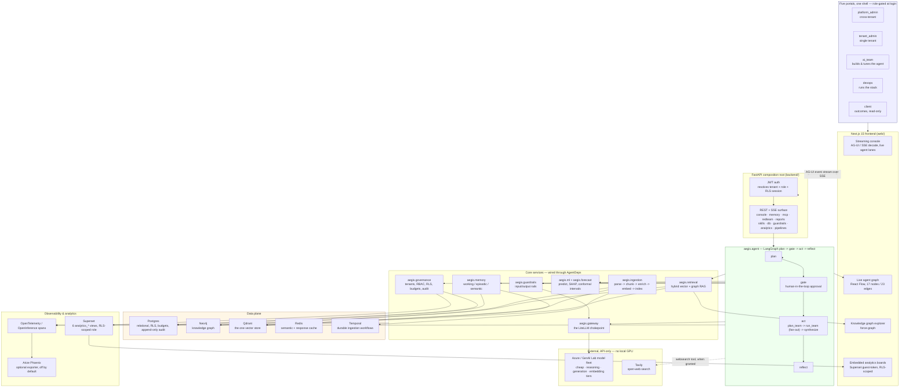

# Aegis — System Architecture

**For the jury and system-architecture reviewers.** This is the whole platform, top to
bottom, as it runs today — not the plan for it. Every store, gateway and module named
below is live in this repository; where something is a documented gap rather than a
built system, it is labelled as one.

Aegis is a **domain-agnostic, multi-tenant enterprise agentic-AI platform**: a team of
agents answers a question, and the platform records who decided, what was read, which
rail fired and who signed for the write. The core is a package you `import`, not an
application you fork — pointing Aegis at a new domain means writing one adapter
(schema, tools, prompts, ML target, corpus); the core never learns the domain.

---

## 1. The whole system, one diagram

---

## 2. The four layers, in order

### 2.1 Frontend — Next.js 15, one shell, five portals

One App Router shell serves five portals under a single dynamic route
(`app/app/[role]/[section]`), gated at login by JWT role claim:

| Portal | Sees |
|---|---|
| `platform_admin` | Everything, across every tenant, plus delegation |
| `tenant_admin` | Everything, scoped to one tenant |
| `ai_team` | Builds and tunes the agent — console, orchestration, memory, the loop |
| `devops` | Runs the stack — versions, patches, ops, the audit trail |
| `client` | Outcomes only — value, savings, risk map, read-only |

`platform_admin` and `tenant_admin` are one wire-level role (`admin`) split by two
server-side guards (`require_platform_admin`, `require_tenant_admin`); the other three
are distinct roles. Nine of the twelve `platform_admin` screens are shared, so
`tenant_admin` and `client` inherit most of the same screens for free.

The console is the marquee surface: it decodes the platform's own AG-UI event stream
live, rendering each sub-agent as a lane that streams its own reasoning as fan-out
happens — the platform's most distinctive behaviour, made visible rather than left to a
final answer. A second tab renders the same run as a live graph over the backend's own
declared topology (`GET /agent/topology` — 17 nodes, 23 edges, entry/terminal/conditional
flags), so a viewer can watch the actual path a run took, including the road not taken.

### 2.2 API — FastAPI composition root

`backend/` is deliberately thin: it owns the HTTP surface, the auth/session/RLS
wiring, and the SSE transport, and contributes no capability of its own that a module
could have owned. Every request resolves a tenant and a role before anything else runs,
and that resolution is what makes every Postgres query below tenant-scoped automatically
via row-level security — an endpoint cannot forget to filter by tenant, because the
database enforces it regardless of what the handler wrote.

The REST/SSE surface is composed from named routers — console, memory, guardrails,
db (read-only), analytics, pipelines, mcp, redteam, reports, seats, skills, llmops,
health — plus a dedicated SSE mount for the live ingest log. `GET /platform/capabilities`
and `GET /about` publish the platform's own capability manifest; the landing page's
module count is read from that endpoint live, not typed into the page.

### 2.3 Orchestration — LangGraph, plan → gate → act → reflect

`aegis.agent` is the one module that composes every other module, through a single
dependency-injection seam (`AgentDeps`) rather than importing them directly — swap any
one dependency (a different retriever, a different gateway) without touching the graph.
The loop is **plan → gate → act → reflect**:

- **plan** — decompose the question into a plan the run will follow.
- **gate** — a conditional edge. High-risk actions or high-uncertainty predictions route
  to a **human-in-the-loop approval** node instead of executing; nothing high-risk fires
  without a signed-for approval on the record.
- **act** — for questions that decompose into independent sub-questions, `plan_team`
  fans out to `run_team` (parallel sub-agents, each with its own lane in the console) and
  `synthesize` folds the results back into one answer.
- **reflect** — the run checks its own output before returning it.

Every step is bracketed by the shared streaming primitive, `AegisEmitter`, which wraps
the open **AG-UI protocol** SDK rather than a hand-rolled wire format — the same event
carries an OpenInference span kind, so one event stream is simultaneously what the
console renders live and what OpenTelemetry exports as a trace. `aegis.agent` itself
still narrates through a locked legacy `StreamEvent` union rather than `AegisEmitter`
directly — a deliberate, recorded deferral to keep the frontend's SSE contract stable
while every other module already speaks AG-UI natively.

### 2.4 The 29 importable `aegis.*` modules

Aegis was extracted from a single monolithic backend into 29 independently-installable
packages under one `aegis` distribution (`pip install aegis[extra]` per module) —
the goal stated plainly in the module contract: **importable, not forkable**. A team
building an unrelated agentic system can install one capability and get a
production-shaped component, not a stub wired only to this repository.

| Group | Modules | What the group owns |
|---|---|---|
| **Foundations** | `core`, `data`, `media` | Protocols, shared types, the registry, `AegisEmitter`; the portable SQLAlchemy base; typed payloads and hygiene for non-text input. `core` has zero heavy dependencies. |
| **Governance & safety** | `governance`, `guardrails`, `security`, `redteam`, `conformance`, `settings`, `dbadmin` | Tenants/RBAC/RLS/budgets/audit; input/output rails (schema, PII, injection, topic, content-safety, grounding); the threat-to-control map; a harness that attacks its own rails; the suite that proves a domain swap is complete; prompt versions/seats/the LLM-Ops loop; a read-only DB console with a role that cannot write. |
| **The agent** | `agent`, `memory`, `skills` | Plan→gate→act→reflect and the graph every run walks; working/episodic/semantic memory and consolidation; `SKILL.md` documents and who may write them. |
| **Knowledge** | `ingestion`, `retrieval`, `pipelines` | Parse→chunk→enrich→embed→index with a quality gate; hybrid vector+graph recall, fusion, reranking; the stage spec every pipeline is generated *from* (`PIPELINES.md` is generated output, so it cannot drift from the code). |
| **The chokepoint** | `gateway`, `jobs`, `runs` | Every model call — routing, cost, budget, fallback; durable work on Temporal and what survives a crash; the run record, folded from its own events. |
| **Measurement** | `ml`, `forecast`, `evals`, `analytics`, `ops`, `observability`, `reports` | Prediction + SHAP + conformal intervals; calibrated time-series forecasting; RAGAS-style metrics + an LLM-judge harness; the `analytics_*` views and their Superset integration; eval-gated release/promotion; OTel/OpenInference export; generated, sourced reports. |
| **Multimodal & outside data** | `media`, `vision`, `voice`, `websearch` | Payload hygiene; image understanding with the injection screen ahead of the model; speech-to-text guarded by the full text rail; reaching outside the tenant's own corpus (Tavily today, behind a swappable Protocol). |

**Two different counts, on purpose.** `GET /platform/capabilities` — the live manifest
the landing page reads — publishes **15 branded capabilities** (Gateway, Router, Memory,
Cache, Retrieval, Signal, Voice, Forecast, Guardrails, Evals, Loop, Governance, Trace,
Vision, Tools/MCP), each with its honest tech underneath. That is a curated,
customer-facing subset — some of it (Cache, Loop) is cross-cutting behaviour rather than
a single package, and packages like `security`, `redteam`, `conformance`, `settings`,
`dbadmin`, `pipelines`, `runs`, `ingestion`, `analytics`, `ops` power the platform without
being separately branded. The 29-package count above is the full engineering surface;
the 15-capability manifest is what a tenant is told they are running.

---

## 3. Data plane — five stores, each doing one job

| Store | Owns | Notes |
|---|---|---|
| **Postgres** | Relational data, tenant/user/budget rows, the append-only audit log, and every row-level-security policy | `pgvector` was deliberately removed — vector search moved entirely to Qdrant, so Postgres does relational/KV/governance and nothing else. |
| **Neo4j** | The knowledge graph — entities and relationships extracted at ingestion | Paired with LightRAG for graph-aware retrieval; relationship questions traverse the graph, similarity questions hit the vector store. |
| **Qdrant** | **The one vector store**, full stop | Both `aegis.retrieval` and LightRAG's own vector storage write to a single Qdrant node. An earlier embedded-Chroma / NanoVectorDB design was removed rather than demoted — an embedded client's file lock is what breaks multi-worker deployment, and a ceiling you can configure your way back into is not actually gone. |
| **Redis** | Semantic response cache, optional guardrails cache | Falls back to an explicit, labelled in-memory cache when absent — never a silently-faked Redis. |
| **Temporal** | Durable ingestion workflows | A document ingest survives a crash mid-pipeline; `TEMPORAL_ADDRESS` unreachable fails loud with the exact local fix (`temporal server start-dev`), never a silent degrade to synchronous. |

No store here is optional infrastructure dressed as a detail: `AegisMode` boots in
`full` mode by default, probes every required store at startup, and **refuses to start**
if one is unreachable — the platform's own honesty rule applied to itself, not just to
the numbers it shows a user.

---

## 4. The LLM gateway and model routing

`aegis.gateway` is the one chokepoint every model call passes through — nothing in the
platform calls a model provider directly. It sits on **LiteLLM** over an Azure /
GenAI Lab model fleet, routed by task rather than by habit: cheap classification and
routing steps go to a small/cheap tier, hard reasoning steps go to a reasoning-tuned
model, main generation goes to a stronger generation-tier model, and embeddings go to a
dedicated embedding model — each call carries budget enforcement and provider fallback,
and the resulting **small-model share** is a live, published metric
(`GET /platform/public-metrics`), not a claim.

---

## 5. Observability and analytics

Every module that narrates its work emits through the same AG-UI event stream, and each
event already carries an OpenInference span kind — so the identical stream that renders
a console lane is also what OpenTelemetry exports as a trace. **Arize Phoenix** is a
wired, optional exporter for that trace data — present in the code, off by default
(`PHOENIX_ENABLED`), stated as off rather than silently absent.

Business analytics runs on a separate track: `aegis.analytics` provisions six
`analytics_*` Postgres views (approvals, spend, runs, and three more) owned by a
dedicated read-only `aegis_superset` role, each view carrying the same row-level
security as the tables it reads from. **Superset** renders them as real charts, embedded
into the console via guest token — so a tenant's board is scoped by the same RLS as
everything else, not by a second, separately-maintained permission system.

---

## 6. Security and multi-tenancy model

- **Row-level security, not application-level filtering.** Every tenant-scoped table
  carries a Postgres RLS policy keyed to the session's tenant claim; a query that forgets
  a `WHERE tenant_id = …` clause still cannot see another tenant's rows, because the
  database — not the handler — is what enforces the boundary.
- **RBAC** — four portal roles plus two admin privilege tiers (§2.1), each mapped to a
  `sees` contract, checked server-side on every route via `require_platform_admin`
  / `require_tenant_admin` guards, never trusted from a client-supplied role field alone.
- **Budgets** are enforced at the gateway chokepoint (§4), so a runaway agent loop cannot
  spend past a tenant's cap regardless of which module triggered the calls.
- **Guardrails** run on both sides of every model interaction: schema validation, PII
  detection (Presidio + spaCy, with a pure-regex fallback when absent), prompt-injection
  detection, topic and content-safety rails (programmatic checks plus NeMo Colang rails),
  and grounding checks on generated answers.
- **Append-only audit log** — every agent action, approval and write is recorded and
  never mutated after the fact; it is what the console's "chain of custody" visual is
  actually reading.
- **Red-teamed by its own code.** `aegis.redteam` is an importable harness that attacks
  the guardrails above and reports what got through, rather than trusting the rails
  because they exist.
- **Conformance-checked.** `aegis.conformance` is the suite that proves a domain swap
  (§8) is actually complete — a new adapter is not "done" until this suite passes.

---

## 7. One question, end to end

1. A user in the `ai_team` or `client` portal submits a question in the console.
2. The API resolves the JWT into a tenant + role, opens an RLS-scoped session, and hands
   the question to `aegis.agent`.
3. **plan** decomposes it; if it needs external knowledge, **act** calls
   `aegis.retrieval` (Qdrant + Neo4j, fused and reranked) or `aegis.websearch` (Tavily,
   only if the tenant has granted that tool).
4. Every model call in every step passes through `aegis.gateway`, checked against input
   guardrails first and output guardrails after, and every call is budget-checked before
   it is allowed to fire.
5. If the plan reaches a high-risk action or a low-confidence prediction, **gate** routes
   to a human approval — the run pauses, visibly, until someone signs it.
6. On fan-out, **act** spawns parallel sub-agents (`plan_team → run_team`); each streams
   its own reasoning as an AG-UI lane, and **synthesize** folds their results into one
   answer.
7. **reflect** checks the drafted answer before it returns.
8. The full run — every step, every guardrail verdict, every approval — is written to
   the append-only audit log and folded into the run record (`aegis.runs`); the same
   event stream is simultaneously rendered live in the console and exported as an OTel
   trace.
9. The answer returns with its citations; nothing in it is asserted without a source the
   platform can point back to, and where a source cannot be found, the run says so
   instead of inventing one.

---

## 8. The domain-agnostic adapter

Nothing above this line knows what domain it is running. Pointing Aegis at a new problem
means writing **one adapter** — schema, tools, prompts, an ML target, and a corpus — and
the core, the gateway, the guardrails, the memory and the governance layer never change.
`aegis.conformance` is the suite that proves that adapter swap is actually complete
rather than partially wired. This is the platform's central engineering claim: it is
importable into a new problem, not forked and re-edited into one.

---

## 9. Deployment topology

Aegis runs as native processes — **no Docker, no GPU** — on commodity hardware, by
design: model inference is API-only against the Azure / GenAI Lab fleet, so the local
footprint is the FastAPI backend (Uvicorn), the Next.js frontend, and the five local
services above (Postgres, Neo4j, Qdrant, Redis, Temporal's dev server), all reachable
over localhost in development and behind normal service addresses in a real deployment.
Superset runs as its own local process for analytics embedding. There is no bespoke
infrastructure a reviewer needs specialised access to reproduce — every store here is a
standard, commonly-run service.

---

## 10. What this document does not claim

Consistent with the platform's own stated ethic — a figure it cannot source is stated as
absent, not invented — three things are worth naming directly:

- **Arize Phoenix is wired but off by default.** Traces exist; the exporter is a flag.
- **`aegis.agent` still narrates through the legacy `StreamEvent` union**, not
  `AegisEmitter` directly — a deliberate, recorded migration deferral, not an oversight.
- **Twenty-one screens across the four non-`platform_admin` portals** have not yet
  received the same visual/charting pass `platform_admin` has (tracked separately in
  `docs/dev_new_docs_v2/frontend-redesign/`) — the architecture and the data they read
  from are complete and live; only the presentation layer on those specific screens is
  still catching up.

**Related documents:** [`module/MODULE_REFERENCE.md`](../module/MODULE_REFERENCE.md)
(the Module Contract and the package-internal diagram) ·
[`module/PIPELINES.md`](../module/PIPELINES.md) (generated stage-by-stage detail) ·
[`teaching/README.md`](../teaching/README.md) (one deep-dive file per module) ·
[`security/`](../security/) (the full threat model and OWASP-Agentic mapping) ·
[`architecture/backend.md`](backend.md) (the original build brief — historical; several
of its store choices, e.g. Chroma/NanoVectorDB, were superseded and are corrected above).
