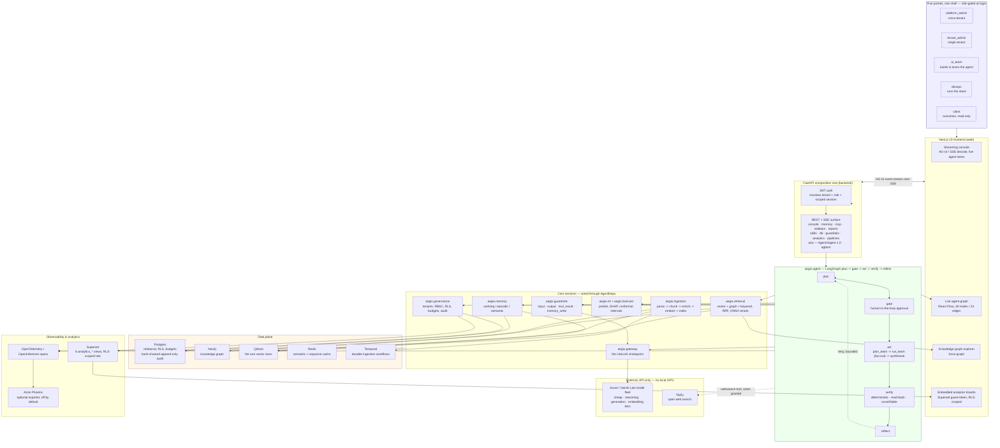

# Aegis — System Architecture

**For the jury and system-architecture reviewers.** This is the whole platform, top to
bottom, as it runs today — not the plan for it. Every store, gateway and module named
below is live in this repository; where something is a documented gap rather than a
built system, it is labelled as one.

Aegis is a **domain-agnostic, multi-tenant enterprise agentic-AI platform**: a team of
agents answers a question, and the platform records who decided, what was read, which
rail fired and who signed for the write. The core is a package you `import`, not an
application you fork — pointing Aegis at a new domain means writing one adapter
(schema, tools, prompts, ML target, corpus); the core never learns the domain.

---

## 1. The whole system, one diagram

---

## 2. The four layers, in order

### 2.1 Frontend — Next.js 15, one shell, five portals

One App Router shell serves five portals under a single dynamic route
(`app/app/[role]/[section]`), gated at login by JWT role claim:

| Portal | Sees |
|---|---|
| `platform_admin` | Everything, across every tenant, plus delegation |
| `tenant_admin` | Everything, scoped to one tenant |
| `ai_team` | Builds and tunes the agent — console, orchestration, memory, the loop |
| `devops` | Runs the stack — versions, patches, ops, the audit trail |
| `client` | Outcomes only — value, savings, risk map, read-only |

`platform_admin` and `tenant_admin` are one wire-level role (`admin`) split by two
server-side guards (`require_platform_admin`, `require_tenant_admin`); the other three
are distinct roles. Nine of the twelve `platform_admin` screens are shared, so
`tenant_admin` and `client` inherit most of the same screens for free.

The console is the marquee surface: it decodes the platform's own AG-UI event stream
live, rendering each sub-agent as a lane that streams its own reasoning as fan-out
happens — the platform's most distinctive behaviour, made visible rather than left to a
final answer. A second tab renders the same run as a live graph over the backend's own
declared topology (`GET /v1/agent/topology` — 18 nodes, 24 edges, entry/terminal/conditional
flags), so a viewer can watch the actual path a run took, including the road not taken.

### 2.2 API — FastAPI composition root

`backend/` is deliberately thin: it owns the HTTP surface, the auth/session/RLS
wiring, and the SSE transport, and contributes no capability of its own that a module
could have owned. Every request resolves a tenant and a role before anything else runs,
that resolution binds the session's `app.tenant_id` GUC, and every scoped query carries
its own `WHERE tenant_id = …` predicate underneath the row-level-security policy. Which
of those two is load-bearing today is stated exactly in §6, because it is not the one a
reader would assume.

The REST/SSE surface is composed from named routers — console, memory, guardrails,
db (read-only), analytics, pipelines, mcp, redteam, reports, seats, skills, llmops,
health — plus a dedicated SSE mount for the live ingest log, and an A2A router mounted
outside the `/v1` prefix for its well-known paths. `GET /v1/platform/capabilities` and
`GET /v1/about` publish the platform's own capability manifest — **15 branded
capabilities** — and the landing page's module count is read from that endpoint live,
not typed into the page.

**Two machine-facing surfaces sit on that router set, and both are worth naming because
they are what an outside system talks to.**

- **Agent2Agent (A2A) protocol 1.0.** `GET /.well-known/agent-card.json`,
  `GET /.well-known/jwks.json` (the ES256 public half) and `POST /v1/a2a` with
  `SendMessage` and `GetTask`, behind `require_auth`. The design decision worth reading
  is what the card's `tenant` routing field *cannot* do: it is opaque and
  attacker-controlled, it selects only which agent is addressed, and it **never** sets
  the database scope — that comes from the bearer token alone, and a mismatch is refused
  with one identical error code and message across every rejection branch so the error
  cannot be used to enumerate tenants. The card declares `streaming`,
  `pushNotifications` and `extendedAgentCard` all **false** (two of them were previously
  `true` and unearned), and it is served **unsigned unless `a2a_public_origin` is
  configured** — because deriving the origin from the request's `Host:` header let a
  caller rewrite the *signed* card, which is why that origin is configuration-only.
- **The Agent Bill of Materials.** `GET /v1/platform/agbom` emits CycloneDX 1.6 with
  media type `application/vnd.cyclonedx+json`, inventorying the tool registry (risk tier,
  personas, read-only flag), the model fleet, the four rail stages and the knowledge
  collections. It is **deterministic**: the `serialNumber` is a SHA-256 over the sorted
  component list, so two builds of an unchanged deployment produce the same serial, and
  the count is read off the live registries rather than typed in. Tools are emitted as
  `type: "application"` — `"tool"` is not a CycloneDX 1.6 component type (CycloneDX's own
  `tools` means the tools that *produced* the document), and emitting it yields a file
  that fails schema validation.

The **MCP** front door (`aegis-adapter-tools`) is the third machine-facing surface. Its
load-bearing property is that authority is re-read from the `users` table **per call**
rather than resolved once at session open, so a forged token claiming a higher role is
downgraded to whatever the database says — and a deactivated, missing or unreachable
account raises rather than falling back to the token's claim.

### 2.3 Orchestration — LangGraph, plan → gate → act → verify → reflect

`aegis.agent` is the one module that composes every other module, through a single
dependency-injection seam (`AgentDeps`) rather than importing them directly — swap any
one dependency (a different retriever, a different gateway) without touching the graph.
The loop is **plan → gate → act → verify → reflect**:

- **plan** — decompose the question into a plan the run will follow.
- **gate** — a conditional edge. High-risk actions or high-uncertainty predictions route
  to a **human-in-the-loop approval** node instead of executing; nothing high-risk fires
  without a signed-for approval on the record. The branch is on **tool risk**; ML never
  gates.
- **act** — for questions that decompose into independent sub-questions, `plan_team`
  fans out to `run_team` (parallel sub-agents, each with its own lane in the console) and
  `synthesize` folds the results back into one answer.
- **verify** — the node that checks what actually happened against something *outside the
  model*, in three tiers: **deterministic** (the tool's own result rows contradict or
  confirm the claim), **read-back** (the record is fetched again and compared), and
  **unverifiable** (stated as unverifiable, not silently assumed true). This is where the
  loop's progress detection lives: a call that has failed **identically three times**
  returns `OSCILLATING` and stops, so a run cannot spend its budget arguing with a rail
  or with itself.
- **reflect** — judges the draft and closes the loop back to `plan` once when it does not
  hold up. The retry is bounded by `max_plan_iterations`, so termination is guaranteed
  rather than hoped for.

Every step is bracketed by the shared streaming primitive, `AegisEmitter`, which wraps
the open **AG-UI protocol** SDK rather than a hand-rolled wire format — the same event
carries an OpenInference span kind, so one event stream is simultaneously what the
console renders live and what OpenTelemetry exports as a trace. `aegis.agent` itself
still narrates through a locked legacy `StreamEvent` union rather than `AegisEmitter`
directly — a deliberate, recorded deferral to keep the frontend's SSE contract stable
while every other module already speaks AG-UI natively.

### 2.4 The 29 importable `aegis.*` modules

Aegis was extracted from a single monolithic backend into 29 independently-installable
packages under one `aegis` distribution (`pip install aegis[extra]` per module) —
the goal stated plainly in the module contract: **importable, not forkable**. A team
building an unrelated agentic system can install one capability and get a
production-shaped component, not a stub wired only to this repository.

| Group | Modules | What the group owns |
|---|---|---|
| **Foundations** | `core`, `data`, `media` | Protocols, shared types, the registry, `AegisEmitter`; the portable SQLAlchemy base; typed payloads and hygiene for non-text input. `core` has zero heavy dependencies. |
| **Governance & safety** | `governance`, `guardrails`, `security`, `redteam`, `conformance`, `settings`, `dbadmin` | Tenants/RBAC/RLS/budgets/audit; input/output rails (schema, PII, injection, topic, content-safety, grounding); the threat-to-control map; a harness that attacks its own rails; the suite that proves a domain swap is complete; prompt versions/seats/the LLM-Ops loop; a read-only DB console with a role that cannot write. |
| **The agent** | `agent`, `memory`, `skills` | Plan→gate→act→reflect and the graph every run walks; working/episodic/semantic memory and consolidation; `SKILL.md` documents and who may write them. |
| **Knowledge** | `ingestion`, `retrieval`, `pipelines` | Parse→chunk→enrich→embed→index with a quality gate, and a reindex that prunes stale vector points so a re-chunk converges instead of accumulating orphans; hybrid vector + graph + keyword recall fused by RRF and graded by a local ONNX cross-encoder; the stage spec every pipeline is generated *from* (`PIPELINES.md` is generated output, so it cannot drift from the code). |
| **The chokepoint** | `gateway`, `jobs`, `runs` | Every model call — routing, cost, budget, fallback; durable work on Temporal and what survives a crash; the run record, folded from its own events. |
| **Measurement** | `ml`, `forecast`, `evals`, `analytics`, `ops`, `observability`, `reports` | Prediction + SHAP + conformal intervals; calibrated time-series forecasting; the real `ragas` metrics for live scoring plus deterministic RAGAS-style proxies and an LLM-judge harness for the offline gate; the `analytics_*` views and their Superset integration; eval-gated release/promotion; OTel/OpenInference export; generated, sourced reports. |
| **Multimodal & outside data** | `media`, `vision`, `voice`, `websearch` | Payload hygiene; image understanding with the injection screen ahead of the model; speech-to-text guarded by the full text rail; reaching outside the tenant's own corpus (Tavily today, behind a swappable Protocol). |

**Two different counts, on purpose.** `GET /v1/platform/capabilities` — the live manifest
the landing page reads — publishes **15 branded capabilities** (Gateway, Router, Memory,
Cache, Retrieval, Signal, Voice, Forecast, Guardrails, Evals, Loop, Governance, Trace,
Vision, Tools/MCP), each with its honest tech underneath. That is a curated,
customer-facing subset — some of it (Cache, Loop) is cross-cutting behaviour rather than
a single package, and packages like `security`, `redteam`, `conformance`, `settings`,
`dbadmin`, `pipelines`, `runs`, `ingestion`, `analytics`, `ops` power the platform without
being separately branded. The 29-package count above is the full engineering surface;
the 15-capability manifest is what a tenant is told they are running.

---

## 3. Data plane — five stores, each doing one job

| Store | Owns | Notes |
|---|---|---|
| **Postgres** | Relational data, tenant/user/budget rows, the append-only ledgers, every row-level-security policy, and **LangGraph's checkpoints** | `pgvector` was deliberately removed — vector search moved entirely to Qdrant, so Postgres does relational/KV/governance and nothing else. Append-only is a **privilege**, not a convention: the serving role holds `SELECT, INSERT` and nothing more on `audit_log`, `usage_ledger` and `run_events` (partitions included), so `DELETE FROM audit_log` on a request connection is refused by the database. The owner role can still rewrite the trail — tampering requires that connection, it is not impossible. |
| **Neo4j** | The knowledge graph — entities and relationships extracted at ingestion | Paired with LightRAG for graph-aware retrieval; relationship questions traverse the graph, similarity questions hit the vector store. |
| **Qdrant** | **The one vector store**, full stop | Both `aegis.retrieval` and LightRAG's own vector storage write to a single Qdrant node. An earlier embedded-Chroma / NanoVectorDB design was removed rather than demoted — an embedded client's file lock is what breaks multi-worker deployment, and a ceiling you can configure your way back into is not actually gone. |
| **Redis** | Semantic response cache, the rate limiter's slot leases, optional guardrails cache, and the **notification fan-out** (pub/sub) | Falls back to an explicit, labelled in-memory cache when absent — never a silently-faked Redis. The notification stream states which mode it is on in its opening frame. |
| **Temporal** | Durable ingestion workflows | A document ingest survives a crash mid-pipeline; `TEMPORAL_ADDRESS` unreachable fails loud with the exact local fix (`temporal server start-dev`), never a silent degrade to synchronous. |

No store here is optional infrastructure dressed as a detail: `AegisMode` boots in
`full` mode by default, probes every required store at startup, and **refuses to start**
if one is unreachable — the platform's own honesty rule applied to itself, not just to
the numbers it shows a user.

---

## 4. The LLM gateway and model routing

`aegis.gateway` is the one chokepoint every model call passes through — nothing in the
platform calls a model provider directly. It sits on **LiteLLM** over an Azure /
GenAI Lab model fleet, routed by task rather than by habit: cheap classification and
routing steps go to a small/cheap tier, hard reasoning steps go to a reasoning-tuned
model, main generation goes to a stronger generation-tier model, and embeddings go to a
dedicated embedding model — each call carries budget enforcement and provider fallback,
and the resulting **small-model share** is a live, published metric
(`GET /v1/platform/public-metrics`), not a claim.

---

## 5. Observability and analytics

Every module that narrates its work emits through the same AG-UI event stream, and each
event already carries an OpenInference span kind — so the identical stream that renders
a console lane is also what OpenTelemetry exports as a trace. **Arize Phoenix** is a
wired, optional exporter for that trace data — present in the code, off by default
(`PHOENIX_ENABLED`), stated as off rather than silently absent.

**Alerting** is a third track, and it is push rather than pull. Before 2026-08-23 there
was none: you learned a 100-document ingest had finished by opening a screen. A
notification is now written to Postgres **first** and published **second** — an alert
that only ever existed in memory is not an alert — and Redis pub/sub carries it across
processes, because the event is written by a Temporal worker while the browser is
attached to a different one. One subscription per process fans out to bounded per-stream
queues rather than one Redis connection per browser tab, and `GET /v1/notifications/stream`
delivers it over SSE. Four emit points: ingest terminal, approval enqueued, the SLA
sweeper's HIGH-risk auto-reject, and budget exhaustion. Degradation is complete rather
than half — unreachable Redis falls back to in-process delivery with a warning that names
the consequence, a lost subscription flips the mode back, and the mode is on the wire.

Business analytics runs on a separate track: `aegis.analytics` provisions six
`analytics_*` Postgres views (approvals, spend, runs, and three more) owned by a
dedicated read-only `aegis_superset` role, each view carrying the same row-level
security as the tables it reads from. **Superset** renders them as real charts, embedded
into the console via guest token — so a tenant's board is scoped by the same RLS as
everything else, not by a second, separately-maintained permission system.

---

## 6. Security and multi-tenancy model

- **Application-level filtering, with row-level security behind it — and the order is
  deliberate.** Twenty-five tenant-scoped tables each carry `ENABLE`/`FORCE ROW LEVEL
  SECURITY` and a single `tenant_isolation` policy keyed to the session's `app.tenant_id`
  GUC, `run_events`' monthly partitions covered by a partition rule rather than by name.
  But `rls_fail_closed` defaults to **`False`**, and the run file does not override it, so
  the installed predicate is `substring(current_setting('app.tenant_id', true) from
  '^[0-9]+$') IS NULL OR tenant_id = …` — an unbound, empty or non-numeric GUC satisfies
  the first disjunct and the policy restricts nothing. What carries the boundary today is
  the application's own `WHERE tenant_id = …` predicate on every scoped query, and no read
  path skips it. That makes RLS **inert defence-in-depth rather than a leak** — and it
  means this document will not describe it as fail-closed. The fail-closed predicate is
  written and tested (`_TENANT_ISOLATION_PREDICATE_CLOSED`, widening only on an explicit
  `app.tenant_all = 'on'`); turning it on is `RLS_FAIL_CLOSED=true`, a configuration
  change, not a code change. The LangGraph checkpoint tables carry no `tenant_id` and so
  no policy; they are scoped by the app-level filter on the `runs` header.
- **RBAC** — four portal roles plus two admin privilege tiers (§2.1), each mapped to a
  `sees` contract, checked server-side on every route via `require_platform_admin`
  / `require_tenant_admin` guards, never trusted from a client-supplied role field alone.
- **Budgets** are enforced at the gateway chokepoint (§4), so a runaway agent loop cannot
  spend past a tenant's cap regardless of which module triggered the calls.
- **Guardrails** run at **four** stages, not two: `INPUT` and `OUTPUT` on the two ends of
  a turn, `TOOL_RESULT` on third-party content a tool pulls into the agent's context, and
  `MEMORY_WRITE` on a candidate fact before it reaches the durable store. The last two
  exist because the first two structurally cannot see those attacks — the turn that
  poisons memory and the turn poisoned by it are *different turns*. Each stage runs schema
  validation, PII detection (Presidio + spaCy, pure-regex fallback when absent),
  prompt-injection detection, topic and content-safety rails (programmatic checks, plus
  NeMo Colang rails when `GUARDRAILS_ENGINE` selects them — the default is `programmatic`),
  and grounding checks on generated answers. The memory-write screen is bound on **both**
  drain paths, the hot path after every turn and the 60-second backstop sweeper, because
  binding one and not the other is how it came to be unbound before.
- **Append-only, hash-chained audit log** — every agent action, approval and write is
  recorded and never mutated after the fact. Append-only is enforced by Postgres
  privileges rather than by convention (§3), and each row now carries `prev_hash` /
  `row_hash` over eight length-prefixed fields, so a rewritten or removed row breaks every
  row after it. `GET /v1/audit/verify` walks a tenant's chain and reports `intact`,
  `checked`, `broken_at` and `head` — and rows written *before* the chain existed are
  counted in a separate `unchained` field rather than folded into the verdict, because
  claiming them as verified would be the exact dishonesty the chain was built to prevent.
  The owner connection can still rewrite the trail; what the chain adds is that doing so
  is **detectable**, which is a different and truer claim than "immutable".
- **Durable human-in-the-loop.** A run parked on the approval gate is a real LangGraph
  `interrupt` checkpointed to Postgres, so it survives a restart: kill the process,
  approve on the new one, and the run finishes from the interrupted checkpoint without
  re-running a single pre-gate node. `AGENT_CHECKPOINTER=memory` (the test default) does
  not, and the difference is invisible until the process dies.
- **A compliance surface derived from wiring, not asserted.** `GET /v1/compliance` maps
  **124 controls across 13 frameworks — 38 enforced, 62 partial, 19 not implemented, 5 not
  applicable** — where "enforced" requires both a file and a test, and anything less must
  name what is missing. A public projection (`GET /v1/platform/standards`) carries only
  the counts, because the guarded body is a control-by-control map of what is *not*
  implemented and where, which is a target list. **This is readiness evidence and never
  certification:** Aegis holds no ISO 27001 certificate, no ISO/IEC 42001 certificate, no
  SOC 2 report and no EU AI Act conformity assessment, and nobody independent has audited
  any of it. The counts here are re-derived from the catalogue by
  `backend/tests/api/test_compliance_readme_totals.py`, so a control changing state fails
  the build rather than quietly ageing this line.
- **Red-teamed by its own code.** `aegis.redteam` is an importable harness that attacks
  the guardrails above and reports what got through, rather than trusting the rails
  because they exist. The default `owasp-full` battery is **66 probes — 50 attacks and 16
  benign controls**, and it blocks **40 of 50 offline at a 0% false-positive rate**. The
  benign half is the part that makes the number mean something: a block rate quoted
  without a false-positive rate is the number a vendor quotes. Every one of the ten leaks
  is declared by the probe itself before the run — eight as semantic-only (they need the
  model layer wired) and two as beyond any text rail — rather than curated out of the
  report.
- **Conformance-checked.** `aegis.conformance` is the suite that proves a domain swap
  (§8) is actually complete — a new adapter is not "done" until this suite passes.

---

## 7. One question, end to end

1. A user in the `ai_team` or `client` portal submits a question in the console.
2. The API resolves the JWT into a tenant + role, binds the session's tenant scope, and
   hands the question to `aegis.agent`.
3. **plan** decomposes it; if it needs external knowledge, **act** calls
   `aegis.retrieval` — three arms (dense vectors in Qdrant, graph traversal in Neo4j, and
   a keyword arm that is PostgreSQL `ts_rank`, **not** Okapi BM25, however the wire value
   is spelled) fused by reciprocal-rank fusion at k=60 and graded by a local ONNX
   cross-encoder — or `aegis.websearch` (Tavily, only if the tenant has granted that
   tool).
4. Every model call in every step passes through `aegis.gateway`, checked against input
   guardrails first and output guardrails after, and every call is budget-checked before
   it is allowed to fire.
5. If the plan reaches a high-risk action or a low-confidence prediction, **gate** routes
   to a human approval — the run pauses, visibly, until someone signs it.
6. On fan-out, **act** spawns parallel sub-agents (`plan_team → run_team`); each streams
   its own reasoning as an AG-UI lane, and **synthesize** folds their results into one
   answer.
7. **verify** checks what actually happened against something outside the model — the
   tool's own result rows, or the record read back — and says *unverifiable* when neither
   is available rather than assuming success; **reflect** then judges the draft and
   returns it to **plan** once if it does not hold up.
8. The full run — every step, every guardrail verdict, every approval — is written to
   the hash-chained append-only audit log and folded into the run record (`aegis.runs`);
   the same event stream is simultaneously rendered live in the console and exported as
   an OTel trace.
9. The answer returns with its citations; nothing in it is asserted without a source the
   platform can point back to, and where a source cannot be found, the run says so
   instead of inventing one.

---

## 8. The domain-agnostic adapter

Nothing above this line knows what domain it is running. Pointing Aegis at a new problem
means writing **one adapter** — schema, tools, prompts, an ML target, and a corpus — and
the core, the gateway, the guardrails, the memory and the governance layer never change.
`aegis.conformance` is the suite that proves that adapter swap is actually complete
rather than partially wired. This is the platform's central engineering claim: it is
importable into a new problem, not forked and re-edited into one.

---

## 9. Deployment topology

Aegis runs as native processes — **no Docker, no GPU** — on commodity hardware, by
design: model inference is API-only against the Azure / GenAI Lab fleet, so the local
footprint is the FastAPI backend (Uvicorn), the Next.js frontend, and the five local
services above (Postgres, Neo4j, Qdrant, Redis, Temporal's dev server), all reachable
over localhost in development and behind normal service addresses in a real deployment.
Superset runs as its own local process for analytics embedding. There is no bespoke
infrastructure a reviewer needs specialised access to reproduce — every store here is a
standard, commonly-run service.

---

## 10. What this document does not claim

Consistent with the platform's own stated ethic — a figure it cannot source is stated as
absent, not invented — three things are worth naming directly:

- **Arize Phoenix is wired but off by default.** Traces exist; the exporter is a flag.
- **`aegis.agent` still narrates through the legacy `StreamEvent` union**, not
  `AegisEmitter` directly — a deliberate, recorded migration deferral, not an oversight.
- **The visual pass across all five portals completed on 2026-08-23**; the per-screen
  briefs that drove it are kept in `docs/dev_new_docs_v2/frontend-redesign/` as the
  record of what each pass changed.
- **Checkpoint storage grows without bound.** Nothing prunes LangGraph's checkpoint
  tables, and no `audit_log` retention or partitioning is documented either. Both are
  recorded as owed work rather than described as solved.
- **There is no trajectory compaction, and there is now a ceiling instead.** Nothing in
  Aegis summarises or evicts a run's own turn history. The memory subsystem
  (`aegis/src/aegis/memory/`) budgets and orders *recalled* material across turns; it
  never sees the trajectory a single run accumulates. That trajectory exists in exactly
  one place — a sub-agent lane's `messages` list — and it is now bounded twice: by
  `AgentConfig.max_trajectory_tokens` (default **36000**) before each model call, and by
  `AgentConfig.max_tool_result_tokens` (default **4000**) on each tool result before it is
  appended. The per-result bound is shared with the main graph's `act` node, so a single
  oversized tool return cannot flood either path; the trajectory bound is a lane-only
  control, because a lane is the only place a run accumulates a history at all. Both are
  in the settings catalogue as `TIGHTEN_ONLY`, so a tenant can bound its own runs
  harder than the platform does and can never loosen past it. A lane that reaches the
  ceiling ends at `SubAgentStatus.CEILING`, keeps the findings it already has, emits a
  `status="ceiling"` beat, and is named as cut short by the synthesis — the same
  designed terminal state a timeout gets. **The ceiling is a refusal, not a
  compaction:** the lane stops rather than continuing on a summarised history, because
  summarising would put a model call, and a compression-hallucination surface, on the
  run path. Long-horizon runs that would need compaction are therefore **out of scope by
  design**, not merely unbuilt — see
  [`dev_new_docs_v2/sota/07-long-horizon-ceiling.md`](../dev_new_docs_v2/sota/07-long-horizon-ceiling.md)
  for what building it would cost.
- **DNS is not resolved by the SSRF guard.** MCP peer registration refuses loopback,
  link-local, private and reserved addresses and non-allowlisted schemes at the registry
  chokepoint, but a hostname that resolves inward still passes. Stated, not hidden.

**Related documents:** [`module/MODULE_REFERENCE.md`](../module/MODULE_REFERENCE.md)
(the Module Contract and the package-internal diagram) ·
[`module/PIPELINES.md`](../module/PIPELINES.md) (generated stage-by-stage detail) ·
[`teaching/README.md`](../teaching/README.md) (one deep-dive file per module) ·
[`security/`](../security/) (the full threat model and OWASP-Agentic mapping) ·
[`architecture/backend.md`](backend.md) (the original build brief — historical; several
of its store choices, e.g. Chroma/NanoVectorDB, were superseded and are corrected above).
