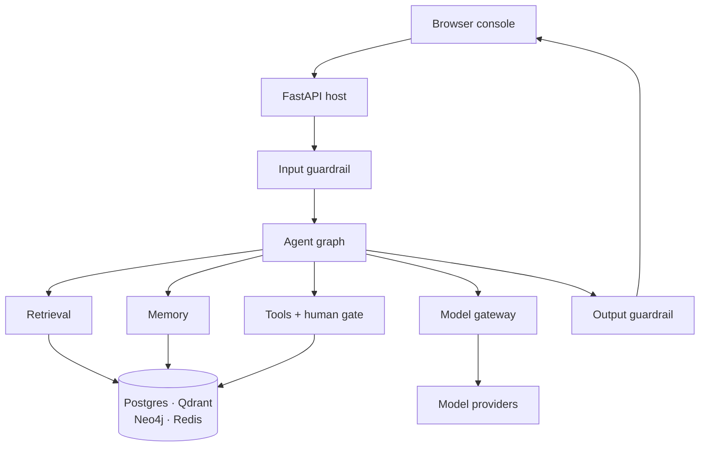

# Part 1 — Foundations

## 1. What Aegis is

Aegis is a platform for building AI agents a company can put in front of real
customers and real records. An **agent** is a program that uses a language model
to decide what to do next, and can then *do* it — look something up, change a
record, send a message. Aegis wraps that ability in what a business demands
first: a check on every question in, a check on every answer out, a human
sign-off on anything consequential, a hard wall between one customer's data and
another's, and a complete record of what happened and what it cost. The core is
Python packages you **import**; one small adapter points it at your business,
and the core never learns your domain. The promise, in four words: **autonomy
you can audit**.

### Cross-questions

**Q: Is Aegis a framework, a library, or an application?**
A: A library (`aegis.*`, importable packages) plus a reference application that
uses it (`backend/`, a FastAPI service, and `web/`, a Next.js console). You can
take the library alone; the application proves it works end to end.

**Q: What does "domain-agnostic" actually mean here?**
A: The core has no idea what a "service request" or a "loan application" is. All
domain knowledge sits in ten adapter pieces — schema, tools, personas, prompts,
memory rules, roster, corpus. Changing domain means rewriting those and touching
nothing in `agent/`, `retrieval/`, `guardrails/`, `memory/` or `api/`.

---

## 2. The problem it solves

Agents save real money because they can *act*, not just advise. But the moment
an agent can act, three fears appear, and each can stop a purchase.

### Fear 1 — wrong answers

A language model produces a confident, well-written sentence whether or not it
has any basis for it. In a chatbot that is embarrassing. In a system of record
it is a false statement on a customer's file.

**What Aegis does about it.** Answers are grounded in retrieved passages that
cite back to the source span, and the output rail checks the answer *against*
those passages before anyone sees it. Where the system acts, it does not accept
the tool's own report of success — it reads the record back through a different,
read-only tool. Where nothing can confirm the action, it says "unverified".

### Fear 2 — unsafe actions

An agent that can close a ticket can close the wrong ticket. An agent that reads
untrusted text — a document, an email, a tool's output — can be *talked into*
acting by that text. This is **prompt injection**, the defining security problem
of the field.

**What Aegis does about it.** Every tool is registered with a declared risk tier
(LOW, MEDIUM, HIGH), and anything at or above the tenant's threshold stops and
waits for a named human. An unregistered tool name resolves to HIGH, so the gate
can only be escaped by a tool that positively declares itself safe. Text
arriving from a tool is screened by the same rail that screens user input,
before it enters the model's context. Every loop is bounded, so an agent that
goes wrong runs out of budget rather than running forever.

### Fear 3 — data leaking between customers

One deployment serves many customers. If tenant A's document can appear in
tenant B's answer, the product is unsellable.

**What Aegis does about it.** Isolation is pushed down into the database with
PostgreSQL **row-level security**: the database itself refuses to return another
tenant's rows, using a policy on the table and a serving role that is explicitly
`NOSUPERUSER NOBYPASSRLS`. It does not depend on every query being written
correctly. Above that, retrieval takes a scope object that is keyword-only with
no default, so no call site can forget it; and every cache is partitioned by
tenant.

### Cross-questions

**Q: Which of the three fears is hardest?**
A: The second. Wrong answers are a quality problem you can measure; leakage is a
boundary you enforce in one place. Unsafe action touches the tool registry, the
graph, the gate, the audit log and the rails at once.

**Q: Row-level security sounds slow. Is it?**
A: It is a `WHERE` clause the planner adds, on an indexed column. The cost is
small; the alternative — trusting every developer to write that predicate every
time — is not a control at all.

**Q: Can't you solve all three with a very good prompt?**
A: No. A prompt is a request, not a constraint. Anything the model is asked to
do politely, an attacker can ask it to undo. Every guarantee here is enforced in
code that runs whether the model cooperates or not.

---

## 3. The one idea: the glass box

Most agent stacks are a **black box**: a question goes in, an answer comes out,
and the middle is a spinner. Aegis is a **glass box**. The organising rule is
one sentence:

> **Every number on screen names where it came from, and every claim in the
> documentation resolves to a file, a route or a test.**

A design constraint, not a slogan. Follow what it forces:

- If a cost figure must name its source, **every model call goes through one
  place** — otherwise some spend is unattributed. Hence one gateway with a usage
  ledger.
- If an answer must name its evidence, **retrieval keeps provenance per
  passage** through fusion and reranking — otherwise the citation is a guess.
- If the console must draw the agent's real shape, **the topology is read off
  the compiled graph**, not hand-drawn — otherwise picture and code drift apart
  the first time someone adds a node.
- If a claim must resolve to a file, **tests check the documents**. The public
  API document is parsed by a test asserting every promised name imports; the
  compliance map resolves against the real filesystem, route table and pytest
  node ids on every run. A renamed module breaks a test instead of leaving a
  false claim standing.

The same rule makes the platform report its own limits honestly: when a
sub-agent hits its token ceiling, the final answer says *"synthesised from 3 of
4 agents; the policy agent was cut short"* — appended by code, because a model
asked to mention its own failure will sometimes forget.

### Cross-questions

**Q: Isn't this just "good logging"?**
A: Logging is added afterwards, for engineers. The glass box is an architectural
constraint that engineers, auditors and end users all read: one model gateway
rather than three call sites, a declarative graph rather than a loop. Structural
decisions, not log lines.

**Q: What is the cost of the glass box?**
A: Indirection. One chokepoint for model calls, one place a node label is
written, one scope object threaded through retrieval — an extra hop each when
debugging. That is the price of answering "where did this number come from?" in
one step instead of five.

**Q: Give me one thing that would be easier without it.**
A: Streaming. Aegis generates the full answer, screens it with the output rail,
then pages it to the browser in word-sized chunks. Raw token streaming would
look faster, but it puts unchecked text on screen — and you cannot unsay a
leaked secret.

---

## 4. The big picture

Read it as a journey with a wall at each end:

1. The **browser** sends a question with a JWT naming user, role and tenant.
2. The **FastAPI host** authenticates, checks the role, resolves the tenant and
   opens an SSE stream back.
3. The **input guardrail** screens the question — schema and length, denylists,
   personal data, prompt injection, content safety, topic. It fails closed.
4. The **agent graph** runs the turn: route, gather, plan, gate, act, verify,
   reflect, generate. Part 2 is about this box.
5. It reaches four capabilities: **tools** (with the human gate before the risky
   ones), **retrieval**, **memory**, and the **model gateway** — the one place a
   model call may be made, where budgets are enforced *before* the spend.
6. Those sit on four stores: **Postgres** (records, governance, checkpoints),
   **Qdrant** (vectors), **Neo4j** (graph), **Redis** (caches, notifications).
7. The **output guardrail** screens the finished answer, including whether it is
   grounded in the retrieved passages, before it streams back.

Every step emits an OpenTelemetry span, so the run can be read as a trace tree.

---

## 5. The module map

Aegis is two things in one repository, and the split is the most important
structural fact about it.

### A library you import, and an app you run

| | `aegis/src/aegis/` | `backend/src/app/` |
|---|---|---|
| What it is | ~29 importable Python packages | A FastAPI application |
| Ships as | An installable wheel, `pip install aegis[...]` | A service you run with uvicorn |
| Knows about HTTP? | No | Yes — it owns every route |
| Knows about your domain? | No | Only through the adapter |
| Owns database sessions? | No | Yes |
| Name | "the core" | "the composition root" |

The library holds the capabilities: `agent`, `retrieval`, `memory`,
`guardrails`, `gateway`, `governance`, `ml`, `evals`, `observability`,
`ingestion`, `jobs`, `ops`, `settings`, `skills`, `runs`, and more. `aegis.core`
sits underneath with only shared types, protocols and configuration — and **zero
heavy dependencies**. A leaf module may import `aegis.core` (and, if durable,
`aegis.data`) plus its own third-party libraries, and nothing else from Aegis.
Shared logic goes *down* into `core`, never sideways between leaves.

The application wires them together — HTTP, JWT and RBAC, the database engine,
the background worker, and the composition root that injects real functions into
the library's seams. It contributes no capability a module could have owned.

Why bother? Because **Aegis must be importable, not forkable.** A team building
an unrelated agentic system should `pip install aegis[guardrails]` and get a
production-shaped component, not a stub that only works bolted onto this
backend. Every heavy dependency is an optional extra, and a missing one fails
loudly with the exact `pip install` command that fixes it, never with a silent
fallback.

### The boundary rule

Without a stated boundary, every internal detail becomes load-bearing by
accident: someone imports it, it works, and now it can never change.
`aegis/PUBLIC.md` is that boundary. Three tiers:

| Tier | Promise | Where |
|---|---|---|
| **Stable** | Not removed or narrowed without a deprecation cycle: one minor release with a warning, then removal | 50 named entries in `PUBLIC.md` |
| **Provisional** | Public, works, documented — but may change in a minor release with a changelog entry. Use it; pin your version. | Everything else in a package's `__all__` |
| **Internal** | No compatibility promise. May move in a patch. | Every submodule, and every name not in a package `__all__` |

A name is public **only if** it is in a top-level package's `__all__` **and**
listed in the Stable table. Those lists hold over seven hundred names; fifty are
Stable — about one in fifteen. That ratio is the point: a surface that is mostly
unpromised can still be improved. Names are *marked*, not removed. A test
imports every Stable name and checks it is in its package's `__all__`, so
renaming a promised name fails the suite until the document is updated.

The reference backend imports over a hundred distinct `aegis.*` paths, most of
them submodules — deliberate, and **not** a claim about the public API. It lives
in the same repository and may reach further than an outside integrator should.

### The adapter — the only thing you write

To point Aegis at a new domain you write ten pieces in one directory:

| Piece | What it declares |
|---|---|
| `schema` | The entities and enums of your domain |
| `tools` | The typed actions, their risk tiers, and the per-persona allowlist |
| `personas` | Who the agent serves; each one's data scope and tools |
| `prompts` | Who the agent is, plus the platform floor |
| `memory_spec` | What counts as a durable fact, and who it belongs to |
| `roster` | Which specialists exist, and the sub-agent fan-out team |
| `ml_spec` | What the ML signal predicts and on which features |
| `generator` | Synthetic data for demos and tests |
| `corpus/` | Seed documents to ingest |
| `skills/` | Procedural playbooks selected per query |

That set is the seam. Swapping domains means editing these and nothing in
`agent/`, `retrieval/`, `ml/`, `memory/`, `guardrails/`, `api/` or
`observability/`.

### Cross-questions

**Q: Why not one package, or one application?**
A: One application makes the capabilities unusable by anyone else and lets HTTP
concerns leak into the reasoning code. One package with no host gives you
nothing to run. The split forces every capability through an injected seam —
which is what makes the vertical slice testable with fakes, no database, no
network.

**Q: 700+ names but only 50 Stable. Isn't that a cop-out?**
A: The opposite. Promising 700 names would turn every schema change into a
breaking change, and the promise would break within a release. Fifty that hold
beat seven hundred that do not — and what is *deliberately* internal (the
governance ORM, the memory mechanism, the operator surfaces) is published
alongside.

**Q: What stops the backend from becoming the real product again?**
A: The stated rule that the host contributes no capability a module could have
owned. The three host-side surfaces — the A2A endpoints, the MCP server, the
software bill of materials — are each a property of this deployment, not a
reusable capability.

---

## 6. The technology choices at a glance

| Technology | What it does here | Why not the obvious alternative |
|---|---|---|
| **FastAPI** | The HTTP and SSE surface: auth, RBAC, tenant resolution, `/query`, the composition root | Django's ORM, admin and sync-first model are unwanted; Flask has no native async or typed schemas. FastAPI gives async, SSE, and the OpenAPI spec the console's types come from. |
| **LangGraph** | The agent: nodes, edges, one shared state, live events per node, and — decisively — `interrupt()` plus durable checkpoints, so a run pauses for a human and resumes elsewhere | A `while` loop cannot pause across processes without becoming a checkpointing project. Frameworks that hide the loop leave nowhere to gate risk between proposal and execution. |
| **Postgres** | System of record: domain rows, governance, tenants, budgets, the hash-chained audit log, graph checkpoints, and retrieval's keyword arm via `ts_rank` | `FORCE ROW LEVEL SECURITY` decides it. MySQL has no equivalent; a document store pushes isolation back into application code. |
| **Qdrant** | The one vector engine: chunk vectors, entity and relation vectors, memory vectors | pgvector ties vector indexing to the transactional database's envelope; Chroma is weaker as a server; Pinecone breaks "runs natively on a laptop, no Docker". Both were removed deliberately: one engine, no silent in-memory fallback. |
| **Neo4j** | The knowledge graph: entities and relationships extracted at ingestion, read by LightRAG's entity-neighbourhood arm | Postgres CTEs can walk a graph, but multi-hop traversal is what a graph database is shaped for, and the ingestion library already speaks Neo4j. The honest alternative is *no graph arm* — losing questions that need a relationship, not a passage. |
| **Redis** | Caches and fan-out, never a system of record: semantic caches (retrieval, answers, memory, injection, web search) plus pub/sub, so one subscription feeds many SSE streams | Memcached has no vector search, which the semantic caches need; an in-process dictionary is not shared across workers. On Windows this is Memurai — same protocol, same port. |
| **Temporal** | Durable background workflows — ingestion, re-indexing, reconciliation — with retries, timers, per-stage resumability and cancellation in the engine | Celery and RQ give a queue, not durable execution: a worker dying mid-ingest loses the run. Lighter Postgres-backed options carry no tenant id. Temporal owns *execution* state; the tenant-scoped job tables stay the record under row-level security. |
| **Next.js** | The console: five role portals (platform admin, tenant admin, AI team, DevOps, client) from one dynamic route, typed from the backend's OpenAPI spec | A React SPA needs its own routing, data-loading and build story; templates cannot stream a live console. Generated types mean a backend schema change fails the frontend build rather than reaching a user. |

Two notes. **There is no Docker anywhere** — every store is a native local
install on macOS, Linux and Windows alike, because a demo must not depend on a
container runtime being healthy. And there are **three run modes**: `safe`
(console only, mock transport, needs nothing), `lite` (the real agent, no
databases, one model API key), and `full` (everything).

### Cross-questions

**Q: That is a lot of infrastructure. Justify it.**
A: Each store answers a different question. Postgres: "what is true, and who may
see it". Qdrant: "what is similar". Neo4j: "what is connected". Redis: "have we
just done this". Collapsing any two costs a capability. `lite` mode runs the
agent without any of them.

**Q: Why is there no database migration tool?**
A: There is no Alembic and no migration tree: the schema is materialised by
`create_all` plus an additive column reconciler. A real trade — it suits a
platform whose schema is still moving and whose deployments are fresh; a
long-lived estate would want a migration tree. Written down, not glossed over.

**Q: Isn't depending on LangGraph a risk?**
A: It is, and it is contained. The dependency is pinned to a major version, and
the graph touches LangGraph in only a few places: the builder, the compiled
graph, `interrupt`, the checkpointer, the stream writer. The rest of
`aegis.agent` is plain Python that would survive a swap.

**Q: Why one model gateway instead of calling providers directly?**
A: Because a budget you cannot enforce is not a budget. Every completion and
embedding goes through one function that routes by role, enforces the tenant's
cap *before* the spend, applies timeouts and retries, and writes a durable usage
row. A second call site would make every cost figure an estimate.
