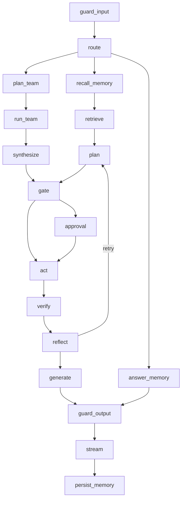

# Part 2 — The Agent

This is the heart of the system. Everything else in Aegis exists to feed this
part, to watch it, or to stop it. Read it slowly: if you understand the
**act → verify → reflect** loop and the **human gate**, you understand Aegis.

---

## 1. What an "agent" actually is

A **chatbot** is a model that reads text and writes text. Ask it to close a
support ticket and it writes *"I have closed the ticket."* Nothing happened. The
ticket is still open.

An **agent** is a model placed in a loop with **tools**. A tool is a real
function the model may ask to run: look a record up, change a status, send a
message. The loop:

1. Give the model the question and the tools it may use.
2. The model replies with either an answer or a request to call a tool.
3. If it asked for a tool, run it and give the result back to the model.
4. Repeat until the model answers, or a limit is reached.

The model does not run the tool. It *asks*, and our code decides whether to run
it. **That gap — between asking and running — is where every safety property in
Aegis lives.**

Three consequences follow, and they are why an agent is much harder to ship than
a chatbot:

| | Chatbot | Agent |
|---|---|---|
| Worst case of a wrong answer | a bad sentence | a changed record |
| Can you undo it? | nothing to undo | only if the tool is reversible |
| Who is accountable? | nobody, it was advice | somebody, an action was taken |

### Cross-questions

**Q: Is an agent just a chatbot with function calling turned on?**
A: Function calling is the mechanism, not the system: it gives the model a way
to *ask*. An agent is the loop, the tool registry, the limits, the verification
and the audit trail that decide what happens when it asks. Aegis is almost
entirely that second part.

**Q: The model chooses the tools — so isn't the model in control?**
A: No. It chooses from a list our code hands it, and every call it proposes is
filtered by a per-persona allowlist and a risk check before it can run. The
model proposes; the platform disposes.

**Q: Why not let a human act and use the model only for advice?**
A: For the highest-risk work that is exactly what happens — the human gate. But
most work is low risk and high volume, and routing all of it through a person
removes the value. Aegis draws the line by **risk tier**, not by refusing to act.

---

## 2. Why a graph

### The concept, before any code

A **graph** here means a small map of the run:

- A **node** is one step. It receives the current state, does one job, and
  returns the piece of state it changed.
- An **edge** is what happens next. A plain edge always goes to the same place;
  a **conditional edge** looks at the state and picks a destination.
- The **state** is one dictionary that flows through every node. Nodes never
  talk to each other directly; they only read and write this dictionary.

**LangGraph** is the library that runs such a graph. You declare the nodes and
edges, `compile()` the result, and LangGraph drives it, saving the state after
every node into a **checkpointer** (a store of run snapshots).

Aegis builds its graph in `aegis/src/aegis/agent/graph.py`, in one function:

```python
builder: StateGraph = StateGraph(AgentState)
builder.add_node("plan", ...)
builder.add_edge("act", "verify")
builder.add_conditional_edges("gate", _route_gate, {"approval": "approval", "act": "act"})
return builder.compile(checkpointer=checkpointer or InMemorySaver())
```

The state type is `AgentState` (`aegis/src/aegis/agent/state.py`). Most keys are
last-write-wins, but six declare a **reducer** — token counts, cost, the round
counter and the attempt log are summed with `operator.add`, so a node returning
`{"plan_iterations": 1}` adds one to the running total rather than overwriting
it. That is what lets several concurrent workers contribute to one honest total.

### What we chose, and what we did not

| Option | What it gives | Why not chosen |
|---|---|---|
| **A plain `while` loop** | Total control, no dependency, easy to read | You write pause/resume, per-step timing, retries and state snapshots yourself. Pausing for an approval that arrives an hour later, on another server, means inventing a checkpointer. |
| **A framework that hides the loop** (an "agent executor" you hand tools to) | Fastest to a demo | The loop *is* the product. If the framework owns it, you cannot insert a risk gate between "the model asked" and "the tool ran". |
| **A workflow engine only** (durable steps, no LLM awareness) | Excellent durability | Wrong altitude for a per-turn reasoning loop. Aegis does use one for long-running jobs like ingestion — but a chat turn does not need a workflow worker. |
| **LangGraph** *(chosen)* | Explicit nodes and edges, one shared state, `interrupt` for human pauses, checkpoints on a pluggable store, live events from every node | A real dependency with its own upgrade risk, and it constrains the code shape. |

The deciding argument is the human gate. Aegis must stop mid-run, wait for a
person, survive a restart, and continue on a *different* worker. In LangGraph
that is `interrupt()` plus a durable checkpointer; written by hand it is a
distributed-systems project.

The second argument is the glass box. Every node body is wrapped by a helper
that emits `node_started` and `node_finished` with a millisecond duration and
opens one OpenTelemetry span. And because the nodes are declared, the topology
served to the console is read off the compiled graph itself, so the picture on
screen cannot drift from the code that ran.

### Cross-questions

**Q: Why LangGraph and not a simple `while` loop?**
A: Because the run must stop for a human and resume later on another machine.
That needs durable checkpoints keyed by a thread id, plus a way to raise a pause
from inside a step. LangGraph gives both; a `while` loop gives neither, and
rebuilding them is more code and more risk than the dependency.

**Q: Is the graph not over-engineering for a chat turn?**
A: It earns its cost the moment a turn can take an action. A pure
question-answering turn does pass through more nodes than it strictly needs —
but those nodes are the input rail, the router, retrieval and the output rail,
all of which we want anyway, and each of which is individually timed and traced.

---

## 3. The eighteen nodes

Aegis wires **eighteen** nodes. Nobody can hold eighteen things in their head as
a list, so hold them as **six groups**.

| Group | Nodes | Job |
|---|---|---|
| **Screen** | `guard_input` | Check the question before anything reads it |
| **Decide who** | `route` | Which specialist, and how wide |
| **Gather** | `recall_memory`, `retrieve` | What do we already know; what does the corpus say |
| **Fan out** *(only for wide turns)* | `plan_team`, `run_team`, `synthesize` | Split the work, run lanes concurrently, merge |
| **Act** | `plan`, `gate`, `approval`, `act`, `verify`, `reflect` | Propose, risk-check, maybe ask a human, do it, check it, decide whether to try again |
| **Finish** | `generate`, `guard_output`, `stream`, `persist_memory` | Write the answer, screen it, send it, remember the turn |

The eighteenth is `answer_memory` — a specialist branch for questions about the
user themselves ("what did I ask you last week?"), answered straight from
long-term memory, skipping retrieval and tools entirely.



Four edges carry the design:

- `guard_input` can end the run immediately — a BLOCK verdict goes straight to
  the end, so the router never runs on a blocked question.
- `plan` goes to `gate` only if the model proposed tool calls; if it just wrote
  an answer, the run jumps to `generate`.
- `approval` goes to `act` if the human approved and to `generate` if not, so a
  refusal still produces a written explanation.
- `synthesize` goes to `gate`. **The fan-out path joins the same tail.** There
  is exactly one gate in the graph, whoever proposed the action.

Every model-calling node is wrapped in a retry policy of at most three attempts,
and only for *transient* failures. Three deliberately have no retry: `act`,
because re-running it could perform a real action twice; `approval`, which
re-executes on resume by design; and the memory nodes, which already degrade to
doing nothing.

### Cross-questions

**Q: Why is `stream` a node rather than the model streaming directly?**
A: Because the order is `generate → guard_output → stream`. The answer is
produced in full, cleared by the output rail, and only then paced onto the
socket in word-sized chunks (four words per event by default). Streaming raw
model tokens would put unchecked text on the user's screen, and you cannot unsay
a leaked secret. The typing effect is cosmetic; the rail is not.

**Q: Two guardrail nodes — is one not enough?**
A: They check different things. The input rail screens what a user sent us:
prompt injection, personal data, schema, topic. The output rail screens what we
are about to send back, including whether the answer is supported by the
passages retrieved. A third rail, on tool results, runs inside `act`.

**Q: Where is the machine-learning step?**
A: Not in this graph. The ML capability (forecasts, calibrated intervals, SHAP
drivers) is a tenant-facing feature served by its own endpoints, not a stage of
the pipeline, because nothing in the graph routes, gates or branches on it. The
human gate fires on a **tool's risk tier** and on nothing else.

---

## 4. The act → verify → reflect loop

This is the concept to nail.

### The problem in one sentence

An agent that takes an action must find out whether it worked — and the easiest
way to find out is the least trustworthy.

There are three ways to answer *"did it work?"*:

1. **Ask the tool.** It returns `ok=True`. Cheap, and often right — but a tool
   that updated the *wrong* record also returns `ok=True`. A success flag says
   the call completed, not that the goal was met.
2. **Ask the model.** *"You just did that — was it good?"* Self-critique is the
   weakest of the three: grounded in nothing outside the model, and it tends to
   agree with itself.
3. **Read the record back.** Call a different, read-only tool and look. If the
   ticket really says `resolved`, it says `resolved` whatever the write tool
   claimed.

Aegis puts a dedicated `verify` node between `act` and `reflect`, makes it
prefer the third answer, and never lets it use the second. That splits the work
three ways:

| Node | Owns |
|---|---|
| `act` | Executing the authorised calls, and nothing else. It does **not** judge its own success. |
| `verify` | The judgement, made against something outside the model. |
| `reflect` | The routing decision — try again, or finish — plus the event the user sees. |

Separating "who did it" from "who judged it" is the whole point.

### The three verify tiers

`verify` tries the cheapest tier first and stops at the first that reaches a
verdict.

**Tier 1 — deterministic.** No tool call, no model call. Decidable purely from
the rows that `act` produced:

| Situation | Verdict |
|---|---|
| No tool ran this round | `GATHERED` |
| The tool-result rail refused a result | `BLOCKED` |
| A tool reported failure | `FAILED` |
| The same failing call has now been tried three times | `OSCILLATING` |
| Every call was read-only and every one succeeded | `GATHERED` |

The last row matters more than it looks. Looking something up successfully is
**progress, not completion**: the canonical shape of real work is *read, then
write* — find the ticket, then change it. So a read-only round may send the loop
round again, but it is **not charged to the repair budget**, because nothing
needed repairing.

**Tier 2 — read the record back.** For each write in the round, the host is
asked: is there a read-only call that would prove this landed? The answer is a
small object called `ReadBack` (in `aegis/src/aegis/agent/deps.py`) with four
fields — which read-only tool to call, with what arguments, what substring the
result must contain, and one human sentence describing what is being checked.
The domain supplies these in `backend/src/app/adapter/tools.py`: after
`update_request_status` runs, the read-back plan calls `find_requests` for that
request id and expects the new status to appear.

Two guards make this tier safe, and both are structural:

- The read-back tool must be **read-only** and **below the gate threshold**. A
  verifier that can change something is not a verifier, and one that raises its
  own approval dialog is a trap.
- **Every** write is checked, and arguments are matched by **call id**, not by
  tool name — two calls to the same tool in one round is the ordinary case, and
  matching by name would verify the second against the first one's record. One
  unproven write condemns the round.

**Tier 3 — admit it cannot be checked.** Some writes leave no trace any
read-only tool can see; appending a note to a timeline is the example. The
honest verdict is `UNVERIFIED`, with the reason spelled out — *the write
reported success and this deployment has no read-only call that could confirm
it*. It is never upgraded to `VERIFIED`.

### What `reflect` does with the verdict

`reflect` re-plans only when **all** of these hold:

- self-repair is enabled (`self_repair_enabled`, default on);
- the verdict is not one of the finished ones;
- the verdict is marked **repairable** — `OSCILLATING` and `BLOCKED` are not;
- the iteration budget still allows another round;
- no result was refused by a rail.

A rail refusal is a *decision*, not a fault. Re-running the same call would be
refused again for the same reason, so the loop stops and says so.

`reflect` also streams a `reflection` event carrying the round number, the
budget, whether the goal is met, whether it will retry, and a plain-English
reason. That event is what the console renders.

### Cross-questions

**Q: How does `verify` differ from "the tool said ok"?**
A: "The tool said ok" is the tool's report about itself. `verify` prefers a
*different* read-only tool reading the record back, and names the tier that
decided in the event. When nothing can confirm the write, it reports
`UNVERIFIED` rather than assuming success.

**Q: Why is there no self-critique tier?**
A: Because ungrounded self-correction is not reliable — a model asked to grade
its own output frequently endorses it, and sometimes makes it worse. Every tier
here is grounded in something the model does not control: the tool rows, a rail
verdict, or the record itself.

**Q: A successful lookup is not "done" — why not report it as a failure so the
loop continues?**
A: Because it would be a lie, and it would render in the console as a failed
tool. `GATHERED` says exactly what happened: the round succeeded and gathered
evidence, and the plan needs another pass to use it.

**Q: What if the read-back tool itself throws?**
A: The verdict is `UNVERIFIED` with the exception in the reason, and the round
is marked repairable. An unreadable record is inconclusive — neither proof of
success nor proof of failure.

**Q: Does verification cost extra money?**
A: Tier 1 costs nothing. Tier 2 costs one read-only tool call per write, and no
model call. A cheap price for the difference between a claim and a check.

---

## 5. Termination — why every loop must be bounded

Any loop that can retry can also fail to stop. An agent that never stops burns a
tenant's budget, holds a socket open and produces nothing. Aegis therefore
carries several independent bounds, and trusts no single one alone.

First, one word to define.

> **Trajectory** — the running list of messages one agent has accumulated during
> a single run: the system prompt, the question, every model reply and every tool
> result appended so far. It is the model's memory *within* one turn. It only
> grows, and it is sent in full on every model call, so a long trajectory is both
> expensive and eventually too large for the model's context window.

Aegis does not compact trajectories — nothing summarises or evicts a run's own
history mid-run. Its long-term memory subsystem governs facts *across* turns and
never sees what one run accumulates. So the honest answer to "what happens on a
very long run" is a stated ceiling rather than a shrug.

The bounds, from the defaults in `AgentConfig`:

| Bound | Default | What it stops |
|---|---|---|
| `max_plan_iterations` | 4 | Total planning rounds in one run. Incremented in `plan`, so the count can only go up — the loop cannot outlive it. |
| Repair budget | charged by `verify` | Only rounds that genuinely needed repairing are charged, so gathering evidence never eats the budget for fixing a real failure. |
| Oscillation stop | 3 identical attempts | If the same tool with the same arguments fails a third time, the verdict is `OSCILLATING` and the loop stops. |
| `max_trajectory_tokens` | 36000 | One lane's whole trajectory. Checked **before** the next model call, so we never pay for the call that breaches the bound. |
| `max_tool_result_tokens` | 4000 | One tool result's contribution to the trajectory. |
| `subagent_max_steps` | 4 | Steps in one sub-agent's loop. |
| `subagent_timeout_s` | 45 s | One sub-agent's wall clock. |
| `team_wall_clock_s` | 120 s | The whole fan-out's wall clock — a backstop above the per-lane bounds, never a tighter deadline competing with them. |

Three details worth understanding:

**Why the third identical attempt, not the second.** Retrying an identical call
after a transient failure is exactly the repair this loop exists to perform, and
the retry that finally succeeds carries the same fingerprint as the attempt it
repairs. Condemning the second try would refuse the repairs most worth making.
What is not progress is the same call failing the same way *twice*. An attempt's
identity is a SHA-256 of the tool name plus its arguments as canonical JSON with
sorted keys, so the same call written in a different key order hashes the same.

**Why the tool-result ceiling bites first.** A run's real exposure is usually one
enormous tool result, not a long conversation. An oversized result is cut
proportionally with an explicit marker saying how many tokens were dropped, and
the full text stays on the run record. The model loses the tail; the audit does
not.

**Why hitting a ceiling is not an error.** A lane that does ends in a designed
terminal state, keeps what it found, and is named as cut short in the final
answer. A stated ceiling reached on purpose is a different thing from a
context-window crash nobody predicted.

Both token ceilings are settings a tenant may **tighten and never loosen**, and
both are enforced on the single-agent path *and* on every fan-out lane through
one shared function — so the same oversized result cannot be truncated in one
place and passed whole in the other.

### Cross-questions

**Q: What stops an infinite loop?**
A: Four things, independently: the planning-round cap incremented in `plan`; the
repair budget; the oscillation stop on the third identical failing call; and the
token ceilings checked before each model call. Even if the model kept asking for
work forever, the round counter alone terminates the graph.

**Q: `max_plan_iterations` defaults to 4 — is that not too few?**
A: It bounds *planning rounds*, not tool calls: one round may propose several
calls, and a fan-out runs several lanes inside a single round. Four covers the
common shape — look up, act, verify, correct once. It is configurable, and
setting it to 1 disables looping entirely.

**Q: Where does 36000 come from, and is the count exact?**
A: It was chosen as roughly three times the highest per-lane trajectory measured
on this deployment, and the sample size is recorded beside it in the code so it
gets revisited rather than repeated as folklore. The count is a monotone
estimate over the serialised messages, which is all a ceiling needs — and the
serialisation deliberately does not escape non-ASCII characters, so a language
such as Hindi is measured at its real size rather than several times over.

---

## 6. Tools and risk tiers

### The registry

A tool is not a loose Python function. It is a **registered specification** —
`ToolSpec` in `backend/src/app/adapter/tools.py` — carrying:

| Field | Meaning |
|---|---|
| `name`, `description` | What the model sees. The description is part of the safety surface. |
| `args_model` | A Pydantic model. Arguments are validated against it, and the JSON schema handed to the model is *derived from the same model*, so validation and advertisement cannot drift. |
| `handler` | The async function that does the work. |
| `risk` | LOW, MEDIUM or HIGH. |
| `read_only` | Whether the call can change anything at all. |
| `destructive` | Whether it overwrites state a reader would miss. |
| `idempotent` | Whether repeating the identical call converges to one outcome. |

The last three are **asserted per tool, never inferred from the risk tier**, and
all default to the cautious reading. The design rule is easy to get wrong:

> LOW risk means *cheap to get wrong*. It does **not** mean *changes nothing*.

The shipped registry proves it. `add_case_note` is LOW and **writes**.
`find_requests` is LOW and **does not**. Risk and read-only are independent
facts, and the verifier depends on knowing which is which.

### The tiers

| Tier | Meaning | Example in the shipped domain |
|---|---|---|
| **LOW** | Cheap to get wrong; easy to notice and undo | `find_requests` (a lookup), `add_case_note` (append a note) |
| **MEDIUM** | Real but recoverable; the previous value stays visible on the timeline | `assign_request` |
| **HIGH** | Consequential and customer-visible | `update_request_status` (resolve or close a request) |

The risk tier is **the only signal that drives the human gate** — no confidence
score, no model self-assessment. That is what makes the guarantee explainable in
one sentence: read the tool's declared risk, read the tenant's floor, compare.
An **unregistered** tool name resolves to HIGH, so the gate can only be escaped
by a tool that positively declares itself safe.

`read_only` is not decoration either. `verify` uses it three times: to tell a
gathering round from an acting round, to pick which results need a read-back,
and to refuse a read-back plan whose tool is not read-only.

### Cross-questions

**Q: Who assigns the risk tier?**
A: The domain adapter, per tool, in code, reviewed like any other code. It is
not a runtime guess and not a model judgement.

**Q: Why is `add_case_note` LOW when it writes?**
A: Because a note is additive, visible on the timeline, and reversible — the
tool carries an inverse action. Nothing a customer sees changes state. Compare
`update_request_status`, which overwrites a customer-visible field, and is HIGH.

**Q: What stops a tool from being renamed and slipping past the gate? And how is
the schema the model sees kept in step with validation?**
A: An unknown tool name resolves to HIGH risk, so it gates — and the model is
only ever offered definitions the persona's allowlist permits, so a name it was
never shown is refused before execution. The schema and the validator are the
same Pydantic model, so there is no hand-written schema to fall out of date.

---

## 7. The human gate

### The idea

Some actions are too consequential to take without a person. When the agent
proposes one, the run **stops**, a person is shown exactly what will happen, and
nothing runs until they decide.

### The rule, in full

`gate` reads the declared risk of every proposed call, takes the highest, and
compares it against `gate_min_risk`. The platform default is **HIGH**. If any
proposed call is at or above that floor, the run is gated.

A tenant may **tighten** this — asking for MEDIUM means more of their actions
stop for a human — but can never loosen it below the floor the host wired. The
per-run value is whichever is stricter.

### How the pause survives a restart

`approval` calls LangGraph's `interrupt()`. This does two things: it suspends the
graph at that node and hands a payload to the caller (which the orchestrator
turns into an `approval_required` event on the wire), and it writes the run's
state to the **checkpointer**, keyed by the run's thread id.

Because the state is on disk, the process can restart, the socket can drop, the
human can go home and approve it tomorrow. When the decision arrives, the graph
is resumed by thread id — possibly on an entirely different worker — the
`approval` node re-executes, `interrupt()` returns the decision this time, and
the run continues from exactly where it stopped.

That is why the checkpointer is **injected** into `build_agent`. The library
defaults to an in-memory saver, which is right for tests; the reference host
wires a durable Postgres saver (`backend/src/app/agent/checkpointer.py`) and
refuses to start serving if it fails to initialise. Alongside it sits a durable
approvals row with an optimistic `PENDING → RESUMING` lock, so exactly one of
the live socket and the background resumer ever executes the action.

Because `approval` re-runs on resume, it deliberately emits **no events before
the interrupt** — the orchestrator emits the notification exactly once, from the
interrupt payload.

### One gate, and it enumerates everything

The design choice is **approve-all, with the full list shown**, not one approval
dialog per call. Both halves matter:

- The interrupt payload carries a structured `actions` list — every call, with
  its arguments, its risk tier, and which sub-agent proposed it — sorted worst
  risk first.
- It **also** spells the same list out in the human-readable `rationale` string,
  because that string is what the approval dialog and the durable inbox row
  render. A gate that says only *"proposed action is high-risk"* while three
  writes queue behind it misrepresents its own consequence.

And then the structural part:

> The `approval` node returns the ids of the actions it rendered, and `act`
> executes **those ids and nothing else**.

That is what makes "the human authorised what ran" a property of the code rather
than of two node bodies happening to iterate the same list. If a gated run
reaches `act` with no recorded ids, it executes nothing rather than guessing.

If the human declines, the run routes to `generate` with a deterministic
sentence explaining that nothing was changed, and the terminal status is
`REJECTED`. A refusal is a *decided outcome*, not an error.

### Cross-questions

**Q: Why can the human gate not be bypassed?**
A: There is exactly one path from a proposal to execution — `gate → approval →
act` — and every branch of the graph joins it, including the fan-out. A
sub-agent cannot execute anything at or above the gate floor at all; the code
that splits its proposed calls enforces that, and the sub-agent module does not
even import `interrupt`. And `act` runs only the ids the approval node returned.

**Q: Why must the set shown and the set executed be the same set?**
A: Because otherwise "approved" means nothing. A human who reads one action and
authorises three has not consented to the other two, and no audit record repairs
that afterwards. Returning the rendered ids from the node that rendered them
makes the two sets the same object.

**Q: Why one dialog for several actions rather than one dialog each?**
A: A per-call gate would multiply the interrupt/resume rendezvous that the
orchestrator, the durable row, the parking path and the console are all built
around — for no safety the enumerated list does not already provide. The
enumeration is the safety property; the number of dialogs is not.

**Q: Is `act` retried if it fails?**
A: No. It is the one node with no retry policy, because it performs real,
externally visible actions and a retry could apply a change twice. Exactly-once
comes from the approvals lock in the database, not from the graph.

---

## 8. Sub-agents and fan-out

### When one lane is not enough

Some questions have several independent parts: *what does the policy say, what
do the records show, and what happened last time?* Answering them one after
another is slow, and mixing them into one prompt makes the answer mushy.

So Aegis can **fan out**: run several sub-agents concurrently, each with its own
narrow remit, system prompt, tool allowlist and model tier — then merge their
findings.

Width is decided by the router, separately from *which* specialist handles the
turn. A user may also choose the width explicitly, in which case the classifier
is skipped rather than overruled — a user who asked for one lane never pays for
the cheap classifier call they were avoiding. An explicit width is narrowed by
the platform cap (`max_parallel_agents`, default 4) and never widened past it.

### One node, several workers

The fan-out lives inside **one graph node**, running its lanes with
`asyncio.gather`, rather than as a set of subgraphs. LangGraph's stream writer
propagates into gathered tasks, so concurrent lanes still emit live, interleaved
events — while subgraphs would change the shape of the orchestrator's stream
loop, including the interrupt detection that makes the human gate durable. That
is a large change to the one piece of code that must not break, for nothing.

Three rules govern the gather. **A lane's failure is a value, never a raise** —
each lane is its own task, awaited individually, so one slow provider cannot
cancel its siblings. **The node returns one summed delta** of tokens and cost,
so the existing reducers keep working untouched. And there is **one shared
retrieval pool per run**: four agents must not retrieve the same tenant's chunks
four times. That is the supply-side saving the platform makes *instead* of
restricting what a user may ask for. Lanes are launched a quarter of a second
apart so N agents do not hit the gateway as a burst.

### The constraint that makes this safe

**A sub-agent may not raise an interrupt, so it may not take a gated action.**

Inside a lane, the model's proposed calls are split three ways:

| Bucket | Rule |
|---|---|
| **executable** | Allowed by the lane's allowlist *and* strictly below the gate floor. Runs in the lane. |
| **proposed** | Allowed, but at or above the gate floor. Returned to the main graph for its single gate. |
| **refused** | Outside the intersection of the persona's allowlist and the lane's own. Nothing happens, and the model is told so. |

The lane's tools are the persona's allowlist **intersected** with the lane's
own. A sub-agent can only ever *narrow* what its persona could already reach.
There is exactly one intersection in the codebase, because two is how the second
one ends up quietly more permissive.

Every tool result a lane executes is screened by the same tool-result rail the
main graph uses, before it enters the lane's context. A record returned by a
tool is third-party text that the model will read as context — the classic
indirect prompt-injection surface.

### How the answers are merged

Each lane ends in one of five terminal states: `OK`, `FAILED`, `TIMEOUT`,
`CEILING` (it hit its trajectory ceiling and kept what it found), or `CANCELLED`.

`synthesize` merges the contributing lanes into one answer, asking the model to
attribute each claim to the agent that produced it. Then the honest coverage
note is appended **in code**, not requested in the prompt:

> *Synthesised from 3 of 4 agents; the policy agent timed out.*

In code, because a model asked politely to mention the failed lane will
sometimes forget, and a designed terminal state would become an invisible one. A
lane that contributed *partial* findings after being cut at its ceiling is named
too — being counted is not the same as being complete.

The fan-out's own wall clock (120 s) sits deliberately *above* the per-lane
bounds, so a slow lane is cut by its own timeout and reported as timed out
rather than cut by the team clock and described as something else.

Finally, `synthesize` routes to `gate`. Everything the lanes wanted to do at
HIGH risk arrives at the same single approval, in one enumerated list, each
action labelled with the lane that proposed it.

### Cross-questions

**Q: What happens if a sub-agent fails?**
A: Its siblings finish. The failure becomes a value on that lane's result with a
terminal status, the lane is excluded from the synthesis, and the coverage note
names it and says why. The one exception is a tenant budget error, which is
allowed to propagate after fan-in so the whole run terminates cleanly as
blocked — a tenant's own spending cap is the one thing that may refuse a run.

**Q: Could a sub-agent take a high-risk action behind the gate's back?**
A: No, and it is enforced in code rather than in a prompt. Anything at or above
the gate floor goes into the "proposed" bucket and is never executed by the
lane. The sub-agent module does not import `interrupt` at all.

**Q: Why is fan-out not always on? More agents sound better.**
A: Width costs money and latency in direct proportion, and most turns are
single-lane questions where a second agent adds nothing. The router decides
width per turn, lanes run on a cheap model tier by default, and retrieval is
shared once across the run — which is most of why a fan-out is affordable.

**Q: Why is a fan-out turn never re-planned by the repair loop?**
A: There is no planning round to go back to — the answer came from the lanes and
the synthesis. Re-planning would discard the synthesis and answer the question
again as a single agent. The loop is closed for team runs in both the routing
function and `reflect`, so the reported decision and the routed decision cannot
disagree.

---

## 9. Personas

A **persona** is a role the agent plays: an operations lead, an end customer, an
analyst. It is not a personality. It is a bundle of three things:

| The persona decides | Mechanism |
|---|---|
| What it may **do** | An entry in `ALLOWLIST` — the exact set of tool names it may call |
| What it may **see** | A data scope applied by the retrieval and data layers from the authenticated user |
| How it **speaks** | A system prompt rendered for that persona id |

The same compiled graph serves every persona. Nothing branches on the persona
inside the graph; the persona is a value on the state, and the capabilities it
implies are resolved through the injected dependencies.

The shipped domain has two, and the contrast is the lesson:

- **`operations_lead`** may call every tool in the registry. Its data scope is
  the whole desk, so being able to enumerate requests grants it nothing its
  scope did not already give it.
- **`client`** may call exactly one tool: `add_case_note`. It is deliberately
  **not** given the lookup tool, even though that tool is read-only and LOW
  risk — because a lookup taking a customer id as a *filter* would let one
  client enumerate another client's requests. That is not a roster line, it is a
  scope change, and it waits until the authenticated subject reaches the tool
  layer and the filter can be pinned to it.

Authorisation is checked in `run_tool` **before** any side effect and before any
audit record. The system prompt is the persona's task prompt plus a **platform
floor** — a fixed block appended after any tenant prompt version is read, so no
tenant-authored prompt can remove it — and the tools clause in that floor is
generated from the registry filtered by the persona's allowlist, so the prompt
can never name a tool the enforcement layer would refuse.

### Cross-questions

**Q: Why not one graph per persona?**
A: Because a change to the gate, the verifier or the rails would then have to be
made several times, and would eventually be made inconsistently. One graph, many
allowlists: the security-relevant code has exactly one copy.

**Q: Persona is in the state — could a request set it to `operations_lead`?**
A: The persona is resolved from the authenticated request's role, not taken from
user input, and the tool layer re-checks the allowlist at execution time. The
allowlist check is the authority, not the state field.

**Q: How do personas relate to sub-agents?**
A: A sub-agent runs *within* the persona of the run. Its tools are the lane's
allowlist intersected with the persona's, so a lane can never reach a tool the
persona could not.

**Q: Why withhold a read-only tool from a persona at all?**
A: Because read-only means "changes nothing", not "reveals nothing". Reading is
a data-scope question. Until the tool can pin its filter to the authenticated
subject, granting it would widen what that persona can see.

---

## 10. The shape of one run, end to end

One realistic turn — *"close request R-1042, the customer confirmed it's
fixed"*, asked by an operations lead:

1. `guard_input` screens the question. It passes.
2. `route` classifies it by keyword, escalating to a cheap model only on a
   genuine tie, and decides the width. Single lane.
3. `recall_memory` assembles what we durably know about this user; `retrieve`
   fetches supporting passages, tenant-scoped.
4. `plan` calls the model with the persona's tool definitions. The model asks
   for `find_requests` to resolve the real id.
5. `gate` sees LOW risk, so no approval. `act` runs the lookup; the result is
   screened by the tool-result rail.
6. `verify` returns `GATHERED` — read-only and successful. Progress, not
   completion, and not charged to the repair budget.
7. `reflect` routes back to `plan`, telling the planner the lookup already
   succeeded and to act on it rather than repeat it.
8. `plan` proposes `update_request_status`. `gate` sees HIGH.
9. `approval` interrupts and the run is checkpointed. A person sees the tool,
   the arguments, the risk tier and the rationale, and approves.
10. `act` executes **only** the enumerated id, auditing who asked, which model
    proposed it, which trace it belongs to and who approved it.
11. `verify` reads the record back through `find_requests` and finds the new
    status. Verdict `VERIFIED`, with the record itself as evidence.
12. `generate` writes the answer, `guard_output` screens it against the
    retrieved passages, `stream` pages it to the browser, `persist_memory`
    records the turn.

Every one of those steps emitted a timed event and an OpenTelemetry span. That
trace is the product.
