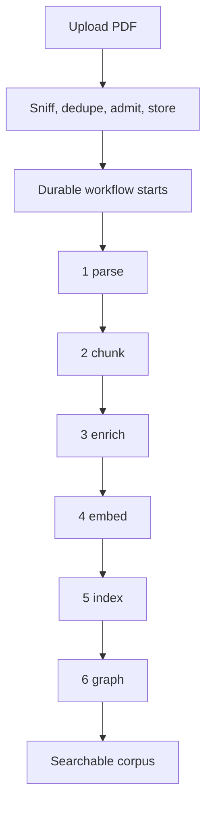
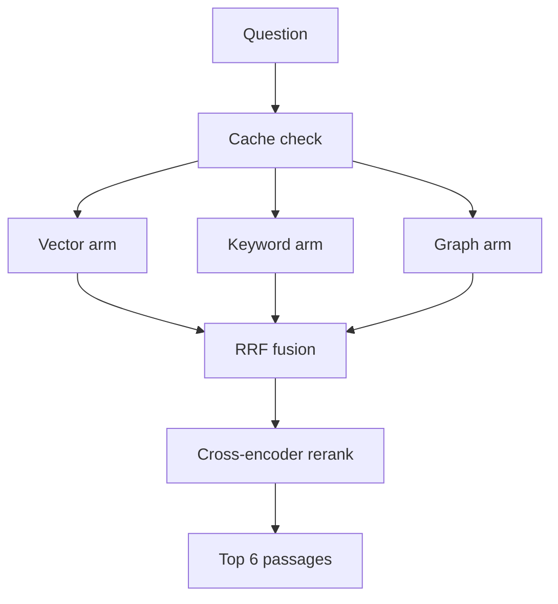
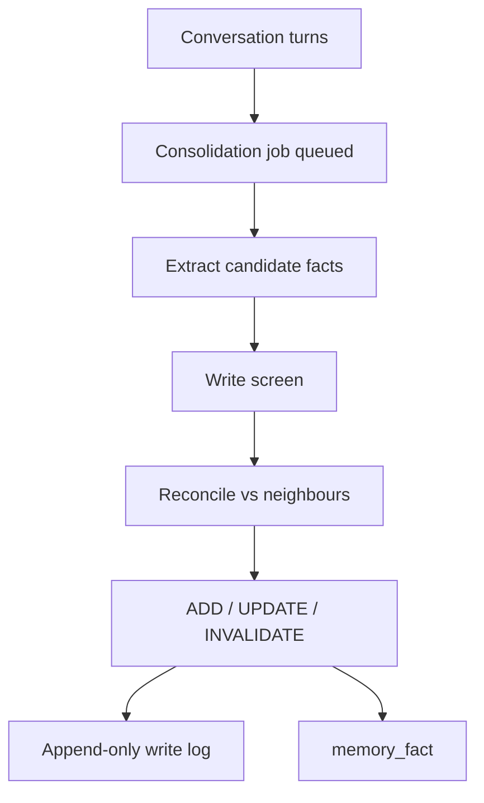

# Part 3 — Knowledge: how Aegis turns documents into answers

A language model knows nothing about your company. It has never read your refund policy,
your contracts, or last quarter's incident reports. Aegis gives it those documents — and
gives it *only the right few paragraphs* out of thousands, with a record of where each one
came from.

This part follows the data:

1. **Ingestion** — a PDF becomes many small, searchable pieces.
2. **Retrieval** — a question finds the pieces that answer it.
3. **The knowledge graph** — named things, and the named links between them.
4. **Caching** — not paying twice for the same question.
5. **Memory** — what the agent remembers about a *person*, across conversations.

---

## 3.1 Ingestion — from a PDF to something searchable

A PDF is a picture of a document. It does not know which words are a heading, which lines
belong to one table, or where one topic ends.

### Four concepts, before any code

**Parsing** is reading the raw file and recovering its structure: headings, paragraphs,
tables, page numbers, and the rectangle each block occupies. Aegis uses **Docling**.
Parsing is slow — 0.4 to 3.2 seconds per page — and peaks near 2.2 GB for one document.

**A chunk** is a small passage, a few hundred words long, stored and searched as one unit.
Aegis packs chunks to **400 words** with **60 words of overlap**. Splitting buys *precision*
(a 200-page manual as one unit returns whole or not at all), fits the model's *context
limit*, and keeps *meaning local* — one vector averaged over 200 pages of mixed topics means
nothing in particular. The overlap exists because the answering sentence may sit exactly on
a boundary; 60 shared words mean it appears whole in at least one chunk.

**An embedding** is a list of numbers placing a text at a point in a large space, arranged
so texts with similar *meaning* land near each other. Aegis uses `text-embedding-3-large`:
**3,072** numbers per chunk. So "you may return goods within 30 days" and "the refund window
is one month" land close together despite sharing almost no words. That is why embeddings
handle paraphrase.

**Indexing** is writing those embeddings into an engine that finds the nearest ones to a
query quickly. Aegis uses **Qdrant**.

### The six stages

Declared in `aegis/src/aegis/jobs/stages.py`, implemented in
`backend/src/app/ingestion/stages.py`.

| # | Stage | What it does | Queue | Timeout | Attempts |
| --- | --- | --- | --- | --- | --- |
| 1 | `parse` | Docling reads the bytes into a tree, saved as a *parse artifact* | `aegis-cpu` | 1800 s | 2 |
| 2 | `chunk` | Packs sections into `chunks` rows with page and box spans and the tenant on every row; each table its own chunk | `aegis-default` | 300 s | 3 |
| 3 | `enrich` | Folds the context prefix into the text to be embedded | `aegis-default` | 300 s | 3 |
| 4 | `embed` | Embeds in batches of 64, writes `chunks.embedding` | `aegis-io` | 900 s | 5 |
| 5 | `index` | Publishes chunks into the vector and key-value stores | `aegis-default` | 600 s | 3 |
| 6 | `graph` | Extracts entities and relations into Neo4j | `aegis-cpu` | 1800 s | 2 |



**The parse artifact.** Stage 1 writes the parsed tree to disk; stage 2 reads that file
rather than re-parsing. The stages are separate units of work, minutes apart on different
machines, so re-deriving the structure would be pure waste.

**The embedding of record.** Stage 4 writes each vector into a normal database column,
`chunks.embedding`. The Qdrant index is a *derived copy*, so rebuilding it replays stored
vectors instead of calling the embedding provider again. A re-index costs nothing.

### The context prefix

Before embedding, Aegis prepends four fields: `[title · type · date · heading path]`. This
is *contextual retrieval*. "the window is 30 days" is meaningless alone;
`[Refund Policy · policy · 2026-01 · Returns > Refund window] the window is 30 days` is
searchable. On the field ablation the pipeline follows, this moved Context@5 from **33.3% to
55.0%** at zero extra model cost.

A missing field becomes a placeholder (`untitled`, `undated`…) rather than being dropped.
The prefix sits *inside* the embedded text, so it is part of what the vector means, and a
corpus mixing four-field and two-field chunks puts two sentence shapes in one space. A
constant placeholder appears everywhere and so carries no information.

### Why ingestion runs as a durable workflow

Ingesting a 200-page document takes minutes. Inside an HTTP request, a browser timeout or a
crashed worker would destroy that work *silently*, halfway, with chunks written and no
embeddings.

Aegis runs ingestion on **Temporal**, a durable execution engine. Each stage is one activity
call, and Temporal's history records which completed; a fresh worker replays that history,
skips what finished and resumes at the interrupted stage. On a hard-killed worker, `parse`,
`chunk` and `enrich` did **not** re-run.

- **Different work, different queues.** A Docling parse peaks near 2.2 GB, so the CPU queue
  runs one activity at a time — two parses would exhaust a 16 GB machine. Embedding is
  network-bound, so the IO queue runs 32; cheap database stages run 8.
- **Different retry budgets.** `embed` gets 5 attempts because provider blips are transient.
  `parse` gets 2: retrying a 126-page parse three times for the same verdict is expensive.
- **Every write is safe to repeat.** `chunk` deletes then inserts in one transaction,
  `embed` updates by primary key. Running a stage twice leaves exactly one of everything.

The upload endpoint does the cheap, irreversible checks first: sniff the file's magic number
rather than trust its declared type, deduplicate on `(tenant_id, content_sha256)`, check the
budget *before* any work exists, then store the bytes and start the workflow.

### Choices made here

| Choice | Alternatives | Why this one |
| --- | --- | --- |
| Structure-aware chunking at ~400 words | Fixed windows; semantic; proposition (DenseX); LLM-driven chunking | Wins on in-corpus retrieval at 100x–10,000x lower cost — propositions lose by 15–27%, LumberChunker costs 1,600x the runtime for no gain |
| Embedding of record in Postgres, index in Qdrant | Index only | An index is disposable; a paid-for vector is not. Re-indexing becomes free |
| Temporal durable workflow | Background thread; Celery; do it in the request | Only durable execution gives "resume after the last committed stage" for free |
| LLM entity extraction (default) | spaCy NER (free, offline) | On one policy document spaCy found **1 entity, 0 relations**; the cached LLM extractor **10 entities, 6 relations** |

### Cross-questions

**Why 400 words and not 100 or 2,000?** Roughly 500 tokens — large enough to hold a complete
argument, small enough that one chunk is about one thing. It is configuration
(`RetrievalConfig.chunk_size`), not a constant.

**If a stage crashes halfway, do I get a half-ingested document?** No. Each stage commits its
rows and its "done" marker in one transaction, so a stage whose output rolled back cannot be
recorded as finished. Re-running is safe because every write is idempotent.

**You embed tables? A table has no sentences.** Each table is its own chunk carrying its
shape and caption; above a size threshold it also carries a short generated sentence saying
what it shows, written *in front of* the grid, cached on the content hash.

**Does the tenant boundary survive ingestion?** On every row. `chunks.tenant_id` is
`NOT NULL`, published vector ids are prefixed with the owning tenant, and the file path in
the index carries a `t7::` owner tag the read path checks.

---

## 3.2 Retrieval — finding the right passages

A question arrives. Somewhere in tens of thousands of chunks are the six that answer it.
Aegis runs three searches, fuses them, then re-orders the survivors with a model slower and
far more accurate than any of the three (`aegis/src/aegis/retrieval/`, orchestrated by
`pipeline.py::Retriever.retrieve`).



Wide recall asks each arm for up to **20** candidates (`recall_top_k`); the answer is built
from **6** (`final_top_k`).

### Arm 1 — vector search

The question is embedded into the same 3,072-number space as the chunks, and the engine
returns the nearest points. Strong at paraphrase and at questions phrased nothing like the
document. Weak at exact rare strings — "clause 7.3.2", a part number, a case ID — which are
short arbitrary tokens that embeddings smooth into a general region of meaning.

### Arm 2 — keyword search, and exactly what it is

The keyword arm is **PostgreSQL full-text search**, ranked with **`ts_rank`**, over the whole
of a tenant's `chunks` table (`lightrag_backend.py::keyword_recall`).

**It is not Okapi BM25, and this guide will not pretend otherwise.** BM25 has three ideas;
`ts_rank` has two:

| BM25 idea | Present? | What it does |
| --- | --- | --- |
| Term-frequency saturation (`k1`) | Yes | A word appearing ten times is worth more than once, but not ten times more |
| Length normalisation (`b`) — flag `1`, divide by `1 + log(length)` | Yes | A long passage should not win merely for having more room |
| **IDF — inverse document frequency** | **No** | — |

**IDF in one sentence:** it weights a word in inverse proportion to how many documents
contain it, so a rare word like "indemnification" counts far more than a common one like
"policy".

**What its absence costs.** A rare identifier and a common filler word carry the same
weight: a passage wins for covering *more of the query's terms*, not *rarer* ones. Ordering
inside this arm is worse than a true BM25 index.

**Why that costs less than it sounds.** RRF fuses the arms on **rank**, not score. Two
rankers that agree on an ordering fuse identically however differently they number it. This
arm owes the pipeline a sensible order, not a calibrated score.

`ts_rank` beat `ts_rank_cd` by measurement: `ts_rank_cd` is proportional to the number of
covers, so a passage repeating one common query word four times outranks the passage
carrying the identifier — the exact failure this arm exists to fix. The query is built with
`plainto_tsquery`, whose `&` operators are rewritten to `|` because BM25 is disjunctive. The
rewrite happens on that function's *output*, already normalised and stripped of operators,
so no user text reaches SQL.

**The naming.** The wire value is still `bm25`, in three packages, the OpenAPI schema and
stored provenance. The console relabels it **"Keyword (ts_rank)"**.

One honesty rule in `_keyword_signal`: a backend that can search its whole corpus by keyword
is a genuine third recall arm, counted and named in the provenance. A backend that cannot
only re-scores the ~20 candidates the other arms found, adding no recall — so the list is
fused with **no origin at all** and reported as `KeywordReport(scope="pool")`. Claiming an
arm fired when it only reshuffled would be claiming recall that never happened.

### Arm 3 — graph traversal

Matches the question against **entity** descriptions, walks their neighbours, and returns
the chunks those entities came from. Strong at questions that hop between things; weak at
questions with no named entity. Section 3.3 covers it.

### Fusion — Reciprocal Rank Fusion

Adding the three arms' scores does not work: a cosine similarity of 0.83, a `ts_rank` of
0.0067 and a graph-proximity score are three different measuring systems. Adding them means
inventing weights, and weights need re-tuning whenever a model, corpus or engine changes.

RRF throws the scores away and keeps only the **position**:

```
score(d) = sum over arms of  1 / (k + rank of d in that arm)     with k = 60
```

Read plainly: **being near the top of several lists beats being at the top of one.** A
document ranked 3rd by vector and 2nd by keyword outscores one ranked 1st by vector alone. A
larger `k` flattens the difference between ranks; 60 is the community default. It needs **no
weights**, so nothing drifts, and a broken arm returning nothing contributes nothing rather
than poisoning the ordering with a mis-scaled score.

`fusion.py` is fifteen lines of pure Python with no dependency. It merges candidates by id
and unions the **origins** of every list a candidate appeared in — which lets the console
honestly say "vector + graph fused via RRF" for a specific passage.

### Rerank — the local cross-encoder

RRF gives a good order; a cross-encoder gives a better one.

| | Bi-encoder (vector search) | Cross-encoder (rerank) |
| --- | --- | --- |
| How it reads | Encodes query alone, passage alone, compares the two number lists | Reads query and passage **together** in one pass, outputs one relevance number |
| Speed | Passages embedded in advance; search in milliseconds | Once per (query, passage) pair, at query time |
| Accuracy | Good | Much better — it sees which words in the passage answer which words in the question |

A bi-encoder is fast enough to search a million chunks and too coarse to order the final
six; a cross-encoder is too slow for a million and exactly right for twenty. Aegis uses
both.

The reranker is a **local ONNX model** — `jinaai/jina-reranker-v1-tiny-en`, 33M parameters,
~130 MB on disk, 8K context, Apache-2.0 (`local_reranker.py`). It runs on `onnxruntime`,
needs no GPU and pulls no PyTorch.

**Cost, on a 16 GB M3** over 20 real 400-word chunks: **1.44 s p50 / 1.55 s p95** — ~**72 ms
per passage**, so cost is `72 ms × recall_top_k`, the honest lever on a slower box.

**Benefit, on the project's own 53-case gold set**, where the reranker is the only difference
between the two arms:

| Metric | Before | After |
| --- | --- | --- |
| MRR@20 | 0.557 | 0.686 (+12.9 pp) |
| nDCG@10 | 0.622 | 0.732 |
| recall@6 | — | +0.009 (one case) |

Recall barely moves, as expected: both arms see the same 20-candidate pool, and a reranker
cannot retrieve what recall missed. What moves is **order** — the right answer travels
toward rank 1, the passage the generator reads first and the citation a human checks. (A
"+12.1 pp recall@5" figure exists for this class of model, but it is T2-RAGBench's result on
their corpus, not this project's.)

**The fallback is loud and never "no reranking".** If the weights are missing or the ONNX
session dies, the pipeline logs at ERROR and falls back to an LLM reranker — never to the
unranked fused order. Which engine ran is reported on `observability.rerank.engine`.

Surviving passages are then **spotlighted**: marked as data, not instructions, because
retrieved text is untrusted and an injection surface. The cross-encoder needs none — it
emits a float, not a continuation, so there is no instruction for injected text to hijack.

### Cross-questions

**Why not just use vector search?** Embeddings are blind to exact rare terms — clause
numbers, part numbers, case IDs — the class enterprise users ask about most, and they cannot
follow a named relationship from one document into another. The keyword arm covers the first
gap, the graph arm the second, and RRF combines them without deciding in advance which one a
question needs.

**Your keyword arm has no IDF. Isn't that a broken BM25?** It is not a BM25 at all, and the
code, the docs and the console all say so. The gap costs ordering *within* that arm and
little at pipeline level, because RRF fuses on rank. A real BM25 index was rejected on
tenant-isolation and dependency grounds: with Postgres FTS the tenant predicate and the
keyword predicate sit on the same row of the same table, so isolation is a `WHERE` clause
rather than a second system to keep in sync.

**Why fuse on rank rather than score?** The scores come from different engines and are not on
the same scale. Combining them needs weights; weights need tuning; tuning drifts. Rank is
the one thing all three arms agree on the meaning of.

**Why a local reranker instead of an LLM rerank call?** Deterministic, so two evaluation runs
are comparable. Free per query. Not prompt-injectable. And it replaced an LLM call over the
same twenty passages that was neither faster nor free.

**What if one arm returns nothing?** RRF simply has one fewer list, and the provenance
records only origins that produced a surviving candidate — so a silent arm is visible as a
silent arm rather than papered over.

---

## 3.3 The knowledge graph

An **entity** is a named thing the corpus talks about. The vocabulary is ten domain-neutral
types: organization, person, product, policy, procedure, issue, system, category, location,
event. A **relation** is a named, directed link between two entities carrying a phrase
lifted from the document: `Finance Director` —*approves*→ `refund above 5000`.

### How they are extracted

The `graph` stage runs an extractor over each chunk (`graph_extract.py`). Two
implementations satisfy one interface. **`LLMCachedExtractor`** (default) makes one
cheap-model call per chunk and **caches the result to disk keyed on `sha256(chunk_text)`**,
so the same text is never paid for twice. **`SpacyExtractor`** is deterministic, free and
offline, mapping spaCy's named-entity recognition onto the same ten types. The LLM extractor
is the default because the deterministic path does not produce a usable graph: on a
refund-escalation policy spaCy produced **1 entity and 0 relations**, the LLM extractor **10
entities and 6 stated relations**.

Identity makes a graph a graph. An entity's id is `kind:normalised_label`, so "ACME Corp",
"acme corp" and "ACME  Corp" across twenty chunks become **one node** connecting them.

Extraction is written to two places for two readers: **Neo4j** holds the durable graph that
backs the Graph screen; **Qdrant entity and relation collections** hold the *vectors* that
let a query find a node in it. Without the second, the graph arm cannot be searched.

Every node and edge carries a tenant-tagged `file_path` such as `t7::refund-policy.pdf`.
That tag is the security control, not a label: Neo4j has no row-level security, so the read
path filters on ownership, and an element whose owner cannot be established is shown to
nobody. Each node also carries `source_id` — the chunk ids it came from — the field that
turns a matched entity back into quotable passages.

### Why a graph answers questions vector search cannot

Take: **"Who approves a refund above ₹50,000, and what does their own policy say about
escalation?"** The answer is not in one passage. It is in two, in different documents,
joined by a name the question never mentions.

The graph does it in two hops: match `refund above 50000`, follow the *approved by* edge to
`Finance Director`, then follow *governed by* to `Escalation Policy` and return that node's
chunks. This is **multi-hop retrieval**, and the link between hops is an explicit extracted
relation, not a similarity guess. Vector search cannot do it because the second passage does
not resemble the question — it resembles the answer to the first half.

### Cross-questions

**Isn't an LLM-extracted graph hallucination with extra steps?** Every entity comes from real
corpus text and every relation carries a real extracted phrase. Where the extractor finds
nothing, nothing is written; edges are never invented to fill the picture.

**Why LightRAG rather than Microsoft GraphRAG?** GraphRAG's indexing includes community
detection and summarisation, which is slow and expensive. Aegis must index a freshly
generated corpus within about two hours on a 16 GB, no-GPU, no-Docker machine. LightRAG
skips that step (ADR 0003).

**Two tenants upload the same public document — do their graphs merge?** Nodes merge and
union their owners; an entity name in a tenant's own corpus is a name that tenant already
knows. Edges stay **single-owner**, keyed by `(source, target, owning file_path)`, because
an edge's phrase is lifted from a specific document and merging would put one tenant's
sentence behind another's provenance.

**Why does a node description carry no document prose?** A merged node's description is
overwritten by whoever writes last, which would hand one tenant's document text to every
other tenant merged into that node. Descriptions carry only the entity's kind and the
extractor that produced it.

---

## 3.4 Caching

Asking the same question twice should not pay twice for three searches, a cross-encoder and
a generation call. Aegis has two independent caches at two layers.

| Cache | File | Stores | Saves |
| --- | --- | --- | --- |
| **Retrieval cache** | `retrieval/cache.py` | The retrieval result — passages and provenance | Three arms plus the rerank |
| **Answer cache** | `retrieval/answer_cache.py` | The final generated answer and its citations | The generation call as well |

The retrieval cache has two tiers. **Exact** is a deterministic key —
`sha256(scope partition + normalised query)` — and one Redis `GET`; normalisation only
collapses whitespace and lowercases. **Semantic** is a cosine nearest-neighbour search over
stored query embeddings, requiring **cosine ≥ 0.985** — deliberately close to identity,
because this tier is a conservative front layer, not a broad quality shortcut. Below it the
match is only a *prefetch hint* and full recall, fusion and rerank still run. Default TTL is
one hour.

### Why the cache key must include the tenant scope

**Every tier is partitioned by scope, never filtered by it.**

*Filtered* means: search one shared index, find the nearest entries across all tenants, then
discard those that do not belong to the asker. Another tenant's passages have now been read
into this process, and one missing `continue` turns it back into a leak.

*Partitioned* means: the scope digest is part of the exact key **and** of the semantic
tier's index key, so a lookup for tenant A can only load tenant A's entries and the
candidate set is scoped **before any comparison happens**. The leak is unreachable rather
than merely unlikely. The stored scope is re-checked on the way out as a corruption
tripwire, and it *raises* rather than skipping quietly.

### "Cache-exact"

Every hit carries the original query, the write timestamp, and a **kind**. **`cache-exact`**
means the incoming query was character-for-character the same after whitespace and case
normalisation — no similarity judgement involved. **`cache-near`** means different text whose
embeddings cleared 0.985. So the interface can say "answered from the cache of query *X* at
time *T*", with a `cache` origin added on top of the stored result's own origins. A cached
answer never launders itself as a fresh one.

### Cross-questions

**Two caches sounds like one too many.** They save different things and hit independently. A
rephrased question may miss the answer cache but hit the retrieval cache, still saving three
searches and a cross-encoder pass.

**Why no RediSearch vector index?** Portability — the target may be a Windows box running
Memurai. A per-scope Redis SET plus an in-process cosine scan needs no Redis module, and the
candidate sets are small precisely because they are already partitioned.

**Can a stale cache serve a wrong answer after a document changes?** The TTL bounds it to an
hour and every hit carries its write timestamp, so age is visible. Cache correctness is
bounded rather than guaranteed — which is why the threshold is near-identity and the
provenance is shown rather than hidden.

---

## 3.5 Memory — what the agent remembers between conversations

### Retrieval is not memory

Two subsystems, two questions. Confusing them is the most common mistake here.

| | Retrieval | Memory |
| --- | --- | --- |
| Answers | "What do the **documents** say?" | "What do I know about **this subject**?" |
| Source | Uploaded corpus | Past conversations |
| Example | "The refund window is 30 days" | "This customer prefers email and is on the enterprise plan" |
| Written by | Ingestion | Consolidation, after conversations |
| Lives in | `chunks`, Qdrant, Neo4j | `memory_fact`, `memory_message`, `memory_profile` |



### The bitemporal model

A stored fact carries **two independent timelines** (`memory/stores.py`):

| Timeline | Columns | Meaning |
| --- | --- | --- |
| **World time** | `valid_at`, `invalid_at` | When the fact became true, and stopped being true, in the real world |
| **Transaction time** | `created_at`, `expired_at` | When the system learned it, and stopped believing it |

Why two? "The customer moved to Bangalore in March" and "we found out in July" are different
facts. One timestamp cannot say whether the agent was wrong or merely late.

So a fact is **superseded, never overwritten**. **ADD** inserts a new valid fact. **UPDATE**
— a refinement of the same value — inserts a superseding row and sets `expired_at` plus
`supersedes_id` on the old one. **INVALIDATE** — a contradiction — sets the old row's
`invalid_at` and `expired_at` and inserts the contradicting fact. Never a delete, so "what
did the agent believe on 15 June, and why?" has an answer.

### Consolidation

Raw turns are cheap to store and useless to search. Consolidation distils them into facts
(`memory/consolidate.py`), running **off the request path** as a background sweep over a
durable queue, every 4 turns by default.

**EXTRACT**: one cheap-model call over the running summary plus the last 10 turns, using the
prompt supplied by the injected `MemorySpec`. Candidates below 0.55 confidence are dropped.

**RECONCILE**: each survivor is embedded and its nearest valid neighbours fetched by cosine.
A top neighbour at cosine ≥ 0.97 **and** the same predicate is a duplicate — NOOP, no second
model call. Otherwise a cheap call picks ADD, UPDATE, INVALIDATE or NOOP.

A mutating decision whose `target_id` cannot be resolved to a fact the model was actually
shown is **refused**, never retargeted onto the nearest neighbour, and audited separately.

The queue is a durable database row rather than a fire-and-forget task, which loses work on
redeploy: enqueue `PENDING` in the request, flip to `DONE` in the background, let a periodic
sweep re-run stragglers.

### The write screen — and why it is a separate layer

Every candidate fact is screened **before** it reaches the store
(`guardrails/pipeline.py::check_memory_write`). This fourth guardrail stage exists because
the other three structurally cannot catch the attack. A user types an ordinary-looking
message containing a poisoned claim; the **input rail** passes it, correctly, because at
that moment it *is* ordinary; the extractor distils it into a durable fact; three weeks
later a different turn recalls that fact as *this platform's own remembered belief*, where
nothing treats it as untrusted.

The turn that poisons the store and the turn that is poisoned are **different turns**, which
is why guarding both ends of one turn never catches it. And **a document chunk is read when
it is retrieved; a memory fact is written once and recalled into many later prompts.** A bad
chunk affects one answer. A bad fact has a long life.

Two design details. The screen returns a **verdict object carrying the rewritten field
values**, not a boolean — a caller that writes the strings it passed in has redacted nothing,
and handing back the fields makes that mistake impossible. And a refusal gets its own
write-log op, `REFUSED`, rather than a NOOP with a reason string: "the extractor proposed
nothing new" and "an attack was turned away" are different events, and a dashboard folding
them together can report neither.

### Recall and assembly

Recall blends four signals, each min-max normalised across the candidate set
(`memory/scoring.py`):

| Signal | Weight | Meaning |
| --- | --- | --- |
| Relevance | 1.0 | Cosine similarity to the current query |
| Recency | 0.5 | Exponential decay: half-life **30 days** for facts, **3 days** for raw turns |
| Importance | 0.5 | A 1–10 rating assigned at extraction |
| Frequency | 0.1 | How often this item has been recalled before |

The selection is assembled into one context block under a hard budget of 8,000 tokens, 1,200
reserved for the reply. The layout is **lost-in-the-middle ordering**: durable high-value
material at the top (profile, facts, skills, summary), the bulky episodic tier in the
tolerant middle, verbatim recent turns at the bottom nearest the query — because models
attend best to the start and the end of a long context. The assembler is greedy,
deterministic and **never makes a model call**; over budget it evicts raw turns first, then
episodic, summary, skills, facts, profile.

### Retention

Everything else in memory is built to keep things, so a subject's memory grows without bound
— a storage bill and a data-protection problem. `retention.py` is the one scheduled hard
delete, deliberately narrow.

| Table | What retention removes |
| --- | --- |
| `memory_message`, `memory_session` | Episodic turns past the horizon, and sessions left with no turns |
| `memory_fact` | Only facts **already closed** — superseded or invalidated — and closed for a minimum period. A currently-valid fact is never touched at any age |
| `memory_consolidation_job` | Terminal queue rows past the horizon |
| **`memory_write_log`** | **Never swept** |

Deleting a valid fact on a timer would silently lobotomise the agent while every dashboard
read healthy. The write log is the "why does the agent believe X" trail, and a retention
policy erasing its own evidence would be the opposite of the thing it is for. It is small
(one row per fact write), and a subject-initiated erasure still removes it — the correct seam
for "delete what you hold about me".

Because this module deletes rows, scope is never implicit: the caller must say exactly one of
`tenant_id=<id>`, `untenanted=True`, or `unrestricted=True`. Passing none raises rather than
defaulting to the most destructive reading.

### The append-only write log

Every fact write — ADD, UPDATE, INVALIDATE, NOOP, REFUSED, PRUNE, DELETE — leaves a row in
`memory_write_log` with the operation, the before and after state, the deciding model, the
reason, and the trace. It makes "why does the agent believe X?" a question with an answer.

### Cross-questions

**Why not put the whole conversation history in the prompt?** It exceeds the context window,
costs tokens every turn, and buries the three sentences that matter inside a thousand that
do not.

**Why supersede instead of overwrite?** An agent that changes its mind silently cannot be
audited. Supersession lets you reconstruct exactly what the agent believed at any past
moment and see the write that changed it.

**The extractor is an LLM — what if it invents a fact?** Three layers. A confidence floor
drops weak candidates, the write screen refuses or redacts before storage, and a decision
naming a target the model was not shown is refused outright.

**Isn't the write screen redundant with the input rail?** No — the timing differs. The input
rail judges a message as a message, when it is genuinely ordinary. The poison becomes
dangerous only after promotion to a durable belief recalled as the platform's own knowledge.
Two turns, two rails.

**How is memory kept per-tenant?** Every recall query filters `subject_id` **and**
`tenant_id`, and the tenant predicate is NULL-**symmetric**: `tenant_id=None` means
`tenant_id IS NULL`, never "any tenant". Emitting the predicate only when a tenant is
supplied would let an unscoped recall return a tenant's row on a `subject_id` collision —
and recall output goes straight into the prompt. Row-level security is an additive belt,
never the primary control.

---

## 3.6 The alternatives, answered honestly

### Why not vector search alone?

Answered in §3.2: it fails on exact rare terms and cannot follow a named relationship across
documents, which is what the keyword and graph arms are for. **Cost of the choice:** three
arms are more moving parts, more latency, and more to explain.

### Why not a managed RAG service?

**The deployment target** is a 16 GB machine with no GPU and, on the strictest variant, no
Docker; a managed service assumes a hosted plane. **Tenant isolation is the product**: the
predicate sits on the same row as the data, is enforced again by row-level security, and
owner tags travel into the vector and graph stores — a managed service's isolation model
cannot be inspected or proved. **Provenance**: the console shows which arms fired, how many
candidates each returned, and which rerank engine ran. **Cost control**: admission runs
before any work exists and every gateway call is metered. **Cost of the choice:**
substantially more code to own, test and operate.

### Why not fine-tune a model on the documents?

Fine-tuning teaches style and behaviour; it is a poor way to teach facts.

| Problem | Retrieval | Fine-tuning |
| --- | --- | --- |
| A document changes | Re-ingest one file, seconds | Retrain, hours to days |
| Citations | Every sentence traces to a chunk, page and box | The model cannot say where it learned something |
| Tenant isolation | One index, one predicate per tenant | One model per tenant, or one model that knows everyone's data |
| Access revocation | Delete rows | The weights already absorbed it |
| Governance | Tenant data is never used to train | Tenant data becomes model weights |

Aegis's AI policy states that no tenant data is used to train or fine-tune any model.
Retrieval keeps that promise structurally; fine-tuning breaks it by definition.

### Why not a graph database as the only store?

A graph is excellent at relationships and poor at everything else. It has **no semantic
similarity** — an edge exists or it does not, and "these two paragraphs mean roughly the same
thing" needs embeddings, at which point you have a vector store again. Neo4j has **no
row-level security**, so tenant isolation would live entirely in application code, and a
reader-applied filter is strictly weaker than a `WHERE` clause the database enforces. And
**extraction is lossy**: the graph holds what the extractor found, the chunks hold what the
document said, and you need the text to quote. Hence the split: **Postgres is the record**,
**Qdrant is the dense index**, **Neo4j is the graph**.

### Why a local reranker instead of an LLM rerank call?

Deterministic, free per query, and not prompt-injectable, because it emits a float rather
than text (§3.2). The 1.44 s p50 is not a second *added*: it replaced an LLM call over the
same twenty passages that was neither faster nor free. The LLM reranker stays as a tested
fallback for a machine that cannot carry the weights.

### Cross-questions

**LightRAG, Docling, Qdrant, Neo4j, Postgres, Redis and Temporal — isn't that too many
dependencies?** Each owns a job the others cannot do, and the boundaries are drawn so any of
them can be replaced without touching the pipeline: fusion is pure Python, the retriever
takes its backend by injection, and the stage contract is standard-library-only.

**What is the biggest weakness of this design?** The keyword arm's missing IDF. The fix is
known — a real BM25 index — and was rejected on tenant-isolation and dependency grounds, not
because the gap does not exist.

**With one more week, what would you add?** That BM25 index, with a tenant filter provable as
strongly as a SQL `WHERE` clause, and a larger gold set — 53 cases cannot defend a one-case
recall delta in either direction.
