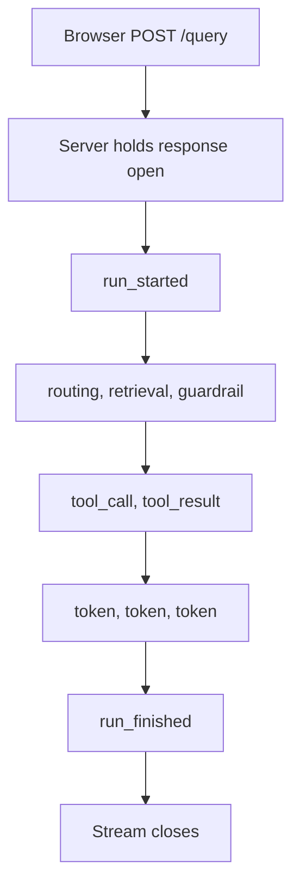

# Part 7 — The surface: console, streaming and the design language

Everything in the previous parts is machinery. This part is what a person actually sees.

The argument for taking it seriously is blunt: **what people see is what they buy.** A
platform can hold the best guardrail rail and the most honest metrics in the room, and
none of it counts if a reviewer cannot tell from the screen what the screen does.

---

## 7.1 The console: five portals, one platform

The console is a **Next.js 15** application using the **App Router**, with React 19 and
Tailwind CSS 4. "App Router" is Next.js's file-system router: a folder becomes a URL, and
components render on the server by default and ship as HTML, so a page arrives with data
already in it rather than as an empty shell that fetches afterwards.

Aegis serves **five role-scoped portals**, keyed on the fine-grained role the backend
issued to the session. That role reaches the browser on `POST /auth/login` inside the
token, and `web/src/lib/portal.ts` decides what the browser does with it.

| Portal | Who they are | What their portal is for |
|---|---|---|
| `platform_admin` | Operates Aegis itself | Every tenant, no tenant pin |
| `tenant_admin` | Administers exactly one tenant | Their own tenant's governance |
| `ai_team` | Builds and tunes the agent | Retrieval, evals, prompts, guardrails |
| `devops` | Runs the stack | Versions, patches, health, security |
| `client` | The tenant end-user | Their value, risk and approvals |

**Why show different surfaces to different roles?** Because a navigation menu is a promise.
Three reasons, in order of weight:

1. **A menu entry the backend will refuse is a lie.** Every route is guarded server-side. If
   a role's principal cannot pass the guard, offering the link produces a 403 and a Retry
   button that offers to fail again. So the rule for adding a section to a portal is:
   **that role must be able to *act* on it.**
2. **Least privilege has to be visible.** A tenant administrator and the platform operator
   are different jobs with different data scopes. One shared "admin" portal would put them
   on the same URL and the same screens, making the isolation invisible even where it is
   real underneath.
3. **A short demo needs a short menu.** Seventeen sections a role can use beats forty they
   mostly cannot.

The portal type is deliberately *the same type* as the backend's role enum rather than a
parallel list of names, so a second list here cannot disagree with the token while still
type-checking. Every section in the catalogue must render a live surface — a backend test
reads this file and asserts it. The one read-only exception is a role's own record: a
tenant admin's audit trail, a client's own approvals.

### Cross-questions

**Q: Isn't hiding menu items just security by obscurity?**
No — the enforcement is server-side on every route, and the portal is a *usability* layer
on top of it. Hiding a control the guard would refuse stops a user wasting a click; it is
not what stops them getting the data.

**Q: Why five portals rather than one console with permission checks per widget?**
Because per-widget checks produce a screen full of greyed-out boxes, which reads as
capability the operator does not have. Five focused surfaces each say clearly what that
role can do.

**Q: What stops the frontend's role list drifting from the backend's?**
It is the same type, imported, not a copy — and a backend route-coverage test reads the
portal catalogue and asserts every listed section resolves to a real, reachable route.

---

## 7.2 Streaming: watching a run rather than polling it

**Server-Sent Events (SSE)** is a web standard where the server holds one HTTP response
open and pushes text messages down it as they happen, and the browser reads them as a
stream. One connection, one direction, plain text.

An agent run is not one event. It is a router decision, then retrieval, then guardrail
verdicts, then tool calls, then tokens arriving one at a time, then a final status. The
alternatives to streaming are both bad. **Waiting for the whole answer** leaves the user
staring at a spinner, learning nothing about what the machine did. **Polling every second**
multiplies load by client count, quantises latency to the poll interval, and loses the
intermediate steps that happened *between* polls — which for a governance product is the
most valuable part.

**Why SSE and not WebSockets?** A run is one-way: the server has everything to say and the
client has nothing to add once the request is in flight. WebSockets buy a duplex channel
you would not use, and they cost a protocol upgrade, their own reconnect logic, awkward
passage through proxies and load balancers, and no standard replay. SSE is ordinary HTTP —
same auth header, same middleware, same infrastructure — with reconnection defined by the
standard.

One detail worth knowing: because `POST /query` needs a request body, the browser's
built-in `EventSource` API cannot be used — it is GET-only. So the console reads the stream
from a `fetch` response body and parses the SSE frames itself, in one shared function used
by both the run stream and the notification stream.

### The tagged event union

Every event on the wire is one member of a **discriminated union** — a set of object
shapes that all carry the same field, `type`, whose literal value says which shape this
one is. The union has **21 members**, including `run_started`, `node_started`,
`node_finished`, `routing`, `retrieval`, `guardrail`, `tool_call`, `tool_result`,
`reasoning`, `reflection`, `verification`, `approval_required`, `approval_queued`,
`budget_exceeded`, `memory`, `provenance`, `agent_status`, `synthesis`, `token`,
`run_finished` and `error`. Every event also carries `run_id` and a monotonic `seq`.

The value of the tag is that TypeScript can *narrow* on it: inside a branch checking
`type === 'guardrail'`, the compiler knows the guardrail fields exist and that the
retrieval fields do not. An unhandled event type is a compile error, not a blank panel.
The TypeScript union mirrors the backend's Pydantic models, and tests pin it against the
generated OpenAPI schema, because the failure mode of a hand-maintained copy of a
generated type is silence.



### Cross-questions

**Q: What happens if the connection drops mid-run?**
The run continues server-side — it is not tied to the socket — and its record and audit
trail are written regardless. The `seq` number on every event is what lets a client
reconnect and know where it was.

**Q: One malformed frame — does the whole stream die?**
No. A frame that fails to parse is skipped rather than tearing down the reader, because
one bad event is not a reason to lose the nineteen good ones after it.

**Q: Why mirror the backend types by hand instead of only generating them?**
The hand-written union is the ergonomic one the components use, and it is *pinned by test*
against the generated schema. The generation is the source of truth; the mirror is
checked, not trusted.

---

## 7.3 The design language

The design system lives in `DESIGN.md` and is enforced by tests, not by convention. Four
rules matter most, and a reader should be able to defend each one.

### The receipt — a figure names its own source

Aegis refuses to assert anything without its origin. Every figure on every screen carries a
**receipt**: a compact mono line saying where the number came from.

```
Source: usage_ledger · univariate · statsforecast   n=412
```

A clamped spend cap says `Decided by:`, a health row says `Evidence:`, a caught attack
says `Rail:`. One component, `Receipt`, renders all of them, so provenance is never
re-improvised per screen and a reader learns the treatment once.

This is **the glass box made visual.** The platform's claim is that nothing it shows is
unaccountable, and the receipt is that claim rendered under every number. It is the one
place the system spends visual boldness, which is why everything around it stays quiet.

### The absence — a number that cannot be computed says so, in its own slot

The counterpart, and the harder rule. When a figure cannot be sourced, the screen renders
an **`Absence`** in the slot the number would have occupied: the figure's name, one line
saying why it is not recorded, and — behind a tooltip — what would have to be emitted or
stored before it could exist.

**Why a zero is a lie and an absence is not.** A zero is a measurement: it says *we looked,
and the value is nothing*. "We did not look", "the sensor is down" and "this has never been
instrumented" are different facts, and rendering any of them as `0` tells the reader
something false with total confidence. Worse, a dashboard's silences are invisible — a
reader cannot distinguish a figure that is missing from one that was never possible, so
they invent the missing one. The absence makes the silence visible.

It is **one line, not three**: with a hundred of them across the console, a stacked
three-paragraph apology would make a panel with nothing to show taller than a panel with
something to show.

### Listings open closed — hover peeks, click pins

Any panel whose body is a list of rows — documents, approvals, audit entries, jobs,
prompts, advisories, probes — opens as a single bar carrying **its title, its row count,
and one key figure**. Nothing else.

```
Documents                                    10 rows · 7 ingested
```

**Hover expands it. Click pins it open** — and the pin survives the pointer leaving,
because hover is for a glance and the pin is for someone who actually wants to read.

The reason is the demo. The whole platform is presented in **ten to fifteen minutes**, so a
reviewer arriving on a screen has a few seconds to decide what it is. If those seconds go
on scrolling past forty rows to find the one figure that matters, the screen has failed —
however correct the table was. The closed bar is the whole contract: a reviewer learns
*what this panel holds* and *that it is populated* without reading one row.

Two rules keep it honest. **Never `display:none`** — rows are collapsed, not removed, so
they stay in the accessibility tree and reachable by keyboard, behind a real `<button>`
with `aria-expanded`. And **one thing per page stays open**: each screen keeps its *primary*
surface expanded, because a page of nothing but closed bars explains nothing.

### Light theme, one ramp, an 11px floor

| Rule | What it means | How it is held |
|---|---|---|
| **Light theme only** | No dark-mode variants anywhere in the app source | A test fails on any `dark:` utility |
| **One blue ramp** | Eight steps, one hue carrying meaning; status colours reserved for status, always with an icon and a word | A test fails any blue step outside the eight |
| **One type ramp** | `display 28 · metric 28 · title 16 · body 14 · label 12 · meta 12` | One page title per screen |
| **11px functional text floor** | No functional text *declared* below 11px | A test scans utilities, `font-size` declarations and the scale |

IBM Plex Sans carries the interface; **JetBrains Mono carries every numeral, id, cost,
count and timestamp**, so columns align and figures do not reflow as they tick.

The floor claims exactly what it can defend: it is a floor on what the codebase
*declares*, not a promise about every pixel the browser finally paints. A reader's own
browser text-size setting can scale below it, and that is a preference someone chose —
honouring it is better than overriding it.

And the standing instruction behind all of it: **prose is a last resort.** If a paragraph
explains a mechanism, it is a tooltip. If it explains a number, it is a receipt. If it
explains an absence, it is an absence. What survives that test is documentation, and
documentation belongs in `docs/`, not on the screen.

### Cross-questions

**Q: Light theme only — isn't dark mode table stakes now?**
For a consumer app, yes. This is a projected, printed and screenshotted enterprise
console, and one theme means one set of contrast measurements to verify rather than two.
Half-finished dark mode is worse than none.

**Q: If listings are closed by default, how does a reviewer know there is data?**
The closed bar carries the row count and one key figure. "10 rows · 7 ingested" answers
*is this populated* without opening anything.

**Q: A receipt under every number sounds like clutter.**
It is small, muted, mono, and either inline beside the figure or under a hairline at the
foot of the panel. It is also the product: a governance console whose numbers cannot be
traced is a slide deck.

---

## 7.4 What the operator sees

A short tour of the surfaces a reviewer is most often shown.

| Screen | What it holds |
|---|---|
| **Console** | The live agent. Ask a question and watch the run stream: the router's choice, retrieval rounds, each guardrail verdict, tool calls, the answer arriving token by token, and the trace panel beside it |
| **Guardrails** | The rails themselves — each layer, what it screens, and a live demo where you fire a probe and watch which layer catches it and what rationale it wrote |
| **Compliance** | Twelve frameworks, mapped control by control to a file, a route or a test. Not a claim of compliance — a map from each control to the artefact that implements it |
| **Audit** | The append-only trail, tenant-isolated by Postgres row-level security, with links from an entry back to the trace that produced it |
| **Evals** | The two layers from Part 5, side by side: the deterministic offline gate with its per-metric thresholds, and the live `ragas` run behind a button that states its cost in gateway calls before you press it |
| **Interop** | The published standards other systems can talk to — A2A agent-to-agent, MCP tool servers, and a CycloneDX software bill of materials |
| **Red team** | Pick a suite, fire the battery, and read the block rate, the false-positive rate, which rail caught what, and which probes were refused unchecked |
| **Forecast / MLOps** | Spend projected forward with *measured* interval coverage, and the model card: ensemble members, SHAP drivers, requested and achieved coverage side by side |

The through-line across all eight: every screen shows a number, names where the number
came from, and states plainly when a number could not be produced.

### Cross-questions

**Q: Which screen would you show first with ten minutes on the clock?**
The Console, because it is the only one that shows the machine working end to end, and the
stream makes the internals visible without narration. Then Guardrails, then Evals.

**Q: The compliance screen maps twelve frameworks. Is Aegis certified?**
No, and it does not say it is. It maps each control to the file, route or test that
implements it. That is evidence an auditor can follow, not a certificate.

**Q: How much of this is real versus mocked for the demo?**
Every listed section renders a live surface against the real backend — a route-coverage
test reads the portal catalogue and asserts it. Where a figure genuinely cannot be
computed in a given deployment, the screen shows an absence rather than a placeholder
number.
