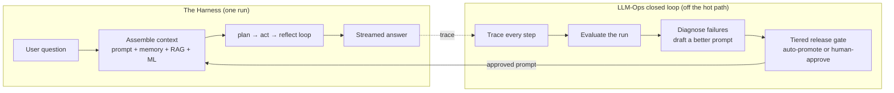
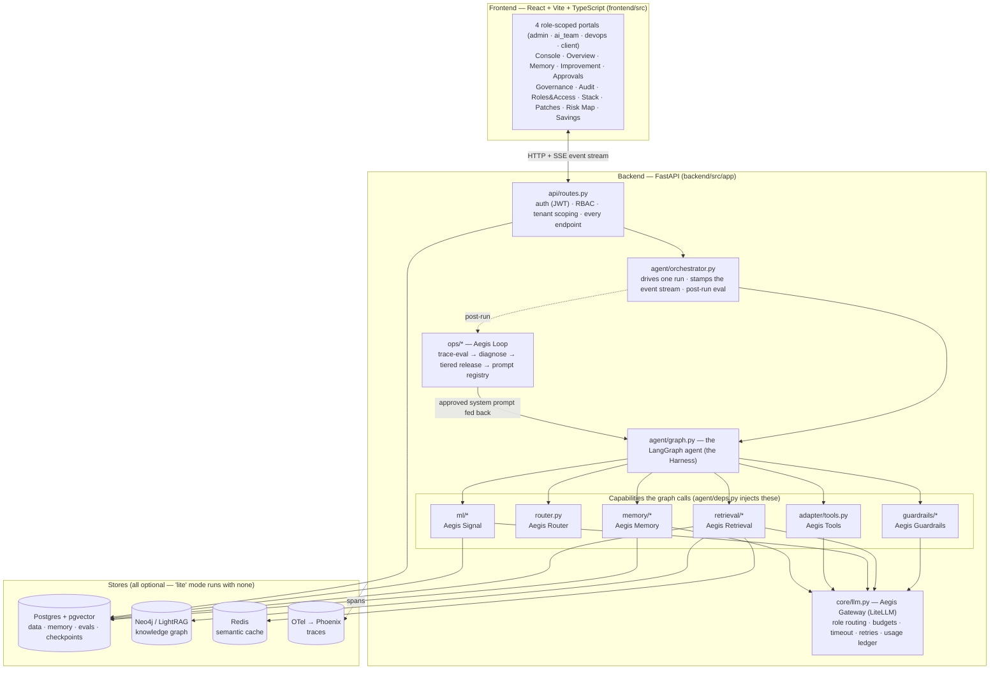
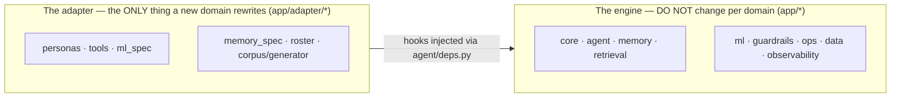

# 00 · What Aegis is (start here)

> New to this codebase? Read this page, then follow the path at the bottom. No prior
> context is assumed. Every claim below names the real file so you can go check it.

## The one-paragraph version

**Aegis is a domain-agnostic agentic-AI platform.** You ask it something; an AI *agent*
plans, retrieves knowledge, optionally calls tools that can change data, and answers —
while staying **cheap** (small models where possible), **trustworthy** (a real
statistical model with calibrated uncertainty), **secure** (guardrails + a human
approval step for risky actions), **multi-tenant** (roles + budgets + row isolation),
**observable** (every step traced), and **self-improving** (it grades its own runs and
can propose a better prompt that a human approves).

"Domain-agnostic" is the key idea: the **engine** (`backend/src/app/*`) knows nothing
about any particular business problem. All domain meaning lives in **one folder** —
`backend/src/app/adapter/*`. To point Aegis at a new problem, you rewrite the adapter and
leave the engine untouched (see `50-extend-for-your-domain.md`).

The demo domain shipped in the adapter is a **customer-support / service-request
operations** assistant (personas like `operations_lead` and `client`, tools that read and
update support requests, an ML model that predicts a request's resolution time). That is
just the current adapter — the engine would run any domain the same way.

## The two reference architectures Aegis embodies

Aegis is a concrete implementation of two well-known patterns (see
`docs/HARNESS_LLMOPS_PLAN.md`).

### 1. The Harness — the runtime that answers one question

The "harness" is everything that assembles context and produces an answer for a single
turn: it builds the prompt (system instructions + long-term memory + retrieved knowledge
+ the ML signal + the question), runs a **bounded** plan → act → reflect loop, gates
risky actions to a human, and streams the answer back. In Aegis the harness is the
LangGraph state machine in `backend/src/app/agent/graph.py`, driven by
`backend/src/app/agent/orchestrator.py`.

### 2. The LLM-Ops closed loop — the system that improves the harness

Every answer is **traced**, **evaluated**, **diagnosed**, and any improvement flows back
into the harness as a new (human-gated) system prompt. This is the self-improvement loop
in `backend/src/app/ops/*`. It closes because the harness reads its *active* prompt from
the same registry the loop writes to (`deps.render_system_prompt` →
`app.ops.registry.get_cached_active`), so an approved improvement is used by the *next*
run.

## The big picture (how the pieces connect)

## The Aegis module map (branded name + honest tech)

Every capability is a first-class **Aegis module**, always presented with the real
underlying technology (branding, never hiding). This naming is used across the docs, the
UI labels, and the code comments.

| Aegis module | What it is | Tech underneath | Where in code |
|---|---|---|---|
| **Aegis Gateway** | single model chokepoint: role routing, budgets, timeout, retry, usage ledger | LiteLLM | `core/llm.py`, `core/models.py` |
| **Aegis Router** | multi-agent supervisor — routes a turn to the right specialist | LangGraph | `agent/router.py` |
| **Aegis Memory** | long-term memory: episodic · semantic · procedural, bitemporal | Postgres + pgvector | `memory/*` |
| **Aegis Cache** | semantic response cache | Redis | `retrieval/cache.py` |
| **Aegis Retrieval** | hybrid RAG: vector + graph + BM25 → RRF → LLM rerank, spotlighting | Neo4j/LightRAG + pgvector | `retrieval/*` |
| **Aegis Signal** | trustworthy ML: ensemble + calibrated conformal intervals + SHAP | XGBoost + MAPIE + SHAP | `ml/*`, `adapter/ml_spec.py` |
| **Aegis Guardrails** | input/output rails: injection, PII, schema, content | programmatic + NeMo Colang | `guardrails/*` |
| **Aegis Evals** | trace-level + answer evaluation | RAGAS-style proxies + LLM judge | `ops/trace_eval.py`, `eval/*` |
| **Aegis Loop** | LLM-Ops self-improvement: trace → eval → diagnose → tiered release | native | `ops/*` |
| **Aegis Governance** | multi-tenant **four-role** RBAC (admin/ai_team/devops/client), budgets, RLS, audit log | Postgres RLS + JWT | `data/*`, `core/governance.py`, `core/security.py` |
| **Aegis Trace** | end-to-end tracing (glass box) | OpenTelemetry → Phoenix | `observability/*` |
| **Aegis Tools / MCP** | risk-tiered tool registry + human gate, exposed over MCP | native + MCP SDK | `adapter/tools.py`, `mcp/server.py` |

> **RBAC & portals.** Authentication resolves one of **four** coarse roles — `admin`,
> `ai_team`, `devops`, `client` (`Role` in `api/schemas.py`, a signed `coarse_role` JWT
> claim in `core/security.py`) — and each gets its **own portal** with a focused surface
> set (`frontend/src/routes/Portal.tsx` `ROLE_SECTIONS`). Four platform surfaces
> (`backend/src/app/platform/*`) back the DevOps and Client portals: `GET /stack`,
> `POST /stack/patch-check`, `GET /risk-map`, `GET /savings`. See `30-frontend.md` for the
> per-role surface map and `docs/LEARNING_GUIDE.md` for the role/endpoint tables.

## Domain-agnostic core vs. adapter — the golden rule

- **New business problem?** Rewrite only `app/adapter/*` (personas, tools, ML feature
  spec, memory fact schema, roster, knowledge corpus). The engine does not change.
- The engine reaches the adapter **only** through the hooks bound in
  `backend/src/app/agent/deps.py` (`AgentDeps.default`). That single seam is the contract.

## Where to go next

| If you want to understand… | Read |
|---|---|
| The AI ideas from scratch (LLM, RAG, agents, guardrails, conformal ML, memory, the loop) | `10-ai-concepts.md` |
| Every backend module, its files, and how they connect | `20-backend.md` |
| The console UI: surfaces, state, API client, mock mode, design tokens | `30-frontend.md` |
| One request traced end-to-end with a sequence diagram | `40-request-flow.md` |
| How to reuse Aegis for *your* problem (the adapter contract) | `50-extend-for-your-domain.md` |
| Install, run (lite vs full), env vars, the day-of runbook | `60-run-and-operate.md` |

> **Honesty bar.** Aegis ships with honesty audits (`docs/HONESTY_AUDIT.md`,
> `docs/AUDIT_ROUND2.md`). Where a feature is optional or not fully wired, these docs say
> so plainly rather than overclaiming. "Claimed but not real" is the one thing this
> project does not ship.
