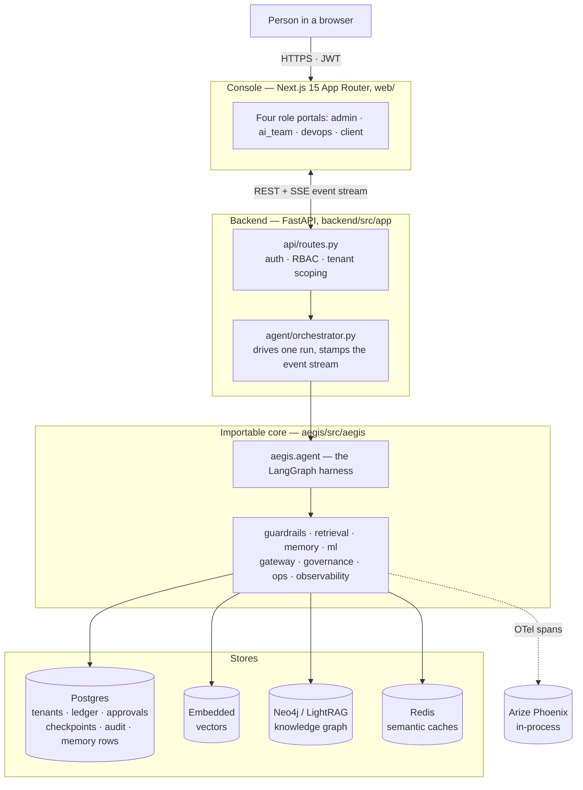

# 00 · What Aegis is

**What you'll learn:** what problem Aegis solves, what "domain-agnostic agentic
platform" actually means, the twelve Aegis modules and the real technology behind each
one, and the honesty principle that governs every claim in this repository.

No prior knowledge is assumed. Terms from the agentic-AI world are explained in plain
language the first time they appear.

---

## 1. The problem

A large language model (LLM) — a program trained on enormous amounts of text that
predicts what text should come next — is very good at language and reasoning, and very
bad at four things an enterprise cares about:

1. **It doesn't know your data.** It was trained on the public internet, not your
   knowledge base.
2. **It is confidently wrong.** A fabricated answer looks exactly like a correct one.
   The industry word for this is *hallucination*.
3. **It costs money per word and cannot be audited.** Ask "why did it say that?" and a
   raw model gives you nothing.
4. **It has no brakes.** If you let it take real actions — update a record, close a
   ticket, issue a refund — nothing stops it from taking the wrong one.

An **agent** is an LLM that doesn't merely answer: it can decide to *call functions*
(its **tools**), read the results, and continue in a loop until the task is done. That
makes all four problems worse, because now the mistakes have consequences.

Aegis is the machinery that sits around the model and fixes all four:

| Problem | Aegis' answer |
|---|---|
| Doesn't know your data | **Retrieval** — fetch the relevant documents first, answer from them, cite them |
| Confidently wrong | **Calibrated ML + evals + tracing** — a statistical confidence interval, a graded run, a visible step-by-step trace |
| Cost and opacity | **One gateway** every model call funnels through: cheap models for cheap tasks, hard budget caps, a usage ledger |
| No brakes | **Guardrails** on input and output, plus a **human approval gate** on risky actions |

---

## 2. What "domain-agnostic agentic platform" means

**Agentic** — the system plans, acts through tools, observes results, and repeats,
rather than emitting one block of text.

**Platform, not application** — Aegis is not a customer-support bot or a finance bot. It
is the reusable engine underneath any such bot. All the machinery above (retrieval,
guardrails, memory, gates, tracing, governance) is business-neutral.

**Domain-agnostic** — every piece of business meaning is confined to one folder,
`backend/src/app/adapter/`. To point Aegis at a different problem you rewrite the
adapter and leave the engine untouched. The engine reaches the adapter through exactly
one seam: the dependency table built in `backend/src/app/agent/deps.py`
(`AgentDeps.default()`).

```mermaid
flowchart LR
    subgraph ADAPTER["backend/src/app/adapter/ — the ONLY domain code"]
        direction TB
        A1["schema.py · generator.py<br/>your entities, your synthetic world"]
        A2["tools.py<br/>your actions + their risk tiers"]
        A3["ml_spec.py<br/>your features and target"]
        A4["personas.py · prompts.py · roster.py<br/>who is asking, what they may do"]
        A5["memory_spec.py · corpus/<br/>what counts as a durable fact, your seed KB"]
    end
    subgraph SEAM["The one contract"]
        D["agent/deps.py<br/>AgentDeps.default"]
    end
    subgraph ENGINE["The engine — unchanged across domains"]
        direction TB
        E1["aegis.agent · aegis.retrieval · aegis.memory"]
        E2["aegis.guardrails · aegis.ml · aegis.gateway"]
        E3["aegis.governance · aegis.ops · aegis.observability"]
    end
    ADAPTER --> SEAM --> ENGINE
```

The domain currently shipped in the adapter is **service-request / case management**:
customers raise service requests, support agents resolve them, and a model predicts a
request's `resolution_hours`. Personas are `operations_lead` and `client`. That is an
illustration, not the product — `adapter/__init__.py` declares
`DOMAIN_ID = "service_request_management"` precisely so the boundary is explicit.

---

## 3. The twelve Aegis modules

`backend/src/app/capabilities.py` holds `AEGIS_MODULES`, the canonical manifest — twelve
entries, served live at `GET /platform/capabilities` and `GET /about`. Every entry pairs
a **branded name** with the **honest underlying technology**. Branding never hides what
actually runs. `module_path` on each entry is import-checked by
`backend/tests/test_capabilities.py`, so the manifest cannot drift into fiction.

| Aegis module | Real tech underneath | What it does | Status |
|---|---|---|---|
| **Aegis Gateway** | LiteLLM | Single model chokepoint: role routing, budgets, timeout, retry, usage ledger | live |
| **Aegis Router** | LangGraph | Multi-agent supervisor — routes a turn to the right specialist | live |
| **Aegis Memory** | Postgres + Qdrant | Long-term memory: episodic, semantic and procedural, bitemporal, consolidated | live |
| **Aegis Cache** | Redis | Semantic response cache keyed on query meaning, not exact bytes | live |
| **Aegis Retrieval** | Neo4j/LightRAG + Qdrant | Hybrid RAG: vector + graph + BM25 fused via RRF, LLM rerank, spotlighting | live |
| **Aegis Signal** | XGBoost + MAPIE + SHAP | Trustworthy ML: ensemble with calibrated conformal intervals and SHAP | live |
| **Aegis Guardrails** | programmatic + NeMo Colang | Input/output rails: injection, PII, schema and content checks | live |
| **Aegis Evals** | RAGAS-style proxies + LLM judge | Trace-level and answer evaluation of each run | live |
| **Aegis Loop** | native | LLM-Ops self-improvement: trace → eval → diagnose → tiered release | live |
| **Aegis Governance** | Postgres RLS + JWT | Multi-tenant RBAC, budgets, row-level security and audit log | live |
| **Aegis Trace** | OpenTelemetry → Phoenix | End-to-end, glass-box tracing of every run | live |
| **Aegis Tools / MCP** | native + MCP SDK | Risk-tiered tool registry with a human gate, exposed over MCP | optional |

`status: "optional"` means the module is gated behind an optional dependency. Only
**Aegis Tools / MCP** carries it — the MCP server needs the `mcp` SDK extra. Note that
"live" here means *the module always runs*; it does not mean every store behind it is
reachable in your particular deployment (see §5).

### The terms, in plain language

- **RAG (Retrieval-Augmented Generation)** — before answering, search your documents and
  paste the best passages into the prompt, so the model answers *from provided facts*
  instead of from memory. Aegis' retrieval is **hybrid**: it runs three searches at once
  (semantic vector search, knowledge-graph traversal, and keyword/BM25 matching), merges
  the three ranked lists with **Reciprocal Rank Fusion (RRF)** — a simple, robust merge
  that scores each result by `1/(k + rank)` in each list — then has a cheap model
  re-rank the survivors.
- **Embedding** — a piece of text turned into a list of numbers ("a vector") so that
  similar meanings sit close together. This is what makes semantic search possible.
  Aegis stores and searches vectors in an **embedded, file-backed vector store** — no server to install.
- **Spotlighting** — retrieved text is *untrusted input*: a poisoned document might say
  "ignore your instructions." Aegis wraps retrieved content in explicit delimiters and
  marks it reference-only, defending against **indirect prompt injection**.
- **Guardrails** — safety checks wrapped around the model. The **input rail** screens
  what goes in (prompt-injection attempts, personal data); the **output rail** screens
  what comes out (leaks, unsafe content). In Aegis the layers are schema, PII, injection
  classifier, content safety, topical scope, and grounding — each layer can only tighten
  the verdict, never loosen it.
- **PII** — personally identifiable information (emails, card numbers, national IDs).
  Aegis detects and redacts it.
- **Conformal prediction** — instead of a bare number, produce a *calibrated interval*
  with a coverage guarantee: "42 hours, with a 90 % coverage band." "Calibrated" means
  the stated confidence is statistically earned, not hand-picked. Aegis uses the MAPIE
  library over an XGBoost + gradient-boosting ensemble.
- **SHAP** — a method that attributes a prediction to its input features, so a human can
  see *which* factors pushed it up or down.
- **HITL (human in the loop)** — for actions too consequential to automate, the agent
  *proposes*, a human *approves*, and only then does it execute. In Aegis the gate fires
  on the tool's declared **risk tier**, not on model confidence.
- **Trace / span** — a nested timeline of every step one run took. Aegis emits
  OpenTelemetry spans and ships them to Arize Phoenix, so a run is a readable tree.
- **Multi-tenancy / RLS** — many customer organisations share one deployment and must
  never see each other's data. Postgres **Row-Level Security** enforces that at the
  database, underneath the application's own filters.

---

## 4. How the pieces sit together

Two things to notice, because they are the architectural decisions that matter:

1. **`aegis/` is a separate installable Python package from `backend/`.** The agent, the
   guardrails, the memory, the retrieval pipeline — none of them import FastAPI or this
   application's settings. `backend/` is a *composition root*: it wires the core to real
   stores, real config and real HTTP. That is what makes Aegis importable rather than
   forkable. `10-architecture.md` covers the seam in detail.
2. **Everything is dependency-injected.** The graph is `build_agent(deps)`; the gateway
   takes an injected governance hook; retrieval takes an injected completer and embedder.
   Every subsystem can therefore run offline with fakes, which is why the test suite
   needs no databases.

---

## 5. The honesty principle

This project's stated ethos is that **an overclaim is worse than a gap**. That shows up
as code, not just as a slogan:

- `capabilities.py` pairs each branded module with its real tech, and a test imports
  every declared `module_path`.
- `backend/src/app/platform/stack.py` reads the software bill-of-materials from
  *actually installed* versions via `importlib.metadata`; an uninstalled optional
  dependency reports `null`, never a guess.
- `backend/src/app/platform/patches.py` queries live PyPI per package; if the network is
  unreachable it reports `online=false` rather than a clean bill of health.
- `aegis/src/aegis/security/posture.py` derives each control's status from live wiring at
  call time, with a deliberately small vocabulary: `enforced`, `partial`, `not_covered`.
  There is no silent green.
- `aegis/src/aegis/redteam/battery.py` deliberately keeps attacks the offline
  deterministic rails *cannot* catch (`needs_llm=True`) so the report shows what leaks.

The same standard applies to this documentation. Known caveats, stated plainly:

- **`GET /graph` reads Neo4j, and is empty until documents are ingested.** The endpoint
  returns the whole knowledge graph LightRAG's entity/relationship extractor has written
  to **Neo4j**, so it is durable and survives a restart. It is empty on a fresh install
  simply because nothing has been ingested yet — and ingestion needs a working model
  gateway, since entities are extracted by an LLM. The response is the **union** of that durable graph and
  the current process's live retrieval deltas, so the visualisation still moves during a
  run; when Neo4j is unreachable only the in-process slice is served.
- **`GET /metrics` is also process-wide in-memory** (`MetricsStore`). Cost, cache-hit
  rate and the quality proxy are measured from real runs in *this* process and reset on
  restart. `p95_latency_ms` is `null` before any run rather than a fabricated zero.
- **Most dashboards are empty until real agent runs happen.** Savings, approvals, usage,
  evals and latency all read from real activity. Empty states say so.
- **There is no test suite in `web/`.** Type safety comes from `tsc` strict mode and
  `next lint`; there are no component or end-to-end tests.
- **NeMo Guardrails is an optional second front door.** With `GUARDRAILS_ENGINE=nemo` the
  Colang policy executes; if the package is absent, enforcement falls back to the
  always-on programmatic rails. Enforcement stays real either way, but the Colang layer
  is not guaranteed present.
- **The router is deterministic in practice.** The shipped roster
  (`adapter/roster.py`) declares two specialists — `qa` (default) and `memory` — so the
  cheap-LLM tiebreak in `aegis/src/aegis/agent/router.py` has nothing to break a tie
  between and never fires live. Add a second named specialist to exercise it.
- **Aegis Signal never gates.** The ML prediction informs the plan and the answer as
  supporting evidence. The human gate fires on tool risk tier only. Graded autonomy bands
  exist as a contract but are inert on the live path.

---

## 6. Where to go next

| To understand… | Read |
|---|---|
| The layering, and why `aegis/` is separate from `backend/` | [`10-architecture.md`](10-architecture.md) |
| The FastAPI app: routes, RBAC, data layer, sweepers | [`20-backend.md`](20-backend.md) |
| The console: portals, auth, live/mock probe, design system | [`30-frontend.md`](30-frontend.md) |
| The actual end-to-end flows, traced to real functions | [`40-pipelines.md`](40-pipelines.md) |
| Running it, and adapting it to a new domain | [`50-run-and-extend.md`](50-run-and-extend.md) |
