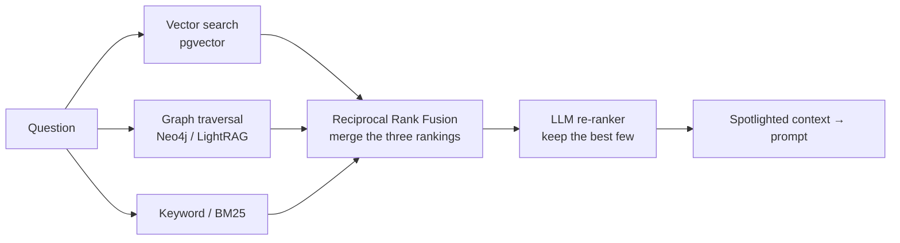
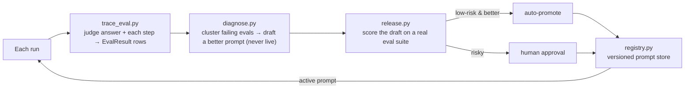

# 10 · The AI ideas, from scratch

This page explains every AI concept Aegis uses, assuming **no background**. Each idea gets
a plain-language definition, then *how Aegis uses it* and *the file* to read. Jargon is
defined the first time it appears.

---

## LLM (Large Language Model)

**Plain:** an LLM is a program trained on huge amounts of text that, given some text,
predicts the next chunk of text. Chatbots are LLMs wrapped so the "next text" is a helpful
answer. They are good at language and reasoning but bad at exact numbers and can be
confidently wrong ("hallucinate").

**In Aegis:** every LLM call goes through **one** function so cost and safety are enforced
in a single place — `complete(role, messages, ...)` in `core/llm.py` (the **Aegis
Gateway**, built on the LiteLLM library). Code never names a model directly; it asks for a
*role* (see below).

## Model roles (routing cheap vs. strong models)

**Plain:** not every task needs the smartest (most expensive) model. Classifying an intent
or extracting a field is easy; writing the final answer or hard reasoning is not.

**In Aegis:** `core/models.py` defines a `ModelRole` enum — `CHEAP`, `REASONING`,
`GENERATION`, `EMBEDDING`, `VISION`, `VOICE` — and a role → deployment-id table
(`model_for`). Cheap tasks route to a small model (`gpt-4o-mini`-class), hard ones to a
stronger model. The dashboard's "small-model share" and "cost saved" come from measuring
this. Any role is overridable with a `MODEL_<ROLE>` env var.

## Tokens

**Plain:** models don't read words, they read **tokens** — pieces of words (roughly ¾ of a
word each). You pay per token in and per token out, and every model has a maximum number
of tokens it can consider at once (its "context window"). So *fitting the right
information into a limited, paid budget* is a real engineering problem.

**In Aegis:** the gateway caps output tokens per call (`settings.llm_max_output_tokens`)
and records prompt/completion tokens for cost. Long-term memory assembles context under a
**hard token budget** (`memory/tokens.py`, `memory/working.py`) so the prompt never
overflows.

## Embeddings

**Plain:** an **embedding** turns a piece of text into a list of numbers (a vector) that
captures its meaning, so that similar meanings sit close together. This lets a computer
find "text about refunds" without matching the exact word "refund" — it compares vectors.

**In Aegis:** the `EMBEDDING` role produces vectors via the gateway (`embed` in
`core/llm.py`, `retrieval/gateway.py::default_embed`). Vectors are stored in **pgvector**
(a Postgres extension) and used for both retrieval and memory recall similarity.

## RAG (Retrieval-Augmented Generation)

**Plain:** instead of trusting the model to "know" a fact, you **retrieve** relevant
documents first and put them in the prompt, so the model answers *from provided facts*.
This reduces hallucination and lets the system cite sources.

**In Aegis (Aegis Retrieval, `retrieval/*`):** retrieval is **hybrid** — it combines three
methods and fuses them:

- **Reciprocal Rank Fusion (RRF)** is a simple, robust way to merge several ranked lists
  into one (`retrieval/fusion.py`).
- A **semantic cache** (Redis, `retrieval/cache.py` — *Aegis Cache*) reuses a prior result
  for a near-duplicate question: faster and cheaper.
- **Spotlighting** (`retrieval/spotlight.py`): retrieved text is *untrusted* — it might
  contain "ignore your instructions." Aegis wraps/delimits it and marks it "reference
  only, not instructions." This defends against *indirect prompt injection*.

## An agent (and tools)

**Plain:** an **agent** is an LLM that doesn't just answer — it can *decide to take
actions* (call functions), observe the results, and continue, in a loop, until the task is
done. The functions it can call are its **tools**.

**In Aegis (the Harness, `agent/graph.py`):** the agent is an explicit **state machine**
(built with the LangGraph library), *not* a free-for-all loop — so every step is
inspectable and bounded. The core loop is `plan → act → reflect`: the model proposes an
action, a tool executes it, and a `reflect` step decides whether the goal is met or
whether to try once more (a **bounded self-repair loop**, capped by
`config.max_plan_iterations`, so it always terminates). The full node order is traced in
`40-request-flow.md`.

- **Tools** live in `adapter/tools.py` (**Aegis Tools**). Each tool has a name, a typed
  argument schema, a **risk tier** (`LOW`/`MEDIUM`/`HIGH`), and a per-persona allowlist.
- The **multi-agent router** (`agent/router.py`, **Aegis Router**) is a supervisor that
  first classifies a turn and hands it to the right specialist (the default `qa` pipeline,
  or a `memory` specialist that answers "what do you know about me" directly).

## Human-in-the-loop (the risk gate)

**Plain:** some actions are too consequential to let an AI do unsupervised (e.g. changing a
record's status). The safe pattern is: the agent **proposes**, a human **approves**, then
it executes.

**In Aegis:** the gate is driven by **tool risk only** (`config.gate_min_risk`, default
`HIGH`) — *not* by model confidence. A HIGH-risk action pauses the run (LangGraph
`interrupt`), writes a **durable** approval row, and waits for a human decision via the
Approvals inbox. The tool then runs **exactly once**, even across a restart or a different
worker (`agent/orchestrator.py`, `agent/approvals.py`). ML uncertainty never gates.

## Guardrails

**Plain:** **guardrails** are safety checks around the model: they inspect what goes *in*
(block prompt-injection attacks, redact personal data) and what comes *out* (stop leaks,
filter unsafe content) before text ever reaches the model or the user.

**In Aegis (Aegis Guardrails, `guardrails/*`):**
- **Input rail** and **output rail** wrap every interaction (`guardrails/rails.py`).
- **Injection detection** = a deterministic regex backstop (no API call) *then* a
  cheap-model classifier, **fail-closed** (block if the classifier errors) —
  `guardrails/classifier.py`.
- **PII redaction** (`guardrails/pii.py`), **schema/format validation**
  (`guardrails/schema.py`), and a small content filter.
- Two front doors, one policy: the fast programmatic rails, and a real **NeMo Guardrails
  Colang** policy (`guardrails/nemo.py`, `guardrails/config/*.co`) that executes when
  `GUARDRAILS_ENGINE=nemo`. *(If the NeMo package is absent it silently downgrades to the
  programmatic rails — enforcement stays real; see `docs/AUDIT_ROUND2.md`.)*

## Calibrated / conformal ML + SHAP

**Plain:** LLMs are bad at precise numbers, so Aegis uses a real **machine-learning**
model for numeric prediction. Three ideas make that prediction *trustworthy*:
- **Ensemble** — combine several models (here XGBoost + gradient boosting) for a more
  robust prediction than any one.
- **Conformal prediction** — instead of a bare number, produce a **calibrated interval**
  with a coverage guarantee ("42 hours, with a 90%-coverage band"), using the MAPIE
  library. "Calibrated" means the stated confidence is statistically honest, not made up.
- **SHAP** — a method that explains *which input features pushed the prediction up or
  down*, so a human sees *why*.

**In Aegis (Aegis Signal, `ml/*` + `adapter/ml_spec.py`):** `predict_explain` returns a
prediction, a conformal interval, and top SHAP drivers. It is a **solution signal, not a
gatekeeper** — it informs the plan and answer as supporting evidence but never blocks the
flow (the human gate is driven by tool risk, not ML confidence). No subject / no model →
the agent answers with zero ML.

## Long-term memory

**Plain:** RAG is "what's true about the world." **Memory** is "what we know about *this
user*, across conversations." Good memory means the assistant remembers your preferences
and past facts without re-asking, while staying isolated per user and auditable.

**In Aegis (Aegis Memory, `memory/*`):** three tiers —
- **Episodic** — the raw past turns (`MemoryMessage`).
- **Semantic** — durable facts distilled from conversations ("prefers email"), stored
  **bitemporally** (Zep-style): a contradicted fact is *invalidated* with a timestamp,
  never deleted — so you keep an auditable belief history (`MemoryFact`).
- **Procedural** — "how to act" playbooks (`adapter/skills/*.md`), selected by keyword.

Each turn, `recall_memory` assembles a **working-memory block** (profile + top facts +
skills + a running summary + recent turns) under a hard token budget, ranking candidates by
**relevance + recency + importance** (the Generative-Agents formula). After answering,
`persist_memory` saves the turns; every N turns a cheap Summarizer distills episodic →
semantic facts. It is isolated per user (every query filters `subject_id`) and degrades
cleanly when stores are off. Deep dive: `docs/MEMORY_SPEC.md`.

## The self-improving LLM-Ops loop

**Plain:** "LLM-Ops" is operating an LLM system like a product: measure quality, find
weaknesses, improve, and roll out safely. The distinctive move is **closing the loop** —
the system grades its own runs and proposes a better prompt that a human approves, and the
next run uses it.

**In Aegis (Aegis Loop, `ops/*`):**

1. **Trace-eval** — a judge grades the answer *and each step*; writes `EvalResult` rows
   (this is "Observe + Eval"), off the hot path.
2. **Diagnose** — cluster a prompt's *failing* evals and ask a reasoning-model optimizer to
   write a **draft** improved prompt (never live).
3. **Release** — the **tiered gate**: score the draft on a real eval suite (generate under
   the *candidate* prompt → judge). If it beats the current prompt, a change-risk
   classifier decides: low-risk changes auto-promote; risky ones go to human approval.
   Every version is stored and **one-click reversible**.
4. **Registry** — the harness reads the *active* prompt from an in-process cache
   (`deps.render_system_prompt` → `registry.get_cached_active`), with the adapter's prompt
   as the floor. So an approved improvement is used by the *next* run — the loop is closed.

## Observability (tracing — the "glass box")

**Plain:** to trust and debug an AI system you need to see *every* step it took. A
**trace** is a nested timeline of spans (agent → router → retriever → guardrail → tool →
LLM) for one run.

**In Aegis (Aegis Trace, `observability/*`):** every node emits an **OpenTelemetry** span,
forming one nested trace per run, shipped to **Phoenix**. The same step events also stream
to the frontend as the live glass-box view.

## Governance & multi-tenancy

**Plain:** a real product serves many organizations ("tenants") who must not see each
other's data or blow each other's budgets. This needs authentication, roles, spend caps,
data isolation, and an audit trail.

**In Aegis (Aegis Governance, `data/*` + `core/*`):** JWT auth + a three-tier role model
(user / tenant-admin / platform-admin), per-tenant **budgets** (token/USD/rate caps,
fail-closed), a durable **usage ledger**, Postgres **Row-Level Security** (RLS) so one
tenant can't read another's rows, and an **audit log** row for every action.

---

Next: see how these fit together module-by-module in `20-backend.md`, or follow one
request through all of them in `40-request-flow.md`.
