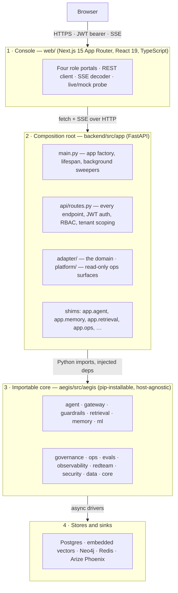
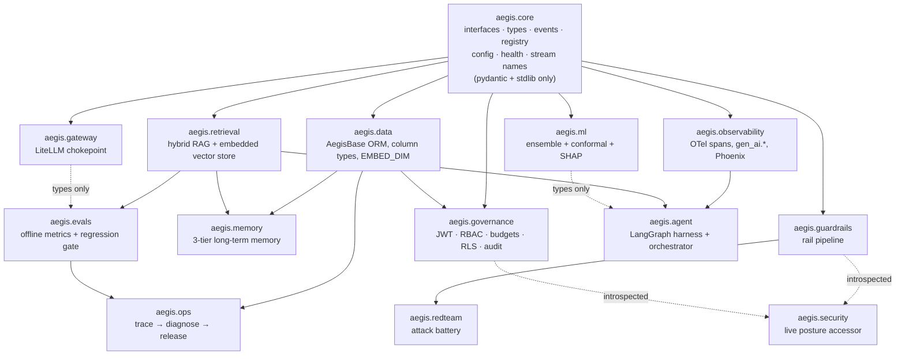
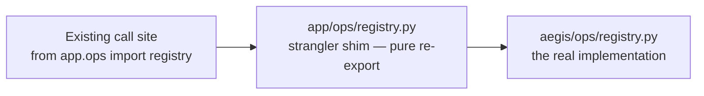
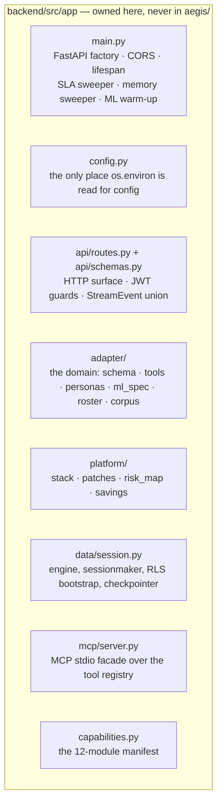
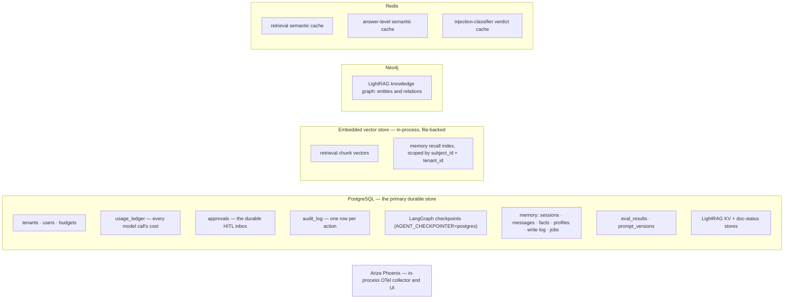
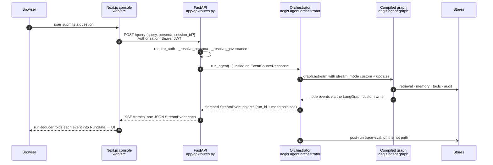

# 10 · Architecture

**What you'll learn:** the whole system from the browser down to the databases, why
`aegis/` is a separate importable package from `backend/`, how the two are glued
together, which store holds what, and how a request physically travels.

---

## 1. The four layers

The rule that shapes everything: **dependencies point downward only.** `aegis/` never
imports `app.*`. It cannot — it is a separate distribution with its own
`pyproject.toml`, installed into the backend's virtualenv as an editable path
dependency (`[tool.uv.sources] aegis = { path = "../aegis", editable = true }` in
`backend/pyproject.toml`).

---

## 2. Why `aegis/` is a separate package

The original codebase had everything under `backend/src/app/`. Every capability was
welded to FastAPI, to `app.config.Settings`, and to this application's governance
tables. That makes a system *forkable* — you copy it and edit — but not *importable*.

The refactor pulled each capability out into `aegis/`, with three hard rules:

1. **No host imports.** `aegis.*` imports nothing from `app.*`. Anything host-specific
   is an injected callable or a `configure_*()` call. `aegis.gateway.configure()` takes
   a config object, a governance hook and an observability sink;
   `aegis.governance.configure_governance()` takes a session factory;
   `aegis.ops.configure_ops()` takes the prompt-floor renderer, the session factory and
   the host's `Approval` ORM class.
2. **Optional dependencies are per-module extras.** `aegis[gateway]` pulls LiteLLM,
   `aegis[retrieval]` pulls LightRAG/Neo4j/Redis/Chroma, `aegis[ml]` pulls
   XGBoost/MAPIE/SHAP, and so on. `aegis.core` needs only pydantic and the standard
   library, so anything depending on it alone stays cheap to install. Isolation tests
   (`aegis/tests/*/test_isolation.py`) assert that importing a module does not drag in
   the heavyweights.
3. **Heavy imports stay lazy.** `import aegis.retrieval` does not require
   `chromadb`; `import aegis.ml` does not import XGBoost until you call something.

The payoff is concrete: another team can `pip install aegis[guardrails]` and use the
rail stack in their own service, with none of this platform attached.

### The module graph inside `aegis/`

Notable edges: `aegis.memory` depends on `aegis.retrieval` for the embedded vector store;
`aegis.ops` depends on `aegis.evals` (one-directional — evals never imports ops);
`aegis.redteam` is leaf-clean and imports only the guardrails; `aegis.security`
introspects other modules rather than depending on their runtime.

---

## 3. How `backend/` and `aegis/` are glued: the strangler shim

The migration used the **strangler-fig** pattern. Rather than a big-bang rewrite, each
`app.*` module was hollowed out and now re-exports from `aegis.*`, keeping every
existing import path and every `capabilities.py` `module_path` valid.

Three shapes of shim exist, and the difference matters when you read the code:

| Shape | Example | What the shim adds |
|---|---|---|
| **Pure re-export** | `app/ml/model.py`, `app/memory/recall.py`, `app/eval/harness.py`, `app/ops/registry.py` | Nothing — the names are re-bound by identity so shared state (e.g. `_ACTIVE_CACHE`) is literally the same object |
| **Host binding** | `app/agent/graph.py`, `app/observability/otel.py`, `app/retrieval/pipeline.py` | Injects host-specific values — the shared LangGraph checkpointer, `phoenix_enabled` from settings, a `RetrievalConfig` built from `app.config.Settings` |
| **Adapter wiring** | `app/core/llm.py` | Calls `aegis.gateway.configure()` at import time with a live settings-reading config, this app's governance hook, and `OtelObservabilitySink`, then re-exports `complete`/`embed` |

`app/core/llm.py` is worth reading in full — it is the clearest example of the pattern.
The gateway itself has no policy; the host supplies the budget-enforcement hook with
its exact fail-closed semantics, and the standalone gateway stays reusable.

---

## 4. What the backend owns that the core does not

`backend/src/app/` is not a thin wrapper. It owns everything host-specific:

`config.py` is the single config boundary: every setting is a typed pydantic field, and
nothing else in the backend reads `os.environ` for configuration.

---

## 5. Stores — what lives where

**An embedded vector store — neither pgvector nor a vector server.** Vector search first
moved off the `pgvector` Postgres extension (which needs a privileged server-side
`CREATE EXTENSION`), and then off a standalone vector server too. Both were blocked by
the same constraint: the target enterprise Windows machine allows no additional server
software. What runs now is a real ANN engine that happens to live in this process —
Chroma's `PersistentClient` (HNSW, cosine) over a local directory for Aegis's own store,
and LightRAG's file-backed NanoVectorDB for LightRAG's internal vectors.

Postgres keeps the embedding as JSON *of record* — the durable source of truth — but it
is no longer searched; `aegis/src/aegis/memory/vector_ops.py` mirrors rows into the
vector store lazily and searches there, scoping every query by a metadata filter on
`subject_id` and `tenant_id`. The `pgvector` and `qdrant-client` dependencies are both
gone from the two `pyproject.toml` files. Any documentation you find claiming pgvector or
Qdrant powers search is stale.

In full-stores mode a usable vector store is still **required** — embedded does not mean
optional. `main.py`'s lifespan opens the store at `VECTOR_STORE_PATH` on construction and
lets the exception propagate, so an unwritable or corrupt directory fails the boot rather
than silently falling back to RAM. Tests use an explicit in-memory engine: a real index,
sanctioned and labelled.

---

## 6. A request, at the architecture level

Three details that make this work:

- **SSE, not WebSockets.** `POST /query` returns an `EventSourceResponse`
  (`sse-starlette`). Because the request needs a POST body, the console cannot use the
  browser's `EventSource` API and hand-rolls a `fetch` reader in `web/src/lib/api/sse.ts`.
- **Every event is stamped.** `run_id` plus a monotonic `seq`, then validated against
  the `StreamEvent` discriminated union in `app/api/schemas.py` before it hits the wire.
  The frontend mirrors the custom-event name list in `web/src/lib/streamNames.ts`
  against `aegis.core.stream_names.ALL` (17 names, exact match).
- **The governance context is bound inside the streaming task**, not at the request
  edge, so the gateway can enforce this tenant's budget on every model call the run
  makes.

---

## 7. Cross-cutting concerns

| Concern | Where it lives | How it reaches everything |
|---|---|---|
| **Model access** | `aegis.gateway` via `app.core.llm` | Every module asks for a `ModelRole`, never a model id |
| **Budgets** | `aegis.governance` | A `contextvars`-threaded `GovernanceContext` set at the request edge, read at the gateway chokepoint |
| **Tracing** | `aegis.observability` | `_timed` wraps each graph node; retrieval/guardrail/tool/LLM spans nest beneath the root `agent.run` span |
| **Tenancy** | `aegis.governance` + `app.data.session` | Application-level `tenant_id` filters, plus Postgres RLS via a session GUC |
| **Domain meaning** | `app.adapter` | Reached only through `AgentDeps.default()` |

Next: [`20-backend.md`](20-backend.md) for the backend in detail, or jump straight to
[`40-pipelines.md`](40-pipelines.md) for the flows.
