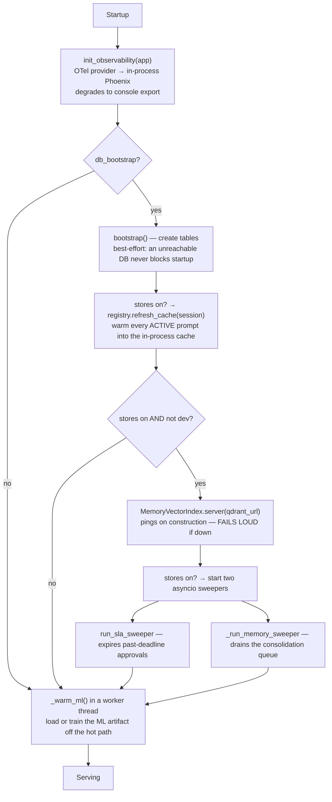
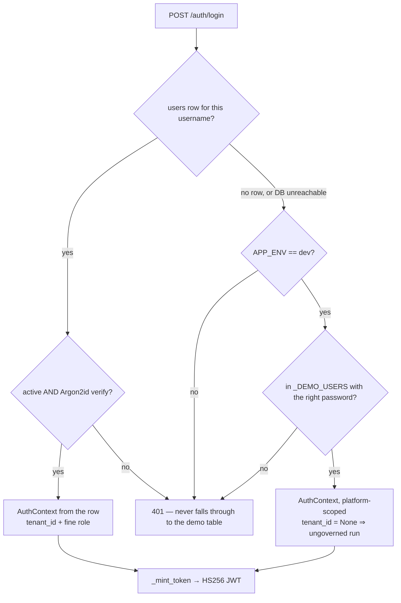
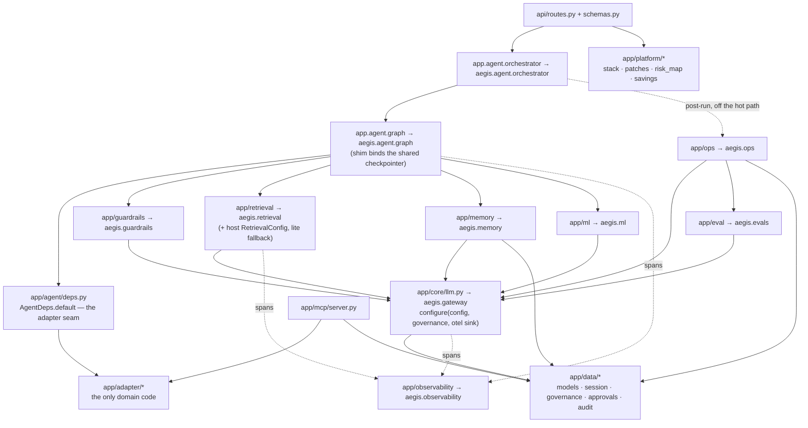
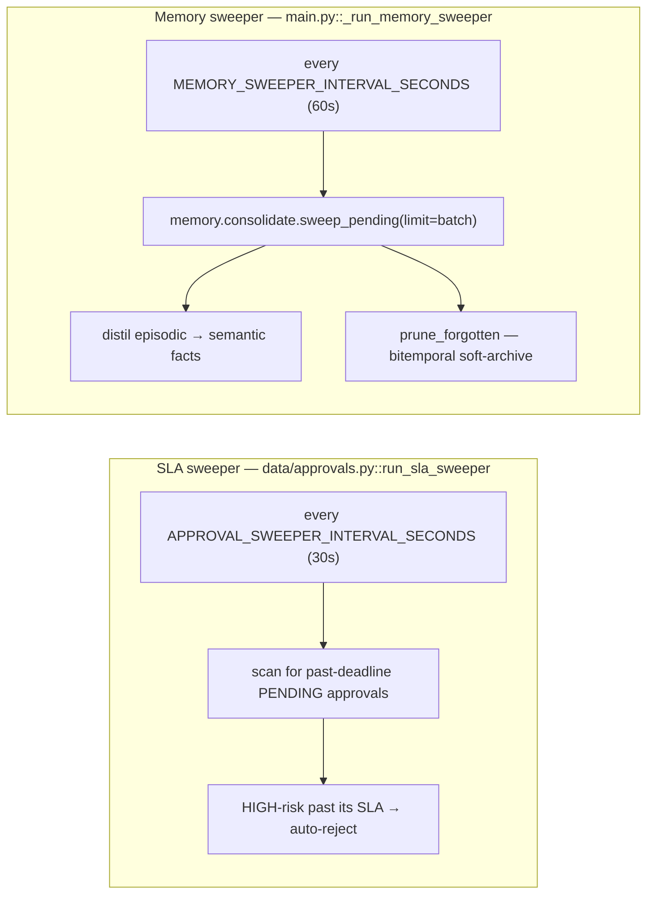

# 20 · The backend

**What you'll learn:** how the FastAPI application is composed, every endpoint and who
may call it, how authentication and role-based access control work, what the data layer
persists, which background tasks run, and where each Aegis module actually lives.

Everything here is under `backend/src/app/`. Read [`10-architecture.md`](10-architecture.md)
first if you have not — the shim relationship between `app.*` and `aegis.*` is assumed.

---

## 1. The composition root — `main.py`

`create_app()` is the application factory. In order, it:

1. Calls `settings.ensure_secure_secrets()` — a **fail-fast** guard that refuses to boot
   a non-dev deployment carrying the default or a too-short `JWT_SECRET`.
2. Applies `LOG_LEVEL` via `logging.basicConfig(force=True)`; an unknown level falls
   back to `INFO`.
3. Builds the `FastAPI` app with rich OpenAPI metadata (the module list in the
   description mirrors `capabilities.py`) and the `lifespan` context manager.
4. Adds CORS for `localhost:3000` / `127.0.0.1:3000` (and the retired Vite dev port
   5173). Without these origins the console's boot probe fails CORS and the app
   silently falls back to mock data.
5. Mounts the single router from `api/routes.py`.

The `lifespan` block is where the runtime actually comes alive:

Two design points worth copying:

- **`_supervise(task, name)`** attaches a done-callback to each long-lived background
  task. A bare `asyncio.create_task` that dies leaves the process serving traffic with a
  dead sweeper and no signal; this turns that into an explicit `ERROR` log. Normal
  cancellation at shutdown stays quiet.
- **Everything optional degrades, everything required fails loud.** Phoenix, DB
  bootstrap, the prompt-cache warm and the ML warm-up are all best-effort. Qdrant in a
  non-dev full-stores deployment is not: it pings at boot and raises.

---

## 2. The HTTP surface — `api/routes.py`

One router, ~2 500 lines, holds every endpoint. `api/schemas.py` holds the request and
response models plus the `StreamEvent` discriminated union that the SSE stream and the
frontend share.

### Authentication

`POST /auth/login` → `_authenticate(username, password)`:

The demo table is a **dev-only** convenience and is closed two ways: a real `users` row
always wins for that username, and `APP_ENV != dev` disables the table entirely. The
five demo principals all use the password `demo`:

| Username | Coarse role | Persona |
|---|---|---|
| `admin` | `admin` | `operations_lead` |
| `ai` or `aiteam` | `ai_team` | `operations_lead` |
| `devops` | `devops` | `operations_lead` |
| `client` | `client` | `client` |

### Two role vocabularies

Aegis carries **two** role notions, and confusing them is the usual source of
misreading the code:

- **Coarse role** (`Role` in `api/schemas.py`): `admin` · `ai_team` · `devops` ·
  `client`. This decides *which portal you get* and drives the per-role guards. It rides
  in the JWT as a signed `coarse_role` claim.
- **Fine tier** (`aegis.governance.security.principal_role`): `platform_admin` (an admin
  with no tenant) · `tenant_admin` (an admin scoped to a tenant) · `user`. This decides
  *how wide your admin reach is*. `coarse_role_from_fine` is its honest inverse.

Both claims are minted into the token, so `require_auth` reads the four-valued role
directly instead of re-deriving it.

### The guards

All defined in `routes.py`:

| Guard | Admits |
|---|---|
| `require_auth` | any valid bearer token |
| `require_admin` / `require_ai_team` / `require_devops` / `require_client` | that one coarse role |
| `require_roles(*roles)` | the combinator behind the pairs below |
| `require_admin_or_devops` | `admin`, `devops` |
| `require_admin_or_ai_team` | `admin`, `ai_team` |
| `require_admin_or_client` | `admin`, `client` |
| `require_platform_admin` | fine tier `platform_admin` only |
| `require_tenant_admin` | fine tier `tenant_admin` or above |

`_scope_tenant(auth, requested)` prevents a tenant-admin from reading another tenant's
rows; `_resolve_persona(requested, auth)` prevents a `client` from borrowing an
operations persona; `_authorize_subject` does the same for memory subjects.

### Every endpoint

| Group | Endpoint | Guard |
|---|---|---|
| **Auth** | `POST /auth/login` | public |
| **Platform** | `GET /health` | **public** |
| | `GET /about` | public |
| | `GET /stream/guardrail-demo?q=` | **public** by design — a real AG-UI SSE demonstrator, touches no tenant data |
| | `GET /platform/capabilities` | any auth |
| **Ops surfaces** | `GET /stack` · `POST /stack/patch-check` | admin or devops |
| | `GET /security/posture` · `GET /latency` · `POST /redteam/run` | admin or devops |
| | `GET /risk-map` | admin or client |
| | `GET /savings` · `GET /gateway/optimization` | any auth |
| **Agent** | `POST /query` (SSE) | any auth |
| | `GET /approvals` · `POST /approvals/{id}/decision` · `POST /approval` | admin |
| | `GET /harness/config` | admin or ai_team |
| **Glass box** | `GET /graph` · `GET /metrics` · `POST /ml/explain` | any auth |
| | `GET /audit` | admin or devops |
| | `GET /ml/model-card` · `GET /evals/report` | admin or ai_team |
| **Governance** | `GET /governance/dashboard` | tenant-admin+ |
| | `GET|POST /admin/tenants` | platform-admin |
| | `GET|POST /admin/users` · `POST /admin/users/{id}/role` | tenant-admin+ |
| | `GET|POST /admin/budgets` · `GET /admin/usage` | tenant-admin+ |
| **Memory** | `GET /memory/facts` · `/profile` · `/sessions` · `/sessions/{id}/messages` · `/writes` · `/recall_debug` | any auth, subject-authorized |
| | `POST /memory/forget` · `DELETE /memory/facts/{id}` | any auth, subject-authorized |
| **LLM-Ops loop** | `GET /ops/prompts` · `/prompts/active` · `/evals` · `/params` | any auth |
| | `POST /ops/diagnose` · `/release` · `/rollback` · `GET /ops/releases/pending` | admin or ai_team |
| | `POST /ops/releases/{id}/decide` | **admin only** — the human release decision never delegates |

Every state-changing action writes an audit row through `_safe_audit`, which swallows
audit-sink failures so a logging blip never fails a request. When `STORES=off`, reads
degrade to empty and mutations return a clean `503`; memory erasure returns `503`
rather than faking success.

### The two in-process dashboard stores

`GraphStore` and `MetricsStore` are plain dataclasses held process-wide and fed from the
live event stream by `_update_dashboards(event, ...)`:

- **`GraphStore`** accumulates the graph nodes and edges that retrieval emitted, **scoped
  per persona** — a security control, so a `client`'s `/graph` never shows what an
  operations persona retrieved. It is *not* a Neo4j query. It starts empty and resets on
  restart.
- **`MetricsStore`** counts queries, cache hits and cost, and computes a
  `quality_score` that is an explicit **grounding proxy**, not an LLM judge: the fraction
  of runs that both completed cleanly and touched at least one graph node. It reads
  `small_model_share`, `cost_saved_usd` and `total_calls` from the gateway's usage tally,
  and `p95_latency_ms` from the in-process latency window — `None` before any run, never
  a fabricated zero.

---

## 3. Module map inside the backend

### Aegis Gateway — `core/llm.py` → `aegis.gateway`

The single async chokepoint for every model call. `complete(role, messages, ...)` and
`embed(texts)` route by `ModelRole` through LiteLLM to a custom OpenAI-compatible
provider. Per call it performs: a budget and rate check **before** spend (fail-closed on
a DB blip unless `BUDGET_FAIL_OPEN=true`), a `max_tokens` cap, a per-call timeout plus an
outer `asyncio.wait_for` backstop, a role fallback chain, one corrective re-ask on
invalid structured output, a usage-ledger write, and a `gen_ai.*` OTel span. A tripped
cap raises `BudgetExceededError`, which the orchestrator turns into a terminal
`budget_exceeded` event.

`core/models.py` holds the `ModelRole` enum (`CHEAP`, `REASONING`, `GENERATION`,
`EMBEDDING`, `VISION`, `VOICE`) and the role → deployment-id table. Code never names a
model; it asks for a role. Any role is overridable with `MODEL_<ROLE>`, and per-role cost
with `COST_<ROLE>_IN` / `COST_<ROLE>_OUT`. A process-wide usage tally is what makes the
console's "small-model share" and "cost saved" *measured* rather than asserted.

`core/governance.py` threads a per-request `GovernanceContext` through `contextvars`;
`core/security.py` re-exports JWT creation/decoding and Argon2id hashing.

### Aegis Guardrails — `app/guardrails` → `aegis.guardrails`

Public contract: `check_input(text)` / `check_output(text)`. The pipeline
(`aegis/src/aegis/guardrails/pipeline.py`) composes six layers — **schema**, **PII**,
**injection classifier**, **content safety**, **topical scope**, **grounding** — and each
layer can only tighten the verdict.

The injection layer is a deterministic signature backstop *first*, then a
`ModelRole.CHEAP` classifier, and it **fails closed**: any classifier error is treated as
`injection=True`. Verdicts are cached (`guardrails/cache.py`) — Redis-backed in full
mode, in-memory otherwise, degrading with a warning rather than refusing to construct.
PII uses Microsoft Presidio + spaCy NER when installed (`aegis[pii]`), falling back to a
pure-regex engine. `guardrails/nemo.py` plus the `config/*.co` Colang flows are the
second front door onto the *same* check functions, selected with
`GUARDRAILS_ENGINE=nemo`.

### Aegis Retrieval — `app/retrieval` → `aegis.retrieval`

`Retriever.retrieve()` runs: exact cache → semantic cache → hybrid wide recall (vector +
graph + hand-rolled BM25) → RRF fusion → LLM rerank → spotlight → assemble → cache
write-back. The shim adds the host pieces: building a `RetrievalConfig` from
`app.config.Settings`, the lazily-built process-wide default retriever that honours
`STORES`, and the module-level `retrieve`/`ingest` the graph calls.

Supporting modules: `fusion.py` (pure RRF, k=60, origin-tagged, reused by memory),
`spotlight.py` (delimiting + datamarking against indirect injection), `reranker.py`
(LLM-as-reranker, API-only — no local cross-encoder, because the target machine has
16 GB and no GPU), `lightrag_backend.py` (Neo4j graph + Qdrant vectors + Postgres KV),
`chunker.py` (heading-aware), `validation.py` (write-time poisoning gate),
`query_rewrite.py`, `agentic.py` (the bounded Self-RAG loop), `answer_cache.py`, and
`memory.py` — the databaseless in-memory backend used when `STORES=off`.

### Aegis Memory — `app/memory` → `aegis.memory`

Three tiers: **episodic** (raw turns), **semantic** (durable facts, stored
bitemporally — a contradicted fact is invalidated with a timestamp, never deleted), and
**procedural** (skill markdown selected by keyword). The read path is deterministic and
LLM-free; the write path is a deferred cheap-model job. Detail in
[`40-pipelines.md`](40-pipelines.md) §4.

### Aegis Signal — `app/ml` → `aegis.ml`

`TrustworthyModel`: a soft-voting ensemble (XGBoost + sklearn HistGradientBoosting),
MAPIE split-conformal intervals with a guaranteed coverage level, and SHAP TreeExplainer
per member. `predict_explain(features) → MLExplainResponse` is the whole public
inference contract. *What* to predict comes from `adapter/ml_spec.py`; *how* lives in the
package. Train with `python -m app.ml`.

### Aegis Loop — `app/ops` → `aegis.ops`

`trace_eval.py` grades a finished run and each trajectory step, writing one `EvalResult`
row per facet keyed by `run_id`/`prompt_key`. `diagnose.py` clusters recent *failing*
evals and asks a reasoning model for an improved prompt — **as a draft only, never
live**. `release.py` is the only place a draft goes live, and it never does so blindly:
an always-on eval gate (must beat the baseline by `margin`), a deterministic
change-risk classifier, then a tiered decision — low risk auto-promotes, medium/high is
staged to the durable approval inbox. `registry.py` is the versioned prompt store the
harness reads synchronously via `get_cached_active`, with the adapter's prompt as an
inviolable floor.

### Aegis Evals — `app/eval` → `aegis.evals`

Deterministic RAGAS-*style* lexical proxies (context precision/recall, groundedness) over
the real hybrid retriever on a frozen seed corpus, plus a DeepEval-*pattern* per-metric
regression gate that also asserts the router still picks the right specialist. Both are
hand-rolled — there is no `ragas` or `deepeval` dependency, and the default run makes no
network call. The LLM judge is inject-only and off unless enabled.

### Aegis Trace — `app/observability` → `aegis.observability`

`init_observability(app)` wires the tracer provider and in-process Phoenix export,
degrading to console. `span(kind, name, attrs)` stamps `openinference.span.kind` so
Phoenix renders a run as a tree. `genai_span` covers `gen_ai.*` LLM and embedding spans.
`semconv.py` holds the attribute keys plus the **A2A** labelled-handoff attributes
stamped on the `route` node when the supervisor dispatches to a specialist.

### Aegis Tools / MCP — `mcp/server.py`

A real MCP stdio server (built on the `mcp` 2.x SDK's low-level `Server`) exposing the
adapter tool registry to external clients such as Claude Desktop. It is a **facade, not a
bypass**: `list_tools` returns only allowlist-filtered tools; `call_tool` rejects unknown
or not-allowed names and routes through the same `run_tool` that re-checks the allowlist
and writes an audit row. **HIGH-risk tools are listed but never auto-executed** — a call
returns "requires human approval" with no side effect. An MCP client is a proposer, never
an approver.

### Platform surfaces — `platform/*`

Four deliberately import-light read endpoints behind the DevOps and Client portals.
`stack.py` builds the software bill-of-materials from actually-installed versions via
`importlib.metadata`, mapping each row to the Aegis module it powers and reporting
`null` for an uninstalled optional dependency. `patches.py` compares installed vs latest
against live PyPI, per package, so one network failure marks only that row `unknown` and
a total failure degrades to `online=false`. `risk_map.py` is the OWASP-Agentic risk
matrix grounded in `docs/security/owasp-agentic.md`, each risk carrying a `control_ref`
pointing at a real file — injection is never marked fully resolved. `savings.py` derives
baseline-vs-actual savings from the real gateway usage ledger.

---

## 4. The data layer — `data/*`

`data/models.py` defines the ORM on the shared `aegis.data.AegisBase`:

| Table | Purpose |
|---|---|
| `tenants`, `users` | Multi-tenancy and identity |
| `budgets` | Hierarchical token / USD / rate caps |
| `usage_ledger` | One durable row per model call |
| `approvals` | The durable HITL inbox |
| `audit_log` | One row per action |
| `chunks` | Retrieval chunk records (embedding-of-record as JSON) |
| `eval_results`, `prompt_versions` | The LLM-Ops loop's substrate |
| memory tables | Sessions, messages, facts, profiles, write log, consolidation jobs |

`data/session.py` owns the async engine and sessionmaker, `bootstrap()` (create_all),
`bootstrap_rls()` (enables Postgres Row-Level Security on `users`, `usage_ledger` and
`approvals`; `audit_log` and `chunks` stay application-scoped), `set_tenant_scope` (emits
the RLS GUC), and `get_agent_checkpointer()` — the single process-wide LangGraph
checkpointer that makes cross-worker resume by `thread_id` possible.

`data/governance.py` holds `enforce_governance` (the pre-spend budget check),
`record_usage`, the admin rollups, and `update_user_role` — guarded by
`LastPlatformAdminError` so the platform can never demote its last global platform-admin
into a lockout.

`data/approvals.py` is the durable inbox: `enqueue_approval`, `list_pending`,
`resolve_approval` (an optimistic `PENDING → RESUMING/REJECTED` transition that
guarantees exactly-once resume), `sweep_expired` and `run_sla_sweeper`.

`data/audit.py` is `record_audit`.

---

## 5. Background work

Two `asyncio` tasks, started in the lifespan and only when `STORES=on`. No cron, no
Docker, no extra process:

Both wrap each cycle in a try/except so a transient database error never kills the loop,
and both are wired to the live `complete` and `embed` — the same path the request-side
consolidation uses.

A third, one-shot task warms the ML spine in a worker thread so the first live query
never pays the model-fit cost.

---

## 6. Reading order in the code

1. `main.py` — how it all boots.
2. `api/routes.py` §auth and the guards — how identity becomes authorisation.
3. `agent/deps.py` — the adapter seam, and therefore the whole extensibility story.
4. `aegis/src/aegis/agent/graph.py` — the agent itself.
5. `core/llm.py` — the chokepoint every module funnels through.

Next: [`30-frontend.md`](30-frontend.md) for the console, or
[`40-pipelines.md`](40-pipelines.md) for the flows these modules participate in.
