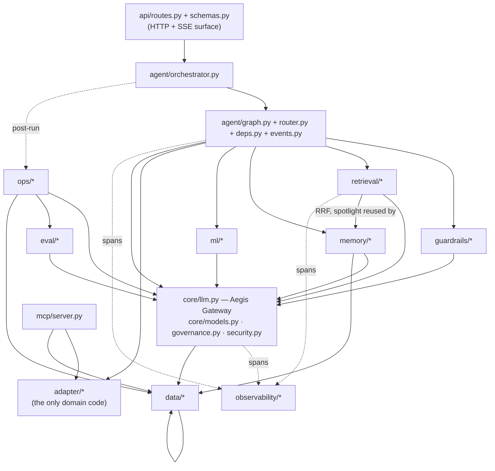
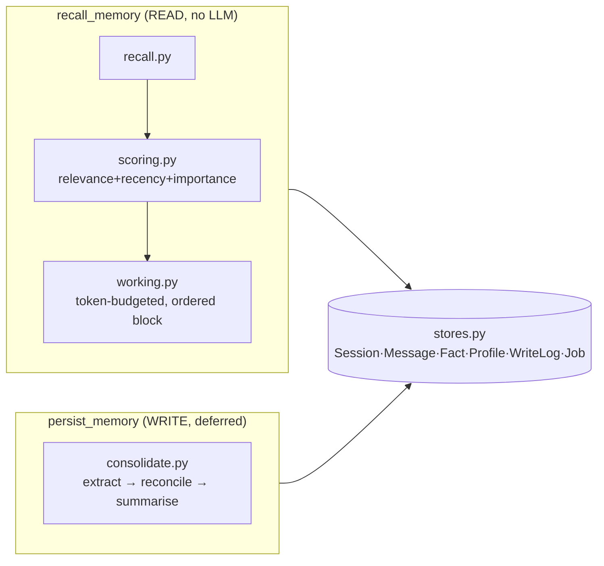
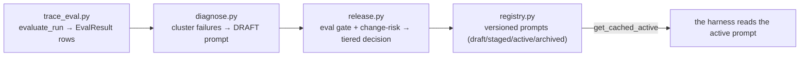

# 20 · Backend module reference

The backend is a **FastAPI** app under `backend/src/app/`. This page walks every Aegis
module: what it does, its files, and how it connects to the rest. Design rule throughout:
**mechanism lives in the core (`app.*`); domain meaning comes from `app.adapter.*`**, and
almost everything is dependency-injected (the LLM `complete`/`embed`, DB sessions) so each
module is offline-testable with fakes.

## Module dependency map

Two things every module shares:
- **`core/models.py::ModelRole`** is the routing currency — retrieval, memory, guardrails,
  ops, and eval all request a model by *role*, never by id.
- **`data/models.py::Base`, `EMBED_DIM` (3072), `VectorType`/`JsonB`** back both the
  governance tables and `memory/stores.py`, with a SQLite fallback so tests need no
  Postgres.

---

## API surface — `api/routes.py`, `api/schemas.py`

Every endpoint lives in `routes.py`; `schemas.py` holds the request/response models and the
`StreamEvent` discriminated union that the SSE stream and the frontend share. RBAC is
enforced with dependency guards (`require_auth` / `require_admin` /
`require_platform_admin` / `require_tenant_admin`), and every state-changing action writes
an audit row.

| Group | Endpoints |
|---|---|
| Auth | `POST /auth/login` (issues a claims-bearing JWT) |
| Agent | `POST /query` (SSE stream), `POST /approval`, `GET /approvals`, `POST /approvals/{id}/decision` |
| Glass box | `GET /graph`, `POST /ml/explain`, `GET /metrics` (platform-admin), `GET /audit` (admin) |
| Admin governance | `GET /admin/tenants`, `GET /admin/users`, `GET|POST /admin/budgets`, `GET /admin/usage` |
| Memory | `GET /memory/{facts,profile,sessions,sessions/{id}/messages,writes,recall_debug}`, `POST /memory/forget`, `DELETE /memory/facts/{id}` |
| Ops (LLM-Ops loop) | `GET /ops/{prompts,prompts/active,evals,releases/pending}`, `POST /ops/{diagnose,release,rollback,releases/{id}/decide}` |

Reads degrade to empty and mutations return a clean `503` when the stores are off (`STORES=off`);
memory erasure returns `503` rather than faking success. Process-wide `GraphStore` and
`MetricsStore` accumulate the per-persona knowledge graph and the efficiency figures from
the live event stream (`_update_dashboards`).

## The agent — `agent/*`

The Harness. Detailed flow is in `40-request-flow.md`; the files:

- **`graph.py`** — the LangGraph state machine (`build_agent`). Nodes in order:
  `guard_input → route → (recall_memory | answer_memory) → retrieve → ml_predict → plan →
  gate → (approval) → act → reflect → generate → guard_output → stream → persist_memory`.
  The `plan → act → reflect` loop is a **bounded self-repair loop** (capped by
  `config.max_plan_iterations`). The human gate fires on **tool risk only**.
- **`orchestrator.py`** — `run_agent` drives the graph with
  `astream(stream_mode=["custom","updates"])`, stamps each event with `run_id`+`seq`, owns
  the human-approval rendezvous (register → interrupt → resume, exactly-once, durable),
  and fires the **post-run trace-eval** off the hot path. Also `decide_approval` /
  `resume_parked_run` (the async inbox resume path).
- **`router.py`** — the supervisor (**Aegis Router**): deterministic-first keyword
  classification with a cheap-LLM tiebreak only on a genuine tie between two named
  specialists. Reads the adapter roster defensively (falls back to a `qa`-only roster).
- **`deps.py`** — `AgentDeps` / `MemoryDeps`: the dependency-injection seam. `AgentDeps.default()`
  binds each capability to the real module lazily; `_default_*` wrappers are the exact
  points the core reaches into `app.adapter.*` (see `50-extend-for-your-domain.md`).
  `AgentConfig` holds `gate_min_risk` (default `HIGH`) and `max_plan_iterations` (default 2).
- **`events.py`** — builders for every `StreamEvent` variant + `stamp`.
- **`approvals.py`, `state.py`** — the in-process approval registry / parked-run handles,
  and the graph's `AgentState` typed dict.

## Aegis Gateway — `core/*`

- **`core/llm.py`** — the single async chokepoint for every model call. `complete(role,
  messages, ...)` and `embed(texts)` route by `ModelRole` through **LiteLLM** to the TCS
  GenAI Lab (a custom OpenAI-compatible provider). Per call: a budget/rate check *before*
  spend (`_enforce_governance`, **fail-closed** on a DB blip unless `budget_fail_open`), a
  `max_tokens` cap, a per-call `timeout` + outer `asyncio.wait_for` backstop, a role
  fallback chain, one JSON re-ask on invalid structured output, a usage-ledger write, and a
  `gen_ai.*` OTel span. Raises `BudgetExceededError` (→ terminal `budget_exceeded` event).
  A process-wide `_UsageTally` powers the dashboard's measured cost-saved / small-model
  share.
- **`core/models.py`** — the role → deployment-id table (`model_for`, `routing_table`,
  `is_small_model`); env-overridable per role with `MODEL_<ROLE>`.
- **`core/governance.py`** — per-request `GovernanceContext` (tenant/user + effective caps)
  via `contextvars`, set at the request edge and read at the chokepoint.
- **`core/security.py`** — JWT (`create/decode_access_token`, HS256) + Argon2id password
  hashing; `principal_role` derives the fine-grained tier (`platform_admin` /
  `tenant_admin` / `user`).

## Aegis Retrieval — `retrieval/*`

Hybrid RAG. `pipeline.py::Retriever.retrieve()`: **exact cache → semantic cache → hybrid
wide recall (vector + graph + BM25) → RRF fusion → LLM rerank → spotlight → assemble →
cache write-back**.

- **`fusion.py`** — pure **Reciprocal Rank Fusion** (`reciprocal_rank_fusion`, k=60),
  origin-tagged; reused by memory too.
- **`spotlight.py`** — Azure Spotlighting: delimiting + datamarking so retrieved content is
  marked untrusted data, defending against indirect prompt injection.
- **`reranker.py`** — LLM-as-reranker (API-only, no local cross-encoder — 16 GB / no-GPU),
  scores candidates 0–10 via `ModelRole.CHEAP`, falls back to recall order on parse failure.
- **`lightrag_backend.py`** — production `KnowledgeBackend` over **LightRAG (Neo4j graph +
  pgvector)**; `recall_ranked` issues two queries (`naive` = pure vector, `local` = graph
  traversal) so RRF fuses genuinely distinct signals.
- **`cache.py`** — two-tier Redis semantic cache (**Aegis Cache**) with honest
  `CacheProvenance`.
- **`memory.py`** — the in-memory *lite* backend + cache for `STORES=off` (real LLM, zero
  infra): hash-based embeddings, brute-force cosine, Jaccard co-occurrence graph, same RRF.
- **`gateway.py`** — lazy `default_complete`/`default_embed` resolvers. **`chunker.py`** —
  heading-aware structured chunking. **`validation.py`** — write-time poisoning gate.
  **`vectors.py`** — dependency-free cosine. **`models.py`** — the pydantic contracts
  (`RetrievalResult`, `Source`, `GraphDelta`, `Provenance`, …). **`protocols.py`** — the
  `KnowledgeBackend` / `MultiListBackend` typing seams.

## Aegis Memory — `memory/*`

Three-tier long-term memory (deep dive: `docs/MEMORY_SPEC.md`). Read path is deterministic
and LLM-free; the write path is a deferred cheap-model job. Isolation is app-level-first:
every query filters `subject_id` (+ optional `tenant_id`), with Postgres RLS as an additive
belt.

- **`stores.py`** — SQLAlchemy models on the shared `Base`: `MemorySession` (thread +
  rolling summary), `MemoryMessage` (episodic; carries `embedding`+`embedding_dim`),
  `MemoryFact` (semantic, **Zep bitemporal** — `valid_at`/`invalid_at` +
  `created_at`/`expired_at`, `supersedes_id`), `MemoryProfile` (the always-injected human
  block), `MemoryWriteLog` (append-only "why the agent believes X" trail),
  `MemoryConsolidationJob` (durable queue).
- **`scoring.py`** — pure Generative-Agents composite (`w_rel*rel + w_rec*rec + w_imp*imp +
  w_freq*freq`, min-max normalized), `recency_decay`, `rank_top`.
- **`recall.py`** — the READ selection: facts (pgvector/Python top-k over *valid* facts),
  episodic (RRF of a recency window + a vector top-k), skills (markdown via
  `memory_spec.select_skills`).
- **`working.py`** — assembles the budgeted, **lost-in-the-middle**-ordered block
  (`profile, facts, skills, summary, episodic, raw`), greedy fill + eviction, episodic
  wrapped in spotlighting. Returns `AssembledMemory` (≤ budget).
- **`consolidate.py`** — mem0 two-phase write: **extract** durable facts (one cheap call),
  **reconcile** each (dedup short-circuit, else ADD/UPDATE/INVALIDATE/NOOP), all audited;
  `enqueue_consolidation`/`sweep_pending` for the durable queue.
- **`config.py`** (`MemoryConfig` knobs), **`vector_ops.py`** (cosine top-k),
  **`tokens.py`** (tiktoken or a `len//4` fallback).

## Aegis Signal — `ml/*`

The trustworthy-ML spine. *What* to predict comes from `adapter/ml_spec.py`; *how* lives
here. A **solution signal only** — never gates a run.

- **`model.py`** — `TrustworthyModel`: a **soft-voting ensemble** (XGBoost +
  sklearn HistGradientBoosting), **MAPIE split conformal** (calibrated interval / set with
  a guaranteed coverage level), and **SHAP TreeExplainer** per member. `predict_explain(features)
  → MLExplainResponse` is the public inference contract (point prediction + conformal
  interval + coverage + signed per-feature SHAP drivers).
- **`spec.py`** — `resolve_spec` reads the adapter's `ml_spec` defensively (or a fallback).
  **`dataset.py`** — synthetic/adapter training-frame resolution.
- **`__main__.py`** — `python -m app.ml` trains on the adapter's real
  `training_frame` (the `resolution_hours` label) and persists the artifact.
  **`__init__.py`** — process-wide singleton (`get_model` → singleton → artifact → freshly
  trained).

## Aegis Guardrails — `guardrails/*`

Layered input/output rails, no local model. Public contract `check_input`/`check_output`
(`rails.py`), each layer can only *tighten* the verdict.

- **`rails.py`** — order: input = schema → PII redaction → injection classifier; output =
  schema → content filter → PII redaction. `_use_nemo()` routes to the Colang path when
  `GUARDRAILS_ENGINE=nemo`.
- **`classifier.py`** — injection/jailbreak: a **deterministic signature backstop** first,
  then a `ModelRole.CHEAP` classifier. **Fails closed** (any error → `injection=True`).
- **`pii.py`** — pure-code detect/redact (email, SSN, card w/ Luhn, keys, IP, phone) →
  `[REDACTED_<KIND>]`. **`schema.py`** — size/control-char checks + output denylist.
- **`nemo.py`** + **`config/`** — the real NeMo Guardrails Colang policy (input/output
  `.co` flows + custom actions delegating to the same `classifier`/`pii`/`schema`
  functions — one policy, two front doors). *If the NeMo package is absent it silently
  downgrades to the programmatic rails; see `docs/AUDIT_ROUND2.md`.*

## Aegis Loop — `ops/*`

The LLM-Ops self-improvement loop (control surface: the `/ops/*` endpoints).

- **`trace_eval.py`** — `evaluate_run` grades the final answer (reasoning-model judge or a
  lexical proxy) *and* each trajectory step (retrieval/tool/guardrail), writing one
  `EvalResult` per facet keyed by `run_id`/`prompt_key`. Best-effort, never raises.
- **`diagnose.py`** — clusters recent *failing* evals for a `prompt_key` and asks a
  reasoning-model optimizer to write an improved prompt **as a DRAFT only**.
- **`release.py`** — the only place a draft goes live: (1) an **eval gate** (must beat
  baseline by `margin` via the injected `eval_fn`), (2) a **change-risk classifier**
  (`classify_change`), (3) a **tiered decision** — low-risk auto-promote, risky → staged to
  the durable approval inbox.
- **`registry.py`** — the prompt-version registry (`create_draft`, `promote`, `rollback`,
  and the synchronous `get_cached_active` the harness reads). The adapter default prompt is
  always the floor.
- **`gate.py`** — the *live* seams `release` is injected with: `make_eval_fn(complete)` is a
  genuinely **prompt-dependent** scorer (retrieves real context, **generates under the
  candidate prompt**, judges it); `enqueue_release_approval` / `decide_release` are the
  release-inbox read/resolve path.

## Aegis Evals — `eval/*`

The offline eval suite `release.py` and CI use. **`harness.py`** — `evaluate(cases,
thresholds, complete=None)` drives the *real* hybrid retriever over `SEED_CASES` and
returns an `EvalReport(passed=…)` (the CI gate; `python -m app.eval.harness`). **`judge.py`**
— optional LLM-as-judge (`judge_answer`, gated by `TAIF_EVAL_LLM_JUDGE`). **`metrics.py`**
— deterministic RAGAS-*style* lexical proxies (context-precision/recall, groundedness).
**`corpus.py`** — the frozen self-contained KB (`SEED_CORPUS`, `SEED_CASES`).

## Aegis Trace — `observability/*`

OpenTelemetry → Phoenix. **`otel.py`** — `init_observability(app)` wires the tracer
(exports to in-process Arize Phoenix, degrades to console); `get_tracer`, `current_trace_id`.
**`spans.py`** — `span(kind, name, attributes)` context manager (stamps
`openinference.span.kind` so Phoenix renders the run as a tree; no-op when untraced).
**`genai.py`** — `genai_span` for `gen_ai.*` LLM/embedding spans + `set_usage`.
**`semconv.py`** — the attribute keys, `DEFAULT_PROVIDER="tcs.genailab"`, and `SpanKind`
(`AGENT, CHAIN, TOOL, RETRIEVER, RERANKER, GUARDRAIL, LLM, EMBEDDING`).

## Aegis Governance — `data/*`

Persistence + tenancy. **`models.py`** — the ORM on `Base`: `Tenant`, `User`, `Budget`
(hierarchical token/USD/rate caps), `UsageLedger`, `Approval` (the durable HITL inbox row),
`AuditLog`, `Chunk`, `EvalResult`, `PromptVersion`. **`session.py`** — async engine/session,
**`get_agent_checkpointer()`** (the single process-wide LangGraph checkpointer enabling
cross-worker resume by `thread_id`), **`set_tenant_scope`** (emits the Postgres RLS GUC),
`bootstrap`/`bootstrap_rls`. **`governance.py`** — `enforce_governance` (the chokepoint
budget check), `record_usage`, admin rollups. **`audit.py`** — `record_audit`.
**`approvals.py`** — the durable inbox: `enqueue_approval`, `list_pending`,
`resolve_approval` (optimistic `PENDING → RESUMING/REJECTED` lock for exactly-once resume),
`sweep_expired` / `run_sla_sweeper`.

## Aegis Tools / MCP — `mcp/server.py`

A real **MCP (Model Context Protocol) stdio server** exposing the adapter tool registry so
external clients (e.g. Claude Desktop) can drive the same tools. It is a **facade, not a
bypass**: `list_tools` returns only allowlist-filtered tools; `call_tool` rejects
unknown/not-allowed names, applies the risk gate, and routes through the same `run_tool`
(re-checks the allowlist + writes an audit row). **HIGH-risk writes are listed but never
auto-executed** — they return "requires human approval" with no side effect (audited as a
proposal), preserving the exact governance the in-process agent enforces.

## The domain edge — `adapter/*`

The only domain-specific code. Fully covered in `50-extend-for-your-domain.md`. In short:
`schema.py` (entities), `generator.py` (synthetic world), `tools.py` (`TOOL_REGISTRY` +
`ALLOWLIST`), `ml_spec.py` (`FEATURES`/`TARGET`/`latent_*`), `personas.py` + `prompts.py`,
`roster.py`, `memory_spec.py`, `corpus/*.md`. The shipped domain is
`service_request_management` — an enterprise customer-support / service-request assistant.
