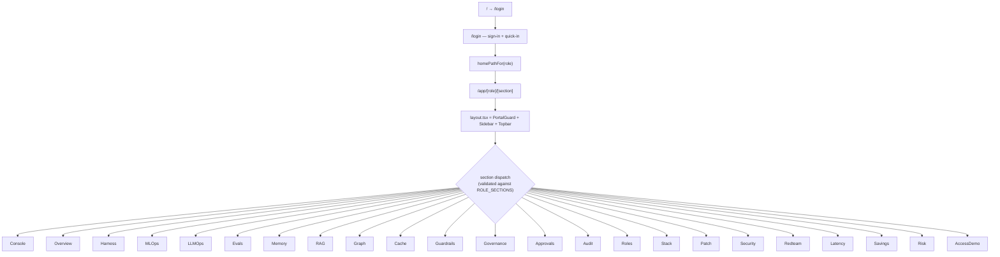
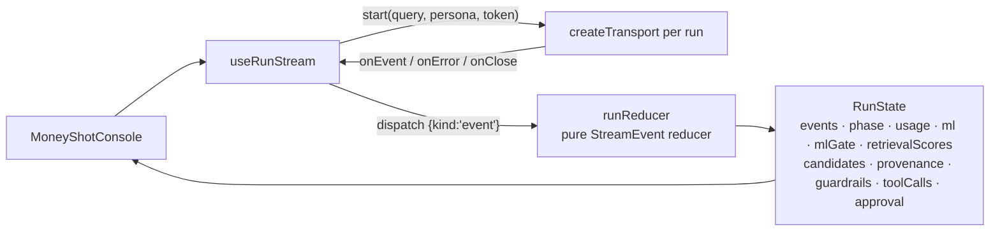

# 30 · The console (frontend)

The console is a **Next.js 15 (App Router) + React 19 + TypeScript** app under `web/src/`,
styled with **Tailwind CSS v4** (CSS-first). It is a *live-first* console: it talks to the
real backend when reachable and falls back to a clearly-labelled in-browser mock otherwise.
Charts use `recharts`; the knowledge graph uses `react-force-graph-2d`. The console ships a
**single light identity** — there is no dark mode (see *The design system* below).

## Surfaces and navigation

Routing is the App Router file tree under `web/src/app/`. There is a login surface plus
**one role-gated portal per role** — four portals, matching the four RBAC roles — and each
portal's surfaces are **URL-addressable sections**, not local tab state:

| Route | Renders |
|---|---|
| `/` | `app/page.tsx` → redirects to `/login` |
| `/login` | `app/login/page.tsx` — real sign-in + four demo quick-in buttons |
| `/app/[role]` | `app/app/[role]/page.tsx` → redirects to the role's default section |
| `/app/[role]/[section]` | `app/app/[role]/[section]/page.tsx` — the section, inside the portal shell |

`Role = 'admin' | 'ai_team' | 'devops' | 'client'` (`lib/stream.ts`). `homePathFor(role)`
(`lib/portal.ts`) maps each role to `/app/<role>/<its default section>` — the single source
of truth for RBAC redirects (login lands there; a session that reaches the wrong portal is
sent back there).

- **`app/app/[role]/layout.tsx`** is the portal shell: `PortalGuard` (client-side RBAC
  gate) wrapping `Sidebar` + `Topbar` + `<main>`. An unknown role 404s.
- **`app/app/[role]/[section]/page.tsx`** validates the pair against `ROLE_SECTIONS`
  (`isValidSection`) and 404s on anything a role does not own, then dispatches to that
  section's component. `generateStaticParams()` enumerates every valid role/section combo,
  so `next build` prints the whole portal route tree.
- **`lib/portal.ts`** is the catalogue: `SECTIONS` (id, label, `lucide` icon, mono `hint`,
  plain-language `tooltip`, optional `group`) and `ROLE_SECTIONS` (the per-role allowlist,
  in nav order). `Sidebar` groups items by `Section.group`.



Each role sees only the surfaces it owns (`ROLE_SECTIONS` in `lib/portal.ts`):

| Role | Portal surfaces (in nav order) |
|---|---|
| `admin` | Overview · Governance · Approvals · Audit · Roles & Access — **oversight/delegation only** (no hands-on AI/DevOps/Client work) |
| `ai_team` | Console · Harness · MLOps · LLMOps · Evals · Token opt · Memory · RAG · Graph · Cache · Guardrails · Access demo |
| `devops` | Overview · Tech Stack & Versions · Patch Check · Security · Red-team · Latency · Audit |
| `client` | Overview · Savings · Risk Map · Access demo |

The full section catalogue (note: several **labels differ from their id** — documented so
the code and UI line up):

| id | UI label | mono hint | Component (`web/src/components/…`) | Shown in |
|---|---|---|---|---|
| `console` | **Console** | `LangGraph` | `console/ConsoleMount.tsx` → `MoneyShotConsole` | ai_team |
| `dashboard` | **Overview** | `value at a glance` | `dashboard/AdminCommandCenter.tsx` (admin) · `dashboard/Dashboard.tsx` (devops, client) | all portals |
| `harness` | **Harness** | `graph · tweak` | `harness/HarnessView.tsx` | ai_team |
| `mlops` | **MLOps** | `SHAP · conformal` | `ml/MLOpsView.tsx` | ai_team |
| `llmops` | **LLMOps** | `trace → eval → release` | `ops/LLMOpsView.tsx` | ai_team |
| `evals` | **Evals** | `RAGAS · DeepEval` | `evals/EvalsView.tsx` | ai_team |
| `tokenopt` | **Token opt** | `routing · savings` | `gateway/TokenOptView.tsx` | ai_team |
| `memory` | **Memory** | `pgvector` | `memory/MemoryView.tsx` | ai_team |
| `rag` | **RAG** | `hybrid · rerank` | `retrieval/RagView.tsx` | ai_team |
| `graph` | **Graph** | `entities · relations` | `graph/GraphView.tsx` | ai_team |
| `cache` | **Cache** | `semantic · TTL` | `cache/CacheView.tsx` | ai_team |
| `guardrails` | **Guardrails** | `rails · verdicts` | `guardrail/GuardrailsView.tsx` | ai_team |
| `simulation` | **Access demo** | `RBAC scope` | `sim/SimulationView.tsx` | ai_team, client |
| `governance` | **Governance** | `tenants · budgets` | `governance/GovernanceView.tsx` | admin |
| `approvals` | **Approvals** | `human gate` | `approvals/ApprovalsInbox.tsx` | admin |
| `audit` | **Audit** | `Postgres audit` | `admin/AuditLog.tsx` | admin, devops |
| `roles` | **Roles & Access** | `RBAC grants` | `admin/RolesAccess.tsx` | admin |
| `stack` | **Tech Stack & Versions** | `SBOM` | `devops/StackVersions.tsx` | devops |
| `patch` | **Patch Check** | `installed vs latest` | `devops/PatchCheck.tsx` | devops |
| `security` | **Security** | `OWASP · posture` | `security/SecurityView.tsx` | devops |
| `redteam` | **Red-team** | `attacks · block-rate` | `redteam/RedteamView.tsx` | devops |
| `latency` | **Latency** | `p50 · p95` | `latency/LatencyView.tsx` | devops |
| `risk` | **Risk Map** | `OWASP-Agentic` | `client/RiskMap.tsx` | client |
| `savings` | **Savings** | `baseline vs actual` | `client/SavingsView.tsx` | client |

Each section exports a `…Mount` client entry, so the heavy, browser-only trees (canvas graph,
chart libraries) mount client-side via `next/dynamic` with `ssr: false` while the route
itself stays a server component. Section changes cross-fade via `.animate-section` in the
portal layout. Sub-panels behind the composite surfaces:

- **Console** (`MoneyShotConsole`): the glass-box — reasoning lane, orchestration map,
  knowledge graph, rerank scoreboard, conformal + SHAP panels, guardrail reveal, approval
  spotlight, answer panel (assembled from `components/console/*`, `graph/*`, `ml/*`,
  `retrieval/*`, `guardrail/*`, `trace/*`).
- **Memory** (`MemoryView`): `SemanticFactsPanel`, `StructuredProfilePanel`,
  `EpisodicSessionsPanel`, `WriteLogPanel`, `RecallDebugPanel`.
- **LLMOps** (`LLMOpsView`): `DiagnosePanel`, `EvalTrend`, `ReleaseGate`, `PromptHistory`,
  `LoopParams`.
- **DevOps surfaces**: `StackVersions` (live software bill-of-materials, `stackDisplay.ts`)
  and `PatchCheck` (installed-vs-latest against PyPI) — `components/devops/*`.
- **Client surfaces**: `SavingsView` (`savingsCalc.ts`) and `RiskMap`
  (`riskMatrix.ts` + `RiskMatrixGrid.tsx`, the OWASP-Agentic heat-map) — `components/client/*`.
- **Roles & Access** (`components/admin/RolesAccess.tsx`): the admin's role-assignment
  surface (drives `POST /admin/users/{id}/role`).

## State management

No Redux/Zustand — just **React Context + hooks + one pure reducer**.

- **`lib/auth/AuthContext.tsx`** provides `{ session, signIn, signOut, hydrated }`.
  `Session = { role, token, username, tenantId }` where `role` is one of the four RBAC
  roles, persisted to `localStorage` and rehydrated on load (a refresh keeps you logged in).
  `signIn` calls the login function in `lib/api/client.ts`. `PortalGuard` reads it to gate
  each portal route.
- **`lib/api/mode.ts`** runs the live/mock boot probe and caches `{ mode, reason }`
  (see next section).

The **console's SSE stream → UI state** pipeline is the important bit:



- `useRunStream` (`state/useRunStream.ts`) wraps `useReducer`. On `start` it creates the
  transport **per run** (so it reads the resolved live/mock mode at run time), then feeds
  each SSE event into the **pure** `runReducer` (`state/runReducer.ts`), which is
  deterministic and side-effect free.
- `runReducer` derives a `RunPhase` (`idle · streaming · awaiting_approval · abstained ·
  completed · blocked · error`) plus the structured views the console renders. This is a
  direct projection of the `StreamEvent` stream described in `40-request-flow.md`.
- `resolveApproval(decision)` calls back into the run controller with the captured
  `approval_id`, resolving a live HITL gate mid-stream.
- The console separately fetches the accumulated graph via `getGraph(token)` and
  efficiency figures via `useMetrics(token)` (`state/useMetrics.ts`).

## The API client and mock mode

The app is **live-first with a labelled mock fallback**. The decision lives in
`lib/api/config.ts` + `lib/api/mode.ts`:

- **Config** (`lib/api/config.ts`) reads the public Next env: `NEXT_PUBLIC_API_BASE` (base
  URL; empty ⇒ same-origin), `NEXT_PUBLIC_HEALTH_PATH` (default `/health`), and
  `FORCE_MOCK = NEXT_PUBLIC_USE_MOCK === 'true' || ?mock=1`.
- **Mode resolution** (`lib/api/mode.ts`): the pure `decideMode(forceMock, reachable)` →
  `forced-mock` (env), `probe-failed` (unreachable), or `probe-live`. `probeBackend()` does
  a `GET {API_BASE}{HEALTH_PATH}` with an `AbortController` timeout; any failure → mock.
  It runs once on mount; `factory.ts` and `client.ts` read the cached result synchronously.
- **Transport selection** (`lib/api/factory.ts`): `createTransport()` returns
  `isMock() ? createMockTransport() : createLiveTransport()`. Both satisfy `RunTransport`
  (`lib/api/transport.ts`): `start(query, persona, token, handlers) → RunController`. The
  mock lives in `src/mock/` (`mockTransport.ts` + fixtures).
- **REST client** (`lib/api/client.ts`, plus `memory.ts` / `ops.ts` / `platform.ts`): every
  function checks `isMock()` first and returns an in-browser fixture when mocking, else
  calls the real route through a private `request<T>(path, init, token)` helper (adds
  `Authorization: Bearer <token>`, throws on non-ok).
- **Offline banner** (`components/console/ConsoleMount.tsx`): renders only when the resolved
  mode is `mock`. It distinguishes forced mock ("Unset `NEXT_PUBLIC_USE_MOCK` / drop
  `?mock=1` to go live") from an unreachable backend ("Backend unreachable — showing
  scripted demo data").

> The switch is driven by **env vars + a boot health probe**, not localStorage.
> localStorage only stores the auth session.

**SSE detail** (`lib/api/sse.ts`): `/query` is streamed with a hand-rolled `fetch` reader
(not `EventSource`, because the stream needs a POST body). `readSSEStream` splits frames on
blank lines, `JSON.parse`s each `data:` line into a `StreamEvent`, and skips malformed
frames rather than tearing down the stream. The same module carries `decodeAguiStream` for
the AG-UI wire format (see `docs/module/aegis-core.md`).

### Endpoints the client calls (all real backend routes)

| Function | Method + path |
|---|---|
| `login` | `POST /auth/login` |
| streaming run | `POST /query` (SSE, body `{query, persona}`) |
| `getGraph` / `getMetrics` / `getAudit` | `GET /graph` · `GET /metrics` · `GET /audit` |
| `mlExplain` | `POST /ml/explain` |
| `postApproval` / `getApprovals` / `postApprovalDecision` | `POST /approval` · `GET /approvals` · `POST /approvals/{id}/decision` |
| admin | `GET /admin/tenants` · `GET /admin/users` · `GET|POST /admin/budgets` · `GET /admin/usage` |
| roles (`assignRole`) | `POST /admin/users/{id}/role` |
| devops (`getStack` / `checkPatches`) | `GET /stack` · `POST /stack/patch-check` |
| client (`getRiskMap` / `getSavings`) | `GET /risk-map` · `GET /savings` |
| memory | `GET /memory/{facts,profile,sessions,sessions/{id}/messages,writes,recall_debug}` |
| ops | `GET /ops/{prompts,prompts/active,evals,releases/pending}` · `POST /ops/{diagnose,release,rollback,releases/{id}/decide}` |
| health probe | `GET /health` (public) |

These map one-to-one to the endpoints in `backend/src/app/api/routes.py` (see
`20-backend.md` §API). Note `POST /approval` is live-only (the mock resolves approvals via
the mock transport's controller instead).

## The design system (`app/globals.css`)

Tailwind v4, CSS-first: tokens are CSS custom properties on `:root`, re-exported as
utilities via `@theme inline`. **The console is light-only — there is no dark mode**; the
stylesheet defines a single light identity and no `.dark` / `data-theme="dark"` variant is
ever applied. The app is also **responsive**: fluid desktop layouts with no horizontal
overflow.

- **Radius:** `--radius: 0.75rem` (+ derived `--radius-sm/md/lg/xl`).
- **Motion:** `--dur-fast` (120ms), `--dur-base` (200ms), `--dur-slow` (320ms),
  `--dur-count` (900ms), `--ease-out`, `--ease-inout`.
- **Neutrals:** `--background`, `--foreground`, `--surface`, `--surface-2`, `--card`,
  `--muted`, `--muted-foreground`, `--border`, `--input`, `--ring` (+ `-foreground` pairs).
- **Signal palette ("taxonomy of trust")** — each has a soft *fill*, a readable *ink*, and
  an on-fill *foreground*: `--agent` (mint), `--graph` (blue), `--risk` (amber),
  `--block` (rose), `--ok` (green), `--ml` (purple). e.g. classes `text-ml-ink`,
  `bg-block`, `text-agent-ink`. This palette is why each subsystem in the console has a
  consistent hue.
- **Charts:** `--chart-1 … --chart-5`. **Semantic:** `--success`, `--danger`, tints.
- **Typography:** `--font-sans` (Inter), `--font-display` (Space Grotesk), `--font-mono`
  (JetBrains Mono); type-scale utilities `.t-hero`, `.t-metric`, `.t-title`, `.t-body`,
  `.t-label`, `.t-mono`.
- **Elevation:** `.shadow-card`, `.shadow-hover`, `.shadow-pop`.
- **Motion utilities** (all disabled under `prefers-reduced-motion`): `.animate-beat`
  (the active-subsystem pulse), `.animate-trace-in`, `.animate-flow-pulse`,
  `.animate-reveal`, `.animate-section` (section cross-fade), `.animate-chart-in`, etc.

## Verify the console

From `web/` (see `60-run-and-operate.md`):

```bash
npm run build   # next build (TypeScript strict) — clean
npm run lint    # ESLint (next/core-web-vitals + next/typescript) — 0 errors
```
