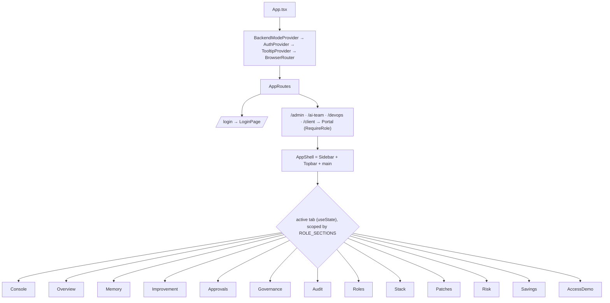
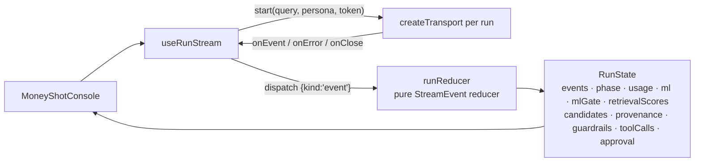

# 30 · The console (frontend)

The frontend is a **React + Vite + TypeScript** app under `frontend/src/`, styled with
**Tailwind CSS v4** (CSS-first). It is a *live-first* console: it talks to the real
backend when reachable and falls back to a clearly-labelled in-browser mock otherwise.
Charts use `recharts`; the knowledge graph uses `react-force-graph`. The console ships a
**single light identity** — there is no dark mode (see *The design system* below).

## Surfaces and navigation

There is a login surface plus **one role-gated portal route per role** (`App.tsx` →
`AppRoutes`) — four portals, matching the four RBAC roles:

| Route | Renders |
|---|---|
| `/login` | `routes/LoginPage.tsx` |
| `/admin` | `RequireRole role="admin"` → `Portal role="admin"` |
| `/ai-team` | `RequireRole role="ai_team"` → `Portal role="ai_team"` |
| `/devops` | `RequireRole role="devops"` → `Portal role="devops"` |
| `/client` | `RequireRole role="client"` → `Portal role="client"` |
| `/` and `*` | `RootRedirect` → `homePathFor(session.role)` or `/login` |

`Role = 'admin' | 'ai_team' | 'devops' | 'client'` (`types/stream.ts`); `homePathFor`
(`auth/RequireRole.tsx`) maps each role to its route. Everything else is a **tab inside
`routes/Portal.tsx`**, switched by local `useState(active)` — *not* the router. `Portal`
builds its tabs from `sectionsFor(role)`, which reads **`ROLE_SECTIONS`** (the per-role
surface allowlist); each `Section` carries a `NavItem` (id, label, icon, mono `hint`) and a
`render`. The list is handed to `AppShell` → `Sidebar`, which groups items by
`NavItem.group`.



Each role sees only the surfaces it owns (`ROLE_SECTIONS` in `Portal.tsx`):

| Role | Portal surfaces (in nav order) |
|---|---|
| `admin` | Overview · Approvals · Governance · Audit · Roles & Access — **oversight/delegation only** (no hands-on AI/DevOps/Client work) |
| `ai_team` | Console · Overview · Memory · Improvement · Access demo |
| `devops` | Overview · Tech Stack & Versions · Patch Check · Audit |
| `client` | Overview · Savings · Risk Map · Access demo |

The full tab catalogue (note: several **labels differ from their id** — documented so the
code and UI line up):

| id | UI label | mono hint | Component | Shown in |
|---|---|---|---|---|
| `console` | **Console** | `LangGraph` | `components/console/MoneyShotConsole.tsx` (eager) | ai_team |
| `dashboard` | **Overview** | `value at a glance` | `components/dashboard/Dashboard.tsx` (lazy) | all portals |
| `memory` | **Memory** | `pgvector` | `components/memory/MemoryView.tsx` (lazy) | ai_team |
| `simulation` | **Access demo** | `RBAC scope` | `components/sim/SimulationView.tsx` (lazy) | ai_team, client |
| `ops` | **Improvement** | `trace → eval → release` | `components/ops/OpsView.tsx` (lazy) | ai_team |
| `approvals` | **Approvals** | `human gate` | `components/approvals/ApprovalsInbox.tsx` (lazy) | admin |
| `admin` | **Governance** | `tenants · budgets` | `components/admin/AdminSettings.tsx` (lazy) | admin |
| `audit` | **Audit** | `Postgres audit` | `components/admin/AuditLog.tsx` (lazy) | admin, devops |
| `roles` | **Roles & Access** | `RBAC grants` | `components/admin/RolesAccess.tsx` (lazy) | admin |
| `stack` | **Tech Stack & Versions** | `SBOM` | `components/devops/StackVersions.tsx` (lazy) | devops |
| `patch` | **Patch Check** | `installed vs latest` | `components/devops/PatchCheck.tsx` (lazy) | devops |
| `risk` | **Risk Map** | `OWASP-Agentic` | `components/client/RiskMap.tsx` (lazy) | client |
| `savings` | **Savings** | `baseline vs actual` | `components/client/SavingsView.tsx` (lazy) | client |

Every non-console surface is code-split (`React.lazy` + a `<Suspense key={active}>` that
cross-fades on tab change via `.animate-section`). Sub-panels behind the composite
surfaces:

- **Console** (`MoneyShotConsole`): the glass-box — reasoning lane, orchestration map,
  knowledge graph, rerank scoreboard, conformal + SHAP panels, guardrail reveal, approval
  spotlight, answer panel (assembled from `components/console/*`, `graph/*`, `ml/*`,
  `retrieval/*`, `guardrail/*`).
- **Memory** (`MemoryView`): `SemanticFactsPanel`, `StructuredProfilePanel`,
  `EpisodicSessionsPanel`, `WriteLogPanel`, `RecallDebugPanel`.
- **Improvement / Ops** (`OpsView`): `DiagnosePanel`, `EvalTrend`, `PendingReleases`,
  `PromptDiff`, `PromptTimeline`.
- **Governance / Admin** (`AdminSettings`): `TenantsView`, `UsersView`, `BudgetsView`,
  `UsageView`.
- **DevOps surfaces**: `StackVersions` (live software bill-of-materials, `stackDisplay.ts`)
  and `PatchCheck` (installed-vs-latest against PyPI) — `components/devops/*`.
- **Client surfaces**: `SavingsView` (`savingsCalc.ts`) and `RiskMap`
  (`riskMatrix.ts` + `RiskMatrixGrid.tsx`, the OWASP-Agentic heat-map) — `components/client/*`.
- **Roles & Access** (`components/admin/RolesAccess.tsx`): the admin's role-assignment
  surface (drives `POST /admin/users/{id}/role`).

Bonus: **projector / present mode** — pressing `F` in `Portal` toggles `presenting`
(`Esc` exits); `AppShell` then strips the chrome and enlarges the console.

## State management

No Redux/Zustand — just **React Context + hooks + one pure reducer**.

- **`auth/AuthContext.tsx`** provides `{ session, signIn, signOut }`. `Session =
  { role, token, username, tenantId }` where `role` is one of the four RBAC roles,
  persisted to `localStorage` under `aegis.session` and rehydrated on load (a refresh keeps
  you logged in). `signIn` calls `apiLogin` from `api/client.ts`.
- **`state/backendMode.tsx`** (`useBackendMode()`) runs the live/mock boot probe once and
  exposes `{ mode, reason, ready }` (see next section).

The **console's SSE stream → UI state** pipeline is the important bit:



- `useRunStream` (`state/useRunStream.ts`) wraps `useReducer`. On `start` it creates the
  transport **per run** (so it reads the resolved live/mock mode at run time), then feeds
  each SSE event into the **pure** `runReducer` (`state/runReducer.ts`), which is
  deterministic and unit-tested (`runReducer.test.ts`).
- `runReducer` derives a `RunPhase` (`idle · streaming · awaiting_approval · abstained ·
  completed · blocked · error`) plus the structured views the console renders. This is a
  direct projection of the `StreamEvent` stream described in `40-request-flow.md`.
- `resolveApproval(decision)` calls back into the run controller with the captured
  `approval_id`, resolving a live HITL gate mid-stream.
- The console separately fetches the accumulated graph via `getGraph(token)` and
  efficiency figures via `useMetrics(token)` (`state/useMetrics.ts`).

## The API client and mock mode

The app is **live-first with a labelled mock fallback**. The decision lives in
`api/config.ts` + `api/mode.ts`:

- **Config** (`api/config.ts`) reads Vite env: `VITE_API_BASE` (base URL),
  `VITE_HEALTH_PATH` (default `/health`), and `FORCE_MOCK = VITE_USE_MOCK === 'true' ||
  ?mock=1`.
- **Mode resolution** (`api/mode.ts`): `decideMode(forceMock, reachable)` →
  `forced-mock` (env), `probe-failed` (unreachable), or `probe-live`.
  `probeBackend()` does a `GET {API_BASE}{HEALTH_PATH}` with a 2.5s `AbortController`
  timeout; any failure → mock. `BackendModeProvider` runs it once on mount; `factory.ts`
  and `client.ts` read the cached result synchronously.
- **Transport selection** (`api/factory.ts`): `createTransport()` returns
  `isMock() ? createMockTransport() : createLiveTransport()`. Both satisfy `RunTransport`
  (`api/transport.ts`): `start(query, persona, token, handlers) → RunController`.
- **REST client** (`api/client.ts`): every function checks `isMock()` first and returns
  an in-browser fixture when mocking, else calls the real route through a private
  `request<T>(path, init, token)` helper (adds `Authorization: Bearer <token>`, throws on
  non-ok).
- **Offline banner** (`components/layout/OfflineBanner.tsx`): renders only when
  `mode === 'mock'`, above every route. It distinguishes forced mock ("Set
  `VITE_USE_MOCK=false`…") from an unreachable backend ("Backend unreachable — showing
  scripted demo data").

> The switch is driven by **env vars + a boot health probe**, not localStorage.
> localStorage only stores the auth session (`aegis.session`).

**SSE detail** (`api/sse.ts`): `/query` is streamed with a hand-rolled `fetch` reader (not
`EventSource`, because the stream needs a POST body). `readSSEStream` splits frames on
blank lines, `JSON.parse`s each `data:` line into a `StreamEvent`, and skips malformed
frames rather than tearing down the stream.

### Endpoints the client calls (all real backend routes)

| Function | Method + path |
|---|---|
| `login` | `POST /auth/login` |
| streaming run | `POST /query` (SSE, body `{query, persona}`) |
| `getGraph` / `getMetrics` / `getAudit` | `GET /graph` · `GET /metrics` · `GET /audit` |
| `mlExplain` | `POST /ml/explain` |
| `postApproval` / `getApprovals` / `postApprovalDecision` | `POST /approval` · `GET /approvals` · `POST /approvals/{id}/decision` |
| admin | `GET /admin/tenants` · `GET /admin/users` · `GET|POST /admin/budgets` · `GET /admin/usage` |
| roles (`assignRole`) | `POST /admin/users/{id}/role` |
| devops (`getStack` / `checkPatches`) | `GET /stack` · `POST /stack/patch-check` |
| client (`getRiskMap` / `getSavings`) | `GET /risk-map` · `GET /savings` |
| memory | `GET /memory/{facts,profile,sessions,sessions/{id}/messages,writes,recall_debug}` |
| ops | `GET /ops/{prompts,prompts/active,evals,releases/pending}` · `POST /ops/{diagnose,release,rollback,releases/{id}/decide}` |
| health probe | `GET /health` (public) |

These map one-to-one to the endpoints in `backend/src/app/api/routes.py` (see
`20-backend.md` §API). Note `POST /approval` is live-only (the mock resolves approvals via
the mock transport's controller instead).

## The design system (`index.css`)

Tailwind v4, CSS-first: tokens are CSS custom properties on `:root`, re-exported as
utilities via `@theme inline`. **The console is light-only — there is no dark mode.**
`components/layout/theme.ts` is explicit about this: it never reads a stored preference,
never applies a `.dark` class or `data-theme="dark"`, and `useTheme()` returns a fixed
`'light'` with a no-op `toggle`; `reflectLight()` forces the document root into the light
state before first paint. (A `.dark` block survives in `index.css` only as inert defensive
styling — it is never activated.) The app is also **responsive**: fluid desktop layouts
with no horizontal overflow, and there is no notification icon in the top bar.

- **Radius:** `--radius: 0.75rem` (+ derived `--radius-sm/md/lg/xl`).
- **Motion:** `--dur-fast` (120ms), `--dur-base` (200ms), `--dur-slow` (320ms),
  `--dur-count` (900ms), `--ease-out`, `--ease-inout`.
- **Neutrals:** `--background`, `--foreground`, `--surface`, `--surface-2`, `--card`,
  `--muted`, `--muted-foreground`, `--border`, `--input`, `--ring` (+ `-foreground` pairs).
- **Signal palette ("taxonomy of trust")** — each has a soft *fill*, a readable *ink*, and
  an on-fill *foreground*: `--agent` (mint), `--graph` (blue), `--risk` (amber),
  `--block` (rose), `--ok` (green), `--ml` (purple). e.g. classes `text-ml-ink`,
  `bg-block`, `text-agent-ink`. This palette is why each subsystem in the console has a
  consistent hue.
- **Charts:** `--chart-1 … --chart-5`. **Semantic:** `--success`, `--danger`, tints.
  **shadcn aliases:** `--primary`, `--secondary`, `--accent`, `--destructive`.
- **Typography:** `--font-sans` (Inter), `--font-display` (Space Grotesk), `--font-mono`
  (JetBrains Mono); type-scale utilities `.t-hero`, `.t-metric`, `.t-title`, `.t-body`,
  `.t-label`, `.t-mono`.
- **Elevation:** `.shadow-card`, `.shadow-hover`, `.shadow-pop`.
- **Motion utilities** (all disabled under `prefers-reduced-motion`): `.animate-beat`
  (the active-subsystem pulse), `.animate-trace-in`, `.animate-flow-pulse`,
  `.animate-reveal`, `.animate-section` (tab cross-fade), `.animate-chart-in`, etc.

## Verify the frontend

From `frontend/` (see `60-run-and-operate.md`):

```bash
pnpm build   # tsc (strict) + vite build — clean, chunks < 500 kB
pnpm lint    # oxlint — 0 errors
pnpm test    # vitest (runReducer, mode, roi, sla, orchestration, … unit tests)
```
