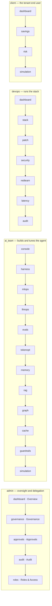
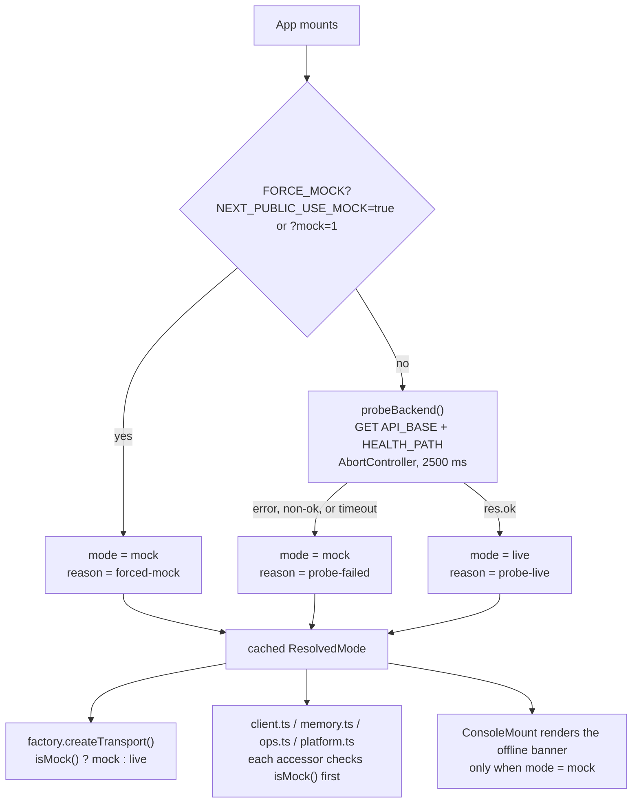
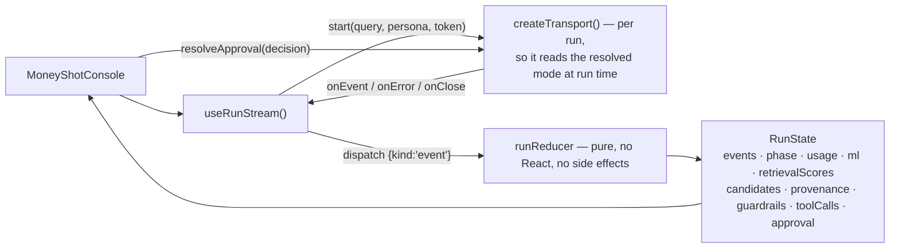

# 30 · The console

**What you'll learn:** how the Next.js console is laid out, the four role portals and
exactly what each one contains, how a session is hydrated and guarded, how the app
decides between the live backend and a labelled mock, how a streaming run becomes UI
state, and what the design system provides.

Everything here is under `web/`. `web/README.md` is the short version and is accurate;
this page is the explained version.

---

## 1. The stack

- **Next.js 15** (App Router) + **React 19** + **TypeScript** (strict)
- **Tailwind CSS v4**, CSS-first (`@tailwindcss/postcss`) — tokens are CSS custom
  properties, re-exported as utilities with `@theme inline`
- **lucide-react** icons, **Recharts** for charts, **react-force-graph-2d** for the
  knowledge graph
- Fonts (Inter / Space Grotesk / JetBrains Mono) load via a runtime `<link>`, not
  `next/font`, so `next build` never blocks on a font fetch
- **Light theme only.** There is one light identity in `globals.css`; no dark variant is
  defined or applied anywhere

Scripts: `npm run dev`, `npm run build`, `npm run lint`. **There is no test runner and no
test suite in `web/`** — correctness rests on TypeScript strict mode and ESLint.

---

## 2. Routing — the App Router tree

```
src/app/
  layout.tsx                       root layout: fonts + globals + AuthProvider
  page.tsx                         "/"  → redirects to /login
  login/page.tsx                   "/login" — real credential sign-in
  app/[role]/layout.tsx            portal shell: PortalGuard + Sidebar + Topbar
  app/[role]/page.tsx              "/app/[role]" → redirect to that role's default section
  app/[role]/[section]/page.tsx    "/app/[role]/[section]" — the section itself
```

Every surface is a **URL-addressable route**, not local tab state — you can deep-link and
refresh into any panel.

```mermaid
flowchart TB
    ROOT["/"] --> LOGIN["/login<br/>real POST /auth/login"]
    LOGIN -->|"JWT role decides"| HOME["homePathFor(role)<br/>= /app/&lt;role&gt;/&lt;default section&gt;"]
    HOME --> PORTAL["/app/&#91;role&#93;/&#91;section&#93;"]
    PORTAL --> LAYOUT["layout.tsx<br/>isRole(role) else notFound()"]
    LAYOUT --> GUARD["PortalGuard"]
    GUARD --> SHELL["Sidebar + Topbar + main"]
    SHELL --> PAGE["&#91;section&#93;/page.tsx"]
    PAGE --> VALID{"isValidSection(role, section)?"}
    VALID -->|no| NF["notFound() — 404"]
    VALID -->|yes| DISPATCH["dispatch to the section's Mount component"]
```



`generateStaticParams()` in the section page enumerates every valid role/section pair
from `ROLE_SECTIONS`, so `next build` prints the entire portal route tree — a nice
build-time proof that the RBAC catalogue and the routes agree.

---

## 3. The four portals — `lib/portal.ts`

`lib/portal.ts` is the catalogue and the single source of truth for navigation and
client-side RBAC. `SECTIONS` maps each id to a `Section` (`id`, `label`, lucide `icon`,
a terse mono `hint` naming the honest tech, a plain-language `tooltip`, and an optional
`group` heading). `ROLE_SECTIONS` maps each role to its sections **in nav order**.



The full catalogue, including the several sections whose **UI label differs from their
id** (documented so code and screen line up):

| id | UI label | mono hint | Component under `src/components/` | Portals |
|---|---|---|---|---|
| `console` | Console | `LangGraph` | `console/ConsoleMount.tsx` | ai_team |
| `dashboard` | Overview | `value at a glance` | `dashboard/AdminCommandCenter.tsx` (admin) · `dashboard/Dashboard.tsx` (devops, client) | admin, devops, client |
| `harness` | Harness | `graph · tweak` | `harness/HarnessView.tsx` | ai_team |
| `mlops` | MLOps | `SHAP · conformal` | `ml/MLOpsView.tsx` | ai_team |
| `llmops` | LLMOps | `trace → eval → release` | `ops/LLMOpsView.tsx` | ai_team |
| `evals` | Evals | `RAGAS · DeepEval` | `evals/EvalsView.tsx` | ai_team |
| `tokenopt` | Token opt | `routing · savings` | `gateway/TokenOptView.tsx` | ai_team |
| `memory` | Memory | `pgvector` ⚠︎ | `memory/MemoryView.tsx` | ai_team |
| `rag` | RAG | `hybrid · rerank` | `retrieval/RagView.tsx` | ai_team |
| `graph` | Graph | `entities · relations` | `graph/GraphView.tsx` | ai_team |
| `cache` | Cache | `semantic · TTL` | `cache/CacheView.tsx` | ai_team |
| `guardrails` | Guardrails | `rails · verdicts` | `guardrail/GuardrailsView.tsx` | ai_team |
| `simulation` | Access demo | `RBAC scope` | `sim/SimulationView.tsx` | ai_team, client |
| `governance` | Governance | `tenants · budgets` | `governance/GovernanceView.tsx` | admin |
| `approvals` | Approvals | `human gate` | `approvals/ApprovalsInbox.tsx` | admin |
| `audit` | Audit | `Postgres audit` | `admin/AuditLog.tsx` | admin, devops |
| `roles` | Roles & Access | `RBAC grants` | `admin/RolesAccess.tsx` | admin |
| `stack` | Tech Stack & Versions | `SBOM` | `devops/StackVersions.tsx` | devops |
| `patch` | Patch Check | `installed vs latest` | `devops/PatchCheck.tsx` | devops |
| `security` | Security | `OWASP · posture` | `security/SecurityView.tsx` | devops |
| `redteam` | Red-team | `attacks · block-rate` | `redteam/RedteamView.tsx` | devops |
| `latency` | Latency | `p50 · p95` | `latency/LatencyView.tsx` | devops |
| `savings` | Savings | `baseline vs actual` | `client/SavingsView.tsx` | client |
| `risk` | Risk Map | `OWASP-Agentic` | `client/RiskMap.tsx` | client |

⚠︎ **Known stale label:** the `memory` section's `hint` and `tooltip` still read
"Postgres + pgvector". The vector store is **Qdrant** (see
[`10-architecture.md`](10-architecture.md) §5). The label is wrong; the code behind it is
not.

There is also an `admin` section defined in `SECTIONS` (label "Settings") that no role's
`ROLE_SECTIONS` list currently includes, so it is unreachable — a defined-but-unwired
catalogue entry.

Each section exports a `…Mount` client entry so the heavy browser-only trees (canvas
graph, chart libraries) mount client-side while the route itself stays a server
component. Section changes cross-fade via `.animate-section` in the portal layout.

---

## 4. Auth, session hydration and PortalGuard

`lib/auth/AuthContext.tsx` provides `{ session, hydrated, signIn, signOut }` where
`Session = { role, token, username, tenantId }`.

```mermaid
sequenceDiagram
    autonumber
    participant U as User
    participant LP as /login page
    participant AC as AuthContext
    participant API as Backend
    participant TK as lib/api/authToken.ts
    participant PG as PortalGuard

    Note over AC: mount effect reads localStorage["aegis.session"]<br/>then sets hydrated = true
    U->>LP: username + password
    LP->>AC: signIn(username, password)
    AC->>API: POST /auth/login
    API-->>AC: { role, token, tenant_id }
    AC->>AC: persist session to localStorage
    AC->>TK: setAuthToken(token)
    Note over TK: every REST call and the SSE transport<br/>read this holder for Authorization: Bearer
    AC-->>LP: Session
    LP->>LP: router.push(homePathFor(role))
    U->>PG: navigates into /app/&lt;role&gt;/…
    PG->>PG: not hydrated → render "Loading…"
    PG->>PG: no session → replace("/login")
    PG->>PG: session.role ≠ portal role → replace(homePathFor(session.role))
    PG-->>U: matching role → render the portal
```

The hydration detail matters and is easy to get wrong. `AuthProvider` restores the
session **in an effect**, not in the `useState` initializer, so server-rendered markup and
the first client render agree (no hydration mismatch). React runs *child* effects before
*parent* effects, so any component that fetches on mount must read
`const { session, hydrated } = useAuth()`, bail out with `if (!hydrated) return`, and put
`[token, hydrated]` in its dependency array. Otherwise it fires with a null token, gets a
401, and spins forever.

`PortalGuard` is defence-in-depth plus UX, not the security boundary. The backend
enforces scope on every request independently; the guard exists so a devops session that
types `/app/ai_team/...` is bounced home instead of seeing a broken shell, and so a
logged-in operator is never flashed to `/login` on a hard refresh.

---

## 5. Live-first with a labelled mock fallback

The console talks to the real backend when it can and falls back to in-browser fixtures
when it cannot — always with a visible banner. The decision is made once, at boot.



Key facts:

- **The default is live.** Before the probe resolves, `decideMode(false, null)` returns
  `live` — optimistic, so the app never flashes a mock banner it will retract.
- `decideMode(forceMock, reachable)` is a **pure function**, unit-testable with no
  network. `probeBackend` is the only impure part.
- The banner distinguishes its two reasons: forced mock tells you to unset
  `NEXT_PUBLIC_USE_MOCK` / drop `?mock=1`; a failed probe says the backend is
  unreachable and this is scripted demo data. **The UI never passes fixtures off as
  live.**
- The switch is driven by env vars plus the boot probe. `localStorage` stores *only* the
  auth session, never the mode.
- Configuration lives in `lib/api/config.ts`: `NEXT_PUBLIC_API_BASE` (empty means
  same-origin), `NEXT_PUBLIC_HEALTH_PATH` (default `/health`), `NEXT_PUBLIC_USE_MOCK`.

### The API layer

| File | Role |
|---|---|
| `lib/api/config.ts` | Reads the public env vars, computes `FORCE_MOCK` |
| `lib/api/mode.ts` | `decideMode`, `probeBackend`, `isMock`, `getResolvedMode` |
| `lib/api/authToken.ts` | The JWT holder every request reads |
| `lib/api/client.ts` | The REST accessors and the private `request<T>(path, init, token)` helper (adds `Authorization: Bearer`, throws on non-ok) |
| `lib/api/memory.ts`, `ops.ts`, `platform.ts` | Domain-grouped accessors on the same helper |
| `lib/api/factory.ts` | `createTransport()` → mock or live |
| `lib/api/transport.ts` | The `RunTransport` contract: `start(query, persona, token, handlers) → RunController` |
| `lib/api/liveTransport.ts` | The real SSE run |
| `lib/api/sse.ts` | `readSSEStream` + `decodeAguiStream` |
| `src/mock/` | `mockTransport.ts` plus fixtures, used only in mock mode |

**SSE detail.** `/query` needs a POST body, so the browser's `EventSource` API cannot be
used. `lib/api/sse.ts` hand-rolls a `fetch` reader: it splits frames on blank lines,
`JSON.parse`s each `data:` line into a `StreamEvent`, and **skips a malformed frame
rather than tearing down the stream**.

The accessors map one-to-one onto real backend routes — `login`, the streaming run,
`getGraph`, `getMetrics`, `getAudit`, `mlExplain`, `getApprovals` / `postApproval` /
`postApprovalDecision`, the `/admin/*` set, `assignUserRole`, `getStack` / `checkPatches`,
`getRiskMap` / `getSavings`, the six memory reads, the `/ops/*` set, plus
`getModelCard`, `getEvalsReport`, `getOpsParams`, `getGatewayOptimization`,
`getHarnessConfig`, `getGovernanceDashboard`, `getSecurityPosture`, `getLatency` and
`runRedteam`.

---

## 6. From SSE events to rendered state

No Redux, no Zustand — React Context, hooks, and one pure reducer.



`runReducer` derives a `RunPhase` — `idle` · `streaming` · `awaiting_approval` ·
`abstained` · `completed` · `blocked` · `error` — plus every structured view the console
renders. Because it is pure, the whole streaming experience is deterministic and could be
tested by replaying a scripted event list (the harness for that does not exist yet).

`lib/stream.ts` holds the `StreamEvent` TypeScript contract; `lib/streamNames.ts` mirrors
`aegis.core.stream_names.ALL` — 17 custom-event names, an exact match with the Python
side.

The console additionally fetches the accumulated graph via `getGraph(token)` and
efficiency figures via `useMetrics(token)` (`state/useMetrics.ts`), both plain REST reads
outside the run stream.

Sub-panels behind the composite surfaces: the **Console** (`MoneyShotConsole`) composes
the reasoning lane, orchestration map, knowledge graph, rerank scoreboard, conformal and
SHAP panels, guardrail reveal, approval spotlight and answer panel from
`components/console/*`, `graph/*`, `ml/*`, `retrieval/*`, `guardrail/*` and `trace/*`.
**Memory** composes semantic facts, structured profile, episodic sessions, write log and
recall debug. **LLMOps** composes diagnose, eval trend, release gate, prompt history and
loop parameters.

---

## 7. The design system — `app/globals.css`

Tailwind v4, CSS-first: tokens are custom properties on `:root`, re-exported as
utilities through `@theme inline`. One light identity, no dark variant, fluid desktop
layouts with no horizontal overflow.

- **Radius** — `--radius: 0.75rem`, with derived `sm` / `md` / `lg` / `xl` / `2xl`.
- **Motion** — `--dur-fast` 120 ms, `--dur-base` 200 ms, `--dur-slow` 320 ms,
  `--dur-count` 900 ms, plus `--ease-out` and `--ease-inout`.
- **Neutrals** — `--background` `#f9f9fa`, `--foreground` `#101828`, `--surface`,
  `--surface-2`, `--card`, `--popover`, `--muted`, `--border`, `--input`, `--ring`, each
  with its `-foreground` pair where needed.
- **The signal palette — "a taxonomy of trust."** Six subsystem hues, each with a soft
  *fill*, a readable *ink*, and an on-fill *foreground*:

  | Token | Hue | Means |
  |---|---|---|
  | `--agent` | mint `#6be6d3` | reasoning / agent trajectory |
  | `--graph` | blue `#7dbbff` | retrieval / knowledge graph |
  | `--risk` | amber `#fec84b` | risk / awaiting human approval |
  | `--block` | rose `#fda29b` | guardrail block / danger |
  | `--ok` | green `#71dd8c` | pass / healthy / efficiency |
  | `--ml` | purple `#b899eb` | ML prediction / explanation |

  This is why every subsystem in the console carries a consistent colour — you learn the
  palette once and read any screen.
- **Charts** — `--chart-1 … --chart-5`. **Semantic** — `--success`, `--danger`, tints.
- **Typography** — `--font-sans` (Inter), `--font-display` (Space Grotesk), `--font-mono`
  (JetBrains Mono), with type-scale utilities `.t-hero`, `.t-metric`, `.t-title`,
  `.t-body`, `.t-label`, `.t-mono`.
- **Elevation** — `.shadow-card`, `.shadow-hover`, `.shadow-pop`.
- **Motion utilities**, all disabled under `prefers-reduced-motion`: `.animate-beat` (the
  active-subsystem pulse), `.animate-trace-in`, `.animate-flow-pulse`, `.animate-reveal`,
  `.animate-section`, `.animate-chart-in`.

---

## 8. Honest caveats

- **No tests.** `web/` has no test runner, no component tests, no end-to-end tests.
- **`/graph` is empty until runs happen in this backend process** — it is an in-process
  per-persona accumulator, not a Neo4j query (see [`20-backend.md`](20-backend.md) §2).
  With Neo4j down, no graph-derived nodes ever arrive, and the view says so rather than
  inventing nodes.
- **Most surfaces are empty on a fresh database.** Cost, savings, approvals, usage,
  evals and latency populate only after real agent runs. Empty states are rendered as
  empty, never as zeros dressed up as data.
- **The `memory` section's tech hint is stale** (says pgvector; it is Qdrant).
- **The `admin` / "Settings" section is defined but unreachable** — no role lists it.

Next: [`40-pipelines.md`](40-pipelines.md) — the flows this UI is a window onto.
