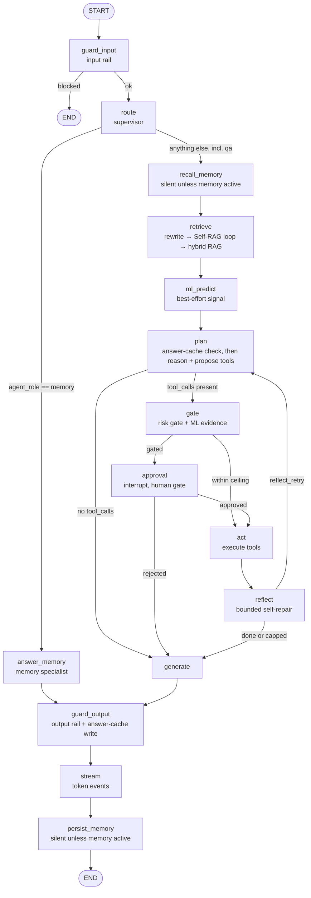
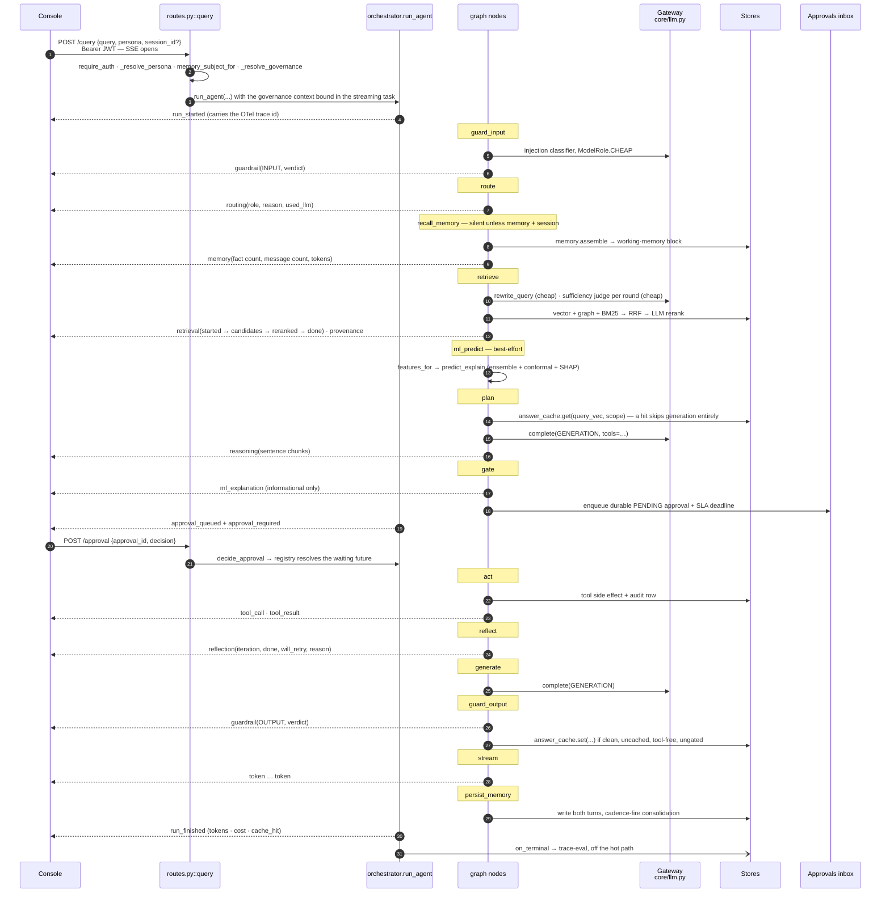
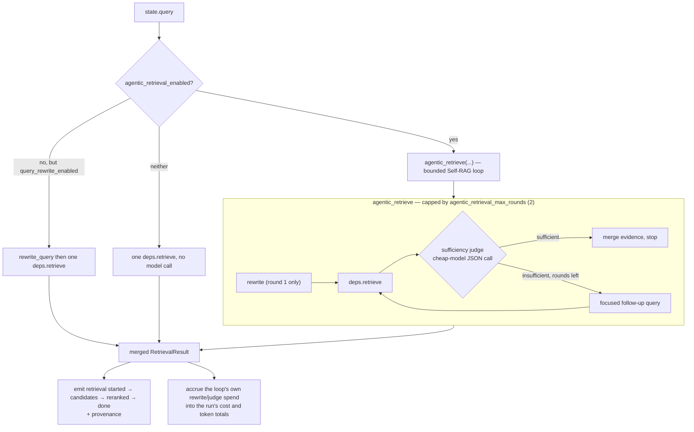
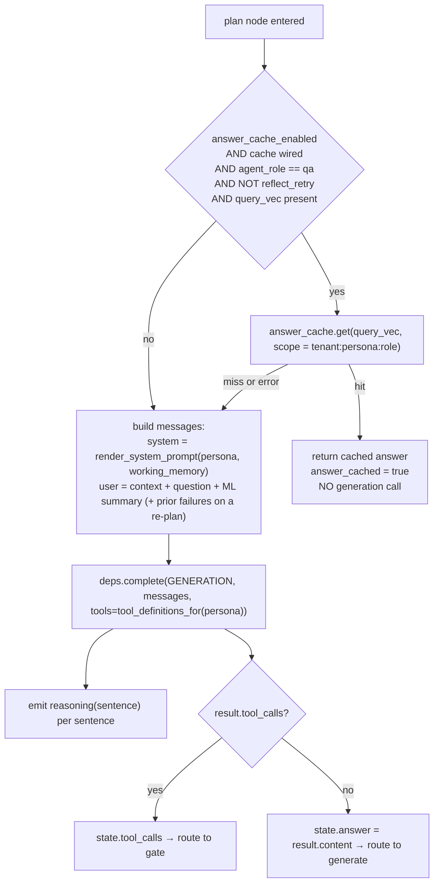
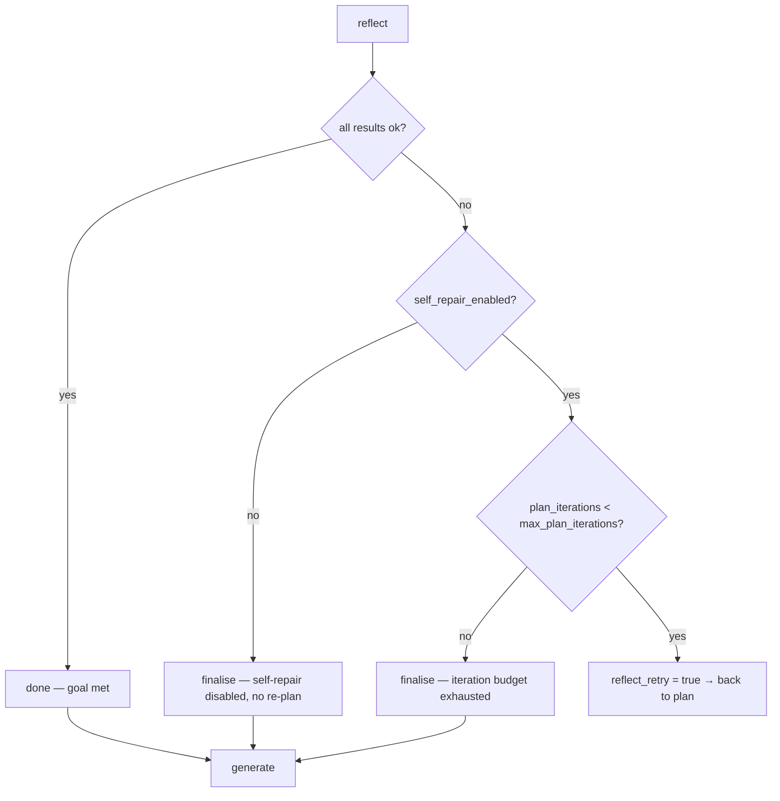
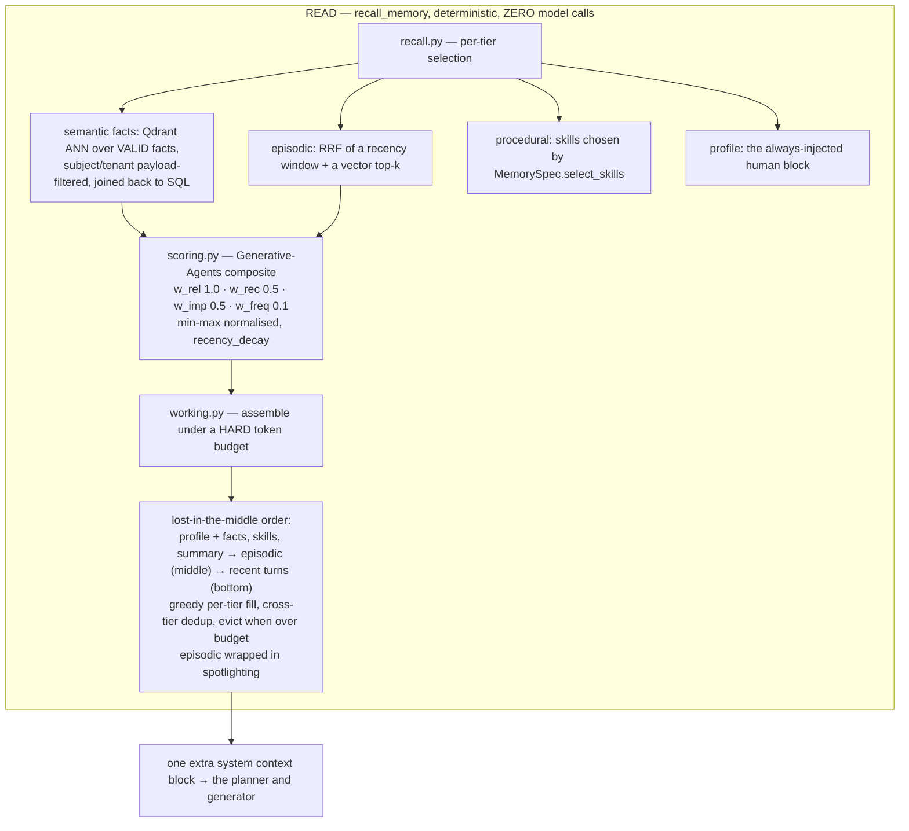
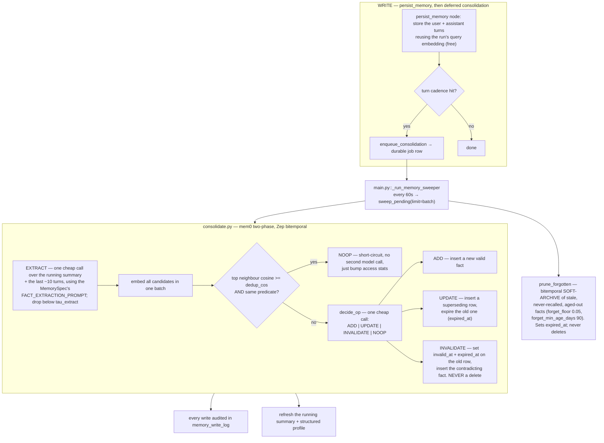

# 40 · The pipelines

**What you'll learn:** exactly what happens, in order, when someone asks Aegis a
question — the guardrails, the router, retrieval, the ML signal, planning, the risk gate,
tool execution, self-repair, generation, streaming and tracing. Then the two flows that
branch off it: the human-approval gate and the long-term memory write path. Finally the
LLM-Ops loop that feeds improvements back in.

This is the most important page in the set. Every node, event and decision below is
traceable to a real function.

**The map of the code:**

| Concern | File |
|---|---|
| The graph and every node body | `aegis/src/aegis/agent/graph.py` |
| The driver, stamping and approval rendezvous | `aegis/src/aegis/agent/orchestrator.py` |
| The supervisor router | `aegis/src/aegis/agent/router.py` |
| The dependency seam (what nodes call) | `backend/src/app/agent/deps.py` → `aegis/src/aegis/agent/deps.py` |
| Event builders | `aegis/src/aegis/agent/events.py` |
| The wire contract | `backend/src/app/api/schemas.py` (`StreamEvent`) |
| The HTTP entry point | `backend/src/app/api/routes.py::query` |

---

## 1. The graph

The agent is an explicit LangGraph **state machine**, not a free-running loop. Every step
is a named node, so every step is inspectable, timed, traced, and bounded. Verified
against `build_agent()` in `aegis/src/aegis/agent/graph.py`:



Five wiring facts that carry real weight:

1. **A blocked input short-circuits to `END`.** The router never even runs on a blocked
   run, so the blocked trace is minimal and unambiguous.
2. **`recall_memory` and `persist_memory` are wired *plain*, not through `_timed`.** A
   `_timed` wrapper emits `node_started`/`node_finished` even for a no-op. Wired plain,
   an inactive memory node returns `{}` and emits *nothing*, so a memory-inactive run's
   event stream is byte-for-byte identical to one from before memory existed.
3. **The loop always terminates.** `plan` increments `plan_iterations`; `reflect` can
   only ever *reduce* the remaining budget against `config.max_plan_iterations`
   (default 2).
4. **The human gate fires on tool risk only** (`config.gate_min_risk`, default `HIGH`).
   ML is surfaced in the same node as informational evidence with no routing semantics.
5. **The memory specialist finalises through the same tail** — `answer_memory` joins at
   `guard_output`, so its answer is still guarded, still streamed, and still persisted.

---

## 2. A query, end to end



### Step by step

**1 · The HTTP edge** — `routes.py::query`. `require_auth` decodes the JWT;
`_resolve_persona(req.persona, auth)` enforces role scope on the requested persona;
`memory_subject_for(auth.user_id, persona)` resolves the memory isolation key;
`_resolve_governance(auth)` loads the tenant's effective budget caps. A `query.start`
audit row is written. The response is an `EventSourceResponse`; the governance context is
bound **inside** the streaming generator (and reset in its `finally`) so every model call
the run makes is budget-checked against this tenant.

**2 · `run_agent` starts.** It mints a `run_id` (which is also the LangGraph
`thread_id`), opens the root OTel span `agent.run` marked `AGENT` so Phoenix nests
everything beneath it, and emits `run_started` carrying the trace id. It then drives
`graph.astream(stream_input, config, stream_mode=["custom","updates"])` — `custom` carries
the node event payloads, `updates` is watched for a LangGraph `__interrupt__`.

**3 · `guard_input`** — `deps.check_input(query)` runs the rail stack: schema checks, PII
detection and redaction, then injection screening — a deterministic signature backstop
first, then a cheap-model classifier that **fails closed** (any classifier error is
treated as an injection). Emits one `guardrail` event at stage `INPUT`. A `BLOCK` verdict
sets `blocked`, the answer becomes the block reason, and the graph routes straight to
`END`; the run finishes with status `BLOCKED`.

**4 · `route`** — the supervisor. `route_query` resolves the adapter roster defensively
(falling back to a `qa`-only roster), classifies the intent **deterministically** by
keyword hints, and escalates to a cheap-LLM tiebreak *only* on a genuine tie between two
named specialists. It writes `agent_role` and `route_reason` to state, emits one
`routing` event, stamps the span with `ROUTER_ROLE`/`ROUTER_REASON`/`ROUTER_USED_LLM`,
opens a nested **A2A handoff span** (`A2A_FROM=supervisor`, `A2A_TO=<role>`,
`A2A_REASON`, `A2A_PROTOCOL=a2a`), and records a best-effort audit row.

> **Honest note:** the shipped roster has one named specialist (`memory`) besides the
> `qa` default, so the tiebreak has nothing to disambiguate and never fires in practice.
> Routing is deterministic `qa` vs `memory` today.

If the role is `memory`, `answer_memory` answers directly from long-term memory — no RAG,
no ML, no planning, no tools — and jumps to `guard_output`.

**5 · `recall_memory`** — inert unless `deps.memory` is wired **and** a `session_id` is
present **and** a subject resolved. When active, `deps.memory.assemble(...)` builds the
working-memory block and emits one `memory` event with the recalled fact count, message
count and token usage. A store failure is caught and degrades to no recall. See §4.

**6 · `retrieve`** — three configurations, selected by settings:



Inside each `deps.retrieve` call, the real hybrid pipeline runs: exact cache → semantic
cache → wide recall on three arms (Qdrant vector search, Neo4j/LightRAG graph traversal,
hand-rolled BM25) → **Reciprocal Rank Fusion** → LLM re-rank → **spotlighting** (the
retrieved text is delimited and datamarked as untrusted reference material, not
instructions) → assemble → cache write-back.

Both the rewrite and the sufficiency judge degrade honestly: a rewrite failure collapses
to `changed=False`, and without a judge the loop falls back to "non-empty context means
sufficient." Their model spend is **accrued into the run's telemetry** via `_accrue`, so
there is no hidden cost. The node stamps its RETRIEVER span with the rewritten query, the
candidate count *before* rerank, the final source count, the cache-hit flag, the round
count and whether a rewrite happened — and surfaces the rewrite and any extra rounds as
`reasoning` events so the glass box shows them.

**7 · `ml_predict`** — best-effort and purely additive. `deps.features_for(query,
persona)` asks the adapter to resolve a subject record; if there is one,
`deps.predict_explain(features)` returns a point prediction, a **conformal interval** with
its guaranteed coverage level, and signed per-feature **SHAP** drivers. Both the raw
response and a domain-framed summary go into state for the planner and the final answer.
No subject, no model, or any exception → the run continues with zero ML. **It can never
block, defer or terminate a run.**

**8 · `plan`** — first, on a `qa` turn, it consults the **answer-level semantic cache**:



The cache **scope key is `tenant:persona:agent_role`**. That partitioning is a
correctness and isolation requirement, not an optimisation: a cached answer can never be
served across a tenant, persona or specialist boundary. The lookup is deliberately
skipped on a self-repair re-plan (a retry means the first answer was insufficient) and
whenever there is no real query embedding. A cache read failure is logged and planning
proceeds normally.

On a re-plan the previous round's failed outcomes are fed back into the user message
("A previous action attempt did not fully achieve the goal…") — Reflexion-style
reflection input.

**9 · `gate`** — computes `deps.tool_risk(name)` for every proposed call, takes the
maximum, and sets `gated = any(risk >= config.gate_min_risk)`. An unregistered tool name
resolves to `HIGH` — **fail-safe by default**. If an ML response exists it emits one
`ml_explanation` event, explicitly carrying no gating semantics.

**10 · `approval`** — covered in §3.

**11 · `act`** — executes each approved (or within-ceiling) call through
`deps.run_tool`, which re-checks the per-persona allowlist before any side effect, writes
an audit row, and opens a `TOOL` span. Emits `tool_call` then `tool_result` per call.

**12 · `reflect`** — the bounded self-repair decision, and it is deliberately
domain-agnostic: the goal is met when *every* `ToolOutcome` in the latest round has
`ok == True`. It never inspects domain semantics.



Every branch emits a `reflection` event carrying `iteration`, `max_iterations`, `done`,
`will_retry` and a human-readable `reason`, so the console can show *why* the agent
stopped or retried.

**13 · `generate`** — composes the final answer from context, tool outcomes and the ML
summary. Skipped entirely if the planner already answered with no tools. If the gate
rejected the action, the prompt explicitly says so ("The proposed action was NOT approved
by the human gate") rather than pretending it succeeded.

**14 · `guard_output`** — runs the output rail over the full answer, **grounding it
against the same retrieved context it was generated from** (`state["context"]`, not a
re-fetch; empty context makes the grounding rail a no-op PASS that emits an advisory
`flag`). `BLOCK` withholds the answer and replaces it with a placeholder; `REDACT` masks
it. Then, if the answer is clean, freshly generated (not itself a cache hit), tool-free,
ungated, and has a real query embedding, it is **written into the answer cache** under the
same scope key. A blocked answer is never cached, and a cache-write failure never breaks
the run.

**15 · `stream`** — emits the guarded answer as `token` events chunked by
`config.stream_chunk_words` words (default 4), and sets `status = COMPLETED`.

**16 · `persist_memory`** — see §4. Silent when inactive.

**17 · Terminal events.** The orchestrator reads final state and emits `run_finished`
with prompt tokens, completion tokens, cost and the cache-hit flag. It then folds the
run's real measured per-node timings into the in-process latency window and fires the
`on_terminal` hook. Two failure modes get their own clean terminal path:
`BudgetExceededError` becomes a `budget_exceeded` event plus `run_finished(BLOCKED)`; any
other exception becomes an `error` event plus `run_finished(ERROR)`. Nothing crashes the
socket.

**18 · Post-run trace-eval.** `on_terminal` schedules a background task that grades the
answer and each trajectory step, writing `EvalResult` rows. Best-effort, gated on stores,
never delaying the stream. See §5.

### Cross-cutting on every step

- **The gateway.** Every `deps.complete` / `deps.embed` routes by `ModelRole`, checks the
  tenant budget *before* spend, caps `max_tokens` and timeout, retries down a fallback
  chain, and writes a usage-ledger row.
- **Tracing.** `_timed(node, label, kind)` wraps each node body: it times the wall clock,
  emits `node_started`/`node_finished`, and opens one OpenTelemetry span of the right
  OpenInference kind (`GUARDRAIL`, `RETRIEVER`, `CHAIN`, `TOOL`, `AGENT`) nested under the
  root `agent.run` span.
- **Stamping.** Every payload is stamped with the `run_id` and a monotonic `seq` and
  validated against `StreamEvent` before it goes on the wire.

---

## 3. The human-approval (HITL) gate

This is the flow that makes autonomy safe, and it is engineered to survive a process
restart.

```mermaid
sequenceDiagram
    autonumber
    participant G as approval node
    participant ORC as orchestrator
    participant REG as ApprovalRegistry<br/>(in-process rendezvous)
    participant DB as approvals table<br/>(durable)
    participant PARK as ParkedRunRegistry
    participant H as Human (admin)

    G->>G: interrupt({action, args, risk, rationale})
    Note over G: the graph pauses on the checkpointer;<br/>the node emits nothing — it re-executes on resume
    G-->>ORC: LangGraph __interrupt__ arrives on the "updates" stream
    ORC->>REG: register(approval_id)  ← BEFORE emitting, so a fast decision cannot race
    ORC->>DB: enqueue_approval(...) → PENDING row + SLA deadline + ML snapshot
    ORC->>PARK: register(run_id, graph, config)
    ORC-->>H: approval_queued (sla_deadline, assignee_tier)
    ORC-->>H: approval_required
    ORC->>REG: await wait(approval_id, timeout=approval_park_timeout)

    alt Human decides while the socket is open
        H->>DB: POST /approval or POST /approvals/{id}/decision
        Note over DB: optimistic PENDING → RESUMING / REJECTED
        DB->>REG: resolve → the awaiting future wakes
        ORC->>G: Command(resume={approved, approver})
        G->>G: approval node returns; route to act or generate
    else Socket times out
        ORC-->>H: run_finished(AWAITING_APPROVAL)
        Note over ORC: the run is NOT lost — it survives as a PENDING row + a checkpoint
        H->>DB: POST /approvals/{id}/decision, later
        DB->>PARK: resume_parked_run continues from the checkpoint
    else SLA expires with no decision
        Note over DB: run_sla_sweeper auto-rejects a past-deadline HIGH-risk gate
    end
```

The properties that matter:

- **Exactly-once execution.** The `PENDING → RESUMING` transition in
  `data/approvals.py::resolve_approval` is an optimistic lock. A replayed or duplicate
  decision returns `accepted=False` and never double-resumes, so the tool runs exactly
  once even across a restart or a different worker.
- **Durability.** The `approvals` row is the source of truth, not the open socket. With
  `AGENT_CHECKPOINTER=postgres` the graph checkpoint is durable too, and
  `data/session.py::get_agent_checkpointer()` hands every compiled graph in the process
  the *same* checkpointer, so a run parked on one can resume by `thread_id` from another.
- **One decision path, two doors.** The live socket (`POST /approval`) and the async inbox
  (`POST /approvals/{id}/decision`) both call `decide_approval`. Both are admin-only, and
  a tenant-admin may only decide on their own tenant's gates.
- **The gate reason is tool risk, always.** `adapter/tools.py` declares
  `add_case_note` = LOW, `assign_request` = MEDIUM, `update_request_status` = HIGH. Mark a
  new tool `HIGH` and it is gated — no engine change needed.
- **MCP clients propose, never approve.** The MCP server lists HIGH-risk tools but
  refuses to execute them, returning "requires human approval" with no side effect.

---

## 4. Long-term memory: read, write, consolidate

Retrieval answers "what is true about the world." Memory answers "what do we know about
*this subject*, across conversations."



**Recall is not read-only.** Every surfaced fact and turn gets `access_count + 1` and a
fresh `last_access_at`, which feeds the live frequency term in the composite. Frequency is
real, not an inert field.

**Isolation is application-level first.** Every query filters `subject_id` (plus
`tenant_id` when given) in its `WHERE` clause — NULL-safe and dialect-independent.
Postgres RLS is an additive belt, never the thing relied upon.



**Bitemporal** means each fact carries two independent time axes: *valid time*
(`valid_at` / `invalid_at` — when the fact was true in the world) and *transaction time*
(`created_at` / `expired_at` — when the system believed it), plus `supersedes_id`. A
contradicted fact is invalidated, never removed, so you keep an auditable belief history
and can ask "what did the system believe last Tuesday?"

Re-asserting a previously invalidated fact falls out naturally as an `ADD`: the
valid-only neighbour scan never surfaces the dead row, so it becomes a brand-new valid
fact rather than a resurrection.

The whole write path is deferred and cheap-model-only, and is driven by injected
`complete` / `embed` / `spec` callables, so it is fully testable offline with scripted
fakes.

---

## 5. The LLM-Ops loop — how the system improves itself

Everything above is one run. This is the loop that makes the *next* run better. It runs
entirely off the hot path.

```mermaid
flowchart LR
    RUN["Every finished run"] -->|"on_terminal, background task"| TE["trace_eval.evaluate_run<br/>grade the answer AND each step<br/>(RETRIEVER · TOOL · GUARDRAIL · CHAIN)<br/>→ one EvalResult row per facet"]
    TE --> DG["diagnose.diagnose<br/>cluster recent FAILING evals for a prompt_key<br/>→ ask a reasoning model for a better prompt<br/>→ DRAFT only, never live"]
    DG --> RL["release.release"]
    RL --> G1["1 · Eval gate, always on<br/>the draft must beat the baseline by margin<br/>on the injected eval_fn"]
    G1 -->|fails| REJ["rejected + archived"]
    G1 -->|passes| G2["2 · classify_change<br/>deterministic low | medium | high<br/>from diff size + safety/tool/model terms"]
    G2 -->|low| PROMO["auto-promote"]
    G2 -->|"medium or high"| STAGE["stage to the durable approval inbox<br/>→ POST /ops/releases/&#123;id&#125;/decide — ADMIN ONLY"]
    PROMO --> REG["registry — versioned prompt store<br/>draft | staged | active | archived"]
    STAGE --> REG
    REG -->|"get_cached_active, synchronous"| HARN["the harness reads the ACTIVE prompt<br/>on the next run's plan/generate"]
    HARN --> RUN
```



Why this closes: `deps.render_system_prompt(persona, extra_context)` prefers the LLM-Ops
active prompt from `registry.get_cached_active` — the same cache `main.py`'s lifespan
warms at startup — with the **adapter's prompt as an inviolable floor**. An approved
improvement is used by the very next run, and `registry.rollback` reverses it in one
call.

The pieces are honest about their limits: `trace_eval` is best-effort and never raises
into the caller; with no `complete` injected it degrades to deterministic lexical
proxies and touches no model; `diagnose` only ever writes drafts; and `release` is the
single code path by which anything goes live.

`gate.py` supplies the live seams `release` is injected with. `make_eval_fn(complete)` is
a genuinely **prompt-dependent** scorer: it retrieves real context, generates *under the
candidate prompt*, and judges the result — so a prompt change actually moves the score.

---

## 6. Reading the trace

Because every node opens a span under `agent.run` and every node emits stream events,
one run is legible in two places at once:

| Surface | Shows |
|---|---|
| **Arize Phoenix** (`observability/*`) | The nested span tree: agent → route handoff → retriever → guardrails → tools → each `gen_ai.*` LLM and embedding call, with usage and timing |
| **The console** (`web/`) | The same run live: reasoning lane, orchestration map, retrieval funnel, rerank scoreboard, conformal + SHAP panels, guardrail reveal, approval spotlight, answer panel |
| **`GET /audit`** | The durable record: one row per state-changing action, with trace links |
| **`eval_results`** | The post-run grades that feed Diagnose |

Next: [`50-run-and-extend.md`](50-run-and-extend.md) — how to run all of this, and how to
point it at your own problem.
