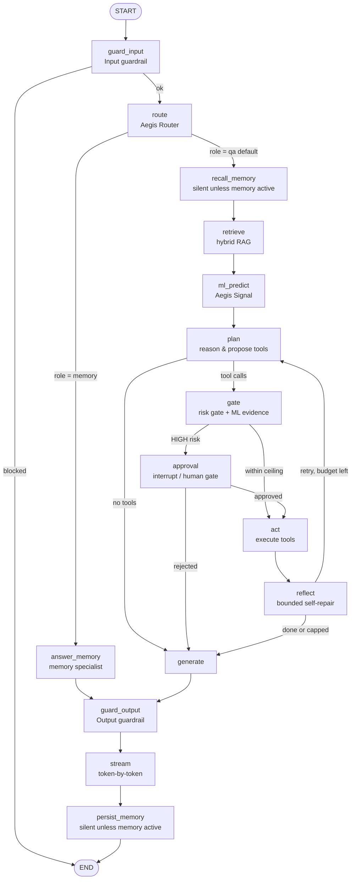
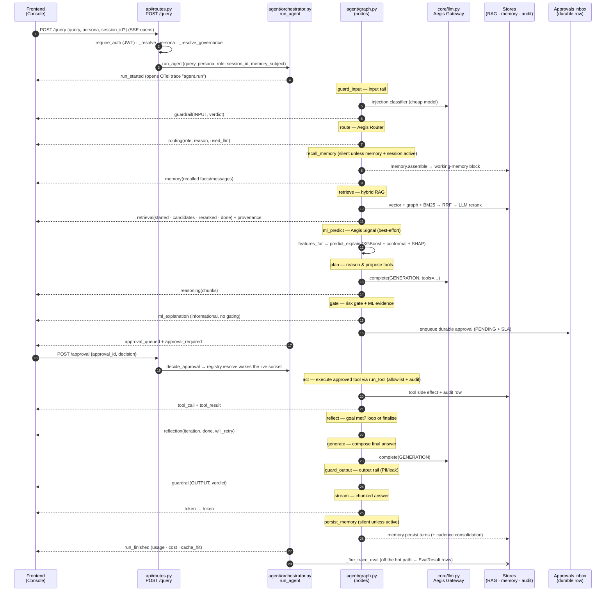

# 40 · One request, end to end

This traces a single `/query` from the browser to the streamed answer and the post-run
grade. Every step names the real node/file/event. The agent is a LangGraph state machine
(`backend/src/app/agent/graph.py`); the orchestrator
(`backend/src/app/agent/orchestrator.py`) drives it and stamps each event.

## The graph (node order, verified against `agent/graph.py`)

Key wiring facts (all from `graph.py`):

- A **blocked input** short-circuits straight to `END` — the router never runs on a
  blocked run.
- `route` dispatches to `answer_memory` **only** when the role is `memory`; every other
  role (the `qa` default) falls through to the normal pipeline via `recall_memory`.
- `recall_memory` and `persist_memory` are wired **plain** (not timed). When memory is
  inactive they return `{}` and emit *nothing*, so a single-shot run's event stream is
  byte-for-byte unchanged.
- `plan` increments a counter; `reflect` can only ever *reduce* the remaining budget
  (`config.max_plan_iterations`, default 2), so the plan→act→reflect loop is guaranteed
  to terminate.
- The human gate fires on **tool risk only** (`config.gate_min_risk`, default `HIGH`).
  ML is never a gate — it is surfaced as informational evidence in the `gate` node.

## The sequence (a `qa` turn that proposes a HIGH-risk action)

## Step-by-step, mapped to real code

Each numbered step names its file, node, and the wire event(s) it produces. Event
builders live in `backend/src/app/agent/events.py`; the wire union is
`StreamEvent` in `backend/src/app/api/schemas.py`.

1. **Frontend opens the stream.** `POST /query` with `{query, persona, session_id?}`.
   The server returns an `EventSourceResponse` (SSE). — `routes.py::query`.
2. **Auth + scoping.** `require_auth` decodes the JWT; `_resolve_persona` enforces role
   scope; `memory_subject_for(user_id, persona)` resolves the memory isolation key;
   `_resolve_governance` loads the tenant's effective budget caps. The governance context
   is bound for the streaming task so the gateway can enforce budgets. — `routes.py`.
3. **Run starts.** `run_agent` mints a `run_id` (the LangGraph `thread_id`), opens the
   root OTel span `agent.run`, and emits **`run_started`** carrying the trace id. —
   `orchestrator.py`.
4. **`guard_input`** (Aegis Guardrails): `deps.check_input` runs a deterministic
   injection-regex backstop then a cheap-model classifier; also PII/schema/content. Emits
   **`guardrail`** (stage `INPUT`). A `BLOCK` verdict sets `blocked` and routes to `END`
   (streamed as the guardrail event, then `run_finished` with status `BLOCKED`). —
   `graph.py::guard_input`.
5. **`route`** (Aegis Router): `route_query` classifies the intent **deterministically**
   by keyword (a cheap-LLM tiebreak only on a genuine tie between two named specialists).
   Emits **`routing`**; writes a best-effort audit row. The shipped roster has one named
   specialist (`memory`), so live routing is deterministic `qa` vs `memory`. —
   `graph.py::route`, `agent/router.py`.
   - If role `== memory` → **`answer_memory`** answers straight from long-term memory
     (skips RAG, ML, plan, gate, tools) and jumps to `guard_output`.
6. **`recall_memory`** (Aegis Memory): if memory + a `session_id` + a subject are present,
   `deps.memory.assemble` builds the working-memory block (profile + top facts + skills +
   summary + recent turns, under a token budget) and emits **`memory`**. Otherwise it
   emits nothing. — `graph.py::recall_memory`, `agent/deps.py::MemoryDeps`.
7. **`retrieve`** (Aegis Retrieval): `deps.retrieve` runs hybrid RAG (vector + graph +
   BM25 → Reciprocal Rank Fusion → LLM rerank), spotlights the context (untrusted, marked
   reference-only), and returns sources + a graph delta. Emits **`retrieval`** (`started`
   → `candidates` → `reranked` → `done`) and **`provenance`**. — `graph.py::retrieve`.
8. **`ml_predict`** (Aegis Signal): best-effort. `deps.features_for(query, persona)`
   resolves a subject record; if found, `deps.predict_explain` returns a calibrated
   prediction + conformal interval + SHAP drivers, stored for the planner and answer. No
   subject → the run continues with zero ML. Never blocks. — `graph.py::ml_predict`.
9. **`plan`**: `deps.complete(GENERATION, messages, tools=…)` reasons over context +
   working memory + the ML summary and either proposes tool calls or answers directly. On
   a re-plan it feeds back the previous failed outcome. Emits **`reasoning`** chunks;
   increments `plan_iterations`. — `graph.py::plan`.
10. **`gate`**: computes the top proposed-tool risk. Gates when any call is at or above
    `config.gate_min_risk` (`HIGH`). Emits **`ml_explanation`** (informational only). Sets
    `gated`. If no tool calls, `plan` routed straight to `generate`. — `graph.py::gate`.
11. **`approval`** (only when gated): calls LangGraph `interrupt(...)`, pausing the run on
    the checkpointer. The orchestrator registers the gate in the `ApprovalRegistry`
    *before* awaiting, persists a durable **PENDING** inbox row with an SLA deadline, and
    emits **`approval_queued`** + **`approval_required`**. A human resolves via `POST
    /approval` (live socket) or `POST /approvals/{id}/decision` (async inbox); both share
    `decide_approval`. On approve the graph resumes with `Command(resume=…)`; the tool
    runs **exactly once** (an optimistic `PENDING → RESUMING` lock guarantees it, even
    across a restart / different worker). If the socket times out, the run **parks** as a
    durable row + checkpoint and finishes later. — `orchestrator.py`, `agent/approvals.py`.
12. **`act`**: executes each approved (or low-risk) tool via `deps.run_tool` (allowlist
    check + audit row + a TOOL span). Emits **`tool_call`** then **`tool_result`**. —
    `graph.py::act`.
13. **`reflect`** (bounded self-repair, Reflexion-style): goal is met when every action
    succeeded. If an action failed/was insufficient **and** budget remains, it loops back
    to `plan`; else it proceeds to `generate`. Emits **`reflection`**. — `graph.py::reflect`.
14. **`generate`**: composes the final answer from context + tool outcomes + the ML
    summary. (Skipped if the planner already answered with no tools.) — `graph.py::generate`.
15. **`guard_output`** (Aegis Guardrails): output rail scans the full answer for PII/leaks;
    `BLOCK` withholds it, `REDACT` masks it. Emits **`guardrail`** (stage `OUTPUT`). —
    `graph.py::guard_output`.
16. **`stream`**: emits the guarded answer as **`token`** events, chunked by
    `config.stream_chunk_words` words. — `graph.py::stream_answer`.
17. **`persist_memory`** (silent unless active): writes the user + assistant turns; every
    `consolidation_every_n` turns it enqueues a durable consolidation job and fires
    background consolidation (episodic → semantic facts). — `graph.py`, `deps.py::persist`.
18. **`run_finished`**: terminal event carrying total prompt/completion tokens, cost, and
    cache-hit. The orchestrator drops the resumable handle. — `orchestrator.py`.
19. **Post-run trace-eval** (Aegis Loop, off the hot path): `_fire_trace_eval` schedules a
    tracked background task that grades the run and each step (retrieval/tool/guardrail),
    writing `EvalResult` rows via `app.ops.trace_eval.evaluate_run`. Best-effort; gated on
    `stores_enabled`; never delays the stream. These rows feed **Diagnose** later
    (`20-backend.md` §Aegis Loop). — `orchestrator.py::_fire_trace_eval`.

## Cross-cutting during every step

- **Aegis Gateway** (`core/llm.py`): every `deps.complete`/`embed` call routes by
  `ModelRole`, checks the tenant budget **before** spend (fails closed on a DB blip),
  caps `max_tokens` + `timeout`, retries via a fallback chain, and writes a usage-ledger
  row. A tripped cap raises `BudgetExceededError`, which the orchestrator turns into a
  terminal **`budget_exceeded`** event.
- **Aegis Trace** (`observability/*`): the `_timed` wrapper opens one OTel span per node
  under the root `agent.run` span; retrieval/guardrail/tool/LLM spans nest beneath, so
  Phoenix shows the run as a tree.
- **Every event** is stamped with the `run_id` and a monotonic `seq` by
  `events.stamp`, then validated against `StreamEvent` before it hits the wire.

## Where the frontend renders each event

The console consumes this same stream. See `30-frontend.md` for the surface details —
`run_started`/`node_*`/`reasoning` drive the live reasoning lane, `retrieval` feeds the
knowledge-graph and rerank views, `ml_explanation` drives the conformal + SHAP panels,
`approval_required` raises the approval spotlight, and `token`/`run_finished` complete the
answer panel.
