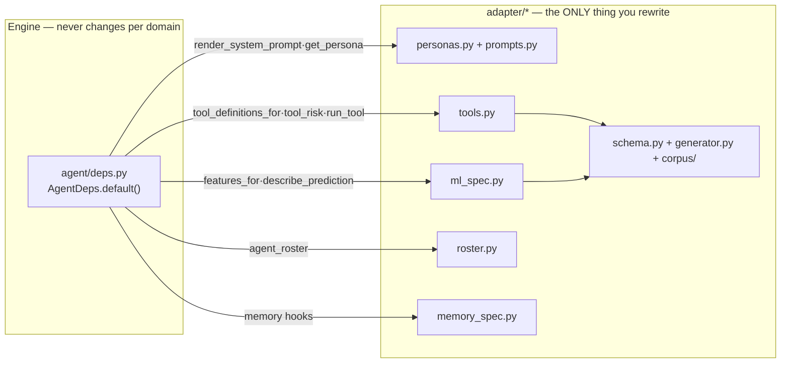

# 50 · Extend Aegis for your domain

This is the reusability story. Aegis's engine (`backend/src/app/*`) is **domain-agnostic**:
it knows nothing about any particular business problem. All domain meaning lives in one
folder — `backend/src/app/adapter/*`. To point Aegis at a new problem, you rewrite the
adapter and **leave the engine untouched**.

## The contract: one seam, `agent/deps.py`

The engine reaches the domain **only** through the hooks bound in `AgentDeps.default()`
(`backend/src/app/agent/deps.py`). Each hook is a small `_default_*` wrapper that lazily
imports a function from `app.adapter`. That table *is* the adapter contract:

| Engine hook (`AgentDeps` field) | Adapter function it calls | Lives in |
|---|---|---|
| `tool_definitions_for(persona)` | `tool_definitions_for(persona)` | `adapter/tools.py` |
| `tool_risk(name)` | reads `TOOL_REGISTRY[name].risk` (**HIGH if unregistered — fail-safe**) | `adapter/tools.py` |
| `run_tool(persona, name, args, …)` | `run_tool(persona, name, args, ctx)` | `adapter/tools.py` |
| `render_system_prompt(persona, extra_context)` | `render_system_prompt(get_persona(persona), …)` (prefers an LLM-Ops active prompt) | `adapter/prompts.py` + `personas.py` |
| `features_for(query, persona)` | resolves a subject record, then `features_for_request(subject, …)` | `adapter/ml_spec.py` |
| `describe_prediction(resp)` | `describe_prediction(resp)` | `adapter/ml_spec.py` |
| `agent_roster()` | `agent_roster()` (via `router.load_roster()`) | `adapter/roster.py` |
| memory (`AgentDeps.memory`) | `memory_subject_for`, `FACT_EXTRACTION_PROMPT`, `select_skills`, `render_profile` | `adapter/memory_spec.py` |

The engine hooks that are **not** adapter-backed — `complete`, `retrieve`, `check_input`,
`check_output`, `predict_explain` — stay wired to the core (`core/llm.py`,
`retrieval`, `guardrails`, `ml`). You do not touch them.



## The registry — `adapter/__init__.py`

`adapter/__init__.py` is the *interface* the core imports. It re-exports every name the
engine is allowed to use and declares the domain identity:

```python
DOMAIN_ID = "service_request_management"
DOMAIN_DESCRIPTION = "…customers raise requests, agents resolve them, a KB backs retrieval…"
```

**Keep these export names stable** — the core imports `from app.adapter import
tool_definitions_for, TOOL_REGISTRY, get_persona, features_for_request, describe_prediction,
agent_roster, …`. Swap the *implementations* behind them; keep the *names*. (Exception:
`memory_spec` is imported directly as `app.adapter.memory_spec`, not re-exported.)

`DEFAULT_PERSONA_ID` (currently `"operations_lead"`) and `get_persona(persona_id) → Persona`
are also exported here (defined in `personas.py`).

## The shipped example domain

To make the pieces concrete, the adapter that ships is **customer-support / service-request
case management**: customers raise `ServiceRequest`s, support agents resolve them, and an ML
model predicts a request's `resolution_hours`. Personas are `operations_lead` (admin ops
lead) and `client` (end customer). That is just the current adapter — the engine would run
any domain identically.

## The adapter pieces — what a new team supplies

| # | Piece | File(s) | You supply |
|---|---|---|---|
| 1 | **Schema** | `schema.py` | Your entities as Pydantic models + their categorical enums; `SCHEMA_VERSION` |
| 2 | **Corpus / generator** | `generator.py`, `corpus/*.md` | A synthetic-world generator (`generate_synthetic`, `generate_synthetic_sync`) + hand-written seed KB Markdown (`load_seed_corpus`) |
| 3 | **Tools** | `tools.py` | Your action tools + `TOOL_REGISTRY` (risk tiers) + `ALLOWLIST` (per-persona scope) |
| 4 | **ML spec** | `ml_spec.py` | `FEATURES`, `TARGET`, `latent_*` ground-truth signal, `features_for_request`, `describe_prediction`, `training_frame` |
| 5 | **Personas** | `personas.py`, `prompts.py` | `PERSONAS`, `DEFAULT_PERSONA_ID`, `SYSTEM_PROMPTS`, `render_system_prompt` |
| 6 | **Roster** | `roster.py` | `agent_roster()` — which supervisor specialists exist + their keyword hints |
| (+)| **Memory spec** | `memory_spec.py` | The durable-fact contract: `FACT_TYPES`, `FACT_EXTRACTION_PROMPT`, `memory_subject_for`, `render_profile`, `select_skills` |

### 1 · Schema — `schema.py`

The shape of your world. Supply `StrEnum`s for your categorical vocabularies and Pydantic
v2 record models for your entities (the shipped ones: `Customer`, `SupportAgent`,
`ServiceRequest`, `Document`, `SyntheticDataset`, …), plus helpers like
`SyntheticDataset.labelled_requests()`. The core never imports these directly — they
underpin the other pieces.

### 2 · Corpus / generator — `generator.py`, `corpus/`

`generator.py` fabricates a synthetic world so the demo runs with no real data:
`generate_synthetic(config, complete=…)` (LLM-fabricated text) and
`generate_synthetic_sync(config)` (deterministic, no LLM — safe inside the running event
loop; this is what seeds the process record store and the ML training frame). It calls
`ml_spec.latent_resolution_hours(...)` so labels are a real function of features (that
coupling is what makes the ML target *learnable*). `corpus/__init__.py::load_seed_corpus()`
reads the hand-written `*.md` KB files that retrieval ingests.

### 3 · Tools — `tools.py`

The typed, audited, per-persona-authorized actions the agent may take.

- One `async def <tool>(args: dict, ctx: ToolContext) → ToolActionResult` handler per tool.
- `TOOL_REGISTRY: dict[str, ToolSpec]` — each `ToolSpec` has a `name`, `description`,
  `args_model`, `handler`, and a **`risk: RiskLevel`**. Shipped example:
  `add_case_note`=LOW, `assign_request`=MEDIUM, `update_request_status`=HIGH.
- `ALLOWLIST: dict[str, frozenset[str]]` — the single source of truth for which persona may
  call which tool (e.g. `operations_lead` → all; `client` → `{add_case_note}`).

The **risk tier drives the human gate**: any tool at or above `AgentConfig.gate_min_risk`
(default `HIGH`) pauses for human approval. So the moment you mark a tool `HIGH`, it is
gated — no engine change needed.

### 4 · ML spec — `ml_spec.py`

The contract the ML spine trains and predicts against: `FEATURES: list[FeatureSpec]`
(name/dtype/levels), `TARGET: TargetSpec` (name/task/unit — e.g. `resolution_hours`,
regression, hours), `latent_*` (the monotone ground-truth signal the generator samples
around), `features_for_request(request, agent, customer) → dict`, `describe_prediction(resp)
→ str` (renders prediction + interval + top SHAP drivers as prompt text), and
`training_frame(...) → pd.DataFrame` (the offline trainer's data source). Train with
`python -m app.ml` (see `60-run-and-operate.md`).

### 5 · Personas — `personas.py`, `prompts.py`

`personas.py` declares each `Persona` (`id`, `role`, `data_scope`, `prompt_key`;
`tool_names` reads the `ALLOWLIST`), the `PERSONAS` dict, `DEFAULT_PERSONA_ID`, and
`get_persona`. `prompts.py` holds `SYSTEM_PROMPTS` (keyed by persona) and
`render_system_prompt(persona, extra_context)`, which folds in the persona's data scope and
its tool allowlist.

### 6 · Roster — `roster.py`

`agent_roster() → AgentRoster` declares the supervisor's routable specialists as
`RosterSpecialist(role, description, keywords, is_default)`. Shipped: `qa` (default — the
full pipeline) and `memory` (answers "what do you know about me" directly). Add a specialist
here and the router can hand turns to it. *(Note: with one named specialist, the router's
cheap-LLM tiebreak never fires live — routing is deterministic `qa` vs `memory`; see
`docs/AUDIT_ROUND2.md`. Add a second named specialist to exercise the tiebreak.)*

### (+) Memory spec — `memory_spec.py`

The one domain seam for long-term memory: `FACT_TYPES` (what counts as a durable fact),
`FACT_EXTRACTION_PROMPT` + `IMPORTANCE_HINTS` (how facts are extracted),
`memory_subject_for(user_id, persona) → "user:<id>"` (the per-user isolation key),
`render_profile(profile) → str`, and `select_skills(query, persona, available)` (keyword →
procedural skill markdown). Consumed inside `app.memory.*`.

## What a new team must NOT touch (the core)

Leave everything outside `adapter/*` alone — the engine reaches the domain only through the
`deps.py` seam above:

- `app.agent` (graph, orchestrator, router, deps, events, approvals) — the Harness.
- `app.core` (llm/gateway, models, governance, security).
- `app.retrieval`, `app.memory`, `app.ml`, `app.guardrails` — the capabilities.
- `app.ops`, `app.eval`, `app.observability`, `app.data`, `app.mcp`, `app.api` — the loop,
  evals, tracing, persistence, MCP facade, and HTTP surface.

If you find yourself editing any of these to add a business rule, that rule belongs in the
adapter instead — that is the whole design.

## "Hello, new domain" checklist

1. **Fork the schema** — replace `schema.py` entities + enums with yours; bump `SCHEMA_VERSION`.
2. **Write a generator** — `generator.py` `generate_synthetic_sync` producing schema-valid
   records with a real label; drop your seed KB into `corpus/*.md`.
3. **Define tools** — `tools.py`: your handlers, `TOOL_REGISTRY` (set risk tiers — mark
   consequential writes `HIGH`), `ALLOWLIST` per persona.
4. **Specify the ML** — `ml_spec.py`: `FEATURES`, `TARGET`, `latent_*`,
   `features_for_request`, `describe_prediction`, `training_frame`. Run `python -m app.ml`.
5. **Declare personas + prompts** — `personas.py` (`PERSONAS`, `DEFAULT_PERSONA_ID`) and
   `prompts.py` (`SYSTEM_PROMPTS`, `render_system_prompt`).
6. **Set the roster** — `roster.py` `agent_roster()`; and `memory_spec.py` (fact contract +
   `memory_subject_for`).
7. **Keep the export names in `adapter/__init__.py` stable** so the core resolves your new
   implementations unchanged.
8. **Verify** — `python -m pytest tests -q` and `ruff check src tests` stay green; the
   engine, being unchanged, needs no new tests beyond your adapter's.

That's the entire reuse surface. The engine, tracing, governance, guardrails, memory
machinery, and the self-improvement loop all come for free.
