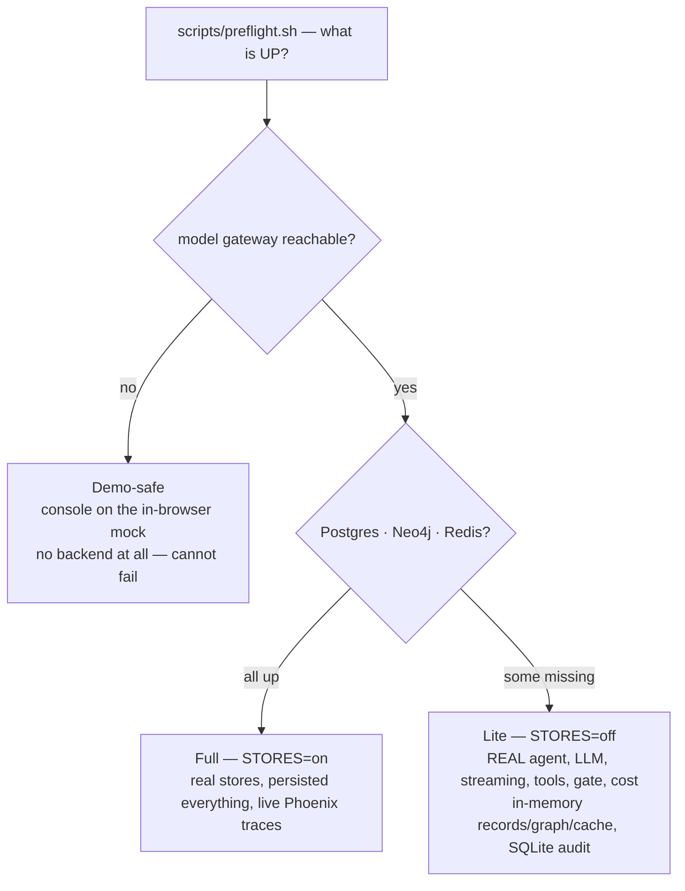
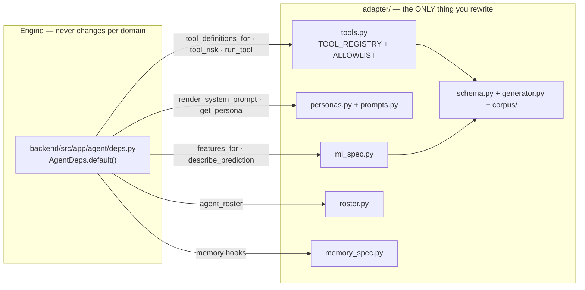

# 50 · Run it, and extend it

**What you'll learn:** what you need installed, the fastest path to a running system,
how to verify it actually works, the environment variables that change behaviour, and
how to point Aegis at a completely different problem domain.

The long-form install manual is [`../../INSTALL.md`](../../INSTALL.md); the one-page
day-of guide is [`../operations/runbook.md`](../operations/runbook.md). This page is the
orientation that ties them together.

---

## 1. Prerequisites

| Tool | Version | Needed for |
|---|---|---|
| **Python** | ≥ 3.11 | the backend |
| **uv** | latest | Python environment and installs |
| **Node.js** | ≥ 18.18 (20+ preferred) | the console |
| **npm** | ships with Node | the console |
| **PostgreSQL** | ≥ 15 | full mode — relational, KV, audit, checkpoints |
| **Neo4j** | 5.x | full mode — the knowledge graph |
| **Redis** | ≥ 7 (Memurai on Windows) | full mode — semantic caches |

Target environment: a **16 GB laptop, no Docker, no GPU**. Every store is a native local
install. Arize Phoenix runs in-process as a pip dependency — nothing to install
separately. The only remote call is the model gateway.

**No vector server is required, and no `pgvector` extension either.** Vector search runs
**embedded** — inside the backend process, against a local directory — so the vector tier
adds nothing to this table. That is a deliberate deployment constraint, not a shortcut:
the target enterprise Windows machine forbids installing extra server binaries.

### Installing the graph store natively (no Docker)

Neo4j ships as an ordinary native package — **Docker is never required, on any
platform.** (The vector store needs no install at all: it arrives as a pip dependency
and runs in-process.)

**Neo4j** — native package on macOS, tarball on Linux (no root needed):

```bash
# macOS
brew install neo4j
neo4j-admin dbms set-initial-password aegisdev1   # must run BEFORE the first start
brew services start neo4j                          # bolt :7687 · http :7474

# Linux
curl -LO https://dist.neo4j.org/neo4j-community-5.26.0-unix.tar.gz
tar xzf neo4j-community-5.26.0-unix.tar.gz && cd neo4j-community-5.26.0
bin/neo4j-admin dbms set-initial-password aegisdev1
bin/neo4j start
```

Neo4j needs a JVM (Java 17+) — check with `java -version`.

**Vector store** — nothing to download. It is embedded: Chroma's `PersistentClient` for
Aegis's own store and LightRAG's file-backed NanoVectorDB for LightRAG's internal
vectors, both installed by `uv sync` as ordinary Python packages. All you provide is a
writable directory.

Then set the matching values in `backend/.env`:

```
NEO4J_URI=bolt://localhost:7687
NEO4J_USER=neo4j
NEO4J_PASSWORD=aegisdev1
VECTOR_STORE_PATH=vector_storage
```

---

## 2. Three run modes

Aegis is designed so a missing database never sinks a demo. Take the highest rung that is
green.



| Rung | Needs | You get |
|---|---|---|
| **Full** (`STORES=on`) | gateway + Postgres + Neo4j + Redis (+ a writable vector dir) | Real RAG over stores, persisted audit / ledger / approvals / checkpoints, live traces |
| **Lite** (`STORES=off`) | **gateway only** | A genuinely real agent — real LLM, streaming, tools, risk gate, token and cost accounting — with in-memory records, graph and cache, and a SQLite audit file |
| **Demo-safe** | nothing | The whole console on the labelled in-browser mock transport |

**Default to Lite.** It removes the largest operational risk (databases not installing)
while staying a *real* demo. The only secret you must set is `GENAILAB_API_KEY`. Lite
installs exactly the same packages as full — the switch is the `STORES` env var, not the
install.

---

## 3. Bring-up

### The fastest path: `scripts/dev-native.sh`

For macOS/Linux against **real native stores, no Docker**, this one script does the
whole backend bring-up:

```bash
./scripts/dev-native.sh
```

It starts Redis if it isn't running, best-effort starts Neo4j (non-blocking — the backend
boots without it, graph retrieval simply degrades), checks Postgres, then launches
uvicorn in the background on `:8000` and polls `/health` until it answers 200. Along the
way it sets three things that matter:

- `PYTHONPATH` gains `aegis/src`, because the importable core is a src-layout sibling
  package.
- `LITELLM_LOCAL_MODEL_COST_MAP=True`, `HF_HUB_OFFLINE=1`, `TRANSFORMERS_OFFLINE=1` — so
  deep imports do not stall on a network-restricted machine.
- It strips the macOS quarantine flag from `.venv` so Gatekeeper does not do a blocking
  network check on every compiled wheel.

Logs go to `/tmp/aegis-backend.log`. When it prints `health : 200`, start the console in
another terminal:

```bash
cd web
NEXT_PUBLIC_API_BASE=http://localhost:8000 NEXT_PUBLIC_HEALTH_PATH=/health npm run dev
```

### The cross-platform scripts

```bash
./scripts/bootstrap.sh      # once: installs the backend (all extras) + web/, writes .env files
./scripts/preflight.sh      # anytime, read-only: prints UP/DOWN for the gateway and each store
./scripts/start.sh lite     # run it. Also: full | safe
```

Windows `.ps1` twins exist for all three (`bootstrap.ps1`, `preflight.ps1`,
`start.ps1 -Mode lite`).

### Manual setup

**Backend**, from `backend/`:

```bash
uv venv && source .venv/bin/activate            # Windows: .venv\Scripts\activate
uv pip install -e ".[data,auth,observability,agent,retrieval,ml,guardrails,mcp,dev]"
cp .env.example .env                            # fill in GENAILAB_API_KEY (+ stores for full)
uvicorn app.main:app --reload --app-dir src     # → http://localhost:8000  (/docs for OpenAPI)
```

That extras list is the complete one — note the **`mcp`** extra, which installs the MCP
SDK (`mcp>=2.0,<3`) that the tool server needs. Leave it out and
`app.mcp.server` will not import, which is the one `capabilities.py` module marked
`optional`. The sibling `aegis` package is pulled in automatically as an editable path
dependency; you do not install it separately.

What each extra buys you:

| Extra | Brings | Without it |
|---|---|---|
| `data` | SQLAlchemy, asyncpg, alembic | no database at all |
| `auth` | pyjwt, argon2-cffi | no JWT login, no RBAC |
| `observability` | OpenTelemetry SDK, Arize Phoenix (pinned `>=14.6,<15`) | no traces |
| `agent` | langgraph, langchain-core, langgraph-checkpoint-postgres | no agent |
| `retrieval` | lightrag-hku, neo4j, redis, chromadb (embedded) | lite retrieval only |
| `ml` | xgboost, scikit-learn, mapie, shap, pandas, numpy | no Aegis Signal |
| `guardrails` | nemoguardrails, `aegis[pii]` (Presidio + spaCy) | programmatic rails with the regex PII engine |
| `mcp` | the MCP SDK | no MCP tool server |
| `dev` | ruff, pytest, pytest-asyncio, aiosqlite, greenlet | no tests or lint |

Presidio's NER needs its spaCy model at runtime — it is not a PyPI dependency:
`python -m spacy download en_core_web_sm`.

**Console**, from `web/`:

```bash
npm install
cp .env.example .env.local
# mock demo:  leave NEXT_PUBLIC_API_BASE empty (the boot probe falls back to mock)
# live:       set NEXT_PUBLIC_API_BASE=http://localhost:8000
npm run dev                                     # → http://localhost:3000
```

### Logging in

Seed the accounts first — there is no fallback login table, so an empty database has
nobody to log in as (it answers 503 and names this command):

```bash
cd backend && PYTHONPATH=src:../aegis/src .venv/bin/python -m app.seed
```

Open <http://localhost:3000>. The seed's five platform-staff principals all use the
password **`demo`** (override with `AEGIS_SEED_PASSWORD` before seeding):

| Username | Role → portal | Persona |
|---|---|---|
| `admin` | `admin` → `/app/admin/dashboard` | `operations_lead` |
| `ai` or `aiteam` | `ai_team` → `/app/ai_team/console` | `operations_lead` |
| `devops` | `devops` → `/app/devops/dashboard` | `operations_lead` |
| `client` | `client` → `/app/client/console` | `client` |

They carry no `tenant_id`, so their runs are ungoverned. The seed's two tenants —
`northwind.*` and `vertex.*`, same password — do carry one, so those logins yield a
tenant-scoped JWT and every run is governed by that tenant's budget and RLS scope. Admins
reassign roles through `POST /admin/users/{id}/role`, which is guarded against demoting
the last platform-admin into a lockout.

### What listens where

| Component | Process | Port | Needed in |
|---|---|---|---|
| Console (Next.js) | `npm run dev` from `web/` | 3000 | all modes |
| Backend (FastAPI) | `uvicorn app.main:app` | 8000 | lite, full |
| PostgreSQL | native install | 5432 | full |
| Neo4j | native install | 7687 (bolt), 7474 (http) | full |
| Redis / Memurai | native install | 6379 | full |
| Arize Phoenix | in-process | 6006 (UI) | full, optional |

---

## 4. Verify it works

**Backend**, from `backend/` with the venv active:

```bash
python -m pytest tests -q      # green suite; the one skip is the opt-in LLM judge
ruff check src tests           # All checks passed!
ruff format --check src
```

The first `pytest` run takes 30–60 s because SHAP/XGBoost trigger a one-time numba JIT
compile. Later runs are a couple of seconds.

The offline **quality gate** runs inside that suite (`tests/eval/test_eval_gate.py`): it
drives the *real* hybrid retrieval path over a frozen seed corpus and **fails** if
context precision, context recall or groundedness regress below threshold. Set
`TAIF_EVAL_LLM_JUDGE=1` to additionally run the reasoning-model judge pass. A second,
DeepEval-pattern regression gate adds per-metric thresholds plus an agentic
tool-selection case that asserts the router still picks the right specialist:

```bash
python -m app.eval.regression        # wired as the pass/fail bar in scripts/preflight.{sh,ps1}
```

**The `aegis` package** has its own suite:

```bash
cd aegis && python -m pytest tests -q
```

Its `test_isolation.py` files are worth knowing about — they assert that importing a
module does *not* drag in the heavyweights, which is what keeps the package genuinely
importable.

**Console**, from `web/`:

```bash
npm run build      # next build, TypeScript strict — expect clean
npm run lint       # ESLint (next/core-web-vitals + next/typescript) — 0 errors
```

There is **no test suite in `web/`.** `next build` and `next lint` are the whole safety
net.

**Train the ML model** (Aegis Signal trains offline on the adapter's real
`training_frame`):

```bash
cd backend && python -m app.ml   # trains TrustworthyModel, persists the artifact, prints a sanity check
```

At runtime `app.ml.get_model()` resolves a process-wide singleton → the persisted
artifact → a freshly trained fallback, so a missing artifact never crashes a run.

**Smoke-test by hand:**

```bash
curl -s localhost:8000/health
TOKEN=$(curl -s -X POST localhost:8000/auth/login \
  -H 'content-type: application/json' \
  -d '{"username":"admin","password":"demo"}' | python -c 'import sys,json;print(json.load(sys.stdin)["token"])')
curl -s localhost:8000/platform/capabilities -H "Authorization: Bearer $TOKEN"
```

The capabilities response is the twelve-module manifest — a quick proof that the branded
names and the real `module_path`s agree.

---

## 5. Environment variables that change behaviour

All backend settings are typed in `backend/src/app/config.py`; nothing else in the
backend reads `os.environ` for configuration.

| Var | Default | Effect |
|---|---|---|
| `GENAILAB_API_KEY` | *(empty)* | **Required** for any real model call |
| `GENAILAB_SSL_VERIFY` | `false` | Keep false — the gateway uses a self-signed cert (a documented, scoped exception) |
| `STORES` | `on` | `on` = real stores; `off` = **lite**, no databases |
| `DB_BOOTSTRAP` | `false` | Create tables on startup, best-effort (run scripts set `true`) |
| `POSTGRES_DSN` / `NEO4J_URI` / `REDIS_URL` | localhost defaults | Store connections |
| `VECTOR_STORE_PATH` | `vector_storage` | Directory for the embedded vector store. In non-dev full mode an unusable directory **fails the boot** by design |
| `AGENT_CHECKPOINTER` | `memory` | `memory` (single-process `InMemorySaver`) or `postgres` (durable `PostgresSaver` → HITL resumable across restart/worker) |
| `APPROVAL_SLA_SECONDS` | `3600` | SLA before the sweeper acts on a pending gate |
| `APPROVAL_DEFAULT_TIER` | `tier-1` | Approver tier stamped on a fresh gate |
| `APPROVAL_SWEEPER_INTERVAL_SECONDS` | `30` | How often the SLA sweeper scans |
| `MEMORY_SWEEPER_INTERVAL_SECONDS` / `_BATCH` | `60` / `10` | Consolidation-queue drain cadence and batch size |
| `GUARDRAILS_ENGINE` | `programmatic` | `programmatic` or `nemo` (executes the Colang policy) |
| `GROUNDING_BLOCK` | `false` | Whether the grounding rail blocks or merely flags |
| `QUERY_REWRITE_ENABLED` | `true` | Context-aware rewrite before retrieval |
| `AGENTIC_RETRIEVAL_ENABLED` / `_MAX_ROUNDS` | `true` / `2` | The bounded Self-RAG loop |
| `ANSWER_CACHE_ENABLED` / `_THRESHOLD` / `_TTL_SECONDS` | `true` / `0.97` / `1800` | Answer-level semantic cache, scoped per tenant+persona+role |
| `LLM_MAX_OUTPUT_TOKENS` | `1024` | Per-generation output cap |
| `LLM_TIMEOUT_SECONDS` | `60` | Per-call timeout, plus an outer `asyncio.wait_for` backstop |
| `BUDGET_FAIL_OPEN` | `false` | Budgets **fail closed** by default: a DB blip during the pre-spend check *denies* the call rather than silently uncapping |
| `JWT_SECRET` | *(dev-insecure default)* | HS256 signing secret — **must be ≥ 32 chars in any non-dev deploy**, or startup fails |
| `JWT_ALGORITHM` / `JWT_EXPIRE_MINUTES` | `HS256` / `720` | Token algorithm and lifetime |
| `APP_ENV` | `dev` | `dev` enables the demo logins and the insecure JWT fallback; anything else locks both down |
| `LOG_LEVEL` | `INFO` | Root log level; unknown values fall back to INFO |
| `PHOENIX_ENABLED` | `true` | Start in-process Phoenix tracing |

Model routing is **role-based**: override any role with `MODEL_<ROLE>` (e.g.
`MODEL_GENERATION=genailab-maas-gpt-4o`), and per-role costs with `COST_<ROLE>_IN` /
`COST_<ROLE>_OUT`. See `backend/src/app/core/models.py`.

Console (`web/.env.local`): `NEXT_PUBLIC_API_BASE` (empty means same-origin),
`NEXT_PUBLIC_HEALTH_PATH` (default `/health`), `NEXT_PUBLIC_USE_MOCK` (default `false`).
`?mock=1` in the URL forces mock per-tab.

---

## 6. Common problems

| Symptom | Fix |
|---|---|
| Gateway DOWN in preflight | Check `GENAILAB_API_KEY` and your network. Until then `start.sh safe` still demos the whole UI |
| Postgres / Neo4j / Redis down | Don't fight it — `start.sh lite` needs none of them |
| Backend won't boot in full mode with a vector-store error | That is deliberate: full stores mode requires a usable `VECTOR_STORE_PATH`. Point it at a writable directory or set `STORES=off`. There is no server to start |
| Backend won't boot at all | Usually a missing venv — re-run `bootstrap` |
| Startup fails on `InsecureConfigurationError` | `APP_ENV` is not `dev` and `JWT_SECRET` is the default or too short. Set a real one |
| `/audit` empty in lite | Expected until an action runs; lite writes to `taif_lite.db` (SQLite) |
| Console shows `—` everywhere | Backend unreachable or no run yet. Confirm `http://localhost:8000/docs` opens |
| Console shows an "offline demo" banner | The boot probe failed. Check `NEXT_PUBLIC_API_BASE` and that CORS allows your origin |
| Console serving stale output | `rm -rf web/.next`, then re-run `npm run dev` |
| `pytest` seems to hang on the first run | The one-time numba/SHAP JIT compile. Give it 60 s |

---

## 7. Extending Aegis to a new domain

This is the reusability story, and it has exactly one seam.

### The contract: `AgentDeps.default()`

The engine reaches the domain **only** through the hooks bound in
`backend/src/app/agent/deps.py`. Each is a small `_default_*` wrapper that lazily imports
from `app.adapter`. That table *is* the adapter contract:

| Engine hook | Adapter function it calls | Lives in |
|---|---|---|
| `tool_definitions_for(persona)` | `tool_definitions_for(persona)` | `adapter/tools.py` |
| `tool_risk(name)` | reads `TOOL_REGISTRY[name].risk` — **`HIGH` if unregistered, fail-safe** | `adapter/tools.py` |
| `run_tool(persona, name, args, …)` | `run_tool(persona, name, args, ctx)` | `adapter/tools.py` |
| `render_system_prompt(persona, extra_context)` | `render_system_prompt(get_persona(persona), …)`, preferring the LLM-Ops active prompt | `adapter/prompts.py`, `personas.py` |
| `features_for(query, persona)` | resolves a subject record, then `features_for_request(...)` | `adapter/ml_spec.py` |
| `describe_prediction(resp)` | `describe_prediction(resp)` | `adapter/ml_spec.py` |
| `agent_roster()` | `agent_roster()` | `adapter/roster.py` |
| `AgentDeps.memory` | `memory_subject_for`, `FACT_EXTRACTION_PROMPT`, `select_skills`, `render_profile` | `adapter/memory_spec.py` |

The hooks that are **not** adapter-backed — `complete`, `retrieve`, `check_input`,
`check_output`, `predict_explain`, `answer_cache`, `record_audit`, `current_tenant_id` —
stay wired to the core. You never touch them.



### The registry — `adapter/__init__.py`

`adapter/__init__.py` is the interface the core imports. It re-exports every name the
engine may use and declares the domain identity:

```python
DOMAIN_ID = "service_request_management"
DOMAIN_DESCRIPTION = "…customers raise requests, agents resolve them, a KB backs retrieval…"
```

**Keep the export names stable.** Swap the implementations behind them; keep the names.
(`memory_spec` is the one exception — it is imported directly as
`app.adapter.memory_spec`, not re-exported.)

### The six pieces a new team supplies

| # | Piece | File(s) | You supply |
|---|---|---|---|
| 1 | **Schema** | `schema.py` | Your entities as Pydantic v2 models plus their `StrEnum` vocabularies; bump `SCHEMA_VERSION` |
| 2 | **Corpus / generator** | `generator.py`, `corpus/*.md` | `generate_synthetic_sync(config)` producing schema-valid records with a real label, plus hand-written seed KB markdown that `load_seed_corpus()` reads |
| 3 | **Tools** | `tools.py` | One `async def handler(args, ctx) -> ToolActionResult` per tool; `TOOL_REGISTRY: dict[str, ToolSpec]` with a `risk: RiskLevel` each; `ALLOWLIST: dict[str, frozenset[str]]` per persona |
| 4 | **ML spec** | `ml_spec.py` | `FEATURES`, `TARGET`, the `latent_*` ground-truth signal, `features_for_request(...)`, `describe_prediction(resp) -> str`, `training_frame(...) -> pd.DataFrame` |
| 5 | **Personas + prompts** | `personas.py`, `prompts.py` | `PERSONAS`, `DEFAULT_PERSONA_ID`, `get_persona`, `SYSTEM_PROMPTS`, `render_system_prompt` |
| 6 | **Roster + memory spec** | `roster.py`, `memory_spec.py` | `agent_roster()` declaring the routable specialists; `FACT_TYPES`, `FACT_EXTRACTION_PROMPT`, `memory_subject_for`, `render_profile`, `select_skills` |

Two details that carry most of the leverage:

- **Risk tiers drive the human gate automatically.** The shipped registry sets
  `add_case_note` = LOW, `assign_request` = MEDIUM, `update_request_status` = HIGH. The
  moment you mark a tool `HIGH`, it pauses for a human — no engine change. And an
  *unregistered* tool name resolves to `HIGH`, so forgetting to register something fails
  safe rather than fails open.
- **The generator must call your `latent_*` function.** The shipped `generator.py` samples
  labels around `ml_spec.latent_resolution_hours(...)`. That coupling is what makes the
  ML target genuinely *learnable* rather than noise — without it the model has nothing to
  find.

### What you must not touch

Everything outside `adapter/`. Concretely: `app.agent`, `app.core`, `app.retrieval`,
`app.memory`, `app.ml`, `app.guardrails`, `app.ops`, `app.eval`, `app.observability`,
`app.data`, `app.mcp`, `app.api`, `app.platform` — and all of `aegis/`. If you find
yourself editing any of these to add a business rule, that rule belongs in the adapter.
That is the entire design.

### "Hello, new domain" checklist

1. **Fork the schema** — replace `schema.py`'s entities and enums; bump `SCHEMA_VERSION`.
2. **Write the generator** — `generate_synthetic_sync` producing schema-valid records with
   a real label; drop your seed KB into `corpus/*.md`.
3. **Define the tools** — handlers, `TOOL_REGISTRY` with honest risk tiers (mark
   consequential writes `HIGH`), `ALLOWLIST` per persona.
4. **Specify the ML** — `FEATURES`, `TARGET`, `latent_*`, `features_for_request`,
   `describe_prediction`, `training_frame`. Then `python -m app.ml`.
5. **Declare personas and prompts** — `PERSONAS`, `DEFAULT_PERSONA_ID`, `SYSTEM_PROMPTS`,
   `render_system_prompt`.
6. **Set the roster and memory spec** — `agent_roster()`, plus the durable-fact contract
   and `memory_subject_for`.
7. **Keep `adapter/__init__.py`'s export names stable** so the core resolves your new
   implementations unchanged.
8. **Verify** — `python -m pytest tests -q` and `ruff check src tests` stay green. The
   engine is unchanged, so it needs no new tests beyond your adapter's.

The engine, tracing, governance, guardrails, memory machinery, the human gate and the
self-improvement loop all come for free.

---

Back to [`00-what-aegis-is.md`](00-what-aegis-is.md), or see the
[docs index](../README.md) for the reference material.
