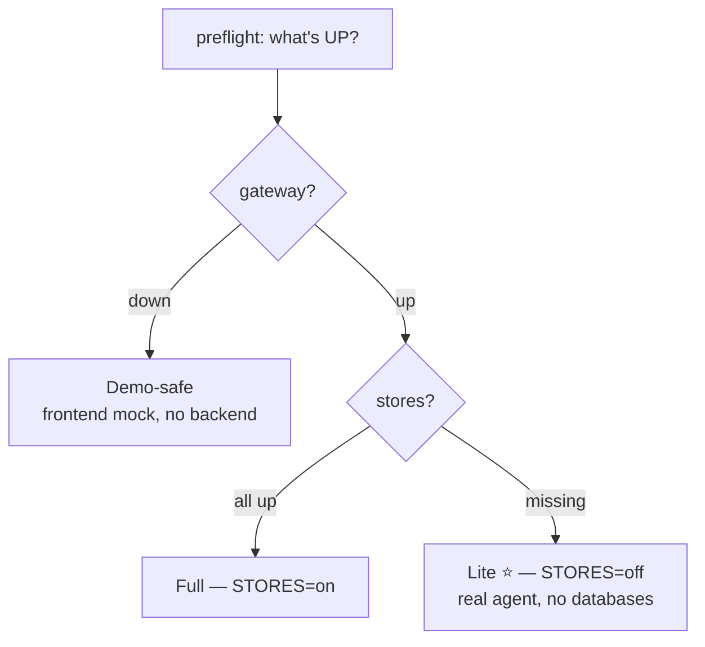

# 60 · Run and operate

How to install, run (lite vs. full), configure, and verify Aegis. The long-form manual is
`INSTALL.md`; the one-page day-of guide is `docs/RUNBOOK.md`. This page is the operator's
orientation; cross-links go to those two.

## Three run modes (the fallback ladder)

Aegis is designed so a missing database never sinks a demo. Pick the highest rung that is
green (`docs/RUNBOOK.md`):

| Rung | Needs | You get |
|---|---|---|
| **Full** (`STORES=on`) | model gateway + Postgres/pgvector + Neo4j + Redis | Real RAG over stores, persisted audit/ledger/checkpoints, live Phoenix traces |
| **Lite** ⭐ (`STORES=off`) | **gateway only** (no databases) | **Real** agent, LLM, streaming, tools, gate, token/cost — in-memory records/graph/cache, SQLite audit |
| **Demo-safe** (frontend mock) | nothing | Full UI on the in-browser mock transport — cannot fail |

**Default to Lite.** It removes the biggest day-of risk (databases not installing) while
staying a *real* demo. The only secret you must set is `GENAILAB_API_KEY`.



## One-command scripts

The repo ships day-of scripts (`scripts/`) with Windows `.ps1` and mac/Linux `.sh` twins
(see `docs/RUNBOOK.md`):

```bash
# macOS / Linux
./scripts/bootstrap.sh      # once: installs backend (all extras) + frontend, writes .env files
./scripts/preflight.sh      # anytime: shows what's UP (gateway / stores)
./scripts/start.sh lite     # run it (lite = real agent, NO databases). Also: full | safe
```

```powershell
# Windows (the hackathon machine)
.\scripts\bootstrap.ps1
.\scripts\preflight.ps1
.\scripts\start.ps1 -Mode lite
```

Then open **http://localhost:5173** and log in with **admin / demo** (or use a role
quick-login button). Lite mode installs the same packages as full — the switch is the
`STORES` env var, not the install.

## Manual setup

Prerequisites: **Python ≥ 3.11**, **uv**, **Node ≥ 18**, **pnpm ≥ 9**; for full mode also
**PostgreSQL ≥ 15 + pgvector**, **Neo4j 5.x**, **Redis ≥ 7**. No Docker, no GPU (16 GB
laptop target). Phoenix runs in-process.

**Backend** (from `backend/`):
```bash
uv venv && source .venv/bin/activate                      # Windows: .venv\Scripts\activate
uv pip install -e ".[data,auth,observability,agent,retrieval,ml,guardrails,dev]"
cp .env.example .env                                       # fill in GENAILAB_API_KEY (+ stores for full)
uvicorn app.main:app --reload --app-dir src                # → http://localhost:8000  (/docs for OpenAPI)
```

**Frontend** (from `frontend/`):
```bash
pnpm install
cp .env.example .env.local
# mock demo:  keep VITE_USE_MOCK=true
# live:       set VITE_USE_MOCK=false and VITE_API_BASE=http://localhost:8000
pnpm dev                                                   # → http://localhost:5173
```

Demo logins (dev only) — one per RBAC role, all with password `demo` (`_DEMO_USERS` in
`api/routes.py`):

| Username | Role → portal | Persona |
|---|---|---|
| `admin` | `admin` → `/admin` | `operations_lead` |
| `ai` (or `aiteam`) | `ai_team` → `/ai-team` | `operations_lead` |
| `devops` | `devops` → `/devops` | `operations_lead` |
| `client` | `client` → `/client` | `client` |

The demo backdoor is dev-only (closed when `APP_ENV != dev` or a real user row exists). A
real deployment seeds the `users` table with Argon2-hashed passwords, a coarse `role`, and a
`tenant_id`, so login yields a JWT carrying the signed `coarse_role` claim and a
**tenant-scoped** identity, and runs are governed. An admin reassigns roles via `POST
/admin/users/{id}/role` (with a last-platform-admin lockout guard).

## Key environment variables

All backend settings are typed in `backend/src/app/config.py`; nothing else reads
`os.environ` for config. The ones that change behavior most:

| Var | Default | What it does |
|---|---|---|
| `GENAILAB_API_KEY` | *(empty)* | **Required** for any real model call (the gateway) |
| `GENAILAB_SSL_VERIFY` | `false` | Keep false — the gateway uses a self-signed cert (scoped exception) |
| `STORES` | `on` | `on` = real stores (Postgres-primary); `off` = **lite** (no databases). Read as `settings.stores_enabled` |
| `DB_BOOTSTRAP` | `false` | Create tables on startup (best-effort; the run scripts set `true`) |
| `GUARDRAILS_ENGINE` | `programmatic` | `programmatic` (fast Python rails) or `nemo` (executes the NeMo Colang policy). *Silently downgrades to programmatic if the NeMo package is absent* |
| `QUERY_REWRITE_ENABLED` | `true` | Context-aware query rewrite before retrieval (`retrieval/query_rewrite.py`) |
| `AGENTIC_RETRIEVAL_ENABLED` / `AGENTIC_RETRIEVAL_MAX_ROUNDS` | `true` / `2` | Bounded Self-RAG retrieval loop (`agent/retrieval_loop.py`) |
| `ANSWER_CACHE_ENABLED` / `ANSWER_CACHE_THRESHOLD` / `ANSWER_CACHE_TTL_SECONDS` | `true` / `0.97` / `1800` | Answer-level semantic cache, scoped per tenant+persona+role (needs Redis; off in lite) |
| `AGENT_CHECKPOINTER` | `memory` | `memory` (single-process `InMemorySaver`) or `postgres` (durable `PostgresSaver` → resumable HITL across restart/worker) |
| `LOG_LEVEL` | `INFO` | Root log level (applied by `main.create_app` via `logging.basicConfig(force=True)`; unknown → INFO) |
| `APP_ENV` | `dev` | `dev` enables the demo logins + insecure JWT fallback; any other value locks both down |
| `JWT_SECRET` | *(dev-insecure default)* | HS256 signing secret — **must be set (≥ 32 chars) in any non-dev deploy**, or startup fails (`ensure_secure_secrets`) |
| `JWT_EXPIRE_MINUTES` | `720` | Access-token lifetime |
| `budget_fail_open` (`BUDGET_FAIL_OPEN`) | `false` | Budgets **fail closed** by default: a DB blip during the pre-spend check *denies* the call, never silently uncaps. Set true only to opt into soft ceilings |
| `LLM_MAX_OUTPUT_TOKENS` | `1024` | Per-generation output cap (cost/latency safety) |
| `LLM_TIMEOUT_SECONDS` | `60` | Per-call timeout (forwarded to LiteLLM + an outer `asyncio.wait_for` backstop) |
| `APPROVAL_SLA_SECONDS` | `3600` | SLA before the sweeper acts on a pending gate (HIGH-risk past-deadline → auto-reject) |
| `POSTGRES_DSN` / `NEO4J_URI` / `REDIS_URL` | localhost defaults | Store connections (full mode). Lite points Postgres at SQLite |
| `PHOENIX_ENABLED` | `true` | Start in-process Phoenix tracing |

Model routing is **role-based**: override any role with `MODEL_<ROLE>` (e.g.
`MODEL_GENERATION=genailab-maas-gpt-4o`) — see `core/models.py`. Per-role cost overrides:
`COST_<ROLE>_IN` / `COST_<ROLE>_OUT`.

Frontend (`frontend/.env.local`): `VITE_USE_MOCK` (default `true`), `VITE_API_BASE`
(default `http://localhost:8000`), `VITE_HEALTH_PATH` (default `/health`). `?mock=1` in the
URL also forces mock.

## What listens where

| Component | Process | Port | Needed in |
|---|---|---|---|
| Frontend (Vite) | `pnpm dev` | 5173 | all modes |
| Backend (FastAPI/uvicorn) | `uvicorn app.main:app` | 8000 | lite, full |
| PostgreSQL + pgvector | native install | 5432 | full |
| Neo4j | native install | 7687 (bolt) | full |
| Redis / Memurai | native install | 6379 | full |
| Arize Phoenix (traces) | in-process | 6006 | full (optional) |

In full mode one local PostgreSQL is the **primary durable store** for everything: tenants,
users, budgets, the usage ledger, the approvals inbox, the LangGraph checkpoints, the audit
log, and pgvector chunks.

## Train the ML model (Aegis Signal)

The ML spine trains offline on the adapter's real `training_frame`:

```bash
cd backend && python -m app.ml     # trains TrustworthyModel, persists the artifact, prints a sanity check
```

At runtime `app.ml.get_model()` resolves a process-wide singleton → the artifact → a freshly
trained fallback, so a missing artifact never crashes a run.

## Verify (proof it works)

**Backend** (from `backend/`, venv active):
```bash
python -m pytest tests -q      # expect a green suite (the one skip is the opt-in LLM-judge)
ruff check src tests           # All checks passed!
ruff format --check src        # formatting
```

The offline **quality gate** runs in the suite (`tests/eval/test_eval_gate.py`): it drives
the *real* hybrid retrieval path over a fixed seed corpus and **fails** if
context-precision/recall or groundedness regress below threshold. Set
`TAIF_EVAL_LLM_JUDGE=1` to additionally run the reasoning-model LLM-as-judge pass. A second,
**DeepEval-pattern** regression gate (`app/eval/regression.py`, `python -m
app.eval.regression`) adds per-metric thresholds *plus* an agentic tool-selection case and
is wired as the pass/fail bar inside `scripts/preflight.{sh,ps1}` (see `docs/EVAL_STRATEGY.md`).
Lite/end-to-end coverage lives in `tests/retrieval/test_memory.py` and `tests/integration/`
(governed-budget block, durable approval round-trip, RRF hybrid provenance, cross-tenant
isolation).

> First `pytest` run is slow (~30–60 s) because SHAP/XGBoost trigger a one-time numba JIT
> compile; later runs are ~2 s.

**Frontend** (from `frontend/`):
```bash
pnpm build     # tsc (strict) + vite build — clean, all chunks < 500 kB
pnpm lint      # oxlint — 0 errors
pnpm test      # vitest unit tests
```

## Common day-of fixes (`docs/RUNBOOK.md`)

| Symptom | Fix |
|---|---|
| Gateway DOWN in preflight | Check `GENAILAB_API_KEY`; confirm you're on the venue network. Until then `start … safe` still demos the whole UI |
| Postgres/Neo4j/Redis DOWN | Don't fight it — run `start … lite` (needs none of them) |
| Backend won't boot | Usually a missing venv — re-run `bootstrap`. Lite needs no databases |
| `/audit` empty in lite | Expected until an action runs; it writes to `taif_lite.db` (SQLite) on the fly |
| Frontend shows `—` everywhere | Backend not reachable or no query run yet; confirm `http://localhost:8000/docs` opens |
| `pnpm dev` stuck at "transforming…" | `pkill -f "esbuild --service"` then re-run |

See also: `INSTALL.md` (long-form setup + full env reference), `docs/RUNBOOK.md` (the
one-page fallback ladder + connection map), and `README.md` (architecture).
