# The Aegis module reference

The single reference for `aegis/src/aegis/` — the importable Python core. It covers
what "modular" means here, the **Module Contract** every package obeys, the AG-UI
streaming spine they all narrate through, the module map with each module's install
extra, and the honest debt list.

**Per-module depth lives in [`../teaching/`](../teaching/README.md)** — one file per
module, 29 of them, each read end to end. This document is the contract and the map;
those files are the explanation.

**The flows those modules compose into live in [`PIPELINES.md`](PIPELINES.md)** — the
three pipelines (retrieval, agent, ingestion), their stages, the module that owns each
stage and what each stage emits. That file is *generated* from `aegis.pipelines.spec`,
which the ingest runtime, `GET /pipelines` and the console's pipeline-health page all
read, so a stage cannot be described here and absent there.

---

## What "modular" means here

Aegis began as one monolithic FastAPI backend (`backend/src/app/*`). It was extracted
component by component into standalone, independently-**importable** `aegis.*` packages.
The goal, stated plainly: Aegis must be **importable, not forkable** — a team building
an unrelated agentic system should be able to run `pip install aegis[guardrails]` (or
`[ml]`, `[retrieval]`, …) and get a production-shaped component, not a stub that only
works bolted onto Aegis's own backend.

`backend/` is now a composition root: it wires the modules together, owns the engine,
the sessions and the HTTP surface, and contributes no capability of its own that a
module could have owned.

## The Module Contract — three pillars

**Pillar A — Importable & isolated.** One repo, one `aegis` package, one
`pyproject.toml`, with optional-dependency **extras** per module (see the module map
below). `aegis.core` holds only Protocols, shared Pydantic types, the registry, config,
health probes, and the `require()` lazy-import helper — it has **zero heavy
dependencies**. The boundary rule that makes this durable: `aegis.core` imports nothing
internal; a leaf module imports only `aegis.core` (and, for the durable modules,
`aegis.data`) plus its own third-party libraries; shared logic goes into `aegis.core`
rather than leaf-to-leaf. A missing optional dependency always fails loud via
`aegis.core.lazy.require(extra, module)`, which raises an `ImportError` naming the exact
`pip install` fix — never a silent `except ImportError: pass`.

**Pillar B — Shows its work.** Every module with runtime work to narrate emits it as a
live, typed event stream instead of returning only a final answer. The same events carry
an OpenInference span kind, so they double as an OTel trace export. One event contract,
two consumers: a live console and an observability backend.

**Pillar C — Honest infra.** Config is typed and fail-fast
(`aegis.core.config.AegisMode`): `full` (default) probes the real backing stores at boot
and refuses to start if a required one is unreachable; `lite` deliberately boots
in-memory, **loudly** announced in logs and in a persistent UI banner; `auto` probes and
may drop to `lite`, but never silently. Backend selection always goes through an explicit
factory that logs its choice. This matters because the old monolith's worst failure mode
was exactly the opposite: code configured for Redis and a vector store silently fell back
to RAM and *called it* durable storage.

### Known deviations from the boundary invariant

Real leaf-to-leaf imports exist in the codebase today. They are recorded rather than
smoothed over, because the point of "honest infra" is not claiming an invariant holds
when the code says otherwise:

- `aegis.memory.recall` / `.cache` / `.vector_ops` import `aegis.retrieval.fusion`,
  `.vectors`, `.models`, `.types`, `.vector_store` — RRF fusion, cosine similarity and
  the Qdrant vector store, reused rather than duplicated.
- `aegis.governance.enforcement` imports `BudgetExceededError` from `aegis.gateway.types`.
- `aegis.vision` and `aegis.voice` import `aegis.media` (payload types and hygiene) and
  `aegis.guardrails.media` (the image screen and image-PII redactor).

All are harmless inside one distribution; each is debt against a future multi-wheel
split. The fix in every case is the same: hoist the shared primitive into `aegis.core`.

## The à la carte streaming spine

Every module that narrates its work emits through **one** shared primitive,
`aegis.core.stream.AegisEmitter`, which wraps the official `ag-ui-protocol` SDK
(`ag_ui.core` + `ag_ui.encoder.EventEncoder`) rather than hand-rolling a wire format.
AG-UI is an open agent-UI standard, so the stream is consumable by ecosystem tooling, not
just by this repo's frontend.

The key design principle is **à la carte**: there is no base class a module must fully
implement and no mandatory event set. A module calls only the helpers relevant to what it
does; the rest never fire.

- `run_started()` / `run_finished()` / `run_error()` — the lifecycle envelope, once per run.
- `step(name, span_kind)` — an async context manager bracketing
  `STEP_STARTED`/`STEP_FINISHED`, carrying an OpenInference `SpanKind` (`LLM`,
  `EMBEDDING`, `RETRIEVER`, `RERANKER`, `TOOL`, `GUARDRAIL`, `AGENT`, `CHAIN`,
  `EVALUATOR`).
- `reasoning(delta)` — live agent thinking, as a `CustomEvent(name="reasoning")`; native
  AG-UI `REASONING_*` events are still draft-spec, so this is the interim channel,
  isolated behind the emitter.
- `text_start` / `text_delta` / `text_end` and `tool_start` / `tool_args` / `tool_end` /
  `tool_result` — bracketed assistant text and tool-call streaming.
- `custom(name, value)` — domain payloads (guardrail verdicts, SHAP explanations,
  citations, …). `name` **must** be one of the canonical names in
  `aegis.core.stream_names.ALL`; an unregistered name raises `ValueError` at the call
  site, so a typo can never reach the frontend as a silently-unrecognised event.

On the frontend, `web/src/lib/streamNames.ts` mirrors `aegis.core.stream_names`
value-for-value and `web/src/lib/api/sse.ts` provides the SSE-frame decoder
(`decodeAguiStream`).

## Whole-platform architecture

```mermaid
graph TD
    subgraph foundations["Foundations — zero/near-zero deps"]
        core["aegis.core<br/>Protocols, types, events,<br/>registry, config, health,<br/>AegisEmitter + stream_names"]
        data["aegis.data<br/>AegisBase, VectorColumn,<br/>JsonB, UtcDateTime, EMBED_DIM"]
        media["aegis.media<br/>typed payloads + hygiene<br/>for non-text input"]
    end

    subgraph leaves["Leaf modules — depend on the foundations"]
        guardrails["aegis.guardrails<br/>input/output rails (text + media)"]
        ml["aegis.ml<br/>predict + SHAP + conformal"]
        forecast["aegis.forecast<br/>time series + measured intervals"]
        retrieval["aegis.retrieval<br/>hybrid RAG"]
        gateway["aegis.gateway<br/>LLM chokepoint"]
        memory["aegis.memory<br/>working + episodic + semantic"]
        governance["aegis.governance<br/>tenants, RBAC, RLS, budgets"]
        evals["aegis.evals<br/>RAGAS-style + LLM-judge"]
        ops["aegis.ops<br/>eval-gated release"]
        observability["aegis.observability<br/>OTel/OpenInference export"]
        vision["aegis.vision<br/>screened image understanding"]
        voice["aegis.voice<br/>guarded speech to text"]
        redteam["aegis.redteam<br/>attacks its own rails"]
        security["aegis.security<br/>threats → wired controls"]
    end

    subgraph orchestration["Orchestration — composes every module above"]
        agent["aegis.agent<br/>LangGraph plan→gate→act→reflect —<br/>AgentDeps injection seam"]
    end

    core --> leaves
    data --> memory
    data --> governance
    media --> vision
    media --> voice

    evals -.->|gates| ops

    agent -->|deps.check_input/check_output| guardrails
    agent -->|deps.predict_explain| ml
    agent -->|deps.retrieve, agentic_retrieve| retrieval
    agent -->|deps.complete| gateway
    agent -->|deps.memory: MemoryDeps Protocol| memory
    agent -->|deps.record_audit; BudgetExceededError| governance
    agent -->|span/SpanKind/semconv| observability

    guardrails -->|guardrail_verdict| stream["AG-UI event stream<br/>(SSE, ag-ui-protocol)"]
    ml -->|shap_explanation, conformal_interval| stream
    retrieval -->|retrieval_citations| stream
    gateway -->|model_call| stream
    memory -->|memory_recall| stream
    evals -->|eval_result| stream
    vision -->|vision events| stream
    voice -->|voice events| stream
    agent -->|reasoning, routing, tool_call, approval_required,<br/>reflection … via the legacy StreamEvent seam| legacyStream["Legacy StreamEvent union<br/>(app.api.schemas, locked SSE contract)"]

    legacyStream -.->|AG-UI migration deferred| stream
    stream --> frontendDecode["web/src/lib<br/>streamNames.ts + api/sse.ts"]
    stream --> otel["Same stream, tagged with<br/>OpenInference SpanKind →<br/>OTel export"]

    style foundations fill:#eef,stroke:#448
    style orchestration fill:#efe,stroke:#484
```

## The module map

**Twenty-nine packages.** `aegis[extra]` is what `pip install` needs; the last column is
one file per module, in depth.

| Module | What it does | `aegis[extra]` | Taught in |
|---|---|---|---|
| `aegis.core` | The contract: Protocols, shared types, registry, config, health, `AegisEmitter` | none (bare `aegis`) | [`core`](../teaching/core.md) |
| `aegis.data` | Portable SQLAlchemy base + cross-dialect JSON/vector/UTC column types | `data` | [`data`](../teaching/data.md) |
| `aegis.pipelines` | The stage declaration the three pipelines are read from, checked against the code | none | [`pipelines`](../teaching/pipelines.md) |
| `aegis.governance` | Tenants, RBAC, Postgres RLS, budgets, audit | `governance` | [`governance`](../teaching/governance.md) |
| `aegis.guardrails` | Input/output rails: schema, PII, injection, topic, content safety, grounding | none for the base pipeline; `nemo` (Colang), `pii` (Presidio), `media`, `redis` optional | [`guardrails`](../teaching/guardrails.md) |
| `aegis.security` | The security-posture surface: threats mapped to their *wired* controls | none | [`security`](../teaching/security.md) |
| `aegis.redteam` | A harness that attacks the rails and reports what got through | none | [`redteam`](../teaching/redteam.md) |
| `aegis.conformance` | The pytest plugin that proves a domain swap is complete | `conformance` | [`conformance`](../teaching/conformance.md) |
| `aegis.settings` | Prompt versions, seats, per-tenant configuration, the LLM-Ops loop | `data` | [`settings`](../teaching/settings.md) |
| `aegis.dbadmin` | The read-only database console and the role that cannot write | `data` | [`dbadmin`](../teaching/dbadmin.md) |
| `aegis.agent` | Plan → gate → act → reflect orchestration; composes every module through `AgentDeps` | `agent` | [`agent`](../teaching/agent.md) |
| `aegis.memory` | Working, episodic and semantic memory; recall and consolidation | `data` (no dedicated `memory` extra) | [`memory`](../teaching/memory.md) |
| `aegis.skills` | `SKILL.md` documents an agent can reach for, scoped and versioned | `data` | [`skills`](../teaching/skills.md) |
| `aegis.ingestion` | Parse → chunk → enrich → embed → index → graph, with the quality gate | `ingestion` | [`ingestion`](../teaching/ingestion.md) |
| `aegis.retrieval` | Hybrid vector + graph + BM25 recall, RRF fusion, local cross-encoder rerank, spotlight | `retrieval` | [`retrieval`](../teaching/retrieval.md) |
| `aegis.gateway` | The LiteLLM chokepoint: routing, cost, budget, fallback, the limiter | `gateway` | [`gateway`](../teaching/gateway.md) |
| `aegis.jobs` | Durable work on Temporal, and what survives a crash | `data` | [`jobs`](../teaching/jobs.md) |
| `aegis.runs` | The run record, folded from its own append-only event log | `data` | [`runs`](../teaching/runs.md) |
| `aegis.ml` | Prediction + SHAP explanation + conformal intervals | `ml` | [`ml`](../teaching/ml.md) |
| `aegis.forecast` | Time-series forecasting with measured, calibrated intervals | `forecast` | [`forecast`](../teaching/forecast.md) |
| `aegis.evals` | Metrics, IR metrics, gold sets, ablation and an LLM-judge harness | none — bare `pip install aegis` | [`evals`](../teaching/evals.md) |
| `aegis.analytics` | The `analytics_*` views, their RLS, and the Superset integration | `data` | [`analytics`](../teaching/analytics.md) |
| `aegis.ops` | Diagnose, eval-gated release, promotion | `data` | [`ops`](../teaching/ops.md) |
| `aegis.observability` | OTel / OpenInference span export | `observability` (+ `phoenix`) | [`observability`](../teaching/observability.md) |
| `aegis.reports` | Generated reports and their sourcing | `data` | [`reports`](../teaching/reports.md) |
| `aegis.media` | Typed payloads and payload hygiene for non-text input | `media` | [`media`](../teaching/media.md) |
| `aegis.vision` | Image understanding, with the injection screen ahead of the model | `media` + `gateway` | [`vision`](../teaching/vision.md) |
| `aegis.voice` | Speech to text, guarded by the full text rail before an agent sees it | `gateway` | [`voice`](../teaching/voice.md) |
| `aegis.websearch` | Reaching outside the tenant's own corpus | `websearch` | [`websearch`](../teaching/websearch.md) |

Two module-level files sit beside the packages: `aegis/runtime.py` (the `Aegis` runtime
object, `AEGIS_MODE`) and `aegis/adapter.py` (the `DomainAdapter` protocol — the seam a
new domain is written against).

`reasoning` and `routing` are reserved in `aegis.core.stream_names` for `aegis.agent`'s
live-thinking and router-decision output. Both fire, but through `aegis.agent`'s own
dict-builder + injected-`stamp` seam (`aegis.agent.events`, validated against the legacy
`StreamEvent` union), not through `AegisEmitter`.

`pip install "aegis[all]"` composes every functional extra;
`aegis/pyproject.toml` is the source of truth for what each one pulls.

## The honest debt list — tracked, not hidden

None of this breaks anything today; all of it is real.

- **Leaf-to-leaf imports** — listed under "Known deviations" above.
- **Frontend AG-UI dispatcher deferred** — the frontend has the name-registry mirror and
  the SSE decoder, but no per-event `event.type → React component` rail, so there is no
  `eval_result` card wired.
- **Agent on the legacy stream** — the marquee module still speaks the old `StreamEvent`
  union rather than `AegisEmitter`. The migration was deferred deliberately, to keep the
  locked frontend SSE contract stable.
- **The ML artifact cold-starts on synthetic data in a fresh clone** — by design, and
  `/ml/explain` returns 503 until `python -m app.ml` has run rather than silently
  fitting the noise synthesiser.

Three items that were on this list until 2026-08-23 have since been wired and are
removed rather than left as folklore: the guardrails injection cache (used by
`aegis.guardrails.pipeline._default_injection_cache`), `AEGIS_MODE` (read by
`aegis.core.config.CoreSettings` and honoured through `aegis.runtime`), and the answer
cache (`aegis.agent.graph` reads and writes it, gated on `answer_cache_enabled`, which
defaults to on).

---

**Related:** [`../teaching/README.md`](../teaching/README.md) (one file per module) ·
[`../architecture/system-architecture.md`](../architecture/system-architecture.md) (how
the modules sit inside the whole system) · [`../adr/`](../adr/) (why each big choice was
made) · [`../../aegis/PUBLIC.md`](../../aegis/PUBLIC.md) (what is promised) ·
[`../../aegis/README.md`](../../aegis/README.md) (the package's own README).
