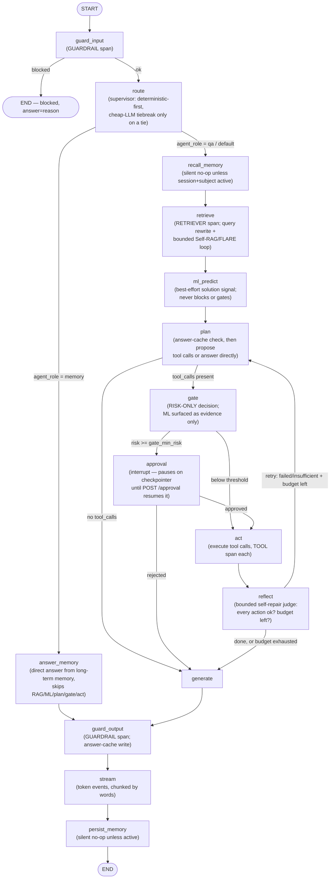

# `aegis.agent` — the plan→gate→act→reflect orchestration graph

## What it is

`aegis.agent` is the finale of the Module Contract extraction: the LangGraph orchestration core
that ties every other `aegis.*` module together into one running agent. It is the plan → gate →
act → reflect graph — guard the input, route to a specialist, retrieve context, take an optional
ML solution signal, propose a plan, gate risky actions behind a human, execute, judge the outcome,
loop or finish, guard the output, stream it, persist memory — expressed as a compiled LangGraph
`StateGraph` over one seam: `AgentDeps`. Every node body calls `deps.*` and nothing else; the
module itself imports only `langgraph`, `aegis.core`, `aegis.observability` (a real, cheap
dependency, no-op when untraced), and two other leaves it composes on purpose —
`aegis.retrieval.agentic`/`.query_rewrite` for the agentic retrieval loop and
`aegis.gateway.types.BudgetExceededError` for a clean budget-tripped stop. It is the one module in
the platform that is *meant* to sit above the leaf-module boundary rule described in
`00-overview.md`, because composing the other modules is its entire job — everything else about
its own behavior (config, checkpointer, event validator, audit sink, domain adapter) still comes
in through injection, never a hard import.

Three design decisions make the graph what it is:

- **The gate is risk-ONLY.** `AgentConfig.gate_min_risk` (default `RiskLevel.HIGH`) is the *only*
  signal that pauses a run for a human. The `ml_predict` node's output is informational — it is
  attached to the `gate` node's `ml_explanation` event and fed into `plan`/`generate` prompts as
  supporting evidence a low-confidence or failed prediction is simply omitted, never a reason to
  defer, abstain, or block. ML is a solution signal, never a flow decider (a founder decision
  documented directly in `graph.py` and `deps.py`).
- **Bounded self-repair.** After `act` executes, `reflect` judges the outcome from the executed
  `ToolOutcome.ok`/`.summary` values (domain-agnostic — never hardcoded domain logic). If an
  action failed or was insufficient *and* the iteration budget (`AgentConfig.max_plan_iterations`,
  default `2`) still allows another round, the graph loops back to `plan` with the failure fed
  back for a Reflexion-style correction; otherwise it proceeds to `generate`. The counter
  increments only in `plan`, so the loop is guaranteed to terminate — this is a hard cap, not a
  best-effort one.
- **Durable human-approval gate with checkpoint/resume.** A gated action calls
  `langgraph.types.interrupt(...)`, which pauses the compiled graph on its injected `checkpointer`.
  `run_agent` registers the pending decision in an in-process `ApprovalRegistry` (so a fast
  `POST /approval` never races past the wait), persists a durable inbox row through the injected
  `enqueue_approval` seam, and — if the socket-held wait times out — *parks* the run rather than
  losing it: the durable row is the source of truth, and `resume_parked_run` drives the same
  checkpointed graph headless to completion from an out-of-band decision, exactly once.

## Architecture

The `AgentDeps` seam is the whole point: `aegis.agent` never resolves a real gateway call,
retrieval engine, guardrail pipeline, ML model, or persona/tool schema itself — every one of those
capabilities arrives as an injected callable, and a host wires the real ones in its own
composition root (`AgentDeps.default()`, app-side, mirroring `gateway.configure(...)`). The
package supplies only the pure contract + graph; nothing here can boot infrastructure.

```mermaid
graph TD
    subgraph agentpkg["aegis.agent"]
        init["__init__.py<br/>public surface"]
        state["state.py<br/>AgentState (TypedDict)"]
        router["router.py<br/>RouterDecision, route_query,<br/>classify_deterministic, load_roster"]
        approvals["approvals.py<br/>ApprovalRegistry, ParkedRunRegistry<br/>(pure asyncio)"]
        deps["deps.py<br/>AgentConfig, AgentDeps, MemoryDeps,<br/>ToolOutcome, risk_rank / risk_at_least"]
        events["events.py<br/>wire-event dict builders"]
        graph["graph.py<br/>build_agent(deps, checkpointer)<br/>every node body"]
        orchestrator["orchestrator.py<br/>run_agent(), resume_parked_run()"]

        init --> deps
        init --> graph
        init --> orchestrator
        init --> router
        init --> approvals
        init --> events
        graph --> deps
        graph --> state
        graph --> router
        graph --> events
        orchestrator --> graph
        orchestrator --> approvals
        orchestrator --> events
    end

    core["aegis.core.types<br/>GuardStage / RunStatus / ApprovalDecision /<br/>RiskLevel / GuardVerdict"] --> deps
    core --> events
    mltypes["aegis.ml.types<br/>MLExplainResponse"] --> deps
    obs["aegis.observability<br/>span, SpanKind, semconv, get_tracer<br/>(no-op when untraced)"] --> graph
    obs --> orchestrator
    retrieval["aegis.retrieval.agentic / .query_rewrite<br/>(bounded agentic retrieval loop)"] --> graph
    gwtypes["aegis.gateway.types<br/>BudgetExceededError"] --> orchestrator

    hostapp["app (composition root)<br/>AgentDeps.default() —<br/>wires aegis.gateway / .retrieval /<br/>.guardrails / .ml / DB-backed MemoryDeps / .governance"] -->|builds & passes deps=| graph
    hostrun["app: durable Postgres checkpointer,<br/>StreamEvent TypeAdapter (stamp),<br/>enqueue_approval / on_terminal / default_tier"] -->|injected run_agent() params| orchestrator

    style agentpkg fill:#eef,stroke:#448
    style hostapp fill:#fee,stroke:#a44,stroke-dasharray: 5 5
    style hostrun fill:#fee,stroke:#a44,stroke-dasharray: 5 5
```

## Runtime flow — the graph `build_agent()` compiles



## Public API

Verified against `aegis/src/aegis/agent/__init__.py` (2026-08-12):

```python
__all__ = [
    "AgentConfig", "AgentDeps", "AgentState", "ApprovalOutcome", "ApprovalRegistry",
    "MemoryDeps", "ParkedRun", "ParkedRunRegistry", "RouterDecision", "ToolOutcome",
    "UnknownApprovalError", "build_agent", "classify_deterministic", "events",
    "get_approval_registry", "get_parked_runs", "load_roster", "resume_parked_run",
    "risk_at_least", "risk_rank", "route_query", "run_agent",
]
```

- **`run_agent(query, *, persona=None, role=None, deps=None, registry=None, run_id=None,
  session_id=None, memory_subject=None, checkpointer=None, stamp=None, enqueue_approval=None,
  on_terminal=None, default_tier=None, parked_runs=None) -> AsyncIterator[Any]`** — the one
  coroutine a host's API layer consumes: builds the graph over `deps`, drives
  `astream(stream_mode=["custom", "updates"])`, stamps every node-emitted event with `run_id` +
  a monotonic `seq`, and owns the human-approval rendezvous (register → enqueue → wait → resume,
  or park on timeout). `deps` is **required** — it raises `ValueError` if omitted, since there is
  no default wiring inside `aegis.agent`. Yields the ordered stream of stamped events, bookended
  by `run_started`/`run_finished` (or `error`/`budget_exceeded` on failure).
- **`build_agent(deps: AgentDeps, *, checkpointer: Any = None) -> CompiledStateGraph`** — compiles
  the `StateGraph` over injected `deps`, closing every node body over the same `AgentDeps`
  instance. `checkpointer` defaults to `langgraph.checkpoint.memory.InMemorySaver()`; a host
  injects a shared/durable saver (Postgres) so a run parked on one compiled graph resumes by
  `thread_id` from any other worker.
- **`resume_parked_run(run_id, decision: ApprovalDecision, *, graph, config=None, approver=None) ->
  bool`** — the pure headless-resume helper: given the already-resolved decision and the compiled
  `graph` whose checkpointer holds the paused state, resumes with `Command(resume=...)` and drives
  the stream to completion exactly once. Returns `False` when there is nothing resumable.
- **`AgentDeps`** (dataclass) — the DI contract: `complete`, `retrieve`, `check_input`,
  `check_output`, `predict_explain`, `tool_definitions_for`, `run_tool`, `tool_risk`,
  `render_system_prompt`, `features_for`, `describe_prediction` (all required, structural
  callables), plus `agent_roster` (defaults to the core `qa`-only fallback via `load_roster`),
  `config: AgentConfig`, `memory: MemoryDeps | None`, `answer_cache: AnswerCache | None`,
  `current_tenant_id` (defaults to ungoverned `None`), `record_audit: AuditFn | None`.
- **`AgentConfig`** (dataclass) — the bounded-autonomy knobs: `gate_min_risk: RiskLevel = HIGH`
  (**the only** gating signal), `run_ml: bool = True`, `stream_chunk_words: int = 4`,
  `max_plan_iterations: int = 2`, `approval_park_timeout: float | None = None` (waits
  indefinitely by default — the live money-shot gate), `default_persona_id: str = "default"`,
  and the retrieval-intelligence flags `query_rewrite_enabled`, `agentic_retrieval_enabled`,
  `agentic_retrieval_max_rounds`, `answer_cache_enabled` (all on by default; test fakes pin them
  off for deterministic single-shot behaviour).
- **`MemoryDeps`** (`Protocol`) — the long-term-memory read/write shape:
  `async assemble(*, subject_id, session_id, persona, query, query_vec) -> AssembledMemory` and
  `async persist(*, subject_id, session_id, turn_index, user_text, assistant_text, query_vec,
  run_id, trace_id) -> None`. `aegis.agent` defines only the shape; the concrete DB-backed
  implementation (opening tenant-scoped sessions, writing the memory stores) lives host-side.
  `AgentDeps.memory = None` (the test-fake default) makes `recall_memory`/`persist_memory`
  silent no-ops — the single-shot trace is byte-for-byte unchanged.
- **`ToolOutcome`** (`Protocol`) — structural `ok: bool` / `summary: str`, the shape `act` reads
  off whatever `run_tool` returns.
- **`AgentState`** (`TypedDict, total=False`) — the graph's single mutable record (run/trace ids,
  query, persona, role, messages, routing, retrieval context, tool calls/results, the self-repair
  counter, ML response/summary, gate/approval fields, memory fields, token/cost accrual, terminal
  `status`). Wire-facing sub-structures are plain dicts so the whole state stays trivially
  checkpointable by `InMemorySaver`.
- **`RouterDecision`** / **`route_query`** / **`classify_deterministic`** / **`load_roster`** — the
  supervisor: `classify_deterministic` picks a specialist by keyword hints with *no model call*;
  `route_query` escalates to a `ModelRole.CHEAP` tiebreak only on a genuine tie between two named
  specialists, falling back to the roster default otherwise; `load_roster` is the core's
  `qa`-only fallback roster used when no adapter roster is injected.
- **`ApprovalRegistry`** / **`get_approval_registry`** / **`ApprovalOutcome`** /
  **`ParkedRunRegistry`** / **`get_parked_runs`** / **`ParkedRun`** / **`UnknownApprovalError`** —
  the `/approval` rendezvous: an in-process notify cache (`register`/`wait`/`resolve`) over the
  durable inbox, plus the parked-run handle registry an out-of-band resumer drives from.
- **`risk_rank(risk: RiskLevel) -> int`** / **`risk_at_least(risk, floor) -> bool`** — the
  ordinal comparison helpers the gate uses (`LOW=0, MEDIUM=1, HIGH=2`).
- **`aegis.agent.events`** — the wire-event dict *builders* (`node_started`, `node_finished`,
  `reasoning`, `guardrail`, `retrieval`, `tool_call`, `tool_result`, `ml_explanation`,
  `approval_required`, `approval_queued`, `provenance`, `reflection`, `routing`, `memory`,
  `token`, `run_started`, `run_finished`, `error`, `budget_exceeded`) — plain factories with no
  validation; the injected `stamp` in `run_agent` finishes the job.

### Usage — injecting `AgentDeps` directly (offline / test-shaped)

```python
from aegis.agent import AgentConfig, AgentDeps, run_agent
from aegis.core.types import RiskLevel

deps = AgentDeps(
    complete=my_complete,              # async (role, messages, *, tools=None) -> LLMResult
    retrieve=my_retrieve,               # async (query, *, persona=None) -> RetrievalResult
    check_input=my_check_input,         # async (text) -> GuardResult
    check_output=my_check_output,       # async (text) -> GuardResult
    predict_explain=my_predict_explain, # (features) -> MLExplainResponse
    tool_definitions_for=my_tool_defs,  # (persona) -> list[dict]
    run_tool=my_run_tool,               # async (persona, name, args, **ctx) -> ToolOutcome
    tool_risk=my_tool_risk,             # (name) -> RiskLevel
    render_system_prompt=my_render_prompt,
    features_for=my_features_for,
    describe_prediction=my_describe_prediction,
    config=AgentConfig(gate_min_risk=RiskLevel.HIGH, max_plan_iterations=2),
)

async for event in run_agent("What's my account status?", persona="default", deps=deps):
    print(event["type"], event)
    # run_started -> guard_input's guardrail -> routing -> retrieval... -> token... -> run_finished
```

### Production usage — the app-side composition root

```python
# backend/src/app/agent/deps.py (composition root, NOT part of aegis.agent)
from aegis.agent import run_agent

deps = AgentDeps.default()   # app-side: wires aegis.gateway/.retrieval/.guardrails/.ml
                              # + the DB-backed MemoryDeps + app.adapter + app.config
async for event in run_agent(
    query, persona=persona, deps=deps,
    checkpointer=get_agent_checkpointer(),   # durable Postgres saver
    stamp=stream_event_adapter.stamp,        # the locked StreamEvent TypeAdapter
    enqueue_approval=app.data.enqueue_approval,
    on_terminal=fire_trace_eval,
):
    await sse_send(event)
```

## Install

`aegis[agent]` — verified against `aegis/pyproject.toml`:

```
agent = ["langgraph>=0.2", "langchain-core>=0.3", "opentelemetry-api>=1.27", "opentelemetry-sdk>=1.27"]
```

The observability deps are listed explicitly because `aegis.agent` imports `aegis.observability`
directly (a real, cheap dependency — degrades to a no-op when no tracer is configured). The
durable Postgres checkpointer (`langgraph-checkpoint-postgres`) is **not** in this extra — it
stays a host/backend concern, since `build_agent`/`run_agent` only need the in-memory saver by
default and accept any injected `BaseCheckpointSaver`. Rolled into `aegis[all]`.

## AG-UI / events

`aegis.agent` does **not** emit through `aegis.core.stream.AegisEmitter`/`stream_names` the way
`aegis.guardrails`/`aegis.retrieval`/etc. do. It emits through the **legacy `StreamEvent` union**
(`app.api.schemas`, 19+ variants) — the locked SSE contract the frontend console already renders.
Nodes never construct or validate a wire event directly: they call the plain dict builders in
`aegis.agent.events`, push them through the LangGraph custom stream writer, and `run_agent` stamps
each one with `run_id`/`seq` via an **injected** `stamp: Callable[[payload, run_id, seq], event]`
— defaulting to a bare dict stamp offline, with the host injecting its `StreamEvent` `TypeAdapter`
in production. This keeps `aegis.agent` free of any dependency on `app.api.schemas`.

The event vocabulary `events.py` builds: `run_started`, `node_started`, `node_finished`,
`reasoning`, `routing` (the supervisor hand-off), `guardrail`, `retrieval`, `provenance`,
`memory`, `tool_call`, `tool_result`, `ml_explanation` (informational only — no gating semantics),
`approval_queued`, `approval_required`, `reflection` (one per bounded self-repair decision),
`token`, `budget_exceeded`, `error`, `run_finished`.

`00-overview.md` notes that `reasoning` and `routing` are reserved names in
`aegis.core.stream_names` specifically for `aegis.agent` — they now light up, but through the
legacy dict/stamp seam rather than `AegisEmitter`. Migrating the agent graph onto the AG-UI
`CustomEvent`/`AegisEmitter` contract (the same one every other module now uses) is an explicit,
deferred follow-on — module map decision #2 chose to keep the legacy union rather than change the
locked frontend SSE contract as part of this extraction.

## The 5 injection seams + honest design notes

`aegis.agent` severs five seams so the graph never resolves live infrastructure or a host schema
itself; each degrades cleanly to an offline default when nothing is injected:

1. **Observability** — `span`/`set_span_attribute(s)`/`get_tracer`/`current_trace_id`/`semconv`/
   `SpanKind` come straight from `aegis.observability` (a real import, not injected) and degrade
   to a no-op on a non-recording span when no tracer is configured. Every node is wrapped in
   `_timed`, which opens one OpenTelemetry span per node (nesting retrieval/guardrail/tool/LLM
   spans beneath it) *and* emits the `node_started`/`node_finished` stream events — one wrapper,
   two outputs.
2. **Event validator** — `run_agent(..., stamp=...)`; defaults to a plain dict stamp
   (`_dict_stamp`) so `aegis.agent` never imports any host wire schema. `GuardStage`/`RunStatus`/
   `ApprovalDecision` live in `aegis.core.types`; `app.api.schemas` re-exports them by identity.
3. **Checkpointer** — `build_agent(deps, *, checkpointer=...)` / `run_agent(..., checkpointer=...)`,
   defaulting to `InMemorySaver()`. This breaks what was a circular dependency
   (`app.data.session ↔ graph._build_postgres_checkpointer`) pre-extraction; the durable Postgres
   saver stays app-side, built from `app.config` + `langgraph-checkpoint-postgres`.
4. **Audit + durable approvals** — `AgentDeps.record_audit` (best-effort route-audit sink,
   `None` → silent no-op) and `run_agent`'s `enqueue_approval`/`on_terminal`/`default_tier`
   params (each defaults to a no-op). The in-process `ApprovalRegistry`/`ParkedRunRegistry` here
   are a fast notify cache over the durable inbox, not the source of truth themselves — a decision
   that arrives after the socket parks still lands durably and a resumer (`resume_parked_run`)
   picks it up from the checkpoint.
5. **Domain adapter + config** — `AgentConfig.default_persona_id` replaces a hardcoded adapter
   import; `deps.agent_roster` carries the routable-specialist roster (defaulting to the core
   `qa`-only fallback so a test fake that omits it still routes); `app.adapter`/`app.config` stay
   entirely app-side — `aegis.agent` imports neither.

Other honest notes:

- **`MemoryDeps` is a `Protocol` in `aegis`, concrete in `app`.** Its `assemble`/`persist` methods
  open tenant-scoped DB sessions — a host coupling that genuinely cannot move into a leaf package
  — so `aegis.agent` defines only the read/write shape; the graph only ever calls
  `.assemble`/`.persist` on whatever is injected.
- **`aegis.agent` intentionally imports other leaves.** `aegis.retrieval.agentic`/`.query_rewrite`
  (the agentic retrieval loop) and `aegis.gateway.types.BudgetExceededError` (a clean
  budget-tripped stop, no litellm pulled in) are real leaf-to-leaf imports — but this module is
  the composition layer sitting *above* the leaf boundary described in `00-overview.md`, not a
  leaf itself: gluing together the other modules is the entire reason it exists.
- **`build_agent` takes no `emit`/tracer parameter.** Nodes emit validator-agnostic dicts through
  the LangGraph custom stream writer; the event validator (`stamp`) is purely an orchestrator
  concern on `run_agent`, not the graph-compile step.
- **`agent_roster` default is genuinely inert.** The pure `AgentDeps.agent_roster` defaults to
  `load_roster()` — a `qa`-only roster — because the core cannot import an adapter; a host
  `AgentDeps` subclass swaps in the real adapter-backed roster in `__post_init__` when the caller
  left the core default in place.
- **`approval_park_timeout=None` is the live demo gate.** It waits indefinitely on the
  in-process future; a positive timeout instead lets the socket-held wait *park* the run (the
  durable inbox row remains the source of truth) rather than holding the connection open forever.
- **The self-repair loop cannot run away.** `reflect`'s retry decision is gated by both "was the
  goal met" and "is there budget left" (`plan_iterations < max_plan_iterations`); the counter only
  ever increments in `plan`, so the loop is structurally bounded, not just conventionally so.
