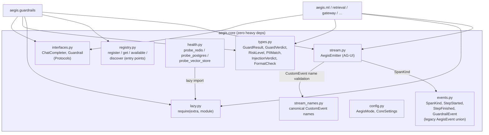
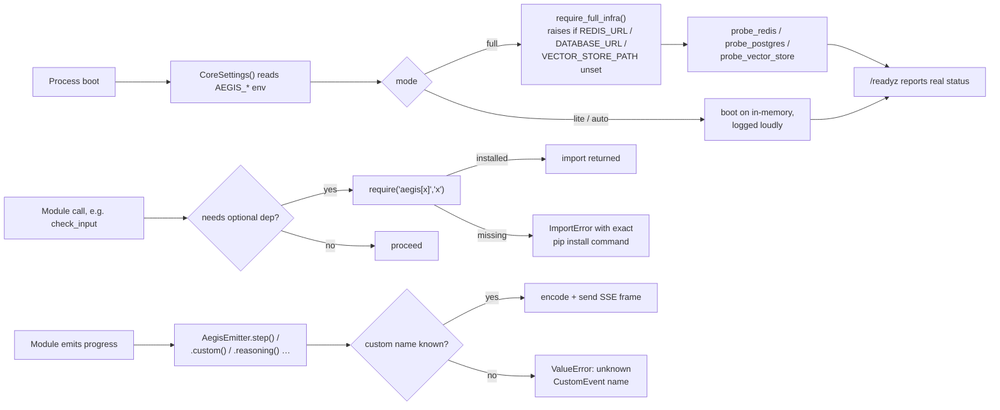

# `aegis.core` — the dependency-free Module Contract

## What it is

`aegis.core` is the load-bearing foundation every other Aegis package builds on, and it is
deliberately boring: Pydantic models, `typing.Protocol` interfaces, a tiny registry, stdlib
config, and one lazy-import helper. No `litellm`, no `torch`, no `xgboost`, no database driver —
`aegis.core` imports nothing internal and pulls in no heavy third-party dependency. That single
constraint is what makes the rest of the platform "importable, not forkable": any leaf module
(`aegis.guardrails`, `aegis.ml`, `aegis.retrieval`, …) can depend on `aegis.core` alone and stay
cheap to install, because core never drags in the world.

The problem it solves is the one every "modular monolith" eventually hits: shared types and
shared discipline tend to leak into whichever module happens to need them first, and soon every
module secretly depends on every other module. Aegis prevents that with an explicit **boundary
invariant**: `aegis.core` imports nothing internal; a leaf module imports only `aegis.core` plus
its own third-party libs; there is **no leaf-to-leaf import**. Anything two or more modules need
to agree on — a verdict enum, a span-kind, an event shape — lives here instead of being duplicated
or reached for across a module boundary.

The SOTA technique `aegis.core` applies is less an ML technique than an infra discipline: **fail
loud, never silently degrade.** Optional dependencies are reached only through `require()`, which
raises an `ImportError` naming the exact `pip install` command instead of an `except ImportError:
pass` no-op. Infra mode (`AegisMode`) is explicit and boot-checked rather than probed-then-silently
-downgraded. Health probes report real reachability, never a guess. This "honest infra" posture is
one of the three pillars of the Module Contract (see `docs/module/00-overview.md`), and `aegis.core`
is where it's codified as reusable primitives (`config.py`, `health.py`, `lazy.py`) rather than
re-invented per module.

## Architecture



## Runtime flow — how a leaf module uses core at boot and per-call



## Public API

Verified against `aegis/src/aegis/core/__init__.py` (2026-08-12).

```python
from aegis.core import (
    AegisEvent, AegisMode, ChatCompleter, CoreSettings, FormatCheck,
    Guardrail, GuardResult, GuardVerdict, GuardrailEvent, InjectionVerdict,
    PIIMatch, RiskLevel, SpanKind, StepFinished, StepStarted,
    available, get, register, require,
)
```

Note: `AegisEmitter` and `stream_names` are **not** re-exported from `aegis.core.__init__` — they
are imported from their own submodules, `aegis.core.stream` and `aegis.core.stream_names`.

Key symbols, by file:

- **`config.py`** — `AegisMode` (`full` | `lite` | `auto`, `StrEnum`); `CoreSettings`
  (`pydantic_settings.BaseSettings`, reads `AEGIS_`-prefixed env vars: `mode`, `redis_url`,
  `database_url`) with `.require_full_infra()`, which raises `RuntimeError` naming the missing
  vars when `mode is full`.
- **`types.py`** — `GuardVerdict` (`pass|block|redact|flag`), `RiskLevel` (`low|medium|high`),
  `PIIMatch`, `InjectionVerdict`, `FormatCheck`, `GuardResult` (`verdict`, `reason`, `text`,
  `layer`, `redactions`). Pydantic + stdlib only.
- **`interfaces.py`** — `ChatCompleter` (async `Protocol`: `__call__(messages, *,
  response_format=None) -> str`) and `Guardrail` (`Protocol`: `check_input`/`check_output` →
  `GuardResult`). Both `@runtime_checkable`.
- **`registry.py`** — `register(kind, name)` (class decorator), `get(kind, name)`,
  `available(kind) -> list[str]`, `discover(kind)` (loads `aegis.<kind>` entry points so
  third-party packages can register components without editing Aegis).
- **`lazy.py`** — `require(extra: str, module: str) -> ModuleType`. The single sanctioned way to
  reach an optional dependency anywhere in Aegis.
- **`events.py`** — `SpanKind` (OpenInference: `LLM|EMBEDDING|RETRIEVER|RERANKER|TOOL|GUARDRAIL|
  AGENT|CHAIN|EVALUATOR`), and the **legacy** discriminated event union `AegisEvent = StepStarted |
  StepFinished | GuardrailEvent` (kept for back-compat; the streaming spine below is the
  forward-facing contract).
- **`health.py`** — `DependencyStatus`, `probe_redis(url, *, client=None)`,
  `probe_postgres(url, *, conn=None)`, `probe_vector_store(path, *, client=None)`. Every probe accepts an
  injected client (tests pass a fake) and never raises — it always returns a status, `up` or
  `down`, using `require()` internally to reach the real driver when no client is injected.
- **`stream.py`** (import directly — not in `core.__init__`) — `AegisEmitter`, the one AG-UI
  streaming primitive. See below.
- **`stream_names.py`** (import directly) — the canonical `CustomEvent` name registry:
  `REASONING`, `GUARDRAIL_VERDICT`, `SHAP_EXPLANATION`, `CONFORMAL_INTERVAL`,
  `RETRIEVAL_CITATIONS`, `ROUTING`, `MEMORY_RECALL`, `MODEL_CALL`, `EVAL_RESULT`, `ALL`
  (`frozenset`), `is_known(name)`.

### Standalone usage — config, registry, lazy import

```python
from aegis.core import AegisMode, CoreSettings, register, get, require

settings = CoreSettings()          # reads AEGIS_MODE / AEGIS_REDIS_URL / AEGIS_DATABASE_URL
settings.require_full_infra()      # raises RuntimeError if mode=full and a URL is missing

@register("guardrail", "dummy")
class Dummy:
    async def check_input(self, text): ...
    async def check_output(self, text): ...

Dummy is get("guardrail", "dummy")  # True

nemoguardrails = require("aegis[nemo]", "nemoguardrails")  # raises w/ install cmd if missing
```

### Standalone usage — the à la carte streaming spine

`AegisEmitter` is the **one** streaming primitive every module emits through, but no module has to
use every helper on it — it calls only what's relevant, and the rest simply never fires.

```python
from aegis.core.stream import AegisEmitter
from aegis.core.events import SpanKind
from aegis.core import stream_names

frames: list[str] = []

async def sink(frame: str) -> None:
    frames.append(frame)  # in production: write to an SSE response

emitter = AegisEmitter(thread_id="t1", run_id="r1", sink=sink)
await emitter.run_started()
async with emitter.step("guard_input", SpanKind.GUARDRAIL):
    await emitter.custom(stream_names.GUARDRAIL_VERDICT, {"verdict": "pass", "rules": []})
await emitter.run_finished()
```

`emitter.step(name, span_kind)` is an async context manager that brackets `STEP_STARTED` /
`STEP_FINISHED`. `emitter.reasoning(delta)`, `.text_start/.text_delta/.text_end`, and
`.tool_start/.tool_args/.tool_end/.tool_result` cover live-thinking, assistant text, and tool-call
streaming respectively, all with AG-UI's start→delta→end bracketing enforced internally (calling
`text_delta` before `text_start` raises `RuntimeError`). `emitter.custom(name, value)` rejects any
`name` not in `stream_names.ALL` with a `ValueError`, so a typo'd event name fails at the call
site instead of silently reaching the frontend as an unrecognized event.

## Install

`aegis.core` has **no extra** — it installs with bare `pip install aegis` (its only dependencies
are `pydantic`, `pydantic-settings`, and `ag-ui-protocol`, all pydantic-only/stdlib-light and
therefore allowed in core per the "zero heavy deps" invariant). Every other `aegis[<extra>]` extra
implicitly includes core.

## AG-UI events it emits

`aegis.core` doesn't itself emit domain events (it has no business logic to report on) — it
defines the **vocabulary** every other module emits through:

- The AG-UI lifecycle/step/text/tool events (`RUN_STARTED`, `STEP_STARTED`/`STEP_FINISHED`,
  `TEXT_MESSAGE_*`, `TOOL_CALL_*`) via `AegisEmitter`.
- The `reasoning` `CustomEvent` (`{messageId, delta}`) for live agent-thinking.
- The canonical `CustomEvent` name registry (`stream_names.py`) that every module's domain payload
  (`guardrail_verdict`, `shap_explanation`, `conformal_interval`, `retrieval_citations`, `routing`,
  `memory_recall`, `model_call`, `eval_result`) must draw its `name` from — `emitter.custom()`
  raises on any name not in that set.

In the console, `web/src/lib/streamNames.ts` mirrors this registry value-for-value, and
`web/src/lib/api/sse.ts` provides a minimal SSE-frame decoder
(`decodeAguiStream(text) -> AguiEvent[]`). As of this writing the
full per-event-type React renderer/dispatcher described in the Module Contract spec (a process-rail
timeline expanding each step into a specialized card) is still a follow-on build — today's
console AG-UI surface is the name registry + the decoder, not yet the rendered process rail.

## Honest infra / design notes

- **Fail-loud optional deps.** `require()` is the only sanctioned way any Aegis code reaches an
  optional dependency. There is no `except ImportError: pass` path anywhere in the platform; a
  missing package always raises with the exact `pip install aegis[...]` fix.
- **Explicit infra mode, no silent fallback.** `AegisMode.full` (default) refuses to boot without
  real backend URLs configured; `lite` is an explicit, loudly-logged opt-in to in-memory,
  non-durable stores; `auto` probes and may drop to lite but **stays loud** about it (never
  silent). This mode is a shared type every data-backed module (`memory`, `governance`, `guardrails`
  cache) reads to pick its store via a factory — never via a caught exception.
- **Probes never lie.** `probe_redis`/`probe_postgres`/`probe_vector_store` always return a
  `DependencyStatus`, never raise, and accept an injected client so they're deterministically
  testable offline. `/readyz` (built by a consuming service on top of these) is meant to report
  real, current status — never an inferred or hardcoded value.
- **Registry, not a hard dependency graph.** `register`/`get`/`discover` let leaf modules and
  third parties advertise implementations (`aegis.<kind>` entry points) without `aegis.core` ever
  importing them back — the dependency arrow only ever points from leaf to core.
- **Structural typing over inheritance.** `ChatCompleter` and `Guardrail` are `Protocol`s, not base
  classes — a caller's own async completion function or guard implementation satisfies the
  contract structurally, so `aegis.guardrails` stays LLM-agnostic and never hard-wires a provider.
