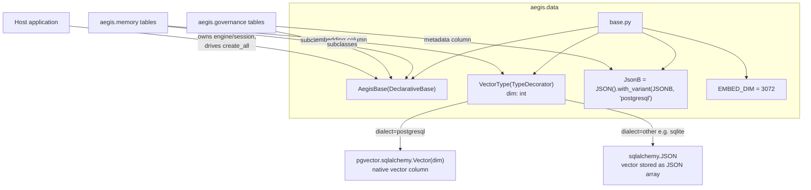
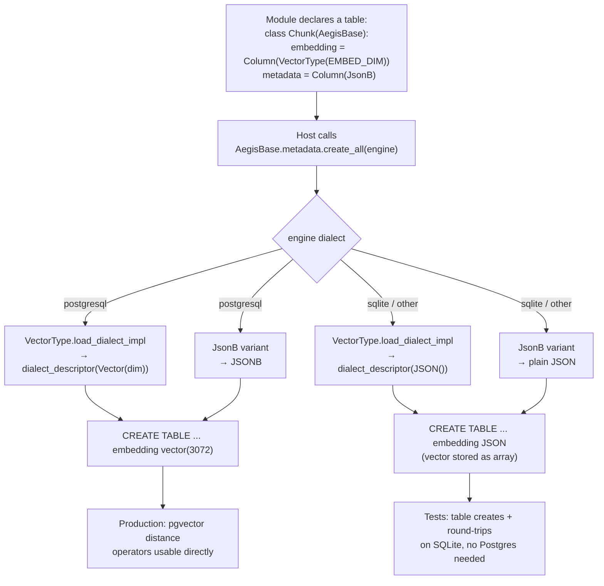

# `aegis.data` — the portable ORM foundation

## What it is

`aegis.data` answers a narrow but important question: when two or more durable modules
(`aegis.memory`, `aegis.governance`) need to register SQLAlchemy tables, where does the shared
`DeclarativeBase` live so neither module owns the other, and neither couples to a specific host
application's engine? The answer is `aegis.data` — a single-file package holding one declarative
base (`AegisBase`), two cross-dialect column-type decorators (`VectorType`, `JsonB`), and one
constant (`EMBED_DIM`). It contributes no engine, no session, no migrations, and no tables of its
own; it only defines the *shape* vocabulary other modules build their tables with. The host
application still owns the actual `engine`/`sessionmaker` and drives
`AegisBase.metadata.create_all(...)`.

The problem this solves is portability under a real constraint Aegis operates under: development
and unit tests must run on a 16 GB machine with **no Docker and no live Postgres**, while
production wants pgvector's native `vector` type and Postgres's native `jsonb`. A schema written
directly against `pgvector.sqlalchemy.Vector` or `sqlalchemy.dialects.postgresql.JSONB` simply
fails to create on SQLite. `aegis.data`'s SOTA technique is unglamorous but effective: a
`TypeDecorator` (`VectorType`) that compiles to `vector(dim)` on PostgreSQL and degrades to plain
`JSON` (storing the embedding as a JSON array) on every other dialect, plus `JsonB`, a
`JSON().with_variant(JSONB, "postgresql")` column that is native `jsonb` in production and portable
`JSON` in tests. One schema definition, two runtime shapes, chosen automatically by SQLAlchemy's
dialect detection — never by an `if postgres:` branch scattered through calling code.

`EMBED_DIM = 3072` fixes the embedding dimensionality (matching
`genailab-maas-text-embedding-3-large`) as a single shared constant, so every module that declares
a `VectorType(EMBED_DIM)` column agrees on the vector width without re-deriving or hardcoding it
independently.

## Architecture



## Runtime flow — schema materialization by dialect



## Public API

Verified against `aegis/src/aegis/data/__init__.py` (2026-08-12).

```python
from aegis.data import AegisBase, EMBED_DIM, JsonB, VectorType

__all__ = ["EMBED_DIM", "AegisBase", "JsonB", "VectorType"]
```

- **`AegisBase`** — `sqlalchemy.orm.DeclarativeBase` subclass. Every table a data-layer module
  contributes subclasses this so all tables share one `MetaData`.
- **`VectorType(dim: int)`** — `TypeDecorator[list[float]]` wrapping `pgvector.sqlalchemy.Vector`.
  `impl = Vector`, `cache_ok = True`. `load_dialect_impl` returns `Vector(dim)` on `postgresql`,
  plain `JSON()` on every other dialect.
- **`JsonB`** — a ready-made column type value (not a class to instantiate):
  `JSON().with_variant(JSONB, "postgresql")`.
- **`EMBED_DIM`** — `int = 3072`.

### Standalone usage

```python
from sqlalchemy import Column, Integer, String
from sqlalchemy.ext.asyncio import create_async_engine
from aegis.data import AegisBase, EMBED_DIM, JsonB, VectorType

class DocChunk(AegisBase):
    __tablename__ = "doc_chunks"
    id = Column(Integer, primary_key=True)
    content = Column(String, nullable=False)
    embedding = Column(VectorType(EMBED_DIM))
    meta = Column(JsonB)

# Tests: SQLite, no Postgres needed.
engine = create_async_engine("sqlite+aiosqlite:///:memory:")

# Production: same model, real pgvector.
# engine = create_async_engine("postgresql+asyncpg://.../aegisdb")

async def create_schema() -> None:
    async with engine.begin() as conn:
        await conn.run_sync(AegisBase.metadata.create_all)
```

## Install

`aegis[data]` — `sqlalchemy[asyncio]>=2.0` + `pgvector>=0.3`. Modules that need durable relational
+ vector storage (`aegis.memory`, `aegis.governance`) declare this as one of their own extras.

## AG-UI events it emits

None. `aegis.data` is a pure schema-shape library with no runtime behavior to report on — it never
constructs an `AegisEmitter` and has no `stream.py`. Modules that use it for storage (memory,
governance) emit their own events around the operations that touch these tables.

## Honest infra / design notes

- **No silent schema divergence.** The dialect fallback (`vector` → `JSON`, `jsonb` → `JSON`) is
  handled entirely by SQLAlchemy's `TypeDecorator`/`with_variant` machinery at the type level, not
  by application code branching on `if postgres`. The same model class produces a *correct* schema
  on either dialect — SQLite just loses pgvector's native distance operators, which is acceptable
  for unit tests (which don't exercise vector search) but never accidentally silent in production
  (production always uses `postgresql+asyncpg`, so it always gets the real `vector` column).
- **No ownership overreach.** `aegis.data` does not create an engine, does not manage a session,
  does not run `create_all` itself, and does not define `alembic` migrations. The host process (or
  the module using it, e.g. `aegis.memory`) is unambiguously responsible for lifecycle; `aegis.data`
  only owns the shape vocabulary, keeping it dependency-injected rather than opinionated about
  connection management.
- **Import-clean.** Per the Module Contract's leaf-module boundary rule, `aegis.data` imports
  nothing from any other Aegis package (not even `aegis.core`) — only `sqlalchemy` and `pgvector`.
  This keeps the dependency arrow one-directional: data-layer modules depend on `aegis.data`, never
  the reverse.
