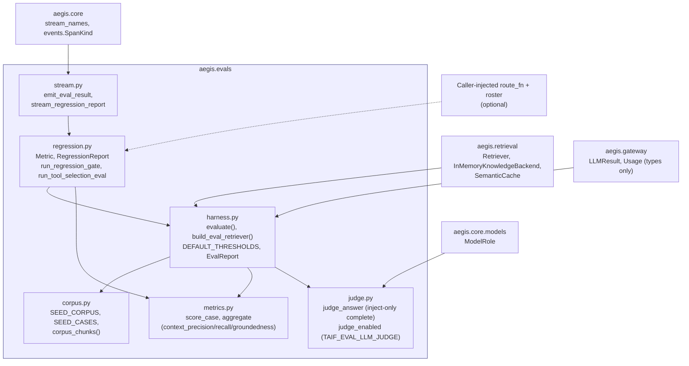
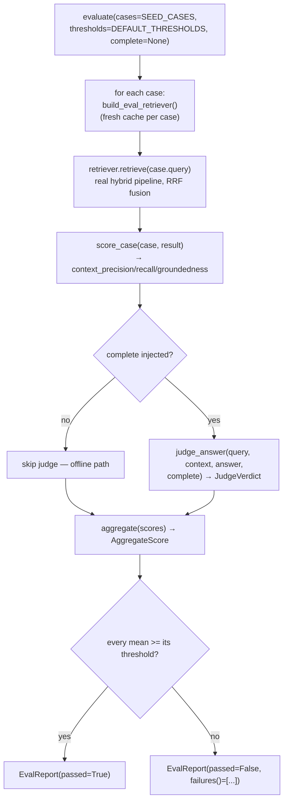
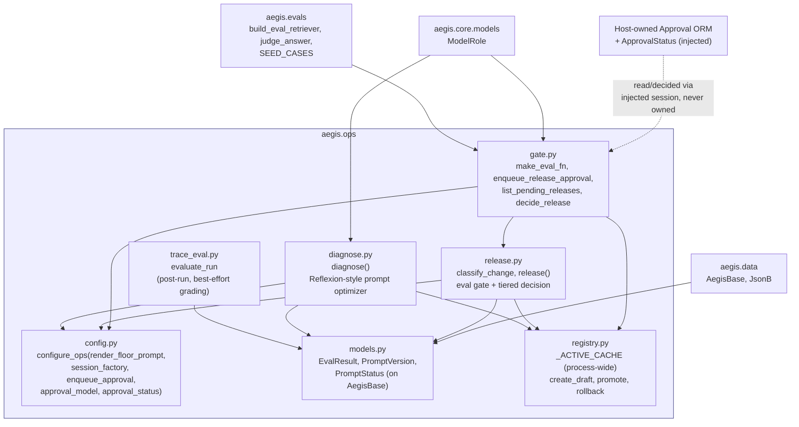
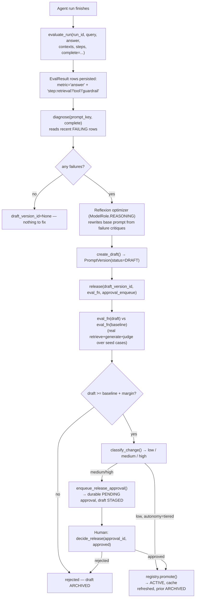

# `aegis.evals` + `aegis.ops` — the offline quality gate and the LLM-Ops loop it gates

These two packages are documented together because they are two halves of one loop:
`aegis.ops` is the importable LLM-Ops self-improvement machine (Trace → Eval → Observe →
Diagnose → Gate → Release) that writes a new system prompt back into the harness, and
`aegis.evals` is what every stage of that loop measures quality *against* — the fixed
seed corpus, the deterministic lexical proxies, the optional LLM-as-judge, and the
DeepEval-pattern regression gate. `aegis.ops` depends on `aegis.evals` one-directionally
(for its release-time regression scorer); `aegis.evals` has no idea `aegis.ops` exists.
Put simply: **ops runs eval-gated releases; evals is what it gates on.**

## `aegis.evals`

### What it is

`aegis.evals` is a pure, importable offline evaluation library plus a CI regression gate
— hand-rolled, with no `ragas` or `deepeval` dependency and no ORM. It answers "is
retrieval quality still good enough to ship" without a network call by default: three
**RAGAS-style deterministic proxies** (context-precision@k, context-recall,
groundedness/faithfulness) computed as transparent token/substring overlap over a fixed,
labelled seed corpus, plus a **DeepEval-pattern** regression gate — declarative,
per-metric thresholds (`Metric(name, threshold, higher_is_better)`) evaluated into a
`RegressionReport`, mirroring `deepeval`'s `assert_test`/`@pytest.mark.parametrize` shape
without the package's network dependency.

The problem it solves is the one every RAG/agent system eventually needs: a CI gate that
actually catches a retrieval or fusion regression, without needing live infra, API keys,
or a flaky network call in the hot path of every pull request. `aegis.evals` drives the
**real** hybrid `aegis.retrieval.Retriever` (genuine vector + graph + BM25 recall, fused
by Reciprocal Rank Fusion) over `SEED_CASES`, with only the embedding (a deterministic
local hash) and the reranker (a pass-through) faked — so the RRF-fused order is exactly
what gets measured, fully offline and fully deterministic. An optional, **inject-only**
LLM-as-judge (`judge_answer`, gated behind the `TAIF_EVAL_LLM_JUDGE` env flag) adds a
model-graded groundedness + relevance pass through the reasoning-model role when a
maintainer opts in; a normal `pytest` run never touches it.

The SOTA technique is the *pattern*, not the library: RAGAS's metric ideas
(context-precision/recall/faithfulness) and DeepEval's declarative per-metric-threshold
shape, both re-implemented natively so the gate stays offline, deterministic, and free of
either package's heavy dependency tree. An optional agentic case
(`run_tool_selection_eval`) extends the gate beyond pure retrieval: when a router
(`route_fn` + `roster`) is injected, it asserts the router still selects the expected
specialist role for representative queries — agent-*behavior* regression testing, not
just retrieval-quality regression testing.

### Architecture



### Runtime flow — `evaluate()`, the offline eval pass



### Public API

Verified against `aegis/src/aegis/evals/__init__.py` and each named submodule
(2026-08-12).

```python
from aegis.evals import (
    DEFAULT_METRICS, DEFAULT_THRESHOLDS, ROUTER_EVAL_CASES, SEED_CASES, SEED_CORPUS,
    AggregateScore, CaseScore, EvalCase, EvalReport, EvalThresholds, GateCaseResult,
    JudgeSummary, JudgeVerdict, Metric, MetricResult, RegressionReport, RouterEvalCase,
    aggregate, build_eval_retriever, evaluate, judge_answer, judge_enabled,
    run_regression_gate, run_tool_selection_eval, score_case, summarize_verdicts,
)
```

Not re-exported at the package root but importable directly: `aegis.evals.stream`
(`emit_eval_result`, `stream_regression_report`).

Key symbols, by file:

- **`harness.py`** — `evaluate(cases=SEED_CASES, thresholds=DEFAULT_THRESHOLDS, *,
  complete=None) -> EvalReport`; `build_eval_retriever() -> Retriever`;
  `DEFAULT_THRESHOLDS` (`min_context_precision=0.66, min_context_recall=0.95,
  min_groundedness=0.85, precision_k=1`); `EvalReport.failures() -> list[str]`.
- **`metrics.py`** — `score_case(case, result, *, precision_k) -> CaseScore`;
  `aggregate(scores) -> AggregateScore`.
- **`judge.py`** — `judge_answer(question, context, answer, *, complete=None) ->
  JudgeVerdict` (raises `ValueError` if `complete is None` — inject-only, no lazy
  fallback); `judge_enabled() -> bool` (reads `TAIF_EVAL_LLM_JUDGE`).
- **`regression.py`** — `Metric(name, threshold, higher_is_better=True)`;
  `DEFAULT_METRICS` (context_precision@1 0.66, context_recall 0.95, groundedness 0.85,
  tool_selection_accuracy 0.99); `run_regression_gate(*, complete=None,
  metrics=DEFAULT_METRICS, route_fn=None, roster=None) -> RegressionReport`;
  `run_tool_selection_eval(*, complete=None, route_fn, roster) -> tuple[float, list]`.
- **`corpus.py`** — `SEED_CORPUS` (5 docs, 2 deliberate distractors), `SEED_CASES` (6
  labelled cases), `corpus_chunks() -> list[Chunk]`.
- **`stream.py`** (import directly) — `emit_eval_result(emitter, *, overall, passed,
  metrics)`; `stream_regression_report(emitter, report) -> RegressionReport`.

### Standalone usage

```python
from aegis.evals import evaluate, run_regression_gate

# Fully offline — no completer, no network, deterministic.
report = await evaluate()
report.passed          # bool
report.aggregate.context_recall

# The DeepEval-pattern gate, same offline default:
regression = await run_regression_gate()
regression.passed
[c.name for c in regression.failures()]

# With an LLM-as-judge (any async ChatCompleter-shaped callable) and an injected router:
async def my_complete(role, messages, *, temperature=0.0, response_format=None): ...
report = await evaluate(complete=my_complete)
report.judge.groundedness   # populated only when `complete` was given

regression = await run_regression_gate(
    complete=my_complete, route_fn=my_router.route, roster=my_roster,
)
```

### Install

**No dedicated `evals` extra exists in `aegis/pyproject.toml`.** `aegis.evals` installs
with bare `pip install aegis`. This is verified, not assumed: `harness.py` imports
`aegis.retrieval` (`Retriever`, `InMemoryKnowledgeBackend`, `SemanticCache`) and
`aegis.gateway` (`LLMResult`, `Usage` — *types* only), and both of those packages defer
their genuinely heavy third-party deps (`lightrag-hku`, `neo4j`, `litellm`, …) behind
`aegis.core.lazy.require()` calls reached only inside specific backends/functions, not at
import time. `aegis/tests/evals/test_isolation.py` asserts this directly — a subprocess
that imports `aegis.evals` (+ `harness`, `regression`, `judge`, `stream`) and checks
`sys.modules` for `{litellm, fastapi, sqlalchemy, torch, langgraph, xgboost,
nemoguardrails, ragas, deepeval}` and finds none. The optional LLM-as-judge needs only an
injected `complete` callable (any async chat-completion function) — no extra install, the
same inject-only pattern `aegis.guardrails`' injection classifier uses.

### AG-UI events it emits

- **`CustomEvent(name="eval_result")`**, emitted by `stream.emit_eval_result` /
  `stream.stream_regression_report`, bracketed by `STEP_STARTED`/`STEP_FINISHED` with
  `step_name="evaluate"`, `SpanKind.EVALUATOR`. Payload:

  ```json
  {"overall": 0.87, "passed": true, "metrics": {"context_recall": 0.95, "groundedness": 0.9}}
  ```

  Never calls a model itself — the payload is whatever the already-computed
  `EvalReport`/`RegressionReport` carries, flattened to a `name → value` map with the
  overall score derived as the mean of every measured metric.

On the frontend, `eval_result` is one of the names mirrored in
`frontend/src/agui/streamNames.ts`. As of this writing there is no dedicated eval-result
card renderer wired to the AG-UI stream — the decode layer (`frontend/src/agui/decode.ts`)
exists but the per-event React dispatcher described in the Module Contract spec is still a
follow-on build, same as every other module in this series.

### Honest infra / design notes

- **Offline by default, network only when asked.** No test or default code path calls a
  model. The LLM-as-judge is gated behind `TAIF_EVAL_LLM_JUDGE`; `evaluate()`'s `judge`
  field is `None` unless a `complete` callable is explicitly passed in.
- **RAGAS answer-relevancy is honestly not computed.** `metrics.py`'s docstring is
  explicit that RAGAS *answer relevancy* needs a generation + semantic-similarity model
  and is not one of the three deterministic proxies here — the model-graded signal is
  the optional LLM-as-judge, not a fourth lexical proxy pretending to be it.
- **The agentic case degrades gracefully, not silently-required.** With no `route_fn`
  injected, `run_tool_selection_eval`'s case is skipped entirely and the RAG-path
  metrics stand alone — the gate does not fail because an optional check was omitted,
  but it also does not fabricate a passing score for a check that never ran.
- **No hardcoded scores anywhere.** Every number in a `CaseScore`/`RegressionReport`
  comes from a real retrieval over the real hybrid pipeline or a real router decision —
  `regression.py`'s own docstring makes this an explicit design constraint, not an
  incidental property.

---

## `aegis.ops`

### What it is

`aegis.ops` is the importable LLM-Ops self-improvement loop: **Trace → Eval → Observe →
Diagnose → Gate → Release**, where Release is the only stage allowed to write a
versioned, reversible system prompt back into the harness. It carries its own ORM
(`EvalResult`, `PromptVersion`/`PromptStatus`, on the shared `aegis.data.AegisBase`) and
a process-wide active-prompt cache read synchronously on the hot path, so a running agent
never pays a database round-trip to know which prompt is live. Every host-specific
dependency — the prompt *floor* (the adapter/persona baseline the registry builds on but
never goes below), the session factory, the durable approval writer, and even the
host-owned `Approval` ORM class itself — is injected once via `configure_ops`, so the
package never imports an application layer.

The problem it solves is closing the loop on prompt quality without ever letting an
agent rewrite its own instructions unsupervised. A production agent accumulates failing
traces; someone (or something) needs to look at *why* they failed, propose a fix, verify
the fix is actually better, and only then let it go live — with a human in the loop for
anything risky. `aegis.ops` implements exactly that pipeline as five composable stages:
`trace_eval.evaluate_run` grades a finished run (final answer + per-step facets) and
persists the scores; `diagnose.diagnose` clusters recent failures and asks a reasoning
model for an improved prompt, written back **only as a DRAFT**; `release.release` runs
the eval gate (the draft must beat the baseline on a real, prompt-dependent regression
score) and a deterministic change-risk classifier; and the **tiered** decision either
promotes a low-risk, eval-passing draft autonomously or stages it in a durable approval
inbox for a human.

The SOTA technique is a **Reflexion-style** self-improvement loop: `diagnose.py` feeds
the current base prompt, a tally of which evaluation metrics are failing most, and the
worst-offending failure critiques to a reasoning-model prompt optimizer, which proposes a
rewrite aimed at the observed failure modes — the same reflect-on-past-failures pattern
Reflexion popularized, but bounded so the model's output is never trusted directly: it
lands as a draft, is scored by the real regression gate from `aegis.evals`, is
risk-classified by transparent diff heuristics (large diffs, changed safety/guardrail
terms, changed model/tool/permission config are all automatically `high` risk regardless
of how the eval scored), and only a `low`-risk, eval-passing draft is ever promoted
without a human. Every promotion archives the version it replaces, so `rollback` is a
one-call revert — reversibility is a first-class design goal, not an afterthought.

### Architecture



### Runtime flow — the closed loop



### Public API

Verified against `aegis/src/aegis/ops/__init__.py` and each named submodule
(2026-08-12).

```python
from aegis.ops import (
    DEFAULT_EVAL_SUBSET, RELEASE_ACTION,
    ChangeRisk, DiagnoseResult, EvalResult, PendingRelease, PromptStatus, PromptVersion,
    ReleaseDecision, ReleaseResult, RunEval,
    apply_release_decision, classify_change, configure_ops, decide_release, diagnose,
    enqueue_release_approval, evaluate_run, list_pending_releases, make_eval_fn, release,
)
```

Not re-exported at the package root but importable directly: `aegis.ops.registry`
(`get_cached_active`, `clear_cache`, `refresh_cache`, `create_draft`, `get_active`,
`list_versions`, `promote`, `rollback`).

Key symbols, by file:

- **`config.py`** — `configure_ops(*, render_floor_prompt=None, session_factory=None,
  set_tenant_scope=None, enqueue_approval=None, approval_model=None,
  approval_status=None)` — the one injection point. Each getter (`render_floor_prompt`,
  `get_session_factory`, `apply_tenant_scope`, `get_enqueue_approval`,
  `get_approval_model`, `get_approval_status`) raises `RuntimeError` naming the missing
  `configure_ops(...)` call when used before configuration.
- **`trace_eval.py`** — `evaluate_run(session, *, run_id, query, answer, contexts,
  steps, complete=None, prompt_key=None, tenant_id=None, threshold=0.6) -> RunEval`.
  Best-effort and total: a per-facet grading failure is caught and skipped, never
  raised; rows are flushed but **not committed** (the caller owns the transaction).
- **`diagnose.py`** — `diagnose(session, *, prompt_key, complete, limit=50,
  render_floor_prompt=None) -> DiagnoseResult`. No failures ⇒ `draft_version_id=None`;
  a malformed optimizer response ⇒ `draft_version_id=None` (never a crash, never a
  garbage prompt).
- **`registry.py`** — `get_cached_active(prompt_key)` (synchronous, hot-path read),
  `refresh_cache(session)`, `create_draft(...)`, `get_active(session, prompt_key)`,
  `list_versions(session, prompt_key)`, `promote(session, version_id)`,
  `rollback(session, prompt_key)` (only reactivates a version that was actually live —
  `activated_at is not None` — so a rejected draft can never be "rolled back" to).
- **`release.py`** — `classify_change(old_prompt, new_prompt, old_config=None,
  new_config=None) -> ChangeRisk` (deterministic, no model call). `release(session, *,
  draft_version_id, eval_fn, approval_enqueue, autonomy="tiered", margin=0.0,
  render_floor_prompt=None) -> ReleaseResult`. `apply_release_decision(session, *,
  draft_version_id, approved) -> PromptVersion | None`.
- **`gate.py`** — `make_eval_fn(complete, *, limit=DEFAULT_EVAL_SUBSET)` returns a
  genuinely prompt-dependent `async eval_fn(system_prompt) -> float` (retrieves real
  context, **generates under the candidate prompt**, grades with the reasoning-model
  judge). `enqueue_release_approval(...)`, `list_pending_releases(...) ->
  list[PendingRelease]`, `decide_release(*, approval_id, approved, decided_by=None) ->
  ReleaseDecision | None`.
- **`models.py`** — `EvalResult`, `PromptVersion` (on `aegis.data.AegisBase`),
  `PromptStatus` (`draft|staged|active|archived`).

### Standalone usage

```python
from sqlalchemy.ext.asyncio import async_sessionmaker, create_async_engine
from aegis.data import AegisBase
from aegis.ops import configure_ops, diagnose, evaluate_run, release
from aegis.ops import models  # noqa: F401 - registers tables on AegisBase
from aegis.ops.gate import make_eval_fn

engine = create_async_engine("sqlite+aiosqlite:///:memory:")
Session = async_sessionmaker(engine, expire_on_commit=False)

async def my_approval_enqueue(**kwargs) -> str:
    ...  # persist a durable approval row; return its id

configure_ops(
    render_floor_prompt=lambda key: "You are a helpful support agent.",
    session_factory=Session,
    enqueue_approval=my_approval_enqueue,
    approval_model=MyApprovalOrmClass,
    approval_status=MyApprovalStatusEnum,
)

async def loop_once(complete) -> None:
    async with engine.begin() as conn:
        await conn.run_sync(AegisBase.metadata.create_all)
    async with Session() as session:
        await evaluate_run(session, run_id="r1", query="...", answer="...",
                            contexts=["..."], steps=[], complete=complete,
                            prompt_key="support")
        result = await diagnose(session, prompt_key="support", complete=complete)
        if result.draft_version_id is not None:
            outcome = await release(
                session,
                draft_version_id=result.draft_version_id,
                eval_fn=make_eval_fn(complete),
                approval_enqueue=my_approval_enqueue,
            )
            print(outcome.outcome)  # "promoted" | "staged_for_approval" | "rejected"
        await session.commit()
```

### Install

**No dedicated `evals` or `ops` extra exists in `aegis/pyproject.toml`.** `aegis.ops`
needs `sqlalchemy` (via `aegis.data`, for its ORM), so the practical install is
**`pip install aegis[data]`** — `aegis/tests/ops/test_isolation.py` asserts exactly this:
importing `aegis.ops` (+ every submodule) must have `sqlalchemy` in `sys.modules` but
none of `{litellm, fastapi, torch, langgraph, xgboost, nemoguardrails}`. It transitively
pulls `aegis.evals` (which, per above, adds no further heavy deps) for `gate.py`'s
`make_eval_fn`. The durable-approval writer, session factory, and floor-prompt renderer
are all inject-only via `configure_ops` — no extra covers them because they are, by
design, the host's own objects.

### AG-UI events it emits

**None.** There is no `stream.py` in `aegis/src/aegis/ops/` and no code path constructs
an `AegisEmitter` or calls `.custom(...)` — verified by reading every file in the
package. `aegis.ops` is triggered off the hot path (post-run trace evaluation) or from
host-owned `/ops/*` API endpoints; any streaming of its progress to a frontend would be
the host's responsibility, layered on top, not something `aegis.ops` does itself. This is
a deliberate, honestly-stated contrast with `aegis.evals`, which does emit `eval_result`
via its own `stream.py`.

### Honest infra / design notes

- **A draft is never trusted; it is always gated.** `diagnose()` can only ever *propose*
  — the resulting `PromptVersion` is written with `status=DRAFT` and nothing in the
  package promotes a draft outside of `release()`/`apply_release_decision()`.
- **The eval gate compares real scores, never a constant.** `make_eval_fn` retrieves,
  generates under the *candidate* prompt, and judges — so a better prompt genuinely
  yields a better score; `release()` rejects (and archives) any draft that does not beat
  `baseline + margin`.
- **Change-risk classification cannot be gamed by a good eval score.** A large diff, a
  changed safety/guardrail/tool/policy term, or a changed model/tool/permission config
  key is unconditionally classified `high` risk regardless of how well the draft scored
  — the eval gate and the risk gate are independent checks, both must be satisfied for
  autonomous promotion.
- **Reversible by construction.** `registry.promote` always archives the prior active
  version rather than deleting it; `rollback` reactivates the most-recently-*live*
  archived version, explicitly excluding archived rejects (drafts that were archived by
  a failed release, which could otherwise have a higher version number and be mistaken
  for the right revert target).
- **`trace_eval.evaluate_run` is total and best-effort by design.** A failure grading
  one metric is logged and skipped; the function is guaranteed to always return a
  `RunEval`, even a `RunEval(overall=0.0, passed=False, metrics={})` on total failure —
  it must never block or raise into the caller, since it runs post-hoc off the hot path.
- **`tenant_id` is a plain indexed column, not a cross-package foreign key.** Like
  `aegis.memory`, `EvalResult.tenant_id`/`PromptVersion.tenant_id` do not carry a DDL
  `ForeignKey` to `aegis.governance`'s `tenants` table (the two live on the same
  `AegisBase` metadata but are populated/isolated independently) — isolation is provided
  by app-scoping and RLS, not a referential constraint across packages.
- **Config injected, fails loud when missing.** Every `config.py` getter raises a
  `RuntimeError` naming the exact `configure_ops(...)` call needed, rather than
  returning `None` or silently no-op-ing — the same "fail loud" posture `aegis.core`
  documents for optional dependencies.
