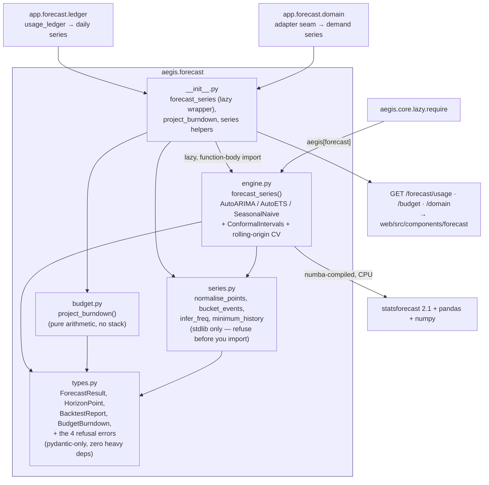
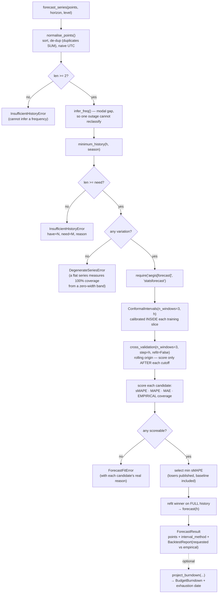

# `aegis.forecast` — time-series forecasting whose interval coverage is measured, not claimed

## What it is

`aegis.forecast` is the domain-agnostic, **LLM-free**, CPU-only forecasting module. It takes a
sequence of `(timestamp, value)` pairs and returns a horizon-indexed forecast — one
`(ts, point, lo, hi)` row per step — together with the accuracy and the interval coverage that
were **measured** on chronologically held-out data, the model that won, and the models that lost.

Two properties define it, and both are corrections of failure modes that are easy to ship by
accident:

**It splits by time, never at random.** `aegis.ml` calibrates its conformal predictor on a random
`train_test_split`. That is correct for i.i.d. tabular rows and *wrong* for a time series: a
calibration row drawn from after the rows the model trained on leaks the future into the residual
distribution, making the band optimistic and voiding the guarantee it advertises. Everything here
is chronological — the conformal band calibrates on rolling windows strictly inside the training
slice, and the rolling-origin backtest only ever scores points that lie after the cutoff whose
model produced them.

**It reports achieved coverage, not requested coverage.** `statsforecast`'s default `level=[90]`
columns are the fitted model's own predictive distribution — a model *assumption*, not a
calibration. Labelling those "90% coverage" is the same overclaim the ML spine was corrected for.
So the default band is `ConformalIntervals`, `interval_method` always states which kind of band a
caller is holding, and `BacktestReport` keeps `requested_coverage` (an input, echoed back) and
`empirical_coverage` (a count of held-out actuals that landed inside the band) in two separate
fields. On real data the second is routinely *below* the first. That gap is the finding.

Every failure is explicit. Too little history raises `InsufficientHistoryError` carrying the exact
arithmetic; a perfectly flat series raises `DegenerateSeriesError`; a series that defeats every
candidate raises `ForecastFitError`; a missing extra raises `ImportError` naming the install
command. There is **no naive-line fallback anywhere** — a plausible-looking line drawn through
nine points is the one output this module refuses to produce.

## Architecture



## Runtime flow — refuse first, then fit, then measure



## Public API

Verified against `aegis/src/aegis/forecast/__init__.py` (2026-08-14).

```python
__all__ = [
    "DEFAULT_BACKTEST_WINDOWS", "DEFAULT_CONFORMAL_WINDOWS", "FREQ_SEASON",
    "BacktestReport", "BudgetBurndown", "BurndownPoint", "CandidateScore",
    "DegenerateSeriesError", "ExcludedModel", "ForecastError", "ForecastFitError",
    "ForecastResult", "HorizonPoint", "InsufficientHistoryError", "IntervalMethod",
    "SeriesPoint", "bucket_events", "forecast_series", "infer_freq", "minimum_history",
    "normalise_points", "project_burndown", "season_length_for", "step_delta",
]
```

- **`forecast_series(points, *, series_id, label, horizon, data_source, freq=None, unit=None,
  level=0.9, interval="conformal", backtest_windows=3, conformal_windows=3,
  include_history=True) -> ForecastResult`** — the module-level contract. `points` accepts
  `(datetime, float)` pairs or `SeriesPoint`s in any order; duplicate timestamps are **summed**
  (two ledger rows in one bucket are two real events). `interval="parametric"` is available and
  is labelled distinctly on the result — it is never presented as a calibrated band.
- **`project_burndown(forecast, *, scope, scope_id, window, limit_usd, spent_usd) ->
  BudgetBurndown`** — pure arithmetic over an already-produced `ForecastResult`; imports nothing
  heavy, so the projection is testable with hand-written points.
- **`minimum_history(horizon, season_length, *, backtest_windows=3, conformal_windows=3) ->
  int`** — the refusal arithmetic, in the dependency-free layer, so a caller can decide whether a
  forecast is even offerable before paying to import `statsforecast`.
- **`bucket_events(events, freq, *, fill_gaps=True) -> list[SeriesPoint]`** — aggregates raw
  timestamped events into a regular series. An empty bucket is emitted as `0.0`: for a
  count/spend series "no rows" means "no spend", not "unknown". Pass `fill_gaps=False` where a
  gap genuinely is unknown.
- **`infer_freq(points) -> str`** — infers `"h" | "D" | "W" | "MS"` from the **modal** gap, so a
  single long outage cannot reclassify an hourly series as daily.
- **`normalise_points`**, **`season_length_for`**, **`step_delta`**, **`FREQ_SEASON`**
  (`{"h": 24, "D": 7, "W": 52, "MS": 12}`).
- Result types (all pydantic, importable with none of the stack installed):
  **`ForecastResult`** (`points`, `history`, `model`, `candidates`, `excluded_models`,
  `interval_method`, `interval_method_detail`, `requested_level`, `backtest`, `data_source`,
  `model_selected_on_backtest_windows`), **`HorizonPoint`** (`ts`, `point`, `lo`, `hi`, `step`),
  **`BacktestReport`**, **`CandidateScore`**, **`ExcludedModel`**, **`BudgetBurndown`**,
  **`BurndownPoint`**, **`SeriesPoint`**, **`IntervalMethod`**
  (`Literal["conformal", "parametric"]`).
- Refusals: **`ForecastError`** (base), **`InsufficientHistoryError`** (`.have`, `.need`,
  `.reason`), **`DegenerateSeriesError`**, **`ForecastFitError`**.

### Standalone usage

```python
from aegis.forecast import forecast_series, project_burndown

result = forecast_series(
    daily_spend_points,              # [(datetime, float), ...]
    series_id="tenant:7:spend",
    label="Daily spend (USD)",
    unit="USD",
    data_source="usage_ledger",
    horizon=14,
    level=0.9,
)

result.model                          # 'AutoETS' — the candidate that won on measured sMAPE
result.interval_method                # 'conformal'
result.backtest.requested_coverage    # 0.9   ← an input, echoed back
result.backtest.empirical_coverage    # 0.786 ← what the band ACTUALLY achieved
result.backtest.coverage_meets_request  # False, and never rounded up
result.candidates                     # every candidate, SeasonalNaive included

burn = project_burndown(
    result, scope="tenant", scope_id=7,
    window="month", limit_usd=220.0, spent_usd=128.4,
)
burn.exhaustion_ts                    # the DATE the cap is projected to be hit
burn.cumulative_bounds_are_calibrated # always False — see the note below
```

### Refusing rather than forecasting noise

```python
from aegis.forecast import InsufficientHistoryError, forecast_series, minimum_history

minimum_history(14, 7)   # 71 = 3 backtest windows x h=14, + 29 to fit and calibrate

try:
    forecast_series(nine_days, series_id="s", label="s",
                    data_source="usage_ledger", horizon=14)
except InsufficientHistoryError as exc:
    exc.have, exc.need    # (9, 71)
    exc.reason            # "...needs 3 held-out backtest window(s) plus enough history..."
```

## Install

`aegis[forecast]` — verified against `aegis/pyproject.toml`:

```
forecast = ["statsforecast>=2.1,<3", "pandas>=2.2,<2.4", "numpy>=1.26"]
```

Resolves against the pins the `ml` extra already holds (`numba==0.67.0`, `numpy<2.5`,
`pandas<2.4` — see `backend/pyproject.toml`'s `[tool.uv] constraint-dependencies`) and coexists
with shap / xgboost / mapie in one environment. **CPU only** — no GPU, no extra system libraries.
Measured on the development machine: `statsforecast` imports in ~1.7 s (cold, ~7.5 s including
numba's first JIT), and a 140-point daily series backtests three candidates and forecasts `h=14`
in ~4 s.

`aegis.forecast.types` and `aegis.forecast.series` import with **none** of that installed —
verified by `aegis/tests/forecast/test_isolation.py`, a set of subprocess guards — because
`aegis/forecast/__init__.py` defers every `engine` import to a function body and the engine
reaches `statsforecast` only through `aegis.core.lazy.require`.

## Host wiring — the two real series

`aegis.forecast` knows nothing about either. The host supplies the points.

| Use case | Host module | Series | `data_source` |
| --- | --- | --- | --- |
| Platform / team | `backend/src/app/forecast/ledger.py` | per-tenant daily spend (`cost_usd`) or call volume from `usage_ledger`, bucketed and gap-filled, tenant-scoped app-level **and** via RLS | `usage_ledger` |
| Client | `backend/src/app/forecast/domain.py` | daily arrivals from the adapter's own records (`ServiceRequest.created_at`), read through `app.adapter`'s public exports only | `adapter` |

The client series is deliberately built from **arrivals, not resolutions**: arrival volume is what
a client plans capacity against, and it is complete, whereas a resolution series silently truncates
the recent end and biases the trend downwards for no reason a reader could see. Because it is
sourced through the seam, it retargets with the rest of the platform on swap day — the forecaster
never learns what the records are.

HTTP surface (`backend/src/app/api/routes.py`, all returning one `ForecastResponse` envelope):

- `GET /forecast/usage?tenant_id&metric=spend|calls&horizon` — tenant-admin, tenant-scoped.
- `GET /forecast/budget?tenant_id&window=day|month&horizon` — tenant-admin; joins the cap from
  `budgets`, spend-so-far from `usage_ledger` and the projection into a burn-down with a date.
- `GET /forecast/domain?horizon` — any authenticated role; the client's own value surface.

A refusal is a **200 carrying `available: false`** plus a typed `refusal` (`insufficient_history`
| `degenerate_series` | `fit_failed` | `extra_missing`), not an HTTP error. "This tenant has nine
days of ledger and needs seventy-one" is a *result* and the most useful thing the surface can say;
an HTTP error would be discarded by the console as a connectivity blip and the user would learn
nothing. The console renders it as `web/src/components/forecast/RefusalNotice.tsx` — the count,
the requirement and the reason — never as an empty chart.

## Honest infra / design notes

- **Requested and achieved coverage are two fields, always.** `BacktestReport.requested_coverage`
  is what was asked for; `empirical_coverage` is the fraction of held-out actuals that fell inside
  the band across `windows × horizon` scored points. `coverage_meets_request` is a strict `>=`,
  never rounded up. The console gives the achieved number the big type and demotes the requested
  level to context.
- **The random-split trap is avoided by construction.** No code path here calibrates on rows drawn
  from after the training data. `ConformalIntervals` calibrates on rolling windows inside the
  training slice; `cross_validation(step_size=horizon)` scores only post-cutoff points.
- **Parametric bands exist and are labelled.** `interval="parametric"` returns the fitted model's
  own predictive distribution with `interval_method="parametric"` and a detail string that does
  not mention conformal calibration. The console renders `ConformalBand` *only* for a conformal
  interval, because that component's own copy reads "conformal · calibrated confidence".
- **The baseline is published, won or lost.** `SeasonalNaive` is always a candidate and always
  reported. A selection is only auditable if the reader can see what the winner actually beat.
- **The selection optimism is declared, not hidden.**
  `model_selected_on_backtest_windows=True` says the winner was chosen using the same windows the
  reported metrics come from, which makes them a mildly optimistic in-selection estimate.
- **A flat series is refused, not forecast.** A constant series (most often an all-zero ledger)
  fits perfectly, forecasts a flat line and measures **100% coverage** from a zero-width band.
  Every number is arithmetically true; together they dress the absence of data as a confident
  prediction, so `DegenerateSeriesError` is raised instead.
- **MAPE is `None` when undefined, never a huge number.** A single zero actual makes MAPE
  undefined rather than merely large; sMAPE is reported alongside precisely because it survives
  zeros.
- **The cumulative burn-down envelope is not a coverage claim.**
  `BudgetBurndown.cumulative_bounds_are_calibrated` is pinned to `False` and the console says so
  in words. Per-step conformal bounds are calibrated *marginally*; consecutive forecast errors are
  correlated, so the sum of marginal quantiles is not the quantile of the sum. The envelope is
  still the useful thing to draw — it is drawn, then explicitly flagged.
- **A failed candidate costs a candidate, not the forecast.** If the batched cross-validation
  raises, it is retried model-by-model and each casualty is recorded in `excluded_models` with the
  real exception text. Only when *every* candidate fails is `ForecastFitError` raised.
- **`approximation=True` on AutoARIMA is a measured trade, not a default.** It scores candidate
  orders by an approximated likelihood during the stepwise search and fits only the winner
  exactly: ~6.5 s → ~2.6 s on the module's own fixtures at identical sMAPE. The search is a
  heuristic either way and this endpoint fits per request.
- **Weekly buckets are `W-MON`, not `W`.** `bucket_events` floors a week to Monday; pandas' plain
  `W` alias is week-ending-Sunday, which would silently shift every forecast timestamp by six
  days. The engine maps the alias explicitly.
- **Fitting runs off the event loop.** `app.forecast.service` dispatches through
  `asyncio.to_thread` — a few seconds of numba-compiled CPU would otherwise block every other
  request on the worker — and memoises on a cheap series fingerprint so a dashboard poll does not
  re-fit.
