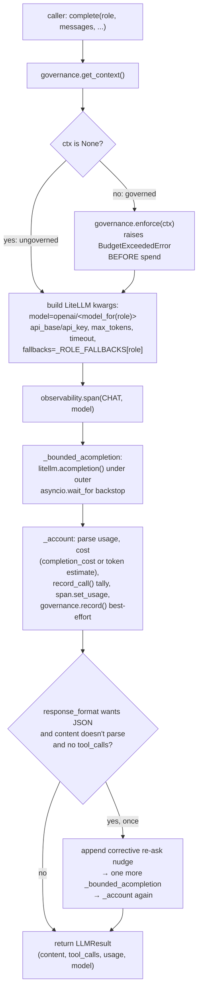

# `aegis.gateway` — the LiteLLM chokepoint, standalone and fleet-agnostic

## What it is

`aegis.gateway` is the single async door every model call in Aegis walks through. Any
agent, guardrail classifier, retrieval reranker, or eval harness that needs a completion
or an embedding calls `complete`/`embed` here — never a provider SDK directly — so
heterogeneous-fleet routing, cost accounting, and call-safety live in exactly one place
instead of being re-implemented at every call site.

The problem it solves is the one every team hits once they're calling more than one
model: code that hard-codes a deployment id ("gpt-4o") can't be swapped, budgeted, or
observed uniformly, and a raw provider SDK call has no timeout discipline, no fallback
chain, and no cost ledger. `aegis.gateway` routes by **role** (`ModelRole.CHEAP` /
`REASONING` / `GENERATION` / `EMBEDDING` / `VISION` / `VOICE`, from `aegis.core.models`)
through a **custom OpenAI-compatible provider** in LiteLLM, so swapping the underlying
fleet — or pointing a role at a different deployment — is a one-file (or one env-var)
change, never a grep-and-replace across call sites.

The SOTA technique is less a model technique than a production call-safety discipline:
every call is wrapped in a per-role **fallback chain** (LiteLLM retries a role's
configured backups on failure), a **hard outer wall-clock backstop**
(`asyncio.wait_for` on top of LiteLLM's own per-attempt timeout, so a genuinely hung
coroutine can't block a run indefinitely), a **bounded output** (`max_tokens` always
has a configured ceiling), and — for structured-output requests — **exactly one**
corrective JSON re-ask, never a retry loop. Cost is tracked per call (falling back to a
token-based estimate when the provider's cost map has no entry for a custom deployment
id) and accumulated into a measured **small-model-routing savings tally**. Budget/rate
governance and observability are **injected hooks**, each defaulting to a documented
no-op, so `aegis.gateway` carries no policy or OTel dependency of its own.

## Architecture

```mermaid
graph TD
    subgraph gateway["aegis.gateway"]
        types["types.py<br/>LLMResult, ToolCallResult,<br/>Usage, BudgetExceededError"]
        routing["routing.py<br/>model_for(role) / routing_table()<br/>is_small_model() / _COST_PER_1K"]
        llm["llm.py<br/>complete / embed / configure<br/>GatewayConfig, GovernanceHook,<br/>ObservabilitySink protocols"]
        stream["stream.py<br/>stream_complete<br/>emits model_call"]
        llm --> routing
        llm --> types
        stream --> llm
    end

    core["aegis.core"] -->|ModelRole, stream_names,<br/>SpanKind, AegisEmitter| gateway
    litellm["litellm (lazy, aegis[gateway])"] -.->|imported inside _litellm()| llm

    hostConfig["Host-supplied GatewayConfig<br/>(or env-read default)"] -->|injected via configure| llm
    hostGov["Host-supplied GovernanceHook<br/>(default: no-op)"] -->|injected via configure| llm
    hostObs["Host-supplied ObservabilitySink<br/>(default: no-op)"] -->|injected via configure| llm

    caller["Caller (agent / guardrail /<br/>retrieval / eval harness)"] -->|complete / embed| llm
    stream -->|AegisEmitter.step + .custom<br/>model_call| ui["AG-UI stream → frontend"]
```

## Runtime flow — `complete()`



## Public API

Verified against `aegis/src/aegis/gateway/__init__.py`, `llm.py`, `routing.py`,
`types.py`, and `stream.py` (2026-08-12).

```python
from aegis.gateway import (
    BudgetExceededError, LLMResult, ToolCallResult, Usage,
    complete, configure, embed, last_trace_id, record_call, usage_tally,
)
```

- **`async complete(role: ModelRole, messages: list[dict], *, tools=None,
  temperature=0.0, response_format=None, max_tokens=None) -> LLMResult`** — the chat
  completion entry point.
- **`async embed(texts: list[str]) -> list[list[float]]`** — batched embeddings via
  `ModelRole.EMBEDDING`.
- **`configure(*, config: GatewayConfig | None = None, governance: GovernanceHook |
  None = None, observability: ObservabilitySink | None = None) -> None`** — wire the
  injected hooks at host startup; any argument left `None` keeps the current binding.
- **`record_call(model_id, cost_usd, *, prompt_tokens=0, completion_tokens=0) ->
  None`** / **`usage_tally() -> dict`** (`total_calls`, `small_calls`,
  `total_cost_usd`, `baseline_cost_usd`, `cost_saved_usd`, `small_model_share`) —
  the process-wide small-model-routing savings metric.
- **`last_trace_id() -> str | None`** — the active trace id from the injected
  observability sink.
- **`BudgetExceededError(*, scope, scope_id, limit_type, limit, used,
  message=None)`** — raised by `complete`/`embed` before spend when governance refuses
  the call.
- Result types (pydantic, in `aegis.gateway.types`, also re-exported at package root):
  `Usage{prompt_tokens, completion_tokens, cost_usd}`,
  `ToolCallResult{id, name, args}`,
  `LLMResult{content, tool_calls, usage, model}`.
- Not re-exported at the package root but importable directly:
  `aegis.gateway.routing` (`model_for(role)`, `routing_table()`, `is_small_model(id)`),
  `aegis.gateway.llm` (`GatewayConfig`, `GovernanceHook`, `ObservabilitySink`
  protocols, `GenAIOperation`), `aegis.gateway.stream` (`stream_complete`).
- `aegis.core.models.ModelRole` is the role enum `complete`/`embed` route on — it lives
  in `aegis.core`, not `aegis.gateway`, so any light module can depend on it without
  pulling in the gateway.

### Standalone usage

```python
from aegis.gateway import complete, configure, usage_tally
from aegis.core.models import ModelRole

configure(config=my_gateway_config)  # or rely on GATEWAY_* env vars (see Install)

result = await complete(
    ModelRole.CHEAP,
    [{"role": "user", "content": "Classify this ticket in one word."}],
)
result.content        # assistant text
result.usage.cost_usd  # per-call cost (real or token-estimated)
usage_tally()["cost_saved_usd"]  # cumulative small-model-routing saving
```

### AG-UI streaming usage

```python
from aegis.core.stream import AegisEmitter
from aegis.core.models import ModelRole
from aegis.gateway.stream import stream_complete

emitter = AegisEmitter(thread_id="t1", run_id="r1", sink=my_sse_sink)
result = await stream_complete(
    ModelRole.GENERATION, [{"role": "user", "content": "..."}], emitter
)
# emits: STEP_STARTED("llm", LLM) -> CUSTOM("model_call", {...}) -> STEP_FINISHED
```

## Install

`aegis[gateway]` — `litellm>=1.52`, the module's only heavy dependency, and it is
**lazy**: `litellm` is imported inside `_litellm()` on first real call, so
`import aegis.gateway` (and `configure()`) never requires it to be installed. This is
enforced by an import-isolation guard test (subprocess check that `litellm` never
lands in `sys.modules` from a bare import). Everything else `aegis.gateway` needs
(`aegis.core.models.ModelRole`, pydantic) comes with bare `aegis.core`.

## AG-UI events it emits

- **`CustomEvent(name="model_call")`**, emitted by `aegis.gateway.stream.stream_complete`
  (bracketed by `STEP_STARTED`/`STEP_FINISHED` with `step_name="llm"`,
  `SpanKind.LLM`). This is an **opt-in helper** — `complete`/`embed` themselves never
  stream (they're also called from non-agentic code paths, e.g. an eval harness), so a
  caller chooses `stream_complete` only when it wants the event. Payload, verified
  against `stream.py`:

  ```json
  {
    "model": "genailab-maas-gpt-4o",
    "role": "generation",
    "prompt_tokens": 128,
    "completion_tokens": 64,
    "cost_usd": 0.0021,
    "cost_saved_usd": 0.0,
    "small_model": false
  }
  ```

  `cost_saved_usd` is the delta of `usage_tally()["cost_saved_usd"]` measured
  before/after this one call (not the cumulative process total), so the payload
  reflects what *this* call alone saved.

On the frontend, `model_call` is mirrored 1:1 in `web/src/lib/streamNames.ts`
(`MODEL_CALL: "model_call"`). As of this writing there is no dedicated renderer
wired to this event anywhere in the frontend — `web/src/lib/api/sse.ts` can
decode the SSE frame, but no per-event React component consumes it yet.

## Honest infra / design notes

- **Governance and observability are injected, not hard-wired.** `GovernanceHook`
  (`get_context`, `async enforce`, `async record`) and `ObservabilitySink` (`span`,
  `set_usage`, `trace_id`) are `Protocol`s with documented no-op defaults
  (`_NoOpGovernance`, `_NoOpObservability`) — standalone `aegis.gateway` does **no**
  budget enforcement and opens **no** span unless a host injects real implementations.
  This is explicit, not a silent gap: the no-op is a deliberate, documented default so
  the module stays usable with just an api key/base url.
- **Enforce before spend, always.** `complete`/`embed` call
  `governance.enforce(ctx)` **before** the model call — a tripped cap raises
  `BudgetExceededError` and no `acompletion`/`aembedding` call is ever made.
- **Ledger writes are best-effort, not a control path.** `governance.record(...)` is
  wrapped centrally in `_record_usage`, which swallows and logs any exception — a
  durable-usage-row write failure must never fail a model call that already succeeded.
- **Hard outer timeout backstop.** LiteLLM receives a per-attempt `timeout`, but a
  genuinely hung coroutine could still ignore it; `_bounded_acompletion` wraps the
  whole call (primary + every fallback) in an outer `asyncio.wait_for`, so the await
  always returns — on expiry it raises `TimeoutError` and the run fails closed rather
  than hanging indefinitely.
- **Cost is never silently zero.** When a provider's cost map has no entry for a
  custom/self-hosted deployment id, `litellm.completion_cost` returns `0.0`; the
  gateway falls back to `_estimate_cost` (an honest, env-overridable per-role
  $/1k-token rate) so the cost dashboard reflects real spend instead of a
  free-looking `$0`.
- **One re-ask, never a loop.** A structured-output request whose reply doesn't parse
  as JSON gets exactly one corrective nudge-and-retry; a second failure is returned
  as-is rather than looping.
- **Isolation is enforced by test, not convention.** `aegis/tests/gateway/test_isolation.py`
  subprocess-checks that `import aegis.gateway` (and every submodule) never pulls
  `litellm` into `sys.modules`.
