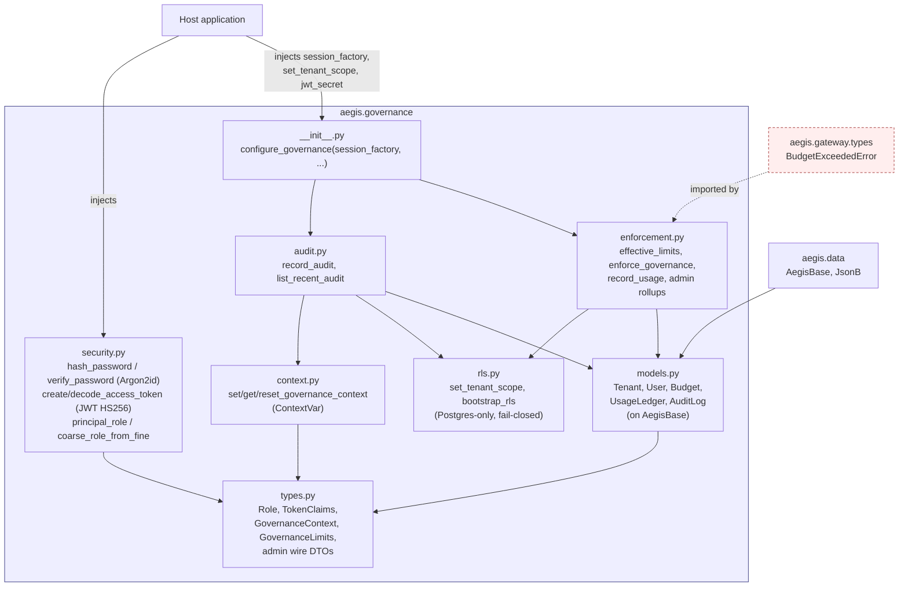
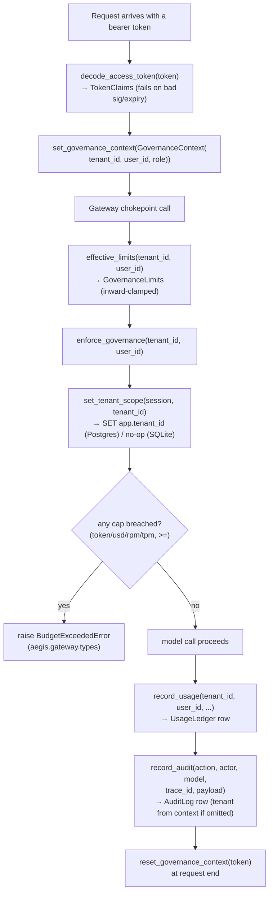

# `aegis.governance` — the importable multi-tenant governance core

## What it is

`aegis.governance` is the platform's answer to "who is allowed to do this, how much can
they spend, and can we prove it afterward." It bundles four things that a multi-tenant
enterprise agentic system needs together, not separately: JWT (HS256) + Argon2id
authentication, a four-tier RBAC model (`platform_admin` / `tenant_admin` / `ai_team` /
`devops` / `client`, derived from a coarse `Role` enum plus tenancy), hierarchical
tenant→user budget enforcement (token/USD/RPM/TPM caps, clamped inward), and a
first-class audit trail — every autonomous or approved action recorded with its actor,
model, trace id, and approver. A per-request `GovernanceContext` is threaded through a
`contextvars.ContextVar` so the tenant/user/role and effective limits reach the gateway
chokepoint without a tenant id being plumbed through every call signature.

The problem it solves is the one every multi-tenant SaaS platform hits eventually:
enforcement logic that starts as a single `if tenant.spend > limit` check slowly grows
tendrils into the API layer, the ORM layer, and the request middleware, until no one can
say with confidence where isolation is actually enforced. `aegis.governance` centralizes
it instead: one contextvar seam for identity, one enforcement chokepoint for spend, one
writer for the audit trail, and — critically — **two independent layers of tenant
isolation** rather than one. App-level `WHERE tenant_id = :ctx` scoping is always
applied; Postgres Row-Level Security is layered *underneath* it as the DB-enforced
backstop, so a bug in the app-level `WHERE` clause is not a cross-tenant data leak by
itself.

The SOTA technique is really two well-established primitives applied without
compromise: **Argon2id** (the Password Hashing Competition winner) for credentials, and
**Postgres RLS with a fail-closed policy** for tenant isolation — a policy that admits a
row only when the session's `app.tenant_id` GUC matches, so an *unset* GUC (a bug, not a
malicious tenant) admits **nothing**, not everything. Budget enforcement uses inward
clamping: a user's cap can only tighten its tenant's cap, never loosen it, and whichever
level breaches first is the one raised in the error. All of this is dependency-injected
— the JWT secret, the session factory, and the RLS binder are wired once at host startup
via `configure_security` / `configure_governance`, so the package never imports a host's
config module and stays fully testable offline (SQLite, where RLS becomes a documented
no-op and app-level scoping is the only layer).

## Architecture



Note the dashed edge: `enforcement.py` imports `BudgetExceededError` directly from
`aegis.gateway.types`. Every other module in this series (`aegis.core`, `aegis.data`,
`aegis.guardrails`) holds to the invariant "a leaf module imports only `aegis.core` plus
its own third-party libs; no leaf-to-leaf import." `aegis.governance` is the one place in
the code as inspected that breaks it — a real, verified deviation from the Module
Contract's stated boundary rule, not a design choice this doc is proposing.

## Runtime flow — a governed model call, end to end



## Public API

Verified against `aegis/src/aegis/governance/__init__.py` and each named submodule
(2026-08-12).

```python
from aegis.governance import (
    MEMBER, PLATFORM_ADMIN, TENANT_ADMIN,
    AdminUserRow, AuditLog, AuditLogRow, Budget, BudgetRow, BudgetScope, BudgetWindow,
    GovernanceContext, GovernanceLimits, LastPlatformAdminError, Role, SecurityConfig,
    Tenant, TenantRow, TenantStatus, TokenClaims, UsageByModel, UsageLedger,
    UsageSeriesPoint, User,
    bootstrap_rls, coarse_role_from_fine, configure_audit, configure_enforcement,
    configure_governance, configure_security, create_access_token, decode_access_token,
    effective_limits, enforce_governance, get_governance_context, hash_password,
    list_budgets, list_recent_audit, list_tenants, list_users, principal_role,
    record_audit, record_usage, reset_governance_context, set_governance_context,
    set_tenant_scope, update_user_role, upsert_budget, usage_rollup, user_tenant_id,
    verify_password,
)
```

Key symbols, by file:

- **`security.py`** — `hash_password(password) -> str` / `verify_password(password,
  hash) -> bool` (Argon2id; `verify_password` never raises, returns `False` on any
  malformed/absent hash). `create_access_token(*, user_id, username, role, tenant_id,
  coarse_role=None, expires_minutes=None) -> str` / `decode_access_token(token) ->
  TokenClaims` (HS256 JWT). `principal_role(role, tenant_id) -> str` /
  `coarse_role_from_fine(fine_role) -> str` derive/collapse the fine RBAC tier.
  `configure_security(jwt_secret, jwt_algorithm="HS256", jwt_expire_minutes=720)` wires
  the signing config (a documented, non-secret dev default ships for offline paths).
- **`context.py`** — `set_governance_context(ctx) -> Token`, `get_governance_context() ->
  GovernanceContext | None`, `reset_governance_context(token)`, over one process-wide
  `ContextVar`.
- **`enforcement.py`** — `configure_enforcement(*, session_factory, set_tenant_scope=None)`.
  `effective_limits(tenant_id, user_id) -> GovernanceLimits`. `enforce_governance(*,
  tenant_id, user_id)` raises `aegis.gateway.types.BudgetExceededError` on the first
  breached cap (checked user-scope first). `record_usage(...)` writes one
  `UsageLedger` row. Admin surfaces: `list_tenants`, `list_users`, `list_budgets`,
  `upsert_budget`, `update_user_role` (raises `LastPlatformAdminError` rather than
  demote the platform's last global admin), `usage_rollup`, `user_tenant_id`.
- **`audit.py`** — `configure_audit(*, session_factory, set_tenant_scope=None)`.
  `record_audit(*, action, actor, model, trace_id, payload, approved_by=None,
  tenant_id=None)` (pulls `tenant_id` from the governance context when omitted).
  `list_recent_audit(limit=50, *, tenant_id=None) -> list[AuditLogRow]`.
- **`rls.py`** — `set_tenant_scope(session, tenant_id)` (`SET app.tenant_id` on
  Postgres; no-op on SQLite). `bootstrap_rls(engine)` (Postgres-only, idempotent:
  `ENABLE ROW LEVEL SECURITY` + a `tenant_isolation` policy on `users` /
  `usage_ledger` / `approvals`).
- **`models.py`** — `Tenant`, `User`, `Budget`, `UsageLedger`, `AuditLog` (all on
  `aegis.data.AegisBase`) plus `TenantStatus`, `BudgetScope`, `BudgetWindow` enums.
- **`types.py`** — `Role` (`admin|ai_team|devops|client`), `TokenClaims`,
  `GovernanceLimits`, `GovernanceContext`, and the admin wire DTOs (`TenantRow`,
  `AdminUserRow`, `BudgetRow`, `UsageByModel`, `UsageSeriesPoint`, `AuditLogRow`) — all
  Pydantic/stdlib, importable without pulling `sqlalchemy`/`pyjwt`/`argon2`.
- **`__init__.py`** — `configure_governance(*, session_factory, set_tenant_scope=None)`
  is the one-call convenience that wires both `configure_enforcement` and
  `configure_audit` from a single injected session factory.

### Standalone usage

```python
from sqlalchemy.ext.asyncio import async_sessionmaker, create_async_engine
from aegis.data import AegisBase
from aegis.governance import (
    configure_governance, configure_security, create_access_token, decode_access_token,
    enforce_governance, record_audit, record_usage, upsert_budget,
)
from aegis.governance import models  # noqa: F401 - registers tables on AegisBase

engine = create_async_engine("sqlite+aiosqlite:///:memory:")
Session = async_sessionmaker(engine, expire_on_commit=False)

configure_security(jwt_secret="a-real-secret-in-production")
configure_governance(session_factory=Session)  # wires enforcement + audit

async def bootstrap() -> None:
    async with engine.begin() as conn:
        await conn.run_sync(AegisBase.metadata.create_all)
    await upsert_budget(scope_type="tenant", scope_id=1, token_cap=100_000, usd_cap=5.0)

token = create_access_token(user_id=42, username="jane", role="client", tenant_id=1)
claims = decode_access_token(token)  # raises jwt.InvalidTokenError if tampered/expired

async def governed_call() -> None:
    await enforce_governance(tenant_id=claims.tenant_id, user_id=claims.user_id)
    # ... call the model ...
    await record_usage(tenant_id=1, user_id=42, model="gpt-4o-mini",
                        prompt_tokens=120, completion_tokens=40, cost_usd=0.002,
                        trace_id="abc123")
    await record_audit(action="tool:create_ticket", actor="jane", model="gpt-4o-mini",
                        trace_id="abc123", payload={"ticket_id": 991})
```

## Install

`aegis[governance]` — verified against `aegis/pyproject.toml`:
`sqlalchemy[asyncio]>=2.0`, `pgvector>=0.3`, `pyjwt>=2.9`, `argon2-cffi>=23.1`. This
single extra covers both the ORM (`aegis.data`'s own needs) and the auth primitives — no
separate `aegis[data]` install is required alongside it.

## AG-UI events it emits

None. There is no `stream.py` in `aegis/src/aegis/governance/` and no code path
constructs an `AegisEmitter` or calls `.custom(...)` — verified by reading every file in
the package. `aegis.governance` is a pure data/auth layer: budget breaches surface as a
raised `BudgetExceededError` for the caller (the gateway/orchestrator) to translate into
whatever surface it streams through, and audit writes are plain database rows with no
corresponding stream event. The design map for this module notes a `budget_exceeded`
AG-UI event exists in the host orchestrator today, but it is emitted by that host code,
not by anything inside `aegis.governance` itself — worth stating plainly rather than
implying the package streams it.

## Honest infra / design notes

- **Two independent isolation layers, not one.** App-level `WHERE tenant_id = :ctx`
  scoping runs on every governed query regardless of dialect; Postgres RLS
  (`bootstrap_rls` + `set_tenant_scope`) is a second, DB-enforced layer underneath it.
  RLS fails **closed**: an unset `app.tenant_id` GUC matches no rows, not every row.
  SQLite (the test database) has no RLS concept, so app-level scoping is honestly the
  only layer there — the module never pretends otherwise.
- **Fail-closed password verification.** `verify_password` never raises — a malformed
  hash, a missing hash, or a genuine mismatch all return `False`, so a bug in error
  handling can never accidentally admit a login.
- **Inward-clamped hierarchical budgets.** A user's effective cap is
  `min(user_cap, tenant_cap)` for every field independently; enforcement checks
  user-scoped budgets before tenant-scoped ones so a breach is attributed to the
  actual over-spending user first.
- **Defensive lockout guard.** `update_user_role` refuses to demote the platform's last
  global (`tenant_id is None`) `admin`, raising `LastPlatformAdminError` rather than
  silently locking every platform-admin surface.
- **Config injected, never imported.** `configure_security` / `configure_governance`
  are the only way this package learns a JWT secret or a session factory — there is no
  host config import anywhere in the package, matching the same seam pattern
  `aegis.ops.config` uses.
- **A real, verified boundary crack.** `aegis.governance.enforcement` imports
  `BudgetExceededError` from `aegis.gateway.types` — a leaf-to-leaf import that the
  Module Contract's stated invariant ("no leaf-to-leaf import," see
  `docs/module/aegis-core.md`) says should not exist. This doc reports it rather than
  papering over it: as of this writing, budget-breach errors live in `aegis.gateway`,
  and `aegis.governance` reaches across the leaf boundary to raise the caller's own
  exception type instead of defining its own.
