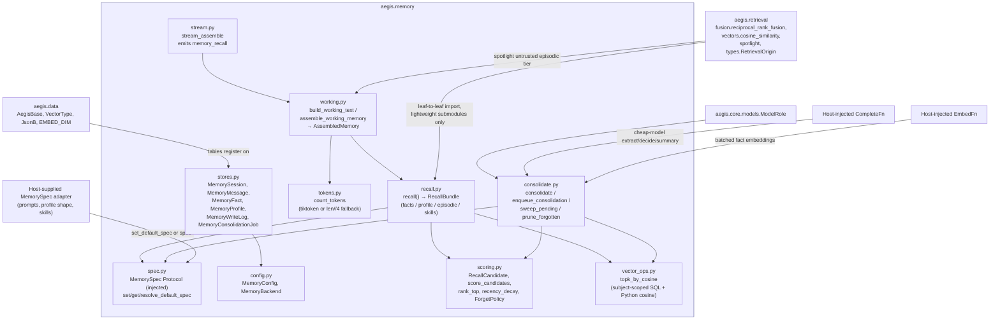
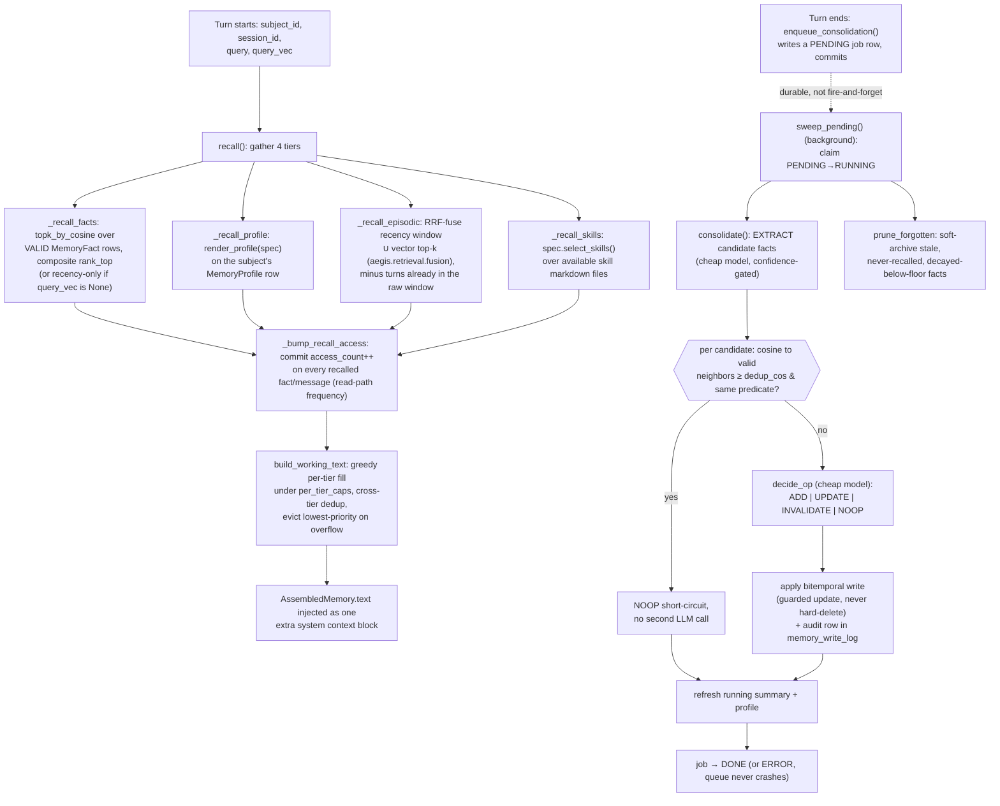

# `aegis.memory` — long-term memory and context engineering

## What it is

`aegis.memory` is the three-tier long-term memory subsystem behind an agent that needs
to remember a subject across turns and sessions without either re-reading the entire
conversation history every time or forgetting everything the moment the context window
rolls over. It persists raw turns cheaply (episodic), lazily distils durable typed facts
with a cheap model (semantic, bitemporal), recalls by a blended relevance score, and
assembles a working-memory block under a hard token budget — the actual context a model
sees is a curated, ordered, budgeted artifact, not a raw transcript dump.

The problem it solves is context engineering, not just storage: naive "stuff everything
into the prompt" approaches either blow the context window or bury the one fact that
matters in the middle of a wall of text (the "lost-in-the-middle" effect). `aegis.memory`
treats recall and assembly as two separate, individually-testable problems — *what* to
recall (relevance/recency/importance/frequency scoring) and *how* to lay it out
(deterministic, non-LLM budgeting with priority-ordered eviction) — so correctness bugs
in one don't hide in the other.

The SOTA techniques are drawn from three published systems and combined: a
**Generative-Agents-style recall composite** (min-max-normalized blend of relevance +
exponential recency decay + importance + log-frequency, each independently tunable);
**mem0-style two-phase consolidation** (a cheap-model EXTRACT pass over the running
summary + last-M turns, then a per-candidate RECONCILE pass that dedup-short-circuits
near-duplicate facts without a second LLM call and otherwise asks the model to decide
ADD/UPDATE/INVALIDATE/NOOP); and **Zep-style bitemporal fact versioning** (a fact is
never hard-deleted — `valid_at`/`invalid_at` track world-time, `created_at`/`expired_at`
track transaction-time, so contradictions and refinements are auditable, not
overwrites). Working-memory assembly is a **deterministic, non-LLM budgeter**: greedy
per-tier fill under token caps, lost-in-the-middle-aware layout (durable material top and
bottom, bulk/lossy episodic recall in the tolerant middle), and priority-ordered eviction
when the assembled text still overflows the ceiling.

## Architecture



## Runtime flow — one turn: recall → assemble → (background) consolidate



## Public API

Verified against `aegis/src/aegis/memory/__init__.py` (2026-08-12).

```python
from aegis.memory import (
    AssembledMemory, ConsolidationResult, ConsolidationStatus, ForgetPolicy,
    MemoryBackend, MemoryConfig, MemoryConsolidationJob, MemoryFact, MemoryMessage,
    MemoryOrigin, MemoryProfile, MemorySession, MemorySpec, MemoryWriteLog,
    RecallBundle, RecallCandidate, WriteOp,
    assemble_working_memory, build_working_text, consolidate, enqueue_consolidation,
    get_default_spec, load_raw_window, minmax, prune_forgotten, rank_top, recall,
    recency_decay, resolve_spec, score_candidates, set_default_spec, sweep_pending,
)
```

- **`recall(session, *, subject_id, session_id, persona, query, query_vec, config,
  tenant_id=None, spec=None) -> RecallBundle`** — gather all four recall tiers
  (selection only; no budgeting). Every query is scoped to `subject_id` (+ `tenant_id`
  when given) — the primary, RLS-independent isolator.
- **`assemble_working_memory(session, *, subject_id, session_id, persona, query,
  query_vec, config, tenant_id=None, spec=None) -> AssembledMemory`** — `recall()` +
  the pure `build_working_text()` in one call; never calls a model.
- **`build_working_text(bundle: RecallBundle, raw_turns, *, query, config) ->
  AssembledMemory`** — the pure, DB-free budgeter (`AssembledMemory{text,
  recalled_fact_ids, recalled_message_ids, tokens_used}`).
- **`consolidate(session, *, subject_id, session_id, config, complete, embed,
  tenant_id=None, trace_id=None, spec=None) -> ConsolidationResult`** — mem0
  EXTRACT→RECONCILE, applies Zep bitemporal writes; does not commit (caller owns the
  transaction).
- **`enqueue_consolidation(session, *, subject_id, session_id, tenant_id=None) ->
  MemoryConsolidationJob`** — writes and commits a `PENDING` job row synchronously
  (the durability seam against fire-and-forget task loss).
- **`sweep_pending(session, *, config, complete, embed, limit=10, spec=None) -> int`**
  — claims and runs up to `limit` `PENDING` jobs (guarded claim, so two sweepers can't
  double-run one), then also runs `prune_forgotten`.
- **`prune_forgotten(session, *, config, limit=500, trace_id=None) -> int`** —
  soft-archives (never hard-deletes) decayed, never-recalled, aged-out facts.
- **`MemorySpec`** (Protocol, `spec.py`) — the injected domain contract:
  `FACT_EXTRACTION_PROMPT`, `IMPORTANCE_HINTS`, `PROFILE_FIELDS`, `FACT_TYPES`,
  `SKILLS_DIR`, `FactSchema`, `FactExtraction`, `render_profile(dict) -> str`,
  `select_skills(query, persona, available) -> list[str] | None`. Configure once via
  `set_default_spec(spec)`, or pass `spec=` per call; `get_default_spec()` raises
  `RuntimeError` if neither was ever supplied.
- **`MemoryConfig`** (`config.py`) — every recall/consolidation/budget knob
  (`raw_window_turns`, `k_fact`/`n_fact`, `tau_extract`, `dedup_cos`, `w_rel`/`w_rec`/
  `w_imp`/`w_freq`, `ctx_token_cap`, `per_tier_caps`, `memory_backend`, …), all
  mechanism parameters — domain-neutral, dataclass defaults.
- **`stores.py`** models (`MemorySession`, `MemoryMessage`, `MemoryFact`,
  `MemoryProfile`, `MemoryWriteLog`, `MemoryConsolidationJob`) — SQLAlchemy models
  registered on `aegis.data.AegisBase`; the host owns the engine and drives
  `create_all`.
- Not re-exported at the package root but importable directly:
  `aegis.memory.vector_ops.topk_by_cosine`, `aegis.memory.stream.stream_assemble`.

### Standalone usage

```python
from aegis.memory import (
    MemoryConfig, assemble_working_memory, enqueue_consolidation,
    set_default_spec, sweep_pending,
)
from my_domain_adapter import memory_spec  # satisfies MemorySpec structurally

set_default_spec(memory_spec)  # host wires its domain contract once at startup

config = MemoryConfig()
assembled = await assemble_working_memory(
    session,
    subject_id="user-42",
    session_id="thread-7",
    persona="support-agent",
    query="What shipping address did I give last time?",
    query_vec=await my_embed(["What shipping address..."]),
    config=config,
)
assembled.text          # the one extra system context block to inject
assembled.tokens_used    # <= config.ctx_token_cap - config.answer_reserve - query tokens

# Durable, request-time enqueue; a background sweeper drains it off the hot path.
await enqueue_consolidation(session, subject_id="user-42", session_id="thread-7")
await sweep_pending(session, config=config, complete=my_complete, embed=my_embed)
```

### AG-UI streaming usage

```python
from aegis.core.stream import AegisEmitter
from aegis.memory.stream import stream_assemble

emitter = AegisEmitter(thread_id="t1", run_id="r1", sink=my_sse_sink)
assembled = await stream_assemble(
    my_memory_facade,  # anything with an async .assemble(...) -> AssembledMemory
    emitter,
    subject_id="user-42", session_id="thread-7", query="...",
)
# emits: STEP_STARTED("recall_memory", CHAIN) -> CUSTOM("memory_recall") -> STEP_FINISHED
```

## Install

`aegis[data]` — `sqlalchemy[asyncio]>=2.0` + `pgvector>=0.3`. **There is no dedicated
`memory` extra in `aegis/pyproject.toml`** — verified against the real
`[project.optional-dependencies]` table, which lists `data`, `gateway`, `retrieval`,
`governance`, `ml`, `redis`, `nemo`, `postgres`, `observability`, `phoenix`, `all`,
`dev`, and no `memory` key. `import aegis.memory` requires `sqlalchemy`/`pgvector`
(from `aegis.data`, via `stores.py`) unconditionally — that's a hard, not optional,
dependency for this module, confirmed by `aegis/tests/memory/test_isolation.py`.

One deviation worth calling out: `aegis.memory.recall`/`vector_ops`/`working` import
`aegis.retrieval.fusion`, `aegis.retrieval.vectors`, `aegis.retrieval.spotlight`, and
`aegis.retrieval.types` for RRF fusion, cosine similarity, and spotlighting. Because
Python runs a package's `__init__.py` on any submodule import, `import aegis.memory`
transitively imports the **whole** `aegis.retrieval` package — but every heavy backend
in `aegis.retrieval` (`lightrag`, `neo4j`, `redis`) is itself lazy-imported inside
methods, so this costs nothing extra beyond `aegis[data]`; it does **not** require
`aegis[retrieval]`. This is confirmed by the isolation test, which explicitly bans
`lightrag`/`neo4j`/`redis`/`litellm` (etc.) from `sys.modules` after `import
aegis.memory`, while asserting `sqlalchemy` **is** present. It is also a real exception
to the "no leaf-to-leaf import" boundary invariant `aegis.core`'s docs describe for the
platform generally — `aegis.memory` is a leaf depending on another leaf
(`aegis.retrieval`), by design, for shared pure-math/schema submodules rather than
duplicating RRF fusion and cosine similarity.

The Redis-backed rolling-window tier (`MemoryConfig.memory_backend = "redis"`) named
in `config.py`'s `MemoryBackend` type is a **documented target, not yet wired** — no
`aegis[redis]` dependency is required to run `aegis.memory` today. The two ends of the
degradation ladder are real: `postgres` (full durable three-tier subsystem) is the live
path, and memory is effectively `off` whenever a host provides no `session_id`/memory
deps (the intermediate `redis` tier is future work).

## AG-UI events it emits

- **`CustomEvent(name="memory_recall")`**, emitted by
  `aegis.memory.stream.stream_assemble` (bracketed by `STEP_STARTED`/`STEP_FINISHED`
  with `step_name="recall_memory"`, `SpanKind.CHAIN`). Payload, verified against
  `stream.py`:

  ```json
  {
    "recalled_fact_count": 3,
    "recalled_message_count": 5,
    "tokens_used": 612
  }
  ```

  Never calls a model — assembly is fully deterministic (`build_working_text` does no
  LLM call), so this event reflects a pure read-and-budget operation, not a generation.

On the frontend, `memory_recall` is mirrored 1:1 in
`web/src/lib/streamNames.ts` (`MEMORY_RECALL: "memory_recall"`). As of this
writing there is no dedicated renderer wired to this event anywhere in the frontend —
`web/src/lib/api/sse.ts` can decode the raw SSE frame, but no per-event React
component (e.g. a "recalled N facts, M turns, used K tokens" card) consumes it yet.

## Honest infra / design notes

- **App-level isolation first, RLS additive.** Every recall/consolidate/prune query
  filters `subject_id` (and `tenant_id` when given) directly in its `WHERE` clause —
  the primary, NULL-safe, dialect-independent isolator. Postgres RLS is an optional
  belt a host may add; it is never relied upon as the sole isolation mechanism.
- **Bitemporal, never hard-delete.** `MemoryFact` rows are contradicted
  (`invalid_at`) or refined (`expired_at` + `supersedes_id`) under a guarded
  `UPDATE ... WHERE invalid_at IS NULL AND expired_at IS NULL` — a concurrency check
  that degrades a lost race to a `NOOP` rather than a lost write. History stays
  auditable in `memory_write_log`; the forgetting sweep (`prune_forgotten`)
  soft-archives, it never deletes.
- **Recency-only degradation is explicit, not silent.** When `query_vec` is `None`
  (an exact-cache hit that never computed one, or a lite-mode reduced-dim vector),
  `_recall_facts` falls back to `ORDER BY valid_at DESC` — a real, documented
  degradation path, not a caught exception. `embedding_dim` is recorded on
  `MemoryMessage` precisely so a mismatched-dimension vector is never mistaken for a
  recall-comparable one (`vector_ops.topk_by_cosine` skips any row whose stored
  embedding length doesn't match the query vector's).
- **Portable vector search by construction, not by luck.** `topk_by_cosine` filters to
  the subject's (small, indexed) candidate rows in SQL, then computes cosine in
  **Python** over that bounded set — deliberately avoiding pgvector's `<=>` operator at
  query time so the identical code path runs correctly on the SQLite test database and
  on Postgres in production, never diverging behavior by dialect.
- **Durable consolidation queue, not fire-and-forget.** `enqueue_consolidation` commits
  a `PENDING` row synchronously in the request path; `sweep_pending` claims rows with a
  guarded `PENDING → RUNNING` update (races safely) and always flips a job to a
  terminal `DONE`/`ERROR` state — a crash or redeploy between enqueue and drain loses
  no work, unlike a bare `asyncio.create_task`.
- **Dedup short-circuit saves real LLM calls, but the fallback is honest.** A candidate
  fact whose top neighbor is `>= dedup_cos` similarity and shares its predicate is
  resolved as a `NOOP` with zero LLM calls; every other candidate still gets a real
  `decide_op` model call rather than a heuristic guess.
- **One quiet exception to "fail loud":** `tokens.py`'s `count_tokens` tries
  `tiktoken` and falls back to a `len // 4` heuristic on `ImportError`, silently and by
  design (documented in the module docstring) — the budgeter only needs a consistent,
  monotone estimate, not exactness, so this is a deliberate, low-stakes exception to
  `aegis.core`'s general "fail loud, no silent fallback" posture rather than an oversight.
- **Domain meaning is fully injected.** What counts as a "fact," how the profile
  renders, and which skills apply are never hard-coded — they come from the
  structurally-typed `MemorySpec` a host supplies via `set_default_spec` or `spec=`.
  `aegis.memory` itself has no opinion on domain; it only owns the recall/consolidate/
  budget mechanism.
