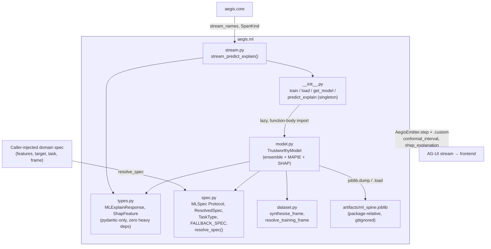
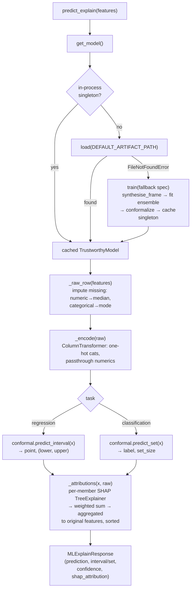

# `aegis.ml` — the trustworthy-ML spine: ensemble + conformal interval + SHAP

## What it is

`aegis.ml` answers a question every "AI predicts X" feature eventually has to face: how much
should anyone trust the number? A raw point prediction from a single model is silent about its
own uncertainty and offers no reason a human can audit. `aegis.ml` is a domain-agnostic,
**LLM-free** prediction engine that never emits a bare number — every prediction ships with a
calibrated interval (or a calibrated prediction *set*, for classification) and a signed
per-feature explanation, so the agent that consumes it can present real evidence ("predicts 4.4h,
90% coverage, driven mainly by X and Y") instead of a confident-sounding guess. *What* to predict
(feature columns, target column, task type) is supplied by an injected spec object — the spine
itself carries no domain knowledge and falls back to a self-contained synthetic spec when none is
given, so it trains, calibrates, explains and round-trips through disk with no network and no
domain code.

The SOTA technique is three verified, CPU-only components stacked correctly: a **soft-voting
ensemble** (XGBoost `+` scikit-learn `HistGradientBoosting`, averaged) reduces variance versus
either learner alone while staying light enough for a 16 GB / no-GPU machine; **MAPIE split
conformal prediction** wraps the *already-fitted* ensemble and, using a calibration split
disjoint from training, produces intervals (regression) or prediction sets (classification) with
a **guaranteed marginal coverage** — not a heuristic confidence score, an actual statistical
guarantee; and **SHAP `TreeExplainer`**, run once per ensemble member and averaged with the
members' voting weights, then aggregated from the one-hot-encoded matrix back to the caller's
*original* feature names, so the reported drivers are the domain's own columns, not opaque encoded
ones.

The ensemble is deliberately a **solution signal only** — `aegis.ml` never gates, defers, or
terminates a run; a failed or low-confidence prediction is simply omitted by the caller,
best-effort. Swapping or adding ensemble members (a `RandomForest`, a linear model, a stacking
meta-learner) is a one-function edit at the documented "estimator reshape point"
(`_regression_members` / `_classification_members` in `model.py`) — the conformal and SHAP
plumbing adapts automatically to whatever tree-based members are listed there.

## Architecture



## Runtime flow — cold-start resolution, then predict/conformalise/explain



## Public API

Verified against `aegis/src/aegis/ml/__init__.py` (2026-08-12).

```python
__all__ = [
    "DEFAULT_ARTIFACT_PATH", "FALLBACK_SPEC", "MLSpec", "ResolvedSpec", "TaskType",
    "TrustworthyModel", "get_model", "load", "predict_explain", "resolve_spec", "train",
]
```

- **`predict_explain(features: dict[str, Any]) -> MLExplainResponse`** — the module-level
  contract: resolves the process-wide singleton via `get_model()`, then predicts, conformalises
  and explains one row.
- **`get_model() -> TrustworthyModel`** — resolution order: in-process singleton → `load()` from
  `DEFAULT_ARTIFACT_PATH` → a freshly `train()`ed fallback model, so the endpoint always answers
  even before any artifact exists.
- **`train(spec=None, frame=None, *, confidence_level=0.9, calibration_size=0.25,
  random_state=0, path=DEFAULT_ARTIFACT_PATH) -> TrustworthyModel`** — fits the ensemble on a
  training split, calibrates MAPIE on a disjoint calibration split, persists via `joblib`, and
  updates the singleton. `spec=None` resolves to `FALLBACK_SPEC`; `frame=None` synthesises data.
- **`load(path=DEFAULT_ARTIFACT_PATH) -> TrustworthyModel`** — loads a persisted spine and caches
  it as the singleton; raises `FileNotFoundError` if `path` doesn't exist (caught internally by
  `get_model()`, not swallowed elsewhere).
- **`resolve_spec(spec=None) -> ResolvedSpec`**, **`FALLBACK_SPEC`**, **`MLSpec`** (a
  `runtime_checkable` `Protocol`: `features: list[str]`, `target: str`), **`ResolvedSpec`**
  (frozen dataclass: `features`, `target`, `task`, `categorical_features`, `frame_provider`,
  `.numeric_features`), **`TaskType`** (`Literal["regression", "classification"]`).
- **`TrustworthyModel`** — reachable as `aegis.ml.TrustworthyModel` via a `__getattr__` lazy
  re-export (kept out of eager `__init__` imports so `import aegis.ml.types` stays free of
  xgboost/sklearn/mapie/shap). Key methods: `.train(...)` (classmethod), `.load(...)`
  (classmethod), `.save(path)`, `.predict_explain(features)`.
- **`DEFAULT_ARTIFACT_PATH`** — `Path`, package-relative (`aegis/ml/artifacts/ml_spine.joblib`).
- Importable directly but not in `__all__`: `aegis.ml.types.MLExplainResponse` / `.ShapFeature`
  (pydantic-only — `prediction`, `conformal_interval`, `conformal_confidence`, `interval_width`,
  `prediction_set_size`, `shap_attribution: list[ShapFeature]`), `aegis.ml.dataset.
  synthesise_frame` / `.resolve_training_frame`.

### Standalone usage

```python
from aegis.ml import train, predict_explain

# Offline, once: trains on FALLBACK_SPEC's synthetic data (no domain spec required).
train(path="aegis/ml/artifacts/ml_spine.joblib")

resp = predict_explain({"feature_0": 1.2, "feature_1": -0.4})
resp.prediction              # float (regression) or str (classification)
resp.conformal_interval      # (lower, upper), guaranteed ~90% marginal coverage
resp.conformal_confidence    # 0.9
resp.shap_attribution        # [ShapFeature(feature=..., value=..., contribution=...), ...]
```

### With a real domain spec

```python
from dataclasses import dataclass
from aegis.ml import train, predict_explain

@dataclass
class MySpec:
    features: list[str]
    target: str
    task: str = "regression"

train(spec=MySpec(features=["age", "tenure_months"], target="churn_risk"))
predict_explain({"age": 34, "tenure_months": 11})
```

### AG-UI streaming usage

```python
from aegis.core.stream import AegisEmitter
from aegis.ml.stream import stream_predict_explain

emitter = AegisEmitter(thread_id="t1", run_id="r1", sink=my_sse_sink)
resp = await stream_predict_explain({"feature_0": 1.2}, emitter)
# emits: STEP_STARTED("ml_predict") -> CUSTOM(conformal_interval) -> CUSTOM(shap_explanation)
#        -> STEP_FINISHED
```

## Install

`aegis[ml]` — verified against `aegis/pyproject.toml`:

```
ml = ["xgboost>=2.1", "scikit-learn>=1.5", "mapie>=1.4", "shap>=0.46",
      "pandas>=2.2,<2.4", "numpy>=1.26", "joblib>=1.4"]
```

(`pandas` is capped `<2.4` specifically so `aegis.ml` can coexist with `aegis[nemo]`'s pandas
pin in one environment.) `aegis.ml.types` alone (`MLExplainResponse`, `ShapFeature`) imports with
none of this installed — verified by `aegis/tests/ml/test_types_is_dep_free.py`, a subprocess
guard — because `aegis/ml/__init__.py` defers every `aegis.ml.model` import to function bodies and
a PEP 562 `__getattr__`, never importing the heavy stack at package-import time.

## AG-UI events it emits

`aegis.ml.stream.stream_predict_explain` brackets one `predict_explain` call in
`emitter.step("ml_predict", SpanKind.CHAIN)` and emits two `CustomEvent`s in order:

- **`CustomEvent(name="conformal_interval")`**:

  ```json
  {
    "prediction": 4.4,
    "lower": 1.2,
    "upper": 7.9,
    "confidence": 0.9,
    "interval_width": 6.7,
    "prediction_set_size": null
  }
  ```

  `lower`/`upper` are `null` for classification; `prediction_set_size` is `null` for regression
  (it carries the conformal *set* size for classification instead).

- **`CustomEvent(name="shap_explanation")`**:

  ```json
  {
    "prediction": 4.4,
    "features": [
      {"feature": "feature_1", "value": -0.4, "contribution": 1.83},
      {"feature": "feature_0", "value": 1.2, "contribution": -0.61}
    ]
  }
  ```

  `features` is sorted by descending absolute contribution.

Both names (`conformal_interval`, `shap_explanation`) are pre-registered in
`aegis.core.stream_names`, so `emitter.custom()` never rejects them. On the frontend,
`web/src/lib/streamNames.ts` mirrors both names, but as of this writing there is no
dedicated renderer wired to this AG-UI `CustomEvent` path — the frontend components that do render
conformal intervals and SHAP attributions today (`web/src/components/ml/ConfidenceCard.tsx`,
`web/src/components/approval/ApprovalCard.tsx`) consume the older, pre-AG-UI bespoke event
union in `web/src/lib/stream.ts` (an `ml_explanation` event), not `aegis.ml.stream`'s
`CustomEvent`s decoded via `web/src/lib/api/sse.ts`. Wiring the AG-UI path into a live
endpoint and pointing those components (or new ones) at it is follow-on work.

## Honest infra / design notes

- **No unguarded degradation, ever.** `get_model()`'s fallback chain (singleton → load → train)
  is explicit and total — the one caught exception (`FileNotFoundError` from `load()`) has exactly
  one defined next step (train the fallback), not a broad `except:` that could mask a real bug.
- **Disjoint calibration, never violated.** `TrustworthyModel.train` always splits training and
  calibration data before fitting; MAPIE is calibrated only on the held-out split. This is what
  makes the coverage guarantee valid — the code has no path that calibrates on training rows.
- **Honest classification evidence.** The response schema carries no interval for classification,
  but the conformal **set size** is surfaced instead of hidden: a singleton set is a confident
  call, a larger set is genuinely ambiguous, reported as-is rather than collapsed to a fake
  confidence score.
- **Explainers never pickled.** `TrustworthyModel.__getstate__` drops the cached SHAP
  `TreeExplainer`s before `joblib.dump`, rebuilding them lazily via `@cached_property` on next use
  — keeps artifacts small and avoids pickling non-portable native explainer state.
- **Solution signal only.** Per `model.py`'s module docstring, `aegis.ml` never gates, defers, or
  terminates a run; a low-confidence or failed prediction is simply omitted by the caller,
  best-effort — risk-tier gating decisions live elsewhere in the platform, not here.
- **Estimator reshape point is documented, not implicit.** `_regression_members` /
  `_classification_members` in `model.py` are the one place to add/swap ensemble members; the
  MAPIE and SHAP plumbing downstream adapts automatically because both operate structurally over
  `estimator.named_estimators_`.
- **Spec injection, no domain reach-in.** `resolve_spec` never imports a domain adapter — it reads
  an injected object leniently via `getattr` (tolerating several spec shapes) and falls back to
  `FALLBACK_SPEC` only when the object is absent or missing required fields, never by probing for
  one.
