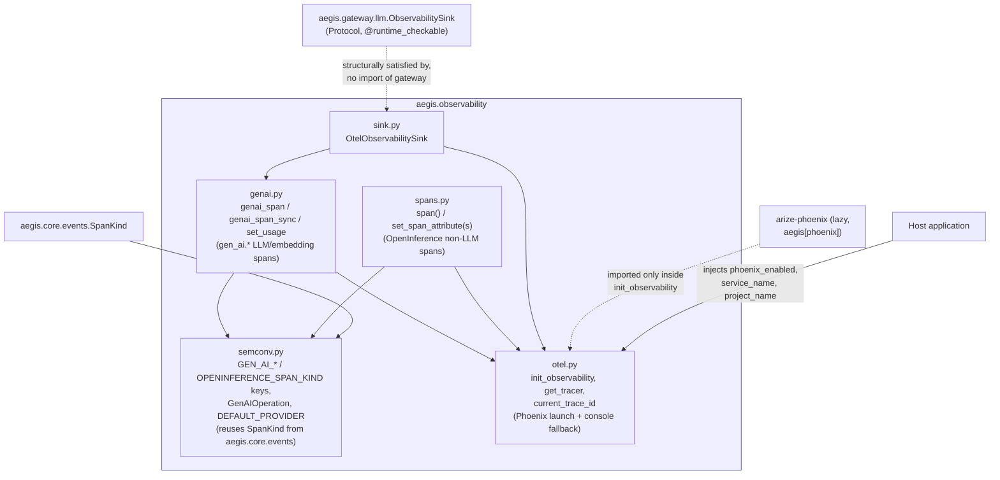
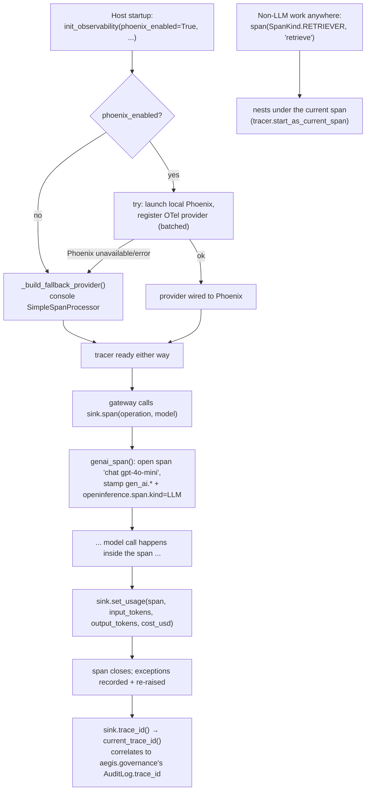

# `aegis.observability` — OpenTelemetry GenAI + OpenInference spans, exported to Phoenix

## What it is

`aegis.observability` is the platform's tracing stack: it stands up an OpenTelemetry
tracer provider, exports `gen_ai.*`-convention spans for every LLM/embedding call, and
gives every non-LLM unit of work (retrieval, guardrail checks, tool calls, graph nodes) a
matching OpenInference-tagged span so the two kinds of work render as one coherent nested
tree in Arize Phoenix — a local, in-process trace viewer with no Docker required. It also
ships `OtelObservabilitySink`, the concrete implementation of `aegis.gateway`'s
`ObservabilitySink` Protocol, so a host wires `gateway.configure(observability=
OtelObservabilitySink())` with zero bespoke adapter code of its own.

The problem it solves is the one every agentic system needs answered after the fact:
what actually happened during this run, in what order, at what cost, and where did it go
wrong? Two separate questions live inside that — the shape of one model call (which
provider, which model, how many tokens, what did it cost) and the shape of everything
around it (a retrieval that returned five chunks, a guardrail that redacted an email, a
tool call that failed) — and both need to nest into a single, human-readable trace tree.
OpenTelemetry's GenAI semantic conventions are the emerging standard for the first
question, but they are still experimental and mid-rename as of this writing (`gen_ai.system`
→ `gen_ai.provider.name`, semconv v1.37.0) — `aegis.observability` tracks the current
names while still emitting the deprecated alias, so older tooling reading the old key
keeps working through the transition.

The SOTA technique is combining two conventions rather than inventing a third: OTel's
GenAI semantic conventions (`gen_ai.operation.name`, `gen_ai.request.model`,
`gen_ai.usage.*`) for LLM/embedding spans, and Arize's OpenInference span-kind convention
(`AGENT`/`CHAIN`/`TOOL`/`RETRIEVER`/`RERANKER`/`GUARDRAIL`/`LLM`/`EMBEDDING`/`EVALUATOR`)
for how Phoenix renders the tree shape — set directly as a string attribute
(`openinference.span.kind`) rather than by depending on Arize's `openinference-*`
instrumentation packages, so Phoenix-compatible rendering comes at zero extra dependency
cost. `SpanKind` itself is not redefined here: it is reused directly from
`aegis.core.events` (the 9-value superset, including `EVALUATOR`), so the exact same enum
drives both the live AG-UI `CustomEvent` stream (`AegisEmitter.step(name, SpanKind.X)`)
and the exported OTel spans — one vocabulary, two independent destinations.

## Architecture



## Runtime flow — startup + one governed model call



## Public API

Verified against `aegis/src/aegis/observability/__init__.py` and each named submodule
(2026-08-12).

```python
from aegis.observability import (
    GenAIOperation, OtelObservabilitySink, SpanKind,
    current_trace_id, genai_span, genai_span_sync, get_tracer, init_observability,
    semconv, set_span_attribute, set_span_attributes, set_usage,
)
```

Key symbols, by file:

- **`otel.py`** — `init_observability(*, phoenix_enabled=True, service_name="taif",
  project_name="taif", app=None)`. `get_tracer() -> Tracer` (works before `init` too,
  resolving against OTel's global no-op provider). `current_trace_id() -> str | None`
  (32-char hex, or `None` if no span is active).
- **`genai.py`** — `genai_span(operation, model, *, temperature=None,
  provider=DEFAULT_PROVIDER, max_tokens=None)` (async context manager) and
  `genai_span_sync` (the sync equivalent). `set_usage(span, *, input_tokens=None,
  output_tokens=None, cost_usd=None, response_model=None)`.
- **`spans.py`** — `span(kind: SpanKind, name, *, attributes=None)` (sync context
  manager; nests under the current span). `set_span_attribute(key, value, *,
  span=None)` / `set_span_attributes(attributes, *, span=None)` — both safe no-ops on a
  non-recording span and skip `None` values.
- **`semconv.py`** — `GenAIOperation` (`CHAT | EMBEDDINGS | TEXT_COMPLETION`); the
  `GEN_AI_*` attribute-key constants (`GEN_AI_OPERATION_NAME`, `GEN_AI_PROVIDER_NAME`,
  `GEN_AI_REQUEST_MODEL`, `GEN_AI_USAGE_INPUT_TOKENS`, …); `OPENINFERENCE_SPAN_KIND`;
  `DEFAULT_PROVIDER = "tcs.genailab"`; app-namespaced attribute keys (`GRAPH_NODE`,
  `RETRIEVAL_QUERY`, `GUARDRAIL_VERDICT`, `TOOL_NAME`, …); re-exports `SpanKind` from
  `aegis.core.events` (not redefined here).
- **`sink.py`** — `OtelObservabilitySink` — `.span(operation, model, *, temperature=None,
  max_tokens=None)`, `.set_usage(span, ...)`, `.trace_id() -> str | None`. Structurally
  satisfies `aegis.gateway.llm.ObservabilitySink` (a `@runtime_checkable` Protocol) with
  no import of `aegis.gateway` at all.

### Standalone usage

```python
from aegis.observability import (
    GenAIOperation, SpanKind, genai_span, init_observability, set_usage, span,
)

# Offline/dev: console exporter, no Phoenix required.
init_observability(phoenix_enabled=False, service_name="my-service")

async def answer(query: str) -> str:
    with span(SpanKind.RETRIEVER, "retrieve", attributes={"input.value": query}):
        context = await my_retriever.retrieve(query)

    async with genai_span(GenAIOperation.CHAT, "gpt-4o-mini") as llm_span:
        result = await my_llm_call(query, context)
        set_usage(llm_span, input_tokens=result.usage.prompt_tokens,
                   output_tokens=result.usage.completion_tokens,
                   cost_usd=result.usage.cost_usd)
    return result.content
```

### Wiring the concrete gateway sink

```python
from aegis.gateway import configure
from aegis.observability import OtelObservabilitySink

configure(observability=OtelObservabilitySink())  # no bespoke adapter needed
```

## Install

`aegis[observability]` — verified against `aegis/pyproject.toml`:
`opentelemetry-sdk>=1.27`, `opentelemetry-api>=1.27`. This extra is **mandatory and
eager**, not lazy: `otel.py`, `genai.py`, and `spans.py` all `import opentelemetry.*` at
module top level, so `import aegis.observability` raises `ModuleNotFoundError` without it
— unlike most of this module series, there is no bare-`pip install aegis` path here.

`aegis[phoenix]` — `arize-phoenix>=5.0`, `arize-phoenix-otel>=0.6` — is genuinely
**optional and lazy**: `phoenix`/`phoenix.otel` are imported only inside
`init_observability()`, and only when `phoenix_enabled=True`. Without it (or if launching
Phoenix fails for any reason), `init_observability` catches the exception, logs a
warning, and falls back to a real, working console-exporting provider — tracing keeps
functioning, just without the Phoenix UI. This is verified, not assumed: the module's own
import-isolation test confirms `import aegis.observability` (+ all five submodules) pulls
no `phoenix` in an environment where Phoenix is not installed at all.

## AG-UI events it emits

**None.** There is no `stream.py` in `aegis/src/aegis/observability/` and no code path
constructs an `AegisEmitter` or calls `.custom(...)` — verified by reading every file in
the package. `aegis.observability` is a **consumer/exporter** of the platform's shared
vocabulary, not an emitter into the AG-UI `CustomEvent` stream: it reuses
`aegis.core.events.SpanKind` (the same enum `AegisEmitter.step()` takes) so the two
systems agree on span-kind vocabulary, but observability's own output goes to OTel/Phoenix
— a separate destination from the SSE stream the frontend consumes, not a projection of
it. No `aegis.observability.bridge`-style "replay AG-UI events as OTel spans" code exists
in this package as of this writing.

## Honest infra / design notes

- **Graceful, loud degrade — never a silent no-op.** If Phoenix or its OTel bridge is
  unavailable or errors, `init_observability` logs a warning and falls back to a real,
  working console-exporting provider. Spans are always produced; the failure mode is
  "no Phoenix UI," never "no tracing."
- **Non-recording spans are safe everywhere.** Before `init_observability` runs (or in
  offline/lite mode, or in tests), `get_tracer()` resolves against OTel's own global
  no-op provider — `span()`, `genai_span()`, and `set_span_attribute(s)` all degrade to
  harmless no-ops on a non-recording span rather than raising.
- **Structural conformance, no reverse dependency.** `OtelObservabilitySink` never
  imports `aegis.gateway` — it satisfies `ObservabilitySink` (marked
  `@runtime_checkable` specifically so this is `isinstance`-checkable) purely
  structurally, keeping the dependency arrow one-directional even though a host wires
  both packages together.
- **Deprecated-alias honesty during a semconv transition.** Both `gen_ai.provider.name`
  (current) and `gen_ai.system` (deprecated) are stamped on every request span, so
  tooling still reading the old key during the OTel GenAI semconv v1.37.0 transition
  keeps working — not a silent breaking rename.
- **A deliberate synchronous-export choice.** The console fallback provider uses a
  `SimpleSpanProcessor` rather than the batched processor specifically so a
  background-thread flush can never race the interpreter's stdout at teardown — a
  documented reliability fix, not an oversight.
- **Kept a strict leaf on purpose.** `opentelemetry` is explicitly added to
  `aegis.core`'s dependency-free import guard (banned from `aegis.core`) even though it
  is not a "heavy" dependency in the `litellm`/`torch` sense — `aegis.observability`
  stays a leaf module like every other package in this series, never something `core`
  itself needs.
