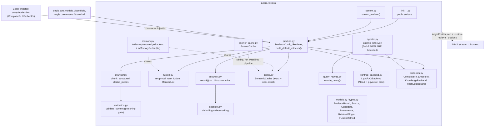
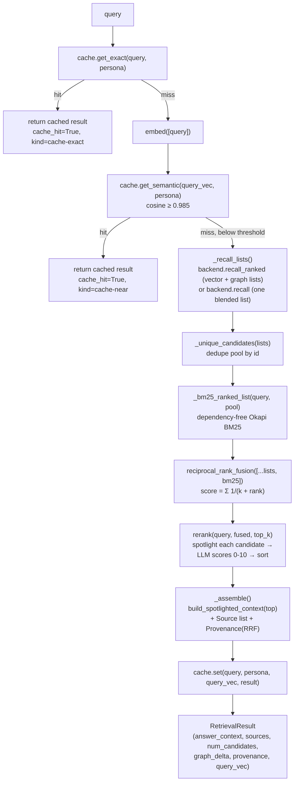

# `aegis.retrieval` — hybrid retrieval: chunk → recall → fuse → rerank → spotlight

## What it is

`aegis.retrieval` answers the question every RAG system eventually has to face honestly: retrieval
isn't one lookup, it's a pipeline with several places to get wrong — chunks that split mid-thought,
a single retrieval signal that misses what another would have found, reranked context that
launders a planted instruction straight into the model, and citations that don't actually trace
back to where an answer came from. `aegis.retrieval` is a domain-agnostic, **LLM-agnostic** hybrid
retrieval engine: structure-aware chunking with dedup, poisoning validation *before* anything is
written to a store, hybrid wide recall across vector + graph + BM25 signals, principled fusion,
an LLM-as-reranker pass, and spotlighted assembly with honest provenance on every result. It is
the largest of the extracted modules and, unlike most, was already fully dependency-injected
before extraction — every heavy dependency (LightRAG, Neo4j, Redis, pgvector) is lazy-imported
inside methods, and the completer/embedder/backend/cache are all structural `Protocol`s a caller
injects, never resolved internally.

The SOTA techniques stack in a specific, deliberate order. Wide recall runs **three signals**
(dense vector similarity, graph traversal, and a hand-rolled, dependency-free BM25 over the
recalled pool) and combines them with **Reciprocal Rank Fusion** — `score(d) = Σ 1/(k + rank_i(d))`
— which needs only each list's *rank*, not its score, so it's robust to combining cosine
similarity, graph-proximity, and BM25 scores that live on incomparable scales. The fused pool then
goes through an **LLM-as-reranker** (API-only by design — no local cross-encoder, since the deploy
target is a 16 GB/no-GPU machine with no dedicated rerank model): a single cheap-model call scores
every candidate 0–10 against the query. Before that candidate text ever reaches the reranking or
generation model, it is wrapped with Microsoft's **Spotlighting** technique (delimiting fences +
datamarking token interleaving, arXiv 2403.14720) — retrieved content is untrusted data, and
indirect prompt injection via a planted document is the top RAG-specific risk this defends
against. A two-tier semantic cache (exact hash, then a conservative near-exact cosine tier) fronts
the whole pipeline, and a bounded Self-RAG/FLARE-style agentic loop (`agentic.py`) can iterate —
judge sufficiency, retrieve again with a focused follow-up, merge — when a single pass isn't
enough, capped by `max_rounds` so it can never run away.

`aegis.retrieval` ships two backend pairs behind the same `Retriever` orchestration and the same
fusion/rerank core: a production path (`LightRAGBackend` over Neo4j + pgvector) and a genuinely
databaseless "lite" path (`memory.py`'s `InMemoryKnowledgeBackend` — a real hybrid retriever using
a local hashing embedding for vector search and a co-occurrence graph for graph expansion, not a
keyword-only stub). Both report entity/relation counts as `None` rather than a fabricated `0` when
a count genuinely can't be measured, and every cache hit carries `CacheProvenance` lineage — the
UI can always say where an answer actually came from.

## Architecture



## Runtime flow — `Retriever.retrieve()`, the main query-time pipeline



## Public API

Verified against `aegis/src/aegis/retrieval/__init__.py` (2026-08-12).

```python
__all__ = [
    "EMBED_DIM", "CacheProvenance", "Candidate", "Chunk", "FusionMethod", "GraphDelta",
    "GraphEdge", "GraphNode", "IngestReport", "Provenance", "Recall", "RetrievalConfig",
    "RetrievalOrigin", "RetrievalResult", "Retriever", "Source", "build_default_retriever",
]
```

- **`Retriever`** (dataclass) — the orchestration core, holding `backend`, `cache`, `complete`,
  `embed`, `config: RetrievalConfig` by injection. `async retrieve(query, *, persona=None) ->
  RetrievalResult`; `async ingest(docs) -> IngestReport` (structure-aware chunk → dedup →
  content-validate → write). No process-wide default instance and no gateway import anywhere in
  the package — a host builds and holds its own `Retriever`.
- **`build_default_retriever(*, complete: CompleteFn, embed: EmbedFn, config=None) ->
  Retriever`** — production wiring: `LightRAGBackend` (Neo4j + pgvector) + Redis-backed
  `SemanticCache`. Requires real infra reachable at the configured URLs.
- **`RetrievalConfig`** (dataclass) — tunables (`recall_top_k=20`, `final_top_k=6`,
  `rerank_role=ModelRole.CHEAP`, `chunk_size=400`, `chunk_overlap=60`, `cache_ttl_seconds=3600`,
  `semantic_threshold=0.985`, `rrf_k=60`, `embed_dim=3072`) plus store connection settings
  (`postgres_dsn`, `neo4j_uri/user/password`, `redis_url`, `stores_enabled: bool`).
- **`EMBED_DIM = 3072`** — package constant (matches `text-embedding-3-large`).
- Result/model types: `RetrievalResult`, `Source`, `Candidate`, `Chunk`, `Recall`, `GraphDelta`,
  `Provenance`, `CacheProvenance`, `IngestReport` (all pydantic `BaseModel`s, `aegis.retrieval.
  models`).
- Schema enums: `RetrievalOrigin` (`vector|graph|bm25|cache`), `FusionMethod`
  (`none|rrf|mix`), `GraphNode` (`id, label, kind`), `GraphEdge` (`source, target, relation`) —
  pydantic/stdlib-only, `aegis.retrieval.types`.
- **Not re-exported at the package root but importable directly** (same pattern as
  `aegis.guardrails`): `aegis.retrieval.memory` (`build_lite_retriever`,
  `InMemoryKnowledgeBackend`, `InMemoryRedis` — the databaseless path),
  `aegis.retrieval.agentic` (`agentic_retrieve`, `assess_sufficiency`, `Sufficiency`,
  `AgenticRetrievalResult`), `aegis.retrieval.stream` (`stream_retrieve`),
  `aegis.retrieval.protocols` (`CompleteFn`, `EmbedFn`, `KnowledgeBackend`, `MultiListBackend`),
  `aegis.retrieval.chunker`, `aegis.retrieval.fusion`, `aegis.retrieval.reranker`,
  `aegis.retrieval.spotlight`, `aegis.retrieval.validation`, `aegis.retrieval.cache`,
  `aegis.retrieval.answer_cache`, `aegis.retrieval.query_rewrite`,
  `aegis.retrieval.lightrag_backend`.

### Standalone usage — databaseless "lite" retriever

```python
from aegis.retrieval.memory import build_lite_retriever, InMemoryKnowledgeBackend

async def my_complete(role, messages, *, temperature=0.0, response_format=None):
    ...  # any async chat-completion call; returns an object with `.content`

async def my_embed(texts: list[str]) -> list[list[float]]:
    ...  # any async embedding call

retriever = build_lite_retriever(complete=my_complete, embed=my_embed)
retriever.backend = InMemoryKnowledgeBackend.from_corpus(
    docs=["Refunds are processed within 5 business days.", "..."]
)

result = await retriever.retrieve("how long do refunds take?")
result.answer_context   # spotlighted, rerank-ordered context for the generator
result.sources          # citation-grade Source list
result.provenance       # origins (vector/graph/bm25) + fusion="rrf"
```

### Production wiring (requires live LightRAG/Neo4j/pgvector/Redis)

```python
from aegis.retrieval import RetrievalConfig, build_default_retriever

retriever = build_default_retriever(
    complete=my_complete,
    embed=my_embed,
    config=RetrievalConfig(postgres_dsn="postgresql://...", neo4j_uri="bolt://..."),
)
report = await retriever.ingest(["some document text", ...])
result = await retriever.retrieve("a question about the corpus")
```

### AG-UI streaming usage

```python
from aegis.core.stream import AegisEmitter
from aegis.retrieval.stream import stream_retrieve

emitter = AegisEmitter(thread_id="t1", run_id="r1", sink=my_sse_sink)
result = await stream_retrieve(retriever, "a question", emitter)
# emits: STEP_STARTED("retrieve") -> CUSTOM(retrieval_citations) -> STEP_FINISHED
```

## Install

`aegis[retrieval]` — verified against `aegis/pyproject.toml`:

```
retrieval = ["lightrag-hku>=1.0", "neo4j>=5.24", "redis>=5.1", "pgvector>=0.3", "asyncpg>=0.29"]
```

All of these are lazy-imported inside methods (`lightrag_backend.py`'s `_ensure()`,
`cache.py`'s `SemanticCache.from_url`) — `import aegis.retrieval` itself pulls none of them, so
the entire lite path (`build_lite_retriever` + `InMemoryKnowledgeBackend`) needs only an injected
`complete`/`embed` and works with **zero** of this extra installed. Verified by
`aegis/tests/retrieval/test_isolation.py`, a subprocess guard.

## AG-UI events it emits

`aegis.retrieval.stream.stream_retrieve` brackets one `retriever.retrieve()` call in
`emitter.step("retrieve", SpanKind.RETRIEVER)` and emits:

- **`CustomEvent(name="retrieval_citations")`**:

  ```json
  {
    "num_candidates": 14,
    "sources": [
      {"id": "doc-0#2-a1b2c3d4", "label": "Refunds", "score": 0.82,
       "origin": ["vector", "bm25"], "snippet": "Refunds are processed within..."}
    ],
    "cache_hit": false,
    "provenance": {"origins": ["vector", "graph", "bm25"], "fusion": "rrf", "cache_kind": null},
    "graph_delta": {
      "nodes": [{"id": "doc-0", "label": "doc-0", "kind": "source"}],
      "edges": [{"source": "doc-0", "target": "doc-1", "relation": "related"}]
    }
  }
  ```

  `label` falls back through `metadata["title"|"section"|"doc"|"source"]`, then the source `id`;
  `origin` is the fused per-candidate origin list written by `reciprocal_rank_fusion`; `snippet`
  is `text[:280]`.

**Mismatch vs. the design spec.** The design spec (§3.3) states the rerank stage "keeps
`SpanKind.RERANKER` (via the emitter if wired, else internal)". The actual code does not: per the
extraction report's own "Deviations" section, `Retriever.retrieve()` carries **no** tracer/emitter
parameter at all — the pre-extraction `app.observability.span(SpanKind.RERANKER, ...)` block
around the rerank call was removed, not replaced with a no-op or an injected seam. `stream_retrieve`
only wraps the *whole* `retrieve()` call (including recall, fusion, and rerank) in one
`SpanKind.RETRIEVER` step; there is currently no distinct `RERANKER`-kind span or event anywhere
in `aegis.retrieval`. Reintroducing a rerank-stage span is explicitly left as follow-up work for a
future `aegis.observability` module or a richer `stream_retrieve`.

On the frontend, `retrieval_citations` is mirrored in `frontend/src/agui/streamNames.ts`, but as
of this writing there is no dedicated renderer wired to this AG-UI `CustomEvent` path — the
frontend has no component currently consuming `retrieval_citations` at all (a `grep` across
`frontend/src` finds it only in `streamNames.ts`). The design spec's "live end-to-end: retrieval_
citations decodes on the frontend" testing goal, and wiring `stream_retrieve` into the backend's
live `/query` SSE endpoint, are both noted in the extraction report as follow-on work not yet done.

## Honest infra / design notes

- **LLM-agnostic by construction.** `complete: CompleteFn` and `embed: EmbedFn` are required
  constructor arguments everywhere a model call happens (`Retriever`, `build_default_retriever`,
  `build_lite_retriever`, `LightRAGBackend`) — there is no `gateway.py` inside the package and no
  fallback that silently resolves a provider internally.
- **Lite mode is a real retriever, not a stub.** `InMemoryKnowledgeBackend` computes genuine local
  vector embeddings (SHA-1 hashing bag-of-words, L2-normalised, brute-force cosine) and a real
  co-occurrence graph (Jaccard-weighted adjacency, one-hop propagation) — it feeds the *same*
  `reciprocal_rank_fusion` core the production LightRAG path uses. Lite and full share one fusion
  and rerank implementation; only the recall backend differs.
- **Entity/relation counts are honest-unknown, never fabricated.** Both `InMemoryKnowledgeBackend
  .ingest_chunks` (no graph extraction in lite mode) and `LightRAGBackend`'s `_graph_counts` (when
  the graph store can't be queried) return `None` rather than `0` — `IngestReport.entities`/
  `.relations` are typed `int | None` specifically so a genuine zero is never confused with "we
  couldn't measure this."
- **Semantic cache is a conservative front layer, not a shortcut.** `semantic_threshold=0.985` is
  deliberately near-identity; anything below it is treated only as a prefetch hint and the full
  recall+fusion+rerank pipeline still runs. Every cache hit carries `CacheProvenance` (`kind`,
  `original_query`, `cached_at`) so a served-from-cache answer is never presented as freshly
  computed.
- **Two independent lines of poisoning defense.** `validation.py`'s `validate_content` runs at
  **write time** (regex injection-signature patterns, size bounds, non-printable-character ratio)
  before a chunk ever reaches a store; `spotlight.py`'s delimiting + datamarking runs at **read
  time**, immediately before reranking or generation ever see retrieved text — a document that
  passes ingestion validation is still never trusted as instructions downstream.
- **Bounded agentic loop, honest fallback.** `agentic.py`'s `agentic_retrieve` is pure logic (no
  OTel, no stream events, no side effects — the orchestrator wires tracing in). Its sufficiency
  judge, when no `complete` is wired, falls back to a documented deterministic rule ("non-empty
  context ⇒ sufficient") rather than fabricating a verdict, and the loop is hard-capped at
  `max_rounds` so it can never run away.
- **`InMemoryKnowledgeBackend.from_corpus()` is honestly empty by default.** Unlike the
  pre-extraction backend (which implicitly resolved a host's bundled adapter corpus), the
  extracted package version requires an explicit `path=` or `docs=` argument; with neither, it
  returns a valid backend with zero chunks rather than silently reaching for an implicit corpus
  that doesn't exist outside a host application — the backend's own strangler shim restores the
  old implicit-lookup behavior at that boundary only.
