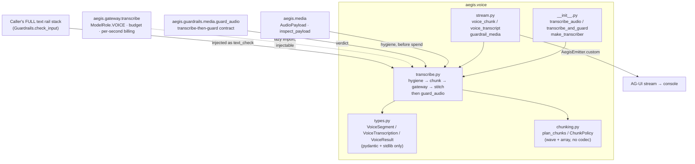
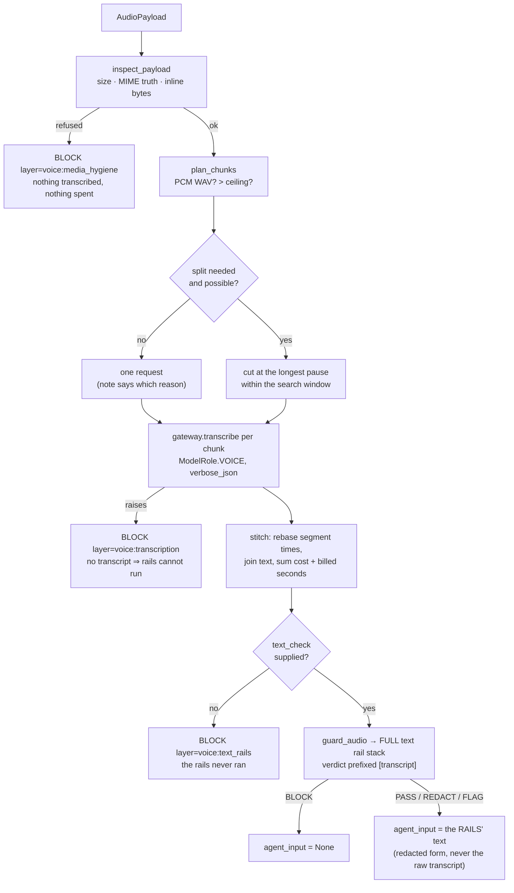

# `aegis.voice` — hosted speech-to-text, guarded before it reaches an agent

## What it is

`aegis.voice` turns a recording into text and then makes that text survive the *whole* input rail
stack before anything downstream may use it. It is a thin module by design: the model call, the
budget check and the ledger already live in `aegis.gateway`, and the transcribe-then-guard contract
already lives in `aegis.guardrails.media`. What was missing was the piece that joins them — and the
chunking that makes a lecture-length recording work at all.

The problem it solves is narrow and specific. Before this module, `aegis.guardrails.media` defined
a `Transcriber` seam and **blocked every audio payload**, because nothing implemented it. That is
the correct failure direction, but it means speech was simply unavailable. Meanwhile
`ModelRole.VOICE` was declared, routed to `azure/genailab-maas-whisper` and priced, and never
invoked. `aegis.voice` closes that gap without weakening the rail: audio is transcribed first,
because a rail cannot judge what it cannot read, and the transcript is then handed to the caller's
entire text stack — signatures, injection classifier, content safety, PII, schema, topical, and
every custom rail the host configured. Every attack that works in text works when spoken, so
speech gets the mature rails rather than a thin parallel "audio policy" that would drift.

Three properties are load-bearing:

- **Fleet-only, hosted.** Policy for this platform is fleet models only, so transcription is a
  hosted call through the existing gateway. There is no faster-whisper, no `openai-whisper`, no
  torch, and no ffmpeg anywhere in the dependency graph — and therefore no GPU question.
- **Hygiene before spend.** `aegis.media.inspect_payload` refuses a payload whose declared MIME
  type is a lie, whose bytes are unreadable, or which is over the cap, *before* a paid request is
  made. A mismatched container costs nothing.
- **Chunking on silence, in pure stdlib.** A recording past the single-request ceiling is split at
  detected pauses using `wave` + `array` — so a cut lands in a gap, not mid-word, and the chunk
  transcripts stitch back onto one timeline. Containers the stdlib cannot decode (MP3, OGG, FLAC,
  M4A) are transcribed whole in one request, and the plan **says so** rather than reporting a
  single chunk as if it had been split.

## Architecture



## Runtime flow



## Public API

Verified against `aegis/src/aegis/voice/__init__.py` (2026-08-14).

```python
__all__ = [
    "NO_DIARISATION", "AudioChunk", "AudioRejected", "ChunkPlan", "ChunkPolicy",
    "TranscribeCallable", "VoiceResult", "VoiceSegment", "VoiceTranscription",
    "make_transcriber", "plan_chunks", "stream_transcribe_and_guard",
    "transcribe_and_guard", "transcribe_audio", "transcript_event", "verdict_event",
]
```

- **`async transcribe_and_guard(payload, *, text_check, transcriber=None, language=None,
  prompt=None, limits=None, policy=None, on_chunk=None) -> VoiceResult`** — the entry point
  anything agent-facing should use. `text_check` is **keyword-only with no default**, so the rails
  cannot be skipped by forgetting an argument.
- **`async transcribe_audio(payload, ...) -> VoiceTranscription`** — transcription alone. Returns
  *evidence*, not agent input: the returned object has no `agent_input` and no `cleared`.
- **`make_transcriber(...) -> Callable[[AudioPayload], Awaitable[str]]`** — the adapter
  `aegis.guardrails.media.MediaScreen(transcriber=...)` wants. It **raises** rather than returning
  `""` on failure, because an empty transcript would sail through the text rails as "nothing to
  object to", whereas a raise becomes a fail-closed BLOCK inside `guard_audio`.
- **`plan_chunks(payload, *, policy=None) -> ChunkPlan`** — pure, offline, no model call.
- **`async stream_transcribe_and_guard(payload, emitter, *, text_check, ...) -> VoiceResult`** —
  the AG-UI path.
- **`VoiceResult.agent_input -> str | None`** — the only sanctioned way transcribed speech leaves
  this module towards an agent. `None` unless the rails cleared it; on a REDACT it is the redacted
  string.

### Standalone usage

```python
from aegis.media import AudioPayload, MediaSource, Provenance
from aegis.voice import transcribe_and_guard

payload = AudioPayload(
    data=wav_bytes,
    mime_type="audio/wav",
    provenance=Provenance(source=MediaSource.USER_UPLOAD, origin="note.wav"),
)
result = await transcribe_and_guard(payload, text_check=guards.check_input)

result.transcription.text       # evidence for the operator's console
result.transcription.segments   # time-aligned on the RECORDING's timeline
result.guard.verdict            # the full text stack's verdict
result.agent_input              # None unless the rails cleared it
result.coverage()               # "Controls run: …  Not run: …"
```

### Wiring speech into the media rail chain

Audio is blocked by `MediaScreen` until a transcriber is wired — that is the pre-`aegis.voice`
state, and it is deliberate:

```python
from aegis.guardrails.media import MediaScreen
from aegis.voice import make_transcriber

screen = MediaScreen(transcriber=make_transcriber())
```

### AG-UI streaming usage

```python
from aegis.core.stream import AegisEmitter
from aegis.voice import stream_transcribe_and_guard

emitter = AegisEmitter(thread_id="t1", run_id="r1", sink=my_sse_sink)
result = await stream_transcribe_and_guard(payload, emitter, text_check=guards.check_input)
# STEP_STARTED("voice_transcribe") -> CUSTOM(voice_chunk)* -> CUSTOM(voice_transcript)
#   -> CUSTOM(guardrail_media) -> STEP_FINISHED
```

## Install

`aegis.voice` adds **no new extra**. Its own code is pydantic + stdlib, and the hosted model call
goes through `aegis[gateway]` (`litellm`), which the platform already installs. The gateway is
imported lazily inside `_default_transcriber()`, so `import aegis.voice` pulls no `litellm`, no
numpy and no pandas — asserted by `tests/voice/test_isolation.py`.

The host side needs `python-multipart` for the upload route; it is declared in
`backend/pyproject.toml` as a core dependency, not an extra, because `POST /voice/transcribe` is
always mounted.

## AG-UI events it emits

Both names are registered in `aegis/core/stream_names.py`.

- **`CustomEvent(name="voice_chunk")`** — one per chunk as it comes back, so a long recording
  renders progressively instead of behind a spinner:

  ```json
  {"index": 2, "of": 5, "startSeconds": 98.5, "durationSeconds": 49.2,
   "splitOnSilence": true, "text": "…transcript so far…"}
  ```

- **`CustomEvent(name="voice_transcript")`** — the finished transcription:

  ```json
  {"text": "...", "language": "en", "durationSeconds": 300.0,
   "model": "genailab-maas-whisper", "chunkCount": 5, "chunking": "…why it was split…",
   "costUsd": 0.03, "audioSecondsBilled": 300.0, "hasConfidence": false,
   "segments": [{"index": 0, "start": 0.0, "end": 4.2, "text": "…",
                 "confidence": null, "chunk": 0}]}
  ```

- **`CustomEvent(name="guardrail_media")`** — the rail verdict on the transcript. The **existing**
  media-verdict name is reused rather than a voice-specific one, because it *is* a media verdict;
  a second name would let the two renderings drift:

  ```json
  {"kind": "audio", "verdict": "block", "reason": "…", "layer": "media_audio:injection",
   "redactions": [], "railsRun": ["payload hygiene", "…"],
   "railsSkipped": ["speaker diarisation (…)"], "agentReady": false}
  ```

## Console surface

`web/src/components/voice/` (AI-team portal → **Voice**). Live `MediaRecorder` capture with a
waveform driven by a parallel `AnalyserNode` (`MediaRecorder` exposes no amplitude of its own), the
transcript with per-segment timings, the rail verdict with its itemised coverage, and a
"send to the agent" action.

The browser re-encodes the recording to 16-bit PCM WAV via `AudioContext.decodeAudioData` before
upload. That is not incidental: Chrome's `MediaRecorder` emits WebM/Opus, which is **not** in
`MediaLimits.allowed_audio_mimes` and would be refused by payload hygiene, and the server's
silence splitter reads WAV only. When the browser cannot decode its own recording, the original
blob is uploaded and the UI says chunking will not apply — it never pretends otherwise.

The send action posts `agent_input`, never `transcript`, and is disabled when `agent_input` is
`null`. Forwarding the raw transcript would defeat the rails, which is exactly why the response
separates the two fields.

## Honest infra / design notes

- **Not verified against the live fleet.** The gateway credential in this repo is a placeholder, so
  every behaviour here is proven against injected fakes. What `azure/genailab-maas-whisper` really
  returns for segments, language detection and duration is asserted nowhere. The call *shape* is
  verified against LiteLLM's `atranscription` contract by the gateway's own tests.
- **Per-segment confidence is never invented.** Whisper's `verbose_json` reports `avg_logprob` and
  `no_speech_prob`, but the gateway's segment parser (`aegis.gateway.llm._parse_segments`) keeps
  only `id`/`start`/`end`/`text`, so no confidence signal reaches this module.
  `VoiceSegment.confidence` is therefore `None` on every segment today and `has_confidence` is
  `False`; the console prints "confidence not reported" once rather than a plausible number per
  row. The field exists so a provider that does report one can be carried straight through.
- **Speaker diarisation is absent, and said so.** It would need either a provider that reports
  speaker labels or a local model; the fleet exposes neither and policy forbids the latter. It is
  listed in `controls_skipped` on **every** result (`NO_DIARISATION`) rather than quietly omitted.
- **Every failure direction is closed.** No transcriber, no `text_check`, a hygiene refusal, or a
  transcription that raised — each ends in a BLOCK whose reason names the control that did not run.
  There is no code path in this module that returns agent-usable text the rails have not judged.
- **The coverage sentence is generated, not written.** `VoiceResult.coverage()` builds the reason
  suffix from `controls_run` / `controls_skipped`, so a control that did not execute cannot appear
  in the sentence — the same discipline as `MediaGuardResult.coverage()`.
- **Chunking is honest about what it cannot do.** Only uncompressed PCM WAV (8/16/32-bit, any
  channel count) can be split, because that is what the stdlib parses. Everything else is one
  request and `ChunkPlan.note` names the container and the reason. When continuous speech offers no
  pause inside the search window, the cut is made on time and the plan records how many cuts were
  forced — a word may straddle that boundary and the operator is told.
- **Billing survives chunking.** Cost and billed audio-seconds are summed across every chunk, so a
  split recording is not a hole in the ledger. Duration prefers the container header and falls back
  to what the provider reported; when neither exists it stays `None` and is rendered as unknown,
  never as `0`.
- **The upload cap is enforced while reading.** `app.voice.read_upload` streams the multipart body
  and abandons the read the moment the running total passes the cap, which is the same number as
  `MediaLimits.max_bytes` so the transport refusal and the hygiene refusal cannot disagree.
- **Multipart, not base64.** Base64 inflates a recording ~33% (2.7 MiB of overhead at the 8 MiB
  cap) and forces the whole body to be materialised as one JSON string before anything can inspect
  it, which defeats a streaming size check.

## Tests

- `aegis/tests/voice/test_chunking.py` — pause-accurate cuts, contiguous tiling, standalone WAV
  chunks, forced cuts admitted, stereo/8-bit, undecodable containers.
- `aegis/tests/voice/test_transcribe.py` — one-shot and chunked transcription, timeline rebasing,
  cost accumulation, hygiene-before-spend, the `MediaScreen` adapter.
- `aegis/tests/voice/test_security.py` — the file that matters: the transcript reaches the text
  stack verbatim; a BLOCK leaves no agent input; missing rails / hygiene refusal / a raising
  transcriber all block; `MediaScreen` blocks audio until `aegis.voice` is wired; `text_check`
  cannot be omitted.
- `aegis/tests/voice/test_isolation.py` — no heavy deps, no `app.*`, and the guarded path runs on a
  base install.
- `aegis/tests/voice/test_stream.py` — event ordering, the honest confidence flag, and a verdict
  emitted even on a blocked run.
- `backend/tests/api/test_voice_endpoint.py` — the route, including a spoken injection blocked by
  the **real** `app.guardrails.check_input` (the deterministic signatures need no model call, so
  the live wiring is proven offline).
