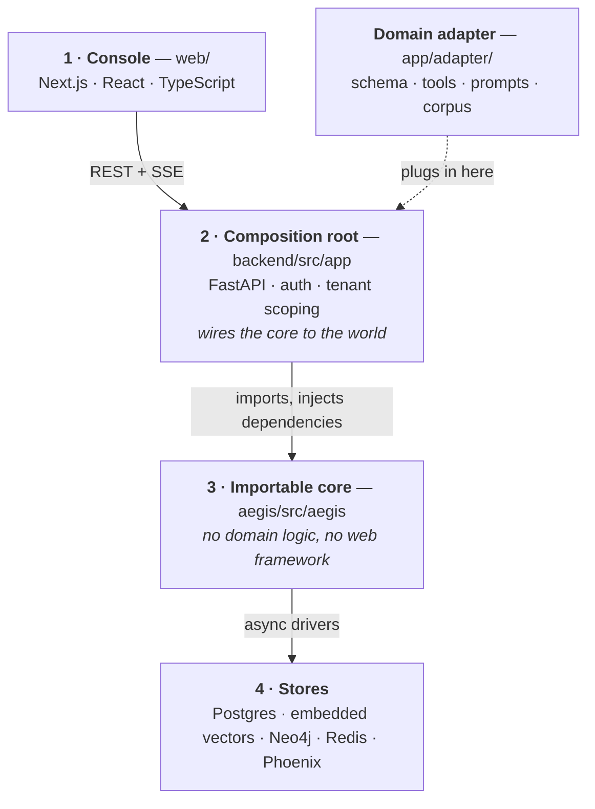
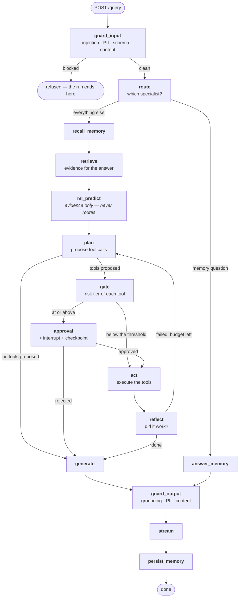
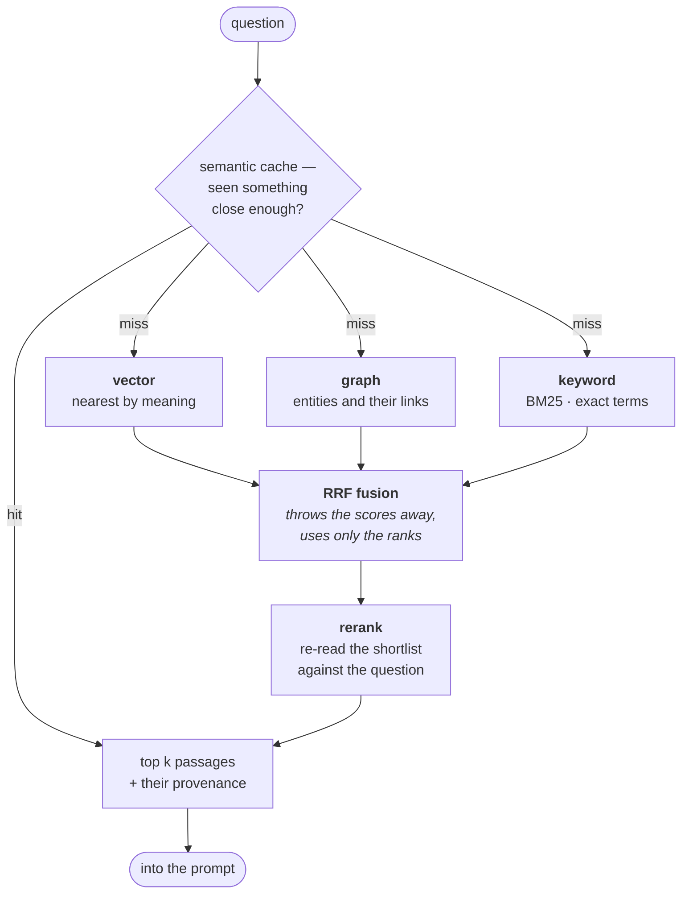
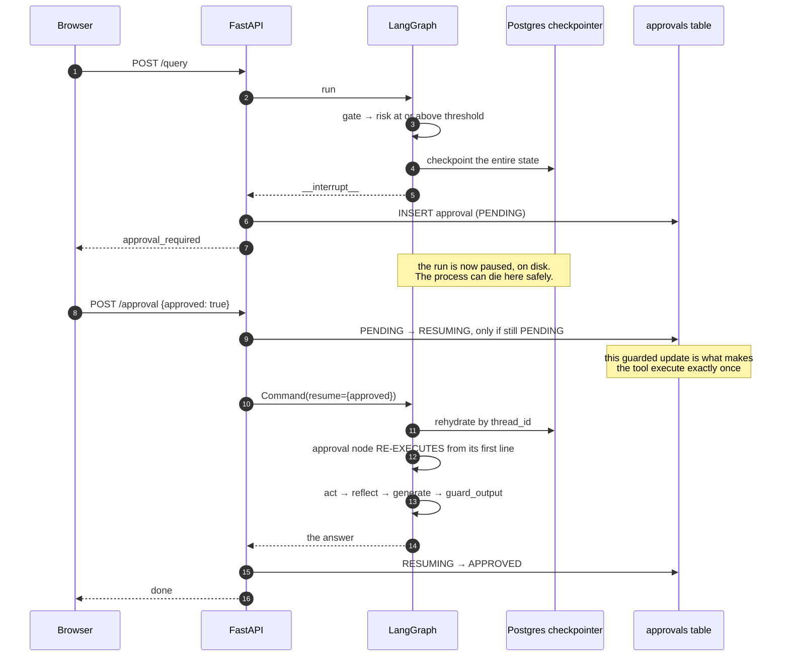
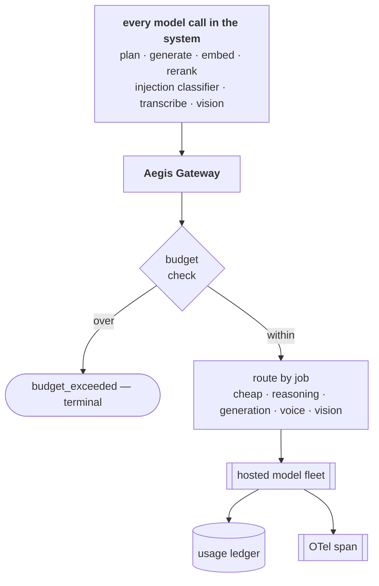

# Foundations — the diagrams

Five pictures. Two of them you should be able to draw on a whiteboard from memory — **the
request flow** and **the approval interrupt/resume** — because between them they carry a
forty-minute conversation about this system.

Everything here is explained in words in [`10-guide.md`](10-guide.md). A diagram is only in this
file when it shows something a paragraph cannot.

---

## 1. Where the code lives

*Look at the arrows. Every one points down, and the adapter joins at layer 2.*

Nothing at layer 3 ever reaches up to layer 2. That is what makes `aegis/` a package you import
rather than an app you fork.

The dotted line is the answer to "how would you point this at a different problem?" — you write
one adapter, and the core never learns your domain.

---

## 2. The request flow, end to end

*Look at the two edges that leave the happy path: `blocked` at the top, and `reflect → plan`
looping back.*

Three things to say about this picture, in this order:

**`ml_predict` has no edge to `gate`.** The prediction is injected into the planner as evidence
and cannot cause a stop. The only arrow into `approval` comes from `gate`, which reads the
**tool's** risk tier — not the model's confidence.

**`reflect → plan` is bounded.** `plan` increments the counter, not `reflect`, so no model output
can extend the budget. Termination is guaranteed by construction.

**Both branches converge on `guard_output`.** The memory specialist skips retrieval, ML, planning
and tools entirely — and still cannot skip the output rail.

---

## 3. Inside `retrieve`

*Look at where the two arms meet: fusion happens on ranks, after the arms, before the reranker.*

The three arms exist because they fail on different inputs. Vector search finds "what's the
refund process?" from "how do I get my money back?" and cannot tell `INV-2291` from `INV-2293`.
Keyword search is the exact opposite.

Fusion sits where it does because the arms produce numbers that cannot be added — a cosine of
0.71 and a BM25 of 8.4 are not the same kind of quantity. Ranks are comparable; scores are not.

Reranking sits last because it is the expensive stage. Cheap and approximate to build a
shortlist; expensive and accurate to order it.

---

## 4. Pausing a run for a human

*Look at the note in the middle. Everything above it can be thrown away and the run still
finishes.*

**Step 12 is where exactly-once actually lives.** It is a database write with a condition on the
old status, not anything LangGraph does. LangGraph will happily resume the same checkpoint twice
if you ask it to; the database is what refuses.

**Step 16 is the detail people miss.** The approval node runs again *from its first line*, which
is why nothing may be emitted before the interrupt — or the user sees the approval request twice.

Because the checkpointer is shared Postgres and the run is found by `thread_id`, the resume does
not have to happen on the machine that started it. That is the difference between surviving a
page refresh and surviving a deploy.

---

## 5. Every model call goes through one door

*Look at the budget check: it is before the call, not after.*

One chokepoint is the only way budgets, routing, cost accounting and tracing get enforced once
instead of at seven call sites that will drift apart.

Which also means any code path that reaches a model without passing through here is invisible to
all four at once — and that is exactly the class of bug worth hunting.

---

**Next:** [`50-interview.md`](50-interview.md) — the questions you'll be asked.
