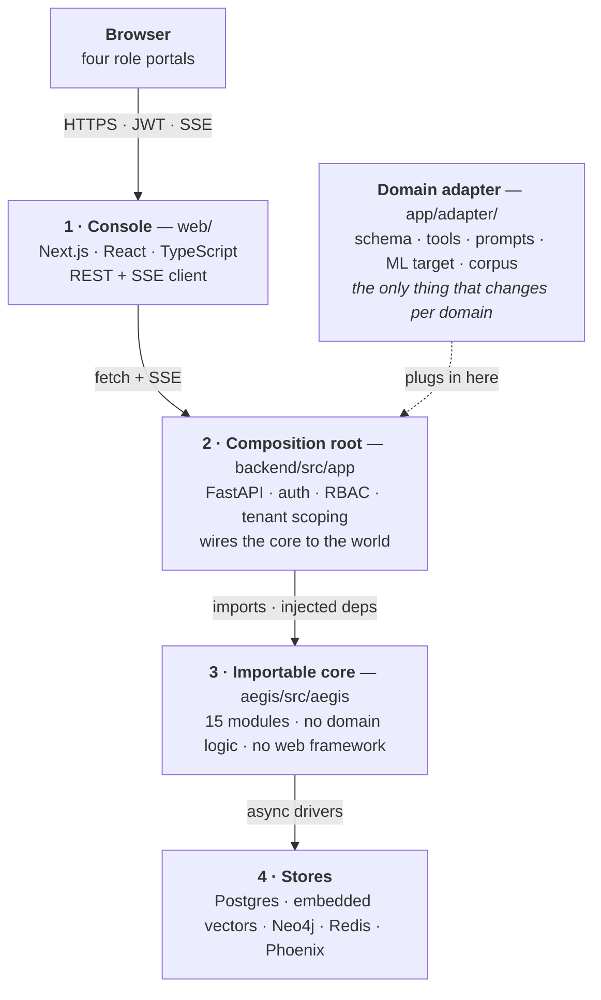
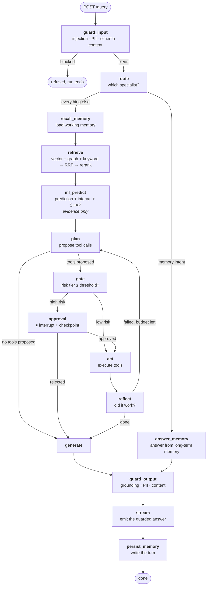
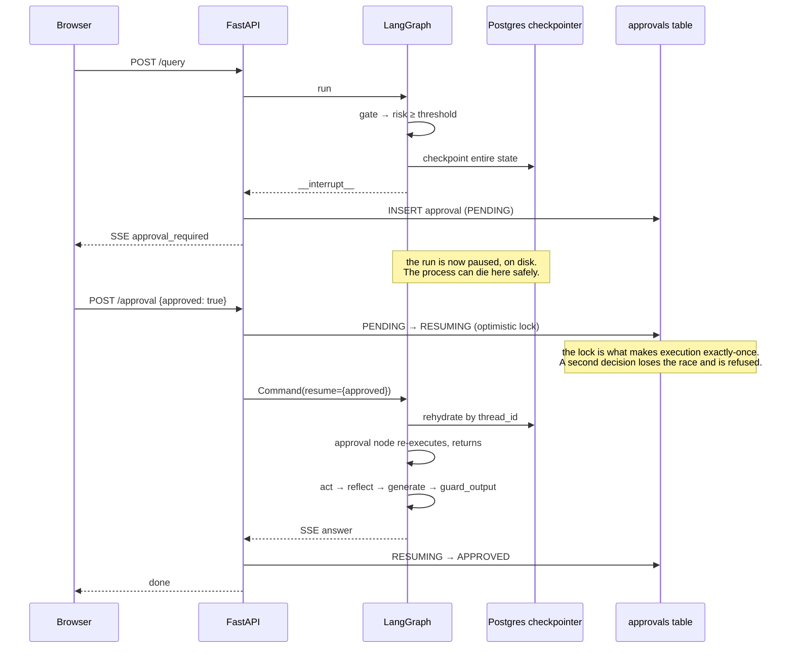
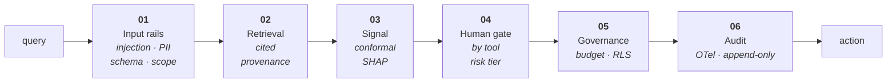
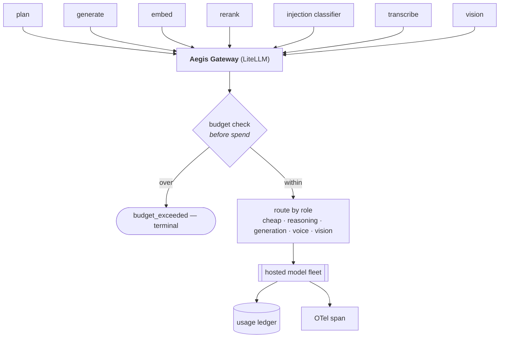
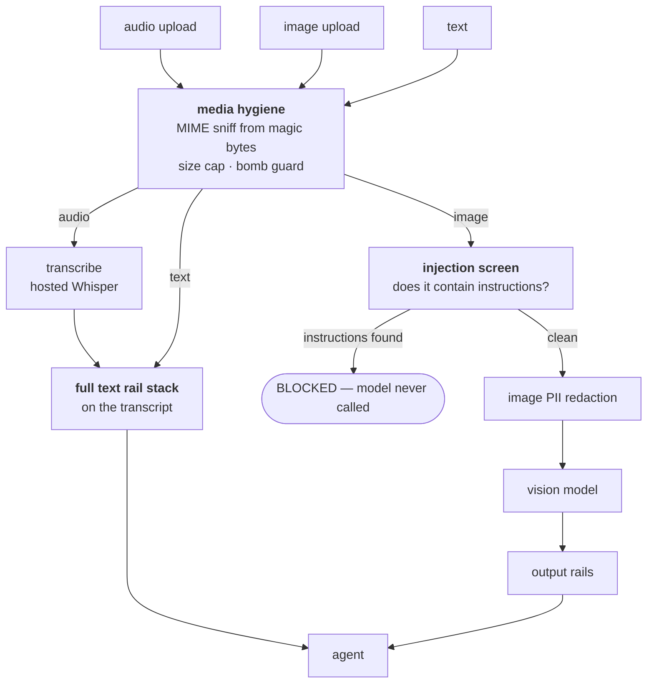

# Foundations — the diagrams to know by heart

Two of these you should be able to draw on a whiteboard from memory: **the request
flow** and **the approval interrupt/resume**. Everything else in Aegis is detail
hanging off those.

---

## 1. The four layers

The shape of the whole system. Note the direction of every arrow: the core never
reaches upward, and only the core touches the stores.

**The question this answers:** "how would you point this at a different problem?"
Write one adapter. The core never learns the domain.

---

## 2. The request flow — end to end

This is the one to memorise. Every node is a real node in the LangGraph.

### The three things to say about this diagram

1. **`ml_predict` runs before `plan`, and has no edge to `gate`.** The prediction is
   *injected into the planner as evidence*. It cannot cause a stop. The only edge into
   `approval` comes from `gate`, which reads the **tool's risk tier**.
2. **`reflect → plan` is the self-repair loop**, and it is bounded. `plan` increments a
   counter capped by `max_plan_iterations`, so termination is guaranteed by
   construction rather than by hoping.
3. **Both branches converge on `guard_output`.** The memory specialist skips retrieval,
   ML, planning and tools entirely — but it cannot skip the output rail.

---

## 3. The human-approval gate — the hard part

The other diagram worth memorising. This is what makes the gate *durable* rather than
a blocking wait that dies with the process.

### Four details interviewers probe

- **The `approval` node emits nothing before interrupting.** It *re-executes* from the
  top on resume, so anything emitted first would be emitted twice. This is the classic
  trap and avoiding it is deliberate.
- **Exactly-once comes from the database lock, not from LangGraph.** The optimistic
  `PENDING → RESUMING` transition is what stops two workers both resuming.
- **Resume works on any worker.** The checkpointer is shared Postgres; the run is found
  by `thread_id == run_id`. Nothing lives in one process's memory.
- **If the socket dropped, the run is *parked*, not lost.** A sweeper resumes it later.

---

## 4. The trust stack — what stands between the model and a real action

Ordering is the information here. Note that **governance sits between the decision and
the action** — the budget is enforced *before* spend, not reconciled after.

---

## 5. Where a model call actually goes

Every call in the system — planning, generation, embedding, reranking, injection
classification, transcription, vision — passes through one chokepoint.

**Why one chokepoint matters:** it is the only place budgets, routing, cost accounting
and tracing can be enforced *once* instead of in seven call sites. Any code path that
bypasses it is invisible to all four — which is exactly the class of bug worth hunting.

---

## 6. How the three modalities share one seam

**The single most important arrow** is `SCR → BLOCKED`. Text rendered *into an image*
is the standard attack on vision models, and it is invisible to a human reviewer. The
screen runs **before** the model sees the pixels, and if it cannot run it fails closed.

---

**Next:** [`../guardrails/00-concepts.md`](../guardrails/00-concepts.md).
