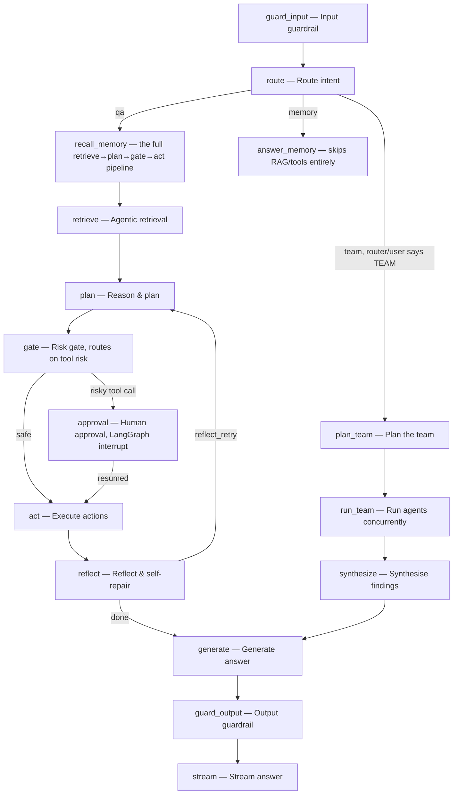

# Agent

## What it is

The orchestration engine that runs one question through: guardrails, intent
routing, retrieval, planning, a risk-gated action step, and answer
generation — with an optional fan-out into a **team** of parallel
specialist agents when the question calls for it. If you have never used
LangGraph before: it is a way of defining an agent's control flow as an
explicit graph of named nodes and edges, rather than one long function, so
each step can be independently tested, logged, and — critically here —
paused and resumed for a human approval.

## Why it exists here

Two things a naive single-LLM-call agent cannot do that this module is
built around: **pause mid-run for a human to approve a risky action** (a
LangGraph `interrupt`, resumable from a real checkpoint, not a hacky
polling loop), and **run several specialist agents in parallel on one
question** when a single agent's reasoning would not cover the question's
different facets, then synthesise their results back into one answer.

## Diagram — the real node names, from `NODE_LABELS`



## The architecture

```
aegis/src/aegis/agent/
  graph.py       the LangGraph itself — every node above, NODE_LABELS, SPECIALIST_NODES
  router.py      classifies intent (qa / memory / team) and depth (auto/single/team)
  subagent.py    the specialist worker: per-lane working memory, skill cards
  topology.py    graph_topology() — reads the SAME graph the console draws, cannot drift
```

## What is actually in Aegis

### The graph is one object; the topology shown to a user is read from it, not hand-drawn

`NODE_LABELS` is not documentation — it is the dictionary the running graph
itself uses to label its own `node_started`/`node_finished` events, and
`aegis.agent.topology.graph_topology()` reads the same structure to build
what the console's orchestration map draws. This is stated directly in the
source: *"anything that draws the graph ... can no longer drift from what
actually runs."* There is exactly one source of truth for "what does this
agent's control flow look like."

### `SPECIALIST_NODES` — the seam that stops a silent swallow

```python
SPECIALIST_NODES = {
    "qa": "recall_memory",     # the full retrieve→plan→gate→act pipeline
    "memory": "answer_memory", # answers from memory, skipping RAG/tools
    "team": "plan_team",       # the adaptive fan-out
}
```

The comment explains a real bug this table fixed: before it existed, the
edge out of `route` was a hardcoded binary — `"memory" → answer_memory,
else recall_memory`. A domain adapter that declared a third specialist role
had it silently swallowed into the generic `qa` pipeline, with no error and
no signal anywhere that the new specialist was never actually reachable. Now
adding a specialist to a roster requires an explicit node **and** an entry
here, or a startup-time warning names the unroutable specialist.

**`team` is not a roster role an adapter declares.** It is written by the
router itself, when either the depth classifier or the user's explicit mode
selection decides the question needs a team — which is why it is
deliberately absent from every domain adapter's own roster and still has
to be dispatchable.

### Depth/fan-out — one line of policy, with a documented failure default

Verbatim from `_depth_policy`'s own comment:

> `effective_depth = user_mode if user_mode != AUTO else classifier_decision`

**The failure default is `SINGLE` on both paths, deliberately not `AUTO`.**
If a depth mode string cannot be parsed, it falls back to `SINGLE`, not to
letting the classifier decide — the stated reason: *"a settings resolver
that cannot be read must not hand the decision to a classifier, because the
manual path must never introduce a second, more permissive default than the
automatic one."* An unreadable setting fails toward *less* fan-out, never
more.

**Whether a team can run at all is read from the live roster, not a config
flag** — `available_agents=len(build_team(deps, ...))`. A host that has not
declared any sub-agents structurally cannot fan out, regardless of what a
request asks for; there is no separate "team enabled" boolean that could
disagree with what the roster actually contains.

### What happens when a request asks for more agents than the tenant's cap allows

The platform enforces a `max_parallel_agents` ceiling per tenant. When a
user explicitly requests a wider team than the cap permits, the run is
**clamped, not refused** — it proceeds at the capped width, and the
decision is reported honestly on the run's own `routing` event as
`decided_by: platform_cap`, distinct from `decided_by: user` (an explicit
choice was honoured) or the classifier's own name (AUTO mode picked the
width). A console reading this event can show the true story — "you asked
for 5, this ran at 4, because of your tenant's cap" — rather than silently
running narrower than requested with no explanation.

### The human gate — a real LangGraph `interrupt`, not a polling loop

The `gate` node routes on the **tool's declared risk tier**: a risky
proposed action routes to `approval`, which is a genuine LangGraph
`interrupt()` — the run's state is checkpointed and execution actually
pauses, to be resumed later from that exact checkpoint once a human
decides. The checkpointer is injected (defaults to an in-memory saver, but
is designed to be swapped for a durable one), which is what makes a
multi-minute human approval survive independently of the process that
started the run.

### The reflection loop — self-repair, bounded

After `act`, the `reflect` node judges the outcome from the tools' actual
executed results (`ToolOutcome`s), and routes either back to `plan` (if
`reflect_retry` is set — the plan needs revision) or forward to `generate`
(done). This loop is what lets a run recover from a tool call that failed
or returned something insufficient, by re-planning rather than simply
generating an answer from incomplete results — but it is not unbounded;
retry state is tracked and eventually the graph proceeds to answer
regardless.

## How it runs

1. `guard_input` screens the incoming question (see `guardrails.md`).
2. `route` classifies intent (`qa` / `memory` / `team`) and resolves the
   depth policy (single vs team, and at what width, per the rules above).
3. For a single-agent run: `recall_memory` → `retrieve` → `plan` → `gate` →
   (optionally `approval`) → `act` → `reflect` (possibly looping back to
   `plan`) → `generate`.
4. For a team run: `plan_team` decomposes the question, `run_team` executes
   specialists concurrently, `synthesize` merges their results, then
   `generate`.
5. `guard_output` screens the answer before it streams to the caller.

## What is not here

- **The reflection loop's retry count is bounded in state, but the exact
  cap is a configuration value, not something visible from the graph shape
  alone** — reading the graph diagram tells you the loop exists, not how
  many times it can fire.
- **A tenant's `max_parallel_agents` cap is enforced by clamping, never by
  outright refusing the request** — a user asking for a wider team than
  permitted always gets a run, just a narrower one, with the clamp reported
  on the wire.
- **`team` fan-out cannot be added to a roster as a normal specialist
  role** — it is graph-internal routing logic, not something a domain
  adapter can declare or configure away.
