# The agent — the diagrams

Every path through the graph, drawn. The two worth being able to reproduce from memory are
**the full graph** and **the interrupt/resume sequence** — those two carry a forty-minute
conversation between them.

---

## 1. The full graph

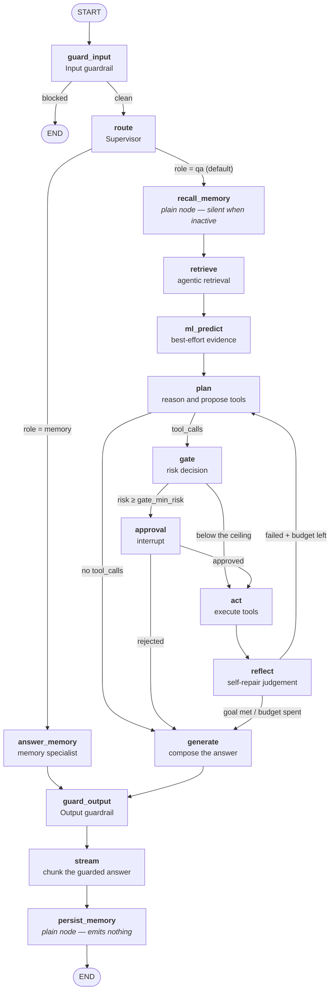

**Four things to point at.**

A blocked input goes **straight to END** — the router never runs and nothing downstream
executes.

The gate sits **between plan and act**, which is the only place it can: the plan is inspectable
there and nothing has happened yet.

The reflect→plan edge is the self-repair loop, and it terminates because the counter is
incremented in `plan` and capped in config.

`recall_memory` and `persist_memory` are wired **plain**, not through the timing wrapper, so a
run with no memory emits a byte-identical trace to one without the nodes at all.

---

## 2. Where the risk gate fires — and where ML does not

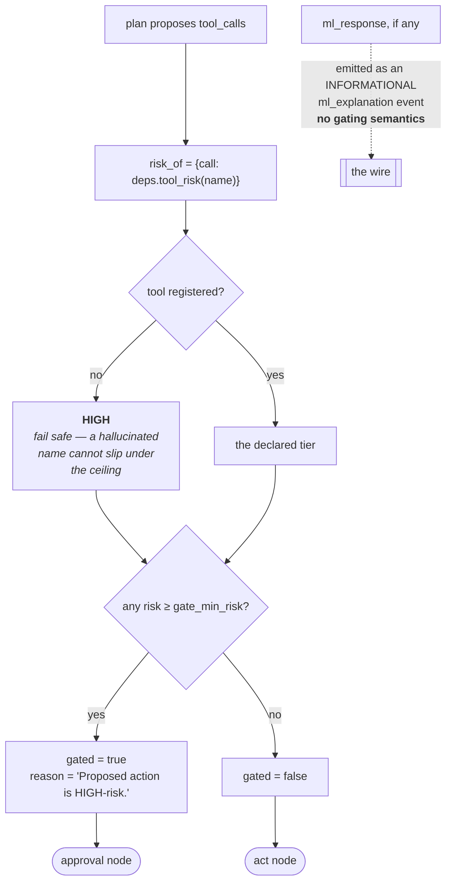

**The dotted edge is the design decision.** ML is evidence injected into the plan and the
answer. It never routes. A model 99% confident about a $4,200 refund still stops, because
refunds are HIGH-risk.

---

## 3. The interrupt / resume sequence — the one to memorise

```mermaid
sequenceDiagram
    autonumber
    participant C as SSE client
    participant O as run_agent
    participant G as LangGraph
    participant CP as checkpointer
    participant DB as approvals row
    participant R as ApprovalRegistry
    participant H as human via POST /approval

    O->>G: astream(...)
    G->>G: gate → gated=true
    G->>CP: checkpoint state
    G-->>O: __interrupt__ chunk
    O->>R: register(approval_id)
    Note over O,R: registered BEFORE emitting,<br/>so a fast decision cannot race past
    O->>DB: INSERT status=PENDING
    O->>O: parked_runs.register(run_id, graph, config)
    O-->>C: node_started · approval_queued · approval_required
    O->>R: await wait(approval_id)

    H->>DB: UPDATE ... WHERE status=PENDING
    Note over DB: the compare-and-swap:<br/>rowcount==1 ⇒ this caller won
    H->>R: notify_live(approval_id, decision)
    R->>R: set future result
    R->>R: await consumed, 1s
    R-->>O: wakes the waiter
    O->>R: mark consumed
    R-->>H: True (a live run took it)
    H->>DB: finalize APPROVED
    O->>G: Command(resume={approved, approver})
    G->>G: approval node RE-EXECUTES;<br/>interrupt() returns the payload
    G->>G: act → reflect → generate → guard_output → stream
    G-->>O: events
    O-->>C: events → run_finished
```

**Step 12 is where exactly-once lives.** The guarded UPDATE, not the graph.

**Step 20 is the detail people miss.** The approval node re-executes from its beginning on
resume, which is why nothing may be emitted before the `interrupt` call.

---

## 4. The acknowledged hand-off — the fixed bug, drawn

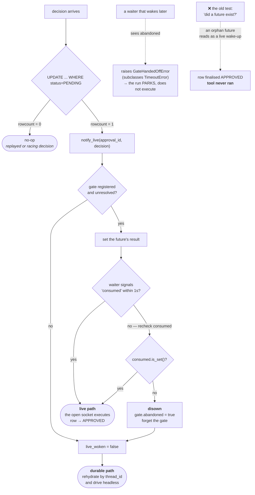

**The two dotted edges are the bug and its closure.** A registered future proves a gate exists,
not that anyone will consume it. `GateHandedOffError` subclasses `TimeoutError` precisely so
the orchestrator's existing park path handles it — exactly one side ever proceeds.

---

## 5. Two resolution paths, converging

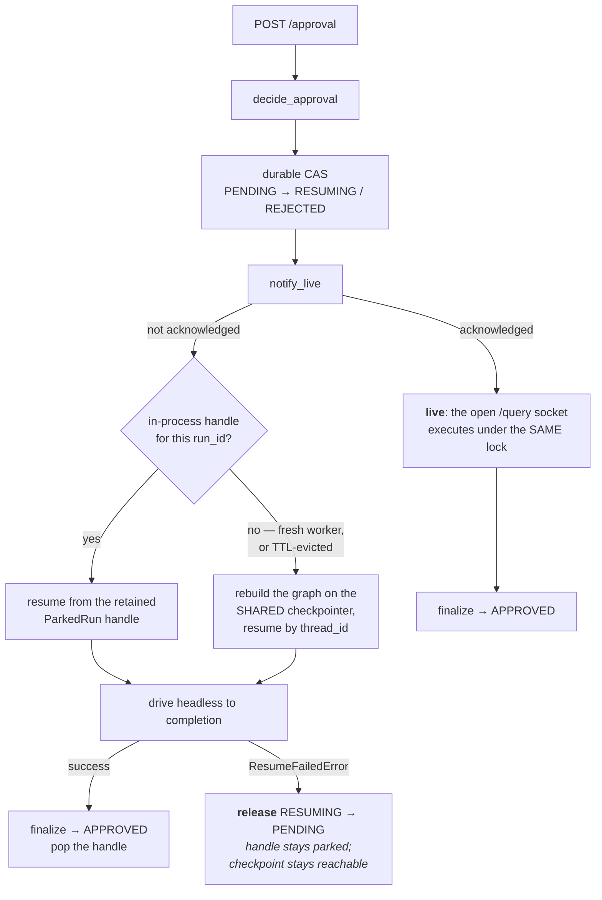

**The `REL` branch is the second fixed bug.** Without it, a failed resume left the row in
`RESUMING` — matched by neither a later decision (requires `PENDING`) nor the SLA sweeper (also
`PENDING`) — stranded forever.

---

## 6. The approval state machine

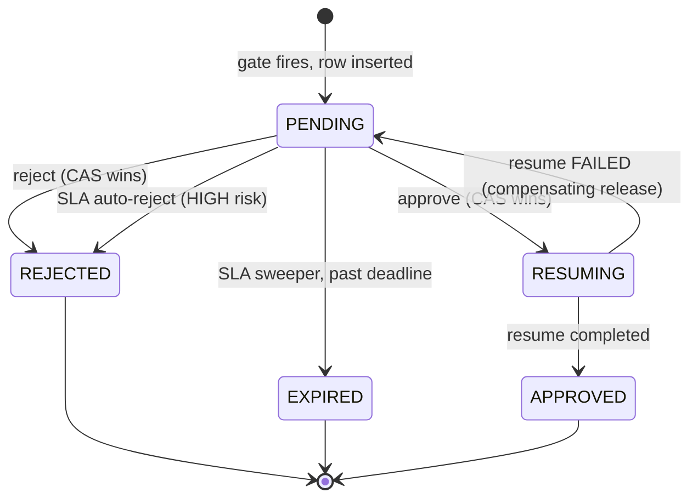

**`RESUMING` is the hazard.** It is matched by neither the decision path nor the sweeper, so
every route out of it must be explicit — completion forward, failure back. Every intermediate
state in a distributed transition needs a compensating action.

---

## 7. Reducers under a fan-out

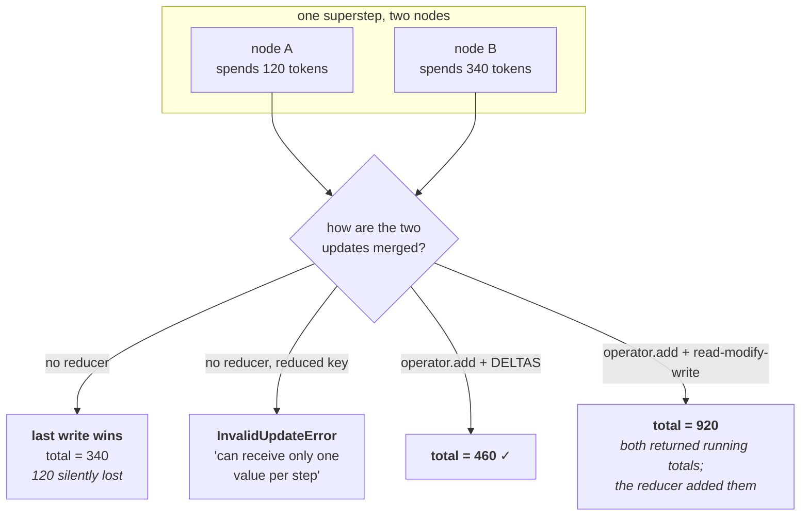

**Both halves are required.** A reducer without delta-returning nodes is *worse* than no
reducer — it double-counts. `_accrue` returns only the current call's contribution, which is
what makes the reducer correct.

And three keys deliberately have **no** reducer: `messages` (a per-round scratch buffer),
`conversation` (a snapshot of external state), and `tool_results` (replaced wholesale, and read
before the overwrite). "No reducer" is a decision there, not a default.

---

## 8. The self-repair loop, and why it terminates

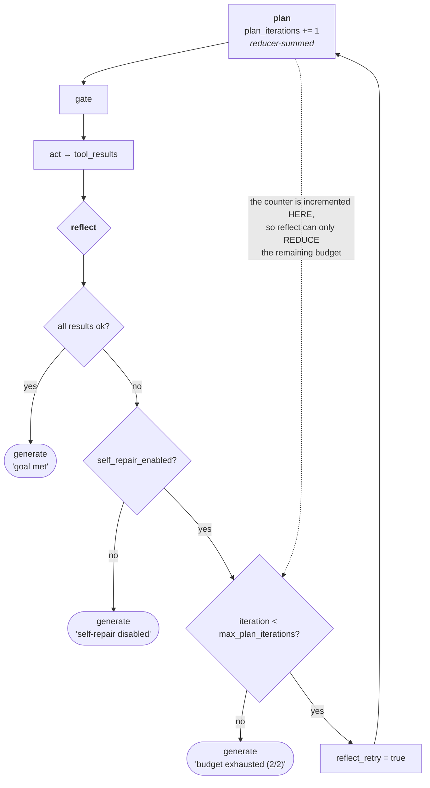

**Termination is structural.** The reflecting model chooses *whether* to retry; it cannot
extend the budget. And the four terminal reasons are distinct strings, so the `reflection`
event says which of the four ways it ended.

On a retry, the previous round's failed outcomes are fed back into the planning prompt —
Reflexion's verbal self-reflection, expressed as a graph edge.

---

## 9. The supervisor router

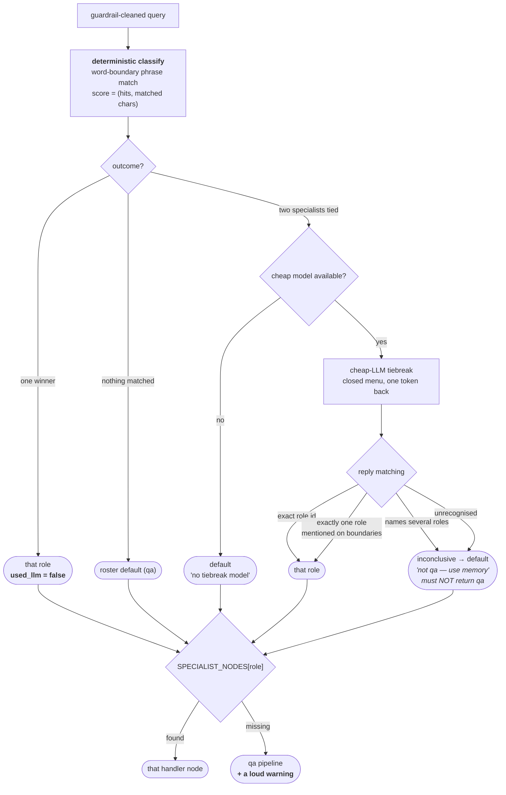

**Two fixed bugs are visible here.** Word-boundary matching (so "memory" no longer matches
"memorandum"), and strict tiebreak parsing (so a reply rejecting a role cannot elect it).

---

## 10. Where the retry sits, and why it matters

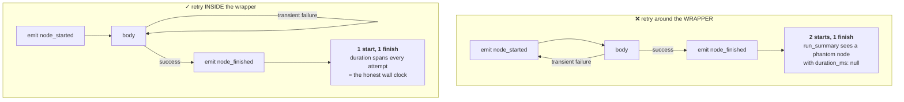

And the exclusions:

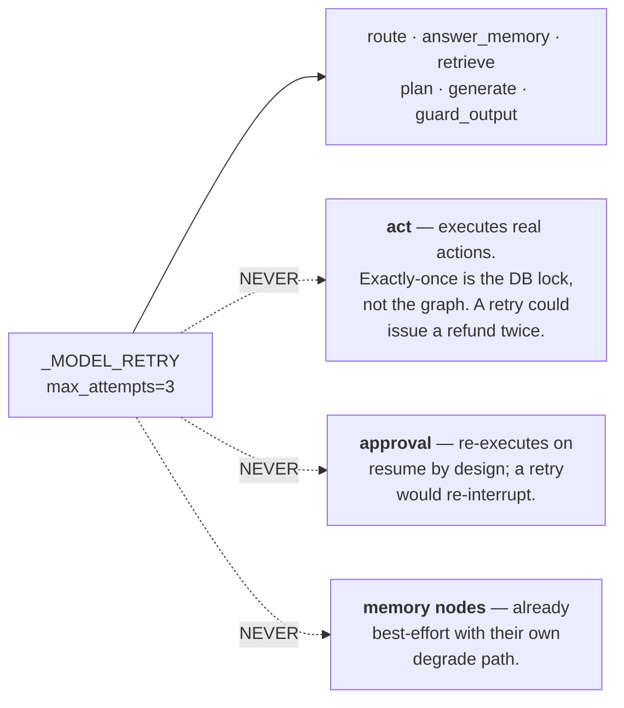

---

## 11. The event stream

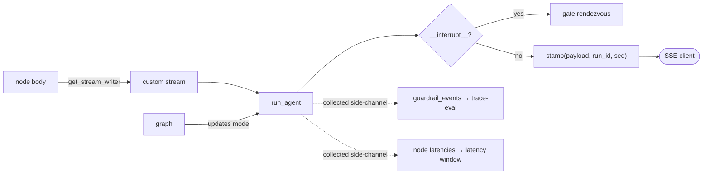

Two stream modes, two jobs: `custom` carries the wire events nodes deliberately emit;
`updates` is watched **solely** to detect an interrupt. The final state is read once via
`get_state`, not streamed — the stream is a presentation concern.

Every event is stamped with `run_id` and a monotonic `seq` and validated against the host's
locked wire schema by the injected `stamp` seam, so the graph never imports an API schema.

---

## 12. The injected seams

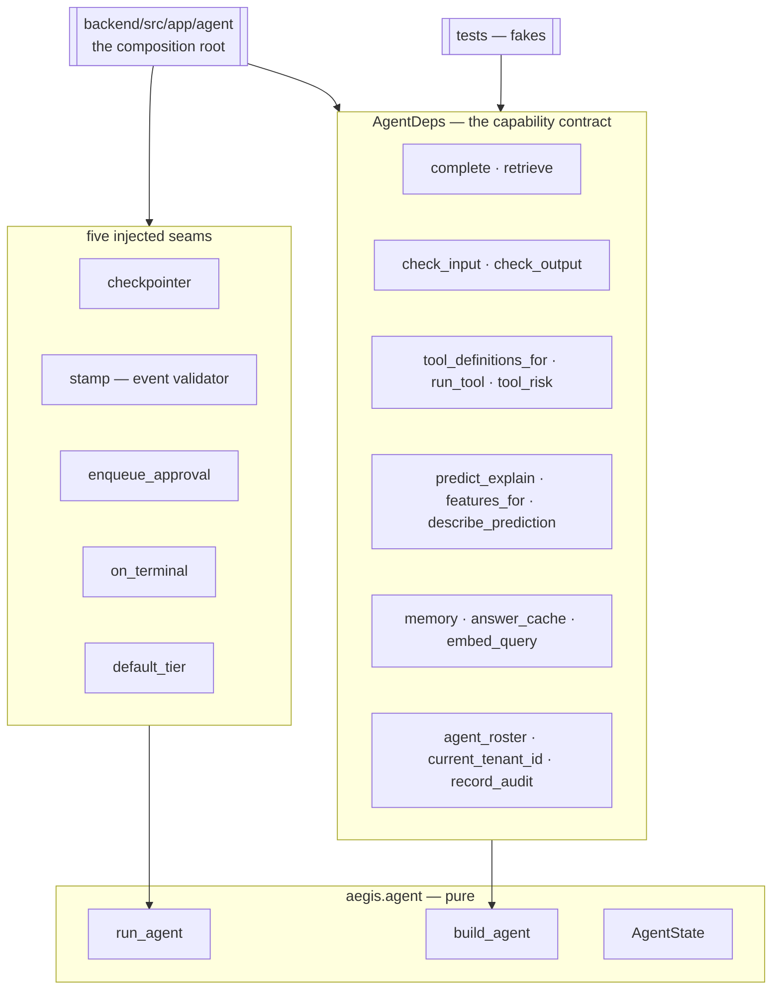

Inject fakes and the entire vertical slice runs offline: no API key, no network, no database.
Inject the real bindings and you get the durable platform. **The graph is identical in both
cases** — which is what makes the tests meaningful.

---

## 13. Topology, served rather than drawn

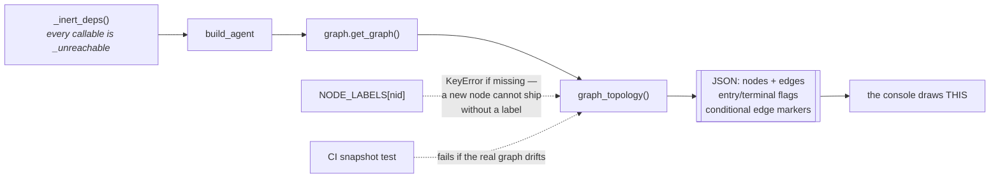

The console used to hardcode a 9-node DAG that drew the gate branching off **ML** —
contradicting the code, where the gate fires on tool risk and ML never routes — and could not
light 7 real nodes. A drifted architecture diagram is worse than none, because it is
confidently wrong.

**Next:** [`50-interview.md`](50-interview.md) — the questions you'll be asked.
