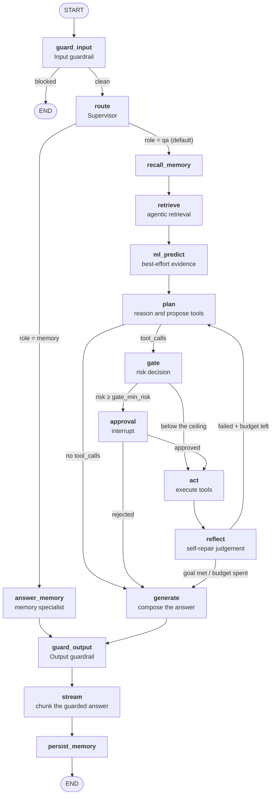
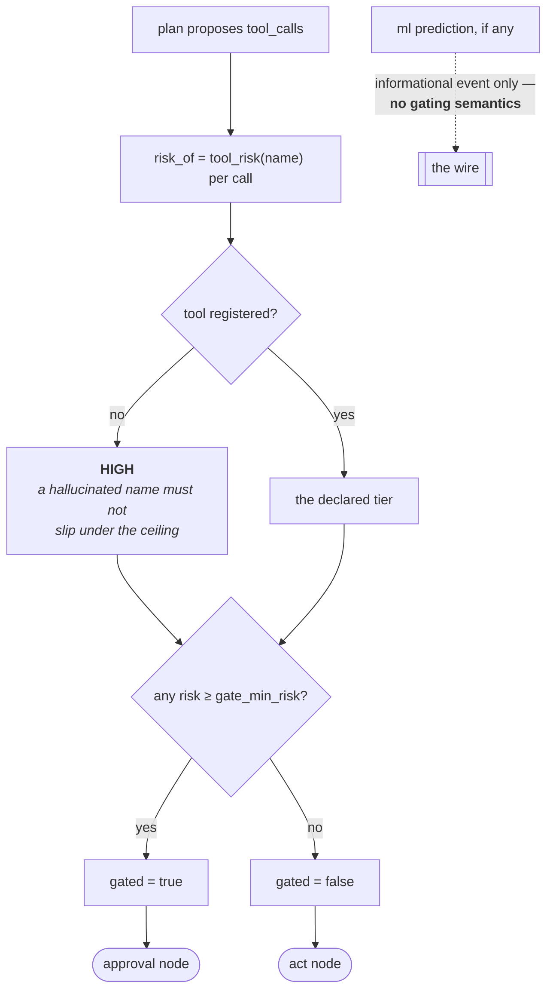
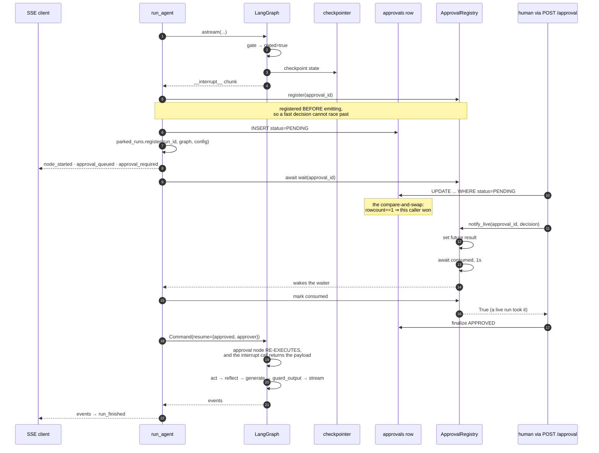
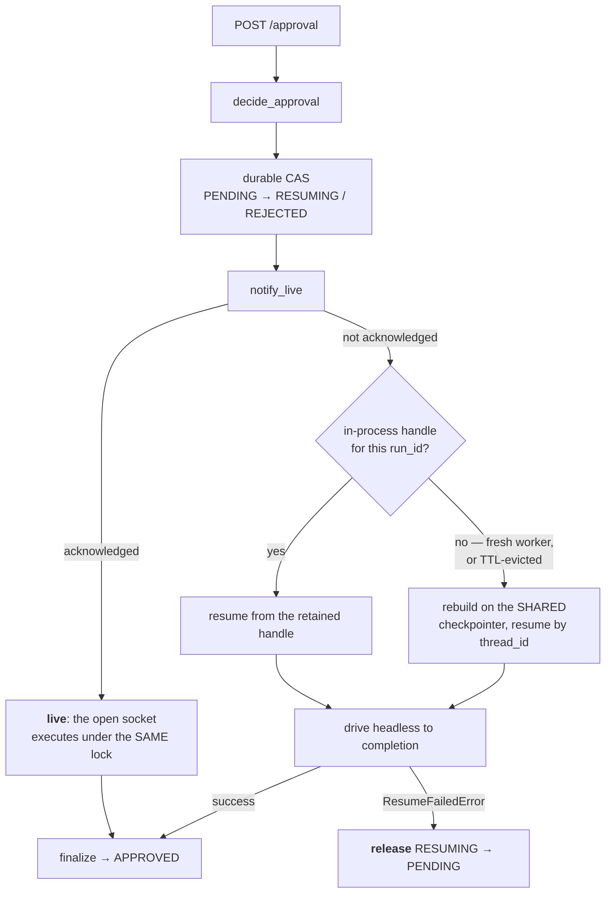
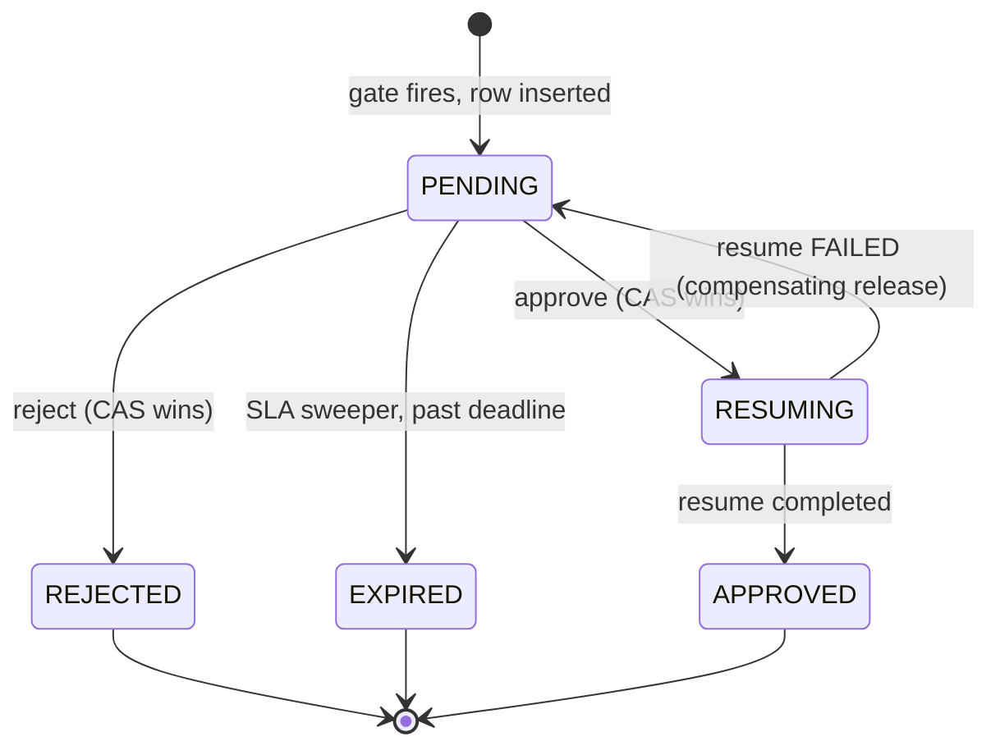

# The agent — the diagrams

Five diagrams. The two worth reproducing from memory are **the full graph** and **the
interrupt/resume sequence** — between them they carry a forty-minute conversation.

Everything else about this module is explained in [`10-guide.md`](10-guide.md); a picture is
only here when it shows something prose cannot.

---

## 1. The full graph

*Look at where the gate sits, and at the one edge that loops back.*

The gate sits **between `plan` and `act`** — the only place it can, because the plan is
inspectable there and nothing has happened yet.

The `reflect → plan` edge is the self-repair loop. It terminates because the counter is
incremented in `plan`, not in `reflect`, so no model output can extend the budget.

A blocked input goes **straight to END**: the router never runs.

---

## 2. What the gate actually decides

*Look at the `no` branch — that is the one an attacker would use.*

The dotted edge is the design decision: **ML informs, risk gates.** A model 99% confident about
a $4,200 refund still stops, because refunds are HIGH-risk.

---

## 3. The interrupt / resume sequence

*Look at step 12 and step 20. Everything else is plumbing.*

**Step 12 is where exactly-once lives** — the guarded UPDATE, not the graph.

**Step 20 is the detail people miss.** The approval node re-executes from its first line, which
is why nothing may be emitted before the `interrupt` call.

---

## 4. Two resolution paths, converging

*Look at the `release` branch — without it a run is stranded forever.*

Only one of the two paths can reach `act`, because only one of them won the compare-and-swap.

The `B2` branch is why eviction is safe: a fresh worker rebuilds from the durable checkpoint and
never needed the in-process handle at all.

---

## 5. The approval state machine

*Look at `RESUMING` — it is the only state with no sweeper watching it.*

`RESUMING` is matched by neither the decision path nor the SLA sweeper, so **every route out of
it has to be explicit** — forward on success, back on failure.

Every intermediate state in a distributed transition needs a compensating action.

**Next:** [`50-interview.md`](50-interview.md) — the questions you'll be asked.
