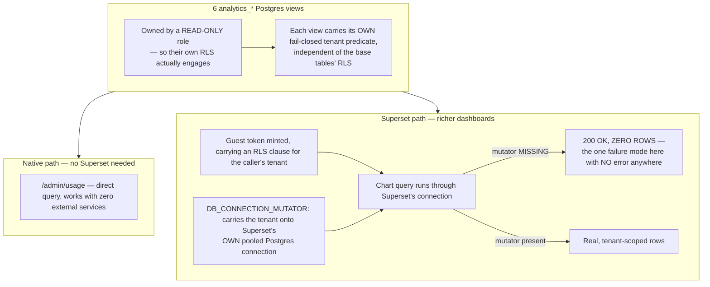

# Analytics

## What it is

The reporting layer: six Postgres views over the platform's own operational
tables (`analytics_spend_daily`, `analytics_runs_daily`, and four others),
consumed either through a native `/v1/admin/usage` path or through embedded
Superset dashboards. If you have never worked with database views owned by
a restricted role before: the interesting technique here is that tenant
isolation is enforced **twice**, independently — once by the view's own SQL
predicate, and once by Superset's guest-token row-level-security clause —
so a failure in either layer alone does not leak data.

## Why it exists here

A dashboard showing cross-tenant numbers by accident is a severe failure on
a multi-tenant platform, and the module is built specifically so that
failure mode defaults to **an empty dashboard**, not a leaked one. Every
part of this system's design biases toward "shows nothing" over "shows the
wrong tenant's data" when something is misconfigured.

## Diagram



## The architecture

```
docs/operations/superset/          the committed asset bundle (datasets, charts, dashboard)
docs/operations/superset-embedded.md   the full integration writeup + failure modes
scripts/superset.sh                install|import|start — rebuilds the whole instance
.superset/                         the actual running instance (gitignored, project-local)
```

The six views themselves live in the Postgres schema, provisioned by a
script that grants them to a dedicated read-only role — not defined as
Python ORM models, since they are pure SQL views over existing tables.

## What is actually in Aegis

### Views owned by a read-only role — why ownership, not just grants, matters

The `analytics_*` views are **owned by** a dedicated read-only Postgres
role, not merely granted `SELECT` under the application's own owning role.
This is load-bearing: Postgres Row-Level Security policies apply based on
the querying role, and a view's RLS behaviour follows its **owner's**
privileges in specific ways that a plain grant does not replicate. Owning
the views under the restricted role is what makes their own tenant
predicate actually engage rather than being silently bypassed by
inherited owner privileges.

### Each view's own fail-closed predicate — independent of the base tables

Even though the base tables underneath already carry RLS (see
`governance.md`), each `analytics_*` view **additionally** carries its own
tenant predicate. This is deliberate defence in depth: a bug in the base
table's RLS configuration does not automatically compromise the analytics
layer, because the analytics layer does not merely trust the base tables —
it re-asserts the same discipline itself, independently.

### `DB_CONNECTION_MUTATOR` — the one failure with no error anywhere

This is the single most important operational fact about this module.
Superset opens its **own** pooled Postgres connection to query these views
— a connection the rest of Aegis's tenant-scoping machinery has no
visibility into. `DB_CONNECTION_MUTATOR` is the hook that carries the
calling tenant onto that connection (via the guest token's row-level-
security clause). **Its absence produces `200 OK` with zero rows** — not an
error, not a 403, nothing that would obviously point at the actual cause.
A chart rendering empty is, on this platform, most likely this exact
misconfiguration rather than a genuine "no data" state — worth checking
first, precisely because it is otherwise silent.

### The second silent failure: Superset pointed at the wrong database

`DB_CONNECTION_MUTATOR` has a sibling, found on 2026-08-23 and worth checking in
the same breath. The Analytics screen read **Metered spend 88.11** and 9 red-team
runs while the Aegis-native KPI beside it said **$4.16** and the database held 7.
Nothing was broken: Superset's stored connection pointed at the database `taif`,
and the backend serves `taif_run1`. Both had been repointed when the deployment
moved; this one was missed.

An analytics tool aimed at the wrong database is not a broken chart. It is a
chart that renders confidently with **another deployment's numbers**, and nothing
on the screen looks wrong. Verify by a *distinctive* count rather than a
plausible one — "does this number match a count I can run myself?" — never by
whether the chart looks populated.

The committed bundle is why it could come back: `databases/Aegis.yaml` hardcoded
`/taif`, so re-provisioning would have recreated it. The database name is now
substituted the same way the password already was, defaulting to the database in
`POSTGRES_DSN` so the two cannot drift by default, and refusing to guess when
neither is set.

### Verified live in this project

`spend-by-model`, `runs-by-outcome`, `human-gates` and other boards were
directly verified end to end: real per-model spend figures (e.g.
`genailab-maas-gpt-4o` at a real measured dollar amount), real run-outcome
counts (903 completed, 32 blocked on the seeded demo data), all correctly
scoped per tenant when queried as different tenant principals.

### The two-path design — native works with nothing else running

`/v1/admin/usage` queries the underlying tables directly and needs no Superset
instance at all — a deployment can show real spend/usage figures with zero
external dependencies. Superset is additive, for richer dashboard
composition, not a hard requirement for basic analytics to function.

## How it runs

1. A caller requests either the native `/v1/admin/usage` endpoint, or a
   Superset-embedded dashboard.
2. For the native path: a direct query against the `analytics_*` views,
   scoped by the caller's own RLS-bound session.
3. For the Superset path: a guest token is minted carrying an RLS clause
   for the caller's tenant; `DB_CONNECTION_MUTATOR` carries that same
   tenant onto Superset's own separate database connection before the
   chart's query actually runs.
4. Either path reads from views that independently re-assert tenant
   isolation, on top of the base tables' own RLS.

## What is not here

- **Superset is not required** for analytics to function at all — the
  native path is a complete, independent fallback.
- **The Superset instance itself is not durable across a machine
  rebuild** unless deliberately placed under a persistent path — see
  `docs/operations/superset-embedded.md` and `scripts/superset.sh` for the
  full rebuild procedure, which this project needed to actually use once
  after an instance installed to a temporary location was lost.
- **A `200 OK` with zero rows on a Superset-embedded chart is not
  automatically distinguishable from genuinely empty data** without
  checking `DB_CONNECTION_MUTATOR` specifically — there is no separate
  error surfaced for this misconfiguration.
