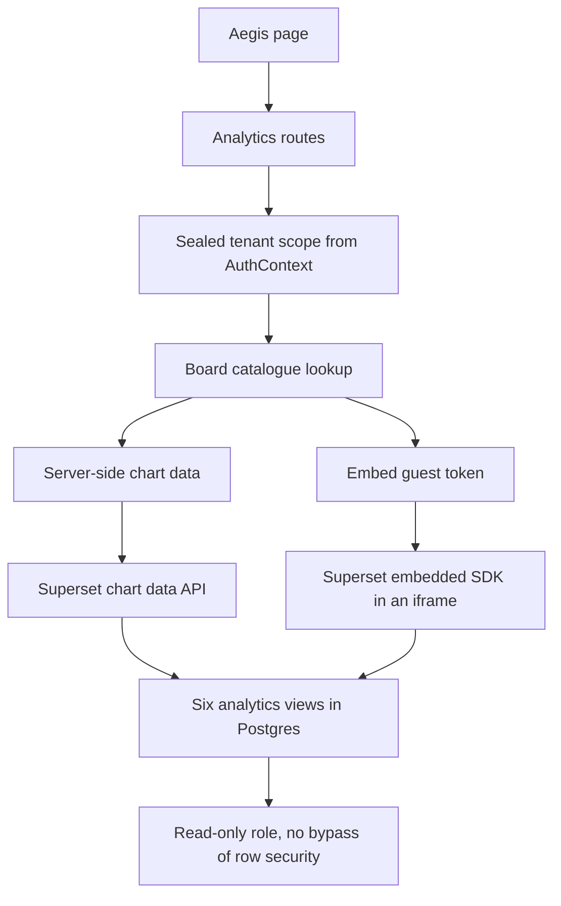

# Analytics

## What it is

Analytics puts business-intelligence charts inside Aegis. Apache Superset holds
the charting engine; Aegis holds the questions it is allowed to ask and the
tenant filter it cannot escape. An operator sees spend, run outcomes, approvals
and job throughput on an Aegis page, never on a second portal.

## Why it exists

Operators need trends, not single rows: spend per model per day, how many runs
were blocked, how long a human gate took. Building a chart engine is wasted
effort, and pointing people at a raw BI tool hands them every tenant's data. This
module takes the engine and keeps the boundary.

## Diagram



## How it works

**The tenant filter is derived, never accepted.** Every request resolves
`AuthContext.tenant_scope()` — the sealed authority that comes from the verified
token, not from the request body or a query string. `rls.py` turns that scope
into a SQL `WHERE` clause. A principal bound to no tenant raises
`UntenantedPrincipalError`, which the route turns into a 403. There is no code
path where a missing tenant becomes "no clause", which in row-security terms
would mean every tenant.

**The browser names a board, and nothing else.** A **board** is a server-side
definition: which Superset dataset, which columns, which metrics, which row
limit. Boards are loaded from a JSON catalogue file (`catalogue.py`). The wire
carries a board id and one of five fixed time windows — `last_7_days`,
`last_30_days`, `last_quarter`, `last_year`, `no_filter`. No dataset, column,
metric, row limit or free-text time range ever arrives from a caller.

**Two paths reach the same data.**

1. *Server-side chart data.* Aegis builds the Superset query context itself
   (`query.py`), calls Superset's `POST /api/v1/chart/data` with a tenant-scoped
   guest token, and returns rows that Aegis's own chart components draw in the
   Aegis theme. No iframe.
2. *The embed.* Aegis mints a short-lived Superset **guest token** and hands it
   to the browser, which passes it to Superset's embedded SDK to render a
   dashboard in an iframe.

**The service credential never leaves the process.** Aegis signs in to Superset
with its service account for exactly one purpose: minting guest tokens. Every
request that can touch tenant rows is authenticated with a guest token instead.

**Isolation is asserted three times, independently.**

1. The guest token's `rls` list — Superset compiles the clause into the `WHERE`
   of every query run under that token. The holder of the token cannot remove it.
2. The query context Aegis builds carries the same predicate as a filter, so the
   question was narrow before Superset ever saw it.
3. Each `analytics_*` view carries `TENANT_PREDICATE` in its own `WHERE`, and
   that predicate is **fail-closed**: an unset or non-numeric `app.tenant_id`
   yields `tenant_id = NULL`, which is never true, so a connection nobody scoped
   sees zero rows rather than everything.

**Superset is optional and Aegis degrades honestly.** Nothing in this module runs
at import or at boot. `AnalyticsService.status()` never raises — it reports
whether the feature is on, whether it is configured, whether Superset answered,
how many boards this role has, and a sentence naming what to do about whatever is
wrong. A deployment with no Superset differs in exactly one page.

## What it stores

This module owns no tables. It owns **six read-only Postgres views**, generated
as SQL by `provision.py` and installed by an operator. Every view carries
`tenant_id` as its first column, because that is the column both isolation
layers filter on.

| View | Source table | Columns that matter |
|---|---|---|
| `analytics_spend_daily` | `usage_ledger` | `day`, `model`, `calls`, `prompt_tokens`, `completion_tokens`, `total_tokens`, `cost_usd`, plus the run-attributed and unattributed splits. The authoritative spend figure. |
| `analytics_runs_daily` | `runs` | `day`, `status`, `runs`, `cache_hits`, `avg_duration_ms`, `max_duration_ms`, `ledger_cost_usd`, `agent_reported_cost_usd`, `approvals_raised`, `guardrail_blocks` |
| `analytics_approvals_daily` | `approvals` | `day`, `status`, `risk`, `gates`, `avg_decision_seconds` |
| `analytics_jobs_daily` | `job_runs` | `day`, `job_type`, `status`, `jobs`, `cost_usd`, `avg_runtime_seconds` |
| `analytics_redteam_runs` | `redteam_runs` | `run_id`, `started_at`, `suite`, `mode`, `attacks_total`, `attacks_blocked`, `block_rate`, `false_positive_rate`, `passed`, `duration_ms` |
| `analytics_audit_daily` | `audit_log` | `day`, `action`, `events` |

The two cost columns on `analytics_runs_daily` are named apart deliberately.
`ledger_cost_usd` sums the ledger rows a run caused and is the same money as
`analytics_spend_daily.cost_usd`, sliced by run. `agent_reported_cost_usd` is the
run's own self-report of what its graph accounted for, which excludes guardrail
screens, embeddings and routing calls the same run also paid for.

## Security and tenant isolation

**The database role.** Superset connects as a dedicated role — `aegis_superset`
by default — created `NOSUPERUSER NOBYPASSRLS` with `SELECT` and nothing else.
This matters: PostgreSQL skips row security entirely for a superuser or a
`BYPASSRLS` role, so an owner-connected Superset would make every tenant policy
inert for every query it ran.

**Two GUCs.** A **GUC** is a per-connection Postgres setting.
`app.tenant_id` carries the tenant a connection may read — the same one Aegis's
own `tenant_isolation` policies read, so a connection cannot be set to two
different tenants at two layers. `app.analytics_all_tenants = 'on'` is the
platform-wide read, a deliberate opt-out in a variable of its own that nothing
else in Aegis ever writes.

**Who may call.** `require_analytics_reader` admits any authenticated principal
to the section. *Which boards* they see is decided by each board's `audience`
(one of `platform_admin`, `tenant_admin`, `ai_team`, `devops`, `client`), applied
identically in all three board routes — so hiding a board from the list is never
the only thing stopping someone opening it. A board id that exists but is not
this caller's returns the same 404 as one that does not exist, so a 404 cannot
reveal which boards exist.

**Auditing.** Minting an embed token writes an `analytics.embed_token` audit row
recording who asked, for which board, and which tenant the token was scoped to.

## API surface

| Method | Path | Who may call it | Returns |
|---|---|---|---|
| GET | `/v1/analytics/status` | any authenticated principal | Whether the feature is enabled, configured, reachable, embed-capable; a detail sentence, a suggested action, the base URL and the board count for this role. Answers 200 in every state. |
| GET | `/v1/analytics/boards` | any authenticated principal | The catalogue entries this role is an audience for, the window keys, and whether the caller is tenant-scoped |
| POST | `/v1/analytics/boards/{board_id}/data` | any authenticated principal, board audience enforced | Columns and rows for one board, scoped to the caller's tenant. Body carries only an optional window key. |
| POST | `/v1/analytics/boards/{board_id}/embed-token` | any authenticated principal, board audience enforced | A short-lived guest token plus the dashboard UUID for the embedded SDK |

An unreachable Superset returns 503 with the operator instruction; a rejection
from Superset returns its own mapped error. Neither takes down any other page.

## Configuration

| Variable | Default | Effect |
|---|---|---|
| `AEGIS_SUPERSET_ENABLED` | `false` | Turns the feature on. Off means the page says so and names this variable. |
| `AEGIS_SUPERSET_BASE_URL` | `""` | Where Superset is served, e.g. `http://localhost:8088` |
| `AEGIS_SUPERSET_USERNAME` | `""` | The Superset service account used only to mint guest tokens |
| `AEGIS_SUPERSET_PASSWORD` | `""` | That account's password |
| `AEGIS_SUPERSET_PROVIDER` | `db` | Superset's auth provider name |
| `AEGIS_SUPERSET_TENANT_COLUMN` | `tenant_id` | The tenant column both isolation layers filter on |
| `AEGIS_SUPERSET_BOARDS` | `""` | Path to the JSON board catalogue. Unset means no boards, reported as itself. |
| `AEGIS_SUPERSET_EMBED_ENABLED` | `false` | Whether the iframe embed is expected to work here. Separate from the feature flag, so losing the embed costs the iframe and not the charts. |
| `AEGIS_SUPERSET_GUEST_TOKEN_TTL_SECONDS` | `300` | Lifetime of a minted guest token — the only Superset credential that reaches a browser |
| `AEGIS_SUPERSET_SSL_VERIFY` | `true` | Verify Superset's TLS certificate. Only meaningful for an `https` base URL. |

The views and the role are installed by an operator, not at boot:

```
python -m aegis.analytics --role aegis_superset --password '…' > analytics.sql
psql -d aegis -f analytics.sql
```

The command **prints** the SQL rather than executing it, so a DBA can read the
DDL before it runs.

## Where it lives

| Path | What it does |
|---|---|
| `aegis/src/aegis/analytics/rls.py` | Derives the tenant clause from the sealed scope. Does no I/O. |
| `aegis/src/aegis/analytics/provision.py` | Declares the six views, the read-only role and the fail-closed predicate; renders the DDL |
| `aegis/src/aegis/analytics/catalogue.py` | Loads and validates the JSON board catalogue |
| `aegis/src/aegis/analytics/query.py` | Builds the Superset query context from a board plus a scope |
| `aegis/src/aegis/analytics/client.py` | The Superset HTTP surface: login, guest token, chart data, embed registration |
| `aegis/src/aegis/analytics/service.py` | The entry point: status, board selection, board data, embed grants |
| `aegis/src/aegis/analytics/types.py` | Boards, windows, aggregates, health verdicts, refusals — values only |
| `aegis/src/aegis/analytics/__main__.py` | `python -m aegis.analytics` — prints the provisioning SQL |
| `backend/src/app/api/routes_analytics.py` | The four HTTP routes and the composition of the service |
| `docs/operations/superset-embedded.md` | The operator's integration walkthrough |
| `scripts/superset.sh` | Install, import and start the local Superset instance |

## What it does not do

- **It does not run raw SQL from a caller.** No `extras.where`, no free-text time
  range, no client-supplied datasource. The catalogue is the whole set of
  questions Aegis will ask.
- **It does not require Superset.** With the feature off, one page explains
  itself and every other surface is unchanged.
- **It does not write anything.** The role has `SELECT` only, and every view is
  read-only.
- **It does not open a socket at import or boot.** The service is built lazily on
  the first request to the analytics router.
- **It does not decide authorisation.** Role and tenant come from the HTTP layer;
  this package receives a sealed scope it cannot compute for itself.
