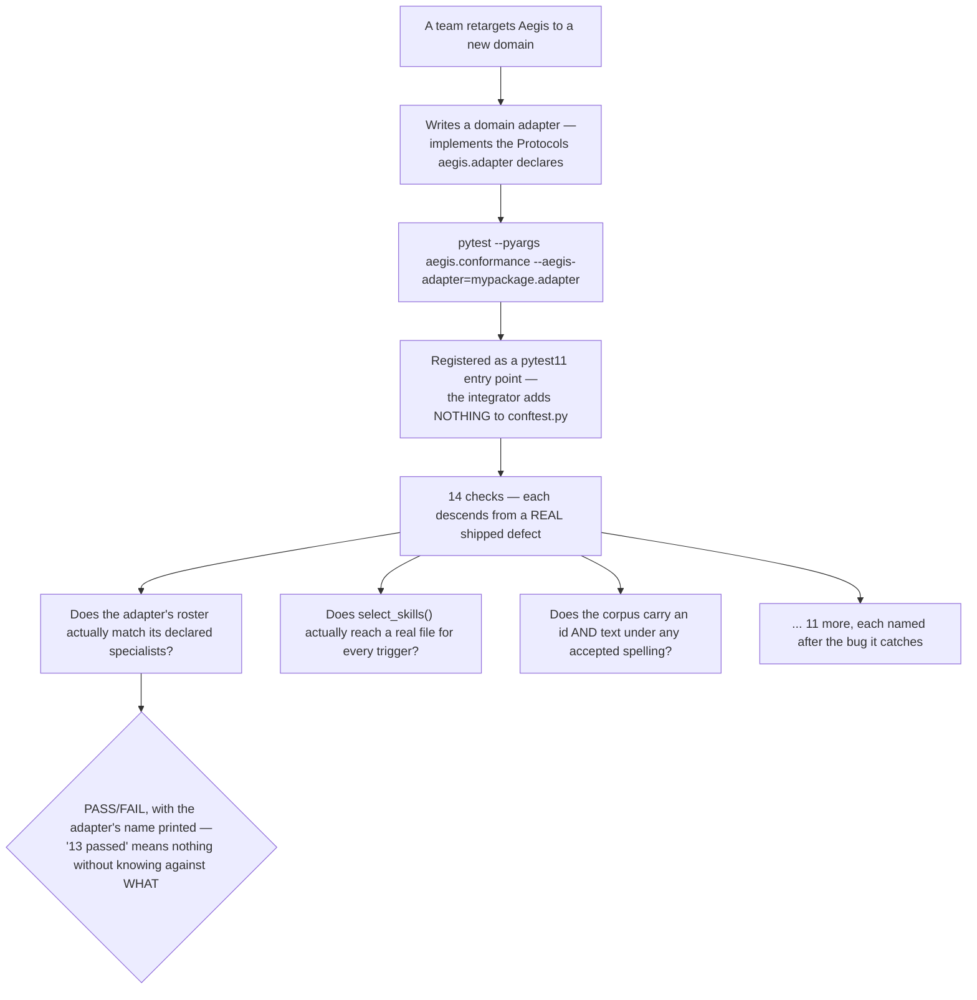

# Conformance

## What it is

A test suite that checks whether a **domain adapter** — the swappable
plug-in that gives Aegis its actual business domain (customer support,
finance, whatever a deployment is retargeted to) — is genuinely complete,
not merely present. If you have never worked on a platform designed to be
retargeted to a new domain: the risk is a "blind swap" that looks finished
(the code compiles, the app boots, screens render) while some load-bearing
piece of the contract was never actually implemented, and that gap is
invisible until a real user hits it in production.

## Why it exists here

Quoted directly, and it is the whole reason this suite is structured the
way it is: *"Fourteen checks, and every one of them descends from a defect
this repository shipped."* This is not a hypothetical test suite written
against an imagined failure mode — every single check exists because a real
version of that exact defect actually happened during this project's own
development, and someone decided the fix should be a permanent, automated
check rather than a one-time correction.

## Diagram



## The architecture

```
aegis/src/aegis/conformance/
  test_conformance.py   the 14 checks themselves
  plugin.py              the pytest11 entry point — --aegis-adapter option, header line
  _report.py             fail() — the shared failure-reporting helper
```

## What is actually in Aegis

### A real pytest plugin, registered as an entry point — zero integrator setup

`plugin.py` is registered in `aegis/pyproject.toml` as a `pytest11` entry
point. This means it is **live in any environment where `aegis` is
installed** — an integrator writing a new domain adapter adds nothing to
their own `conftest.py` and copies no files to get the suite running; it is
already discoverable the moment `aegis` is a dependency. Running it is:

```
pytest --pyargs aegis.conformance --aegis-adapter=mypackage.my_adapter
```

### The header line exists because this suite gets demonstrated on a screen

Quoted: *"'13 checks passed' is only evidence if the audience can see
*which* adapter they passed against."* The plugin prints a header naming
the exact adapter path under test — so a report of passing conformance
cannot be silently shown against the wrong adapter, or against no adapter
at all, and still look like proof of anything.

### The checks tolerate real-world field naming, on purpose

`_ID_ATTRS = ("id", "doc_id", "document_id", "uid", "key")` and
`_TEXT_ATTRS = ("body", "text", "content", "markdown", "raw_text",
"chunk_text")` — the suite checks whether a corpus record carries an
identity and text field under **any** of several accepted spellings, rather
than demanding one exact field name. This is a deliberate accommodation:
different domain adapters will reasonably have grown their own corpus
schema, and the conformance check's job is to verify the *contract* is met
(every record is identifiable and has text), not to impose one rigid field
name on every possible adapter.

### The blind-swap test this suite is built to catch

The project's own history is the clearest illustration: a domain swap that
compiles and boots is not the same as one that is complete. Four core
modules were found to have leaked the *previous* domain's vocabulary into
what should have been fully retargeted code — the app ran, screens
rendered, and the platform was still broken for every real authenticated
user because a fresh agent doing the swap had missed pieces the conformance
suite exists specifically to surface before a jury or a customer does.

## How it runs

1. A team retargets Aegis by writing a new domain adapter implementing the
   Protocols `aegis.adapter` declares.
2. They run the conformance suite against their adapter's import path.
3. Each of the 14 checks independently verifies one specific contract —
   the roster matches its declared specialists, every skill trigger reaches
   a real file, every corpus record is identifiable and has text under an
   accepted field name, and eleven more — each named for the real defect
   it was written to catch.
4. The header names the adapter under test, so a passing report is
   attributable.

## What is not here

- **This does not verify the adapter's business logic is *correct*** —
  only that the contract's shape is met (fields exist, roster entries
  resolve, files are reachable). A conformant adapter can still give wrong
  domain answers; conformance is a floor, not a correctness proof.
- **It cannot catch a defect nobody has shipped yet** — by its own stated
  design, every check descends from a real, already-encountered failure.
  A genuinely novel class of incompleteness in a future swap would need a
  new check added, the same way each of the current 14 was added.
