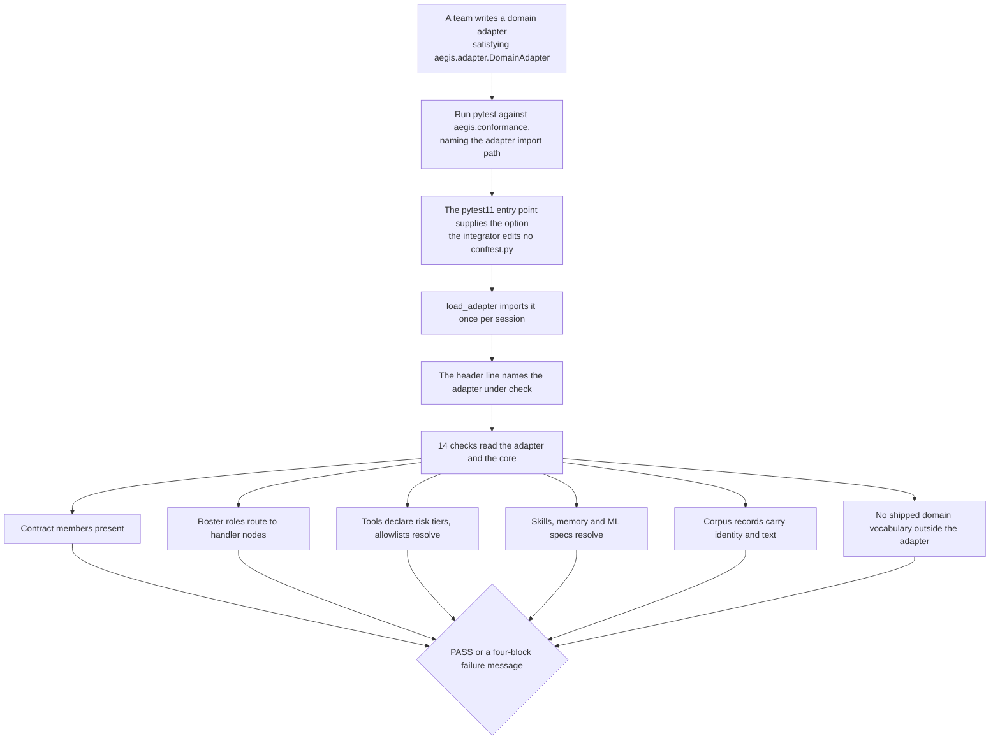

# Conformance

## What it is

`aegis.conformance` is an executable test suite that checks whether a **domain
adapter** — the swappable package that gives Aegis its business domain — is wired
completely. It ships as a pytest plugin, runs with one command, and needs no
Postgres, no Redis, no queue and no model call.

## Why it exists

Aegis is retargeted to a new domain by writing one adapter. The risk is a swap
that *looks* finished: the code imports, the app boots, the screens render, and
some load-bearing piece of the contract was never actually implemented. That gap
stays invisible until a real user hits it. The suite makes the gap fail a command
instead.

Because it touches no infrastructure, an integrator can run it **before** the
database, the gateway or the queue works — which is exactly when a wiring mistake
is cheapest to fix.

## Diagram



## How it works

### Pointing it at an adapter

Three ways, in precedence order:

1. `pytest --pyargs aegis.conformance --aegis-adapter myapp.adapter`
2. `AEGIS_ADAPTER=myapp.adapter pytest --pyargs aegis.conformance`
3. Nothing — the run stops immediately with a usage error naming both of the
   above.

The command line wins over the environment, so a shell that already exports
`AEGIS_ADAPTER` for a running application can still check a second adapter
without unsetting anything.

A missing or unimportable adapter raises `AdapterNotSelectedError`, which is a
hard stop rather than a skipped suite: a conformance run that quietly checks
nothing is indistinguishable, in a terminal, from one that passed.

### The plugin

`plugin.py` is registered in `aegis/pyproject.toml` as a `pytest11` entry point,
so it is live in any environment where `aegis` is installed. An integrator copies
no files and adds nothing to their own `conftest.py`. Being globally loaded, it is
deliberately **inert**: it contributes one namespaced option and one header line,
and does nothing at all to a pytest run that is not checking an adapter.

The header line names the exact adapter path under test. "14 checks passed" is
only evidence if the reader can see *which* adapter they passed against.

### The fixtures

`conftest.py` imports the adapter once per session and exposes two fixtures:
`adapter` (the module) and `piece` (a reader for one adapter member). Every check
that reads a member goes through `piece`, so a missing member fails with the same
actionable message rather than an `AttributeError` from inside a check body.

### The 14 checks

| # | Check | What it verifies |
|---|---|---|
| 1 | `every_contract_member_is_present` | The adapter declares every member `aegis.adapter.DomainAdapter` requires. |
| 2 | `domain_identity_is_a_usable_topical_rail` | The declared domain identity can actually drive the topical guardrail. |
| 3 | `every_roster_role_has_a_handler_node` | Each specialist in the roster resolves to a real graph node. |
| 4 | `the_roster_default_role_is_declared_and_routable` | The default role exists and can be routed to. |
| 5 | `every_tool_declares_a_risk_tier` | No tool reaches the approval gate without a risk tier. |
| 6 | `allowlists_name_registered_tools_and_known_personas` | Per-persona tool allowlists name tools and personas that exist. |
| 7 | `every_persona_the_adapter_declares_resolves` | Every declared persona resolves. |
| 8 | `the_system_prompt_never_drops_the_platform_floor` | The adapter's system prompt keeps the platform's baseline instructions. |
| 9 | `memory_spec_satisfies_the_memory_contract` | The memory spec is a real attribute of the adapter and satisfies the contract. |
| 10 | `skills_directory_holds_at_least_one_playbook` | The skills directory is not empty. |
| 11 | `every_playbook_is_reachable_from_select_skills` | Every playbook file can actually be selected by a trigger. |
| 12 | `ml_spec_resolves_to_the_domain_not_the_fallback` | The ML spec trains on domain data, not a generic fallback. |
| 13 | `seed_corpus_records_carry_identity_and_chunk` | Every corpus record has an id and text. |
| 14 | `no_shipped_domain_vocabulary_survives_outside_the_adapter` | No word from the shipped domain remains in any core module. |

### Field-name tolerance

Check 13 accepts several spellings rather than demanding one:

- identity: `id`, `doc_id`, `document_id`, `uid`, `key`
- text: `body`, `text`, `content`, `markdown`, `raw_text`, `chunk_text`

Different adapters reasonably grow their own corpus schema. The check's job is to
verify the contract is met — every record is identifiable and has text — not to
impose one field name on every possible adapter.

### The vocabulary check

Check 14 is the inverse of the others: it reads the **core**, not the adapter, and
asks whether any module outside the adapter still contains a word belonging to the
shipped domain. `_vocabulary.py` freezes that word list as data the check is
quarantining — nothing in the platform reads the module, and a term listed there
is a term the core is forbidden to contain.

The check is **unconditional**. It is not "runs only after a retarget": the
reference adapter itself must keep the core clean, which is the only way the
promise holds before anybody retargets. When the reference adapter is the one
loaded, every listed term must still be found somewhere inside it, so a stale
entry is a failure rather than decoration.

### The failure message

`_report.py::fail()` renders every failure in the same four labelled blocks —
**what** was found, **fix** (the edit to make), **if not** (the consequence of
leaving it), and **scar** (the class of wiring mistake this check guards against).
It calls `pytest.fail(..., pytrace=False)`, because a traceback through the report
module tells the reader nothing and buries the four lines that do.

## What it stores

This module stores nothing. It writes no files, opens no connections and mutates
no adapter it reads.

## Security and tenant isolation

No tenant-scoped data. The suite runs in a developer's or CI's process, reads an
imported module, and never authenticates as anyone. It performs only pure,
side-effect-free reads — each check's docstring names exactly what it touches.

## API surface

No HTTP routes. The entire surface is one command:

```
pip install 'aegis[conformance]'
AEGIS_ADAPTER=myapp.adapter pytest --pyargs aegis.conformance
```

## Configuration

| Name | Kind | Default | Effect |
|---|---|---|---|
| `AEGIS_ADAPTER` | Environment variable | unset | The adapter import path to check. |
| `--aegis-adapter` | pytest option | unset | The same, and wins over the environment. |

The `aegis[conformance]` extra pulls exactly one dependency: `pytest>=8.3`.

## Where it lives

| File | What it does |
|---|---|
| `aegis/src/aegis/conformance/__init__.py` | `ADAPTER_ENV_VAR`, `ADAPTER_OPTION`, `load_adapter()`, `AdapterNotSelectedError`. |
| `aegis/src/aegis/conformance/plugin.py` | The `pytest11` entry point: the option and the header line. |
| `aegis/src/aegis/conformance/conftest.py` | Session-scoped `adapter` and `piece` fixtures. |
| `aegis/src/aegis/conformance/test_conformance.py` | The 14 checks. |
| `aegis/src/aegis/conformance/_vocabulary.py` | The quarantined domain word list and `MIN_CORE_FILES`. |
| `aegis/src/aegis/conformance/_report.py` | `fail()` — the four-block failure message. |
| `aegis/pyproject.toml` | Registers the plugin and declares the `conformance` extra. |

## What it does not do

- **It does not check that the adapter is correct.** It checks that the contract's
  shape is met: members exist, roster entries resolve, files are reachable, records
  are identifiable. A conformant adapter can still give wrong domain answers.
- **No quality measurement.** No retrieval quality, no answer grading, no latency.
- **No infrastructure.** It never reaches a database, a queue, a vector store or a
  model, which is why it runs before any of those are configured.
- **It covers the wiring mistakes it enumerates.** A genuinely new class of
  incompleteness needs a fifteenth check, added the way the current fourteen are.
