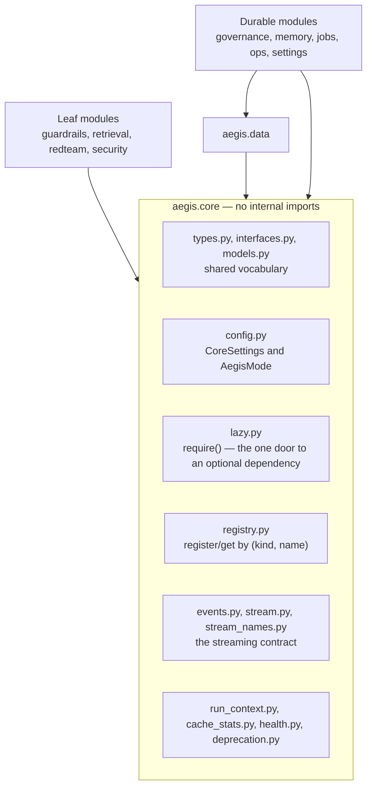

# Core

## What it is

`aegis.core` is the one package every other Aegis module is allowed to import.
It holds the shared vocabulary — value types, Protocols, the event contract, the
run context, typed configuration — and nothing else. It imports nothing internal
to Aegis and pulls in no heavy dependency.

## Why it exists

Aegis ships as installable modules, not as one application. A team should be able
to install `aegis[guardrails]` and get a working component without also getting a
database driver, a workflow engine or a document parser. That is only possible if
there is one small, shared substrate that every module can assume is present.
`aegis.core` is that substrate, and the rule "core imports nothing internal" is
what keeps it small.

## Diagram



## How it works

**Shared types.** `types.py` defines the value objects that cross module
boundaries: `GuardVerdict` (PASS / REDACT / FLAG / BLOCK), `GuardResult`,
`GuardStage`, `InjectionVerdict`, `PIIMatch`, `FormatCheck`, `RiskLevel`,
`RunStatus`, `ApprovalDecision`. `models.py` adds `ModelRole` — a *job* name
(`CHEAP`, `REASONING`, `GENERATION`, `EMBEDDING`, `VISION`, `VOICE`) so callers
ask for a model by role and the gateway owns the routing table.

**Protocols.** `interfaces.py` declares `ChatCompleter` and `Guardrail` as
`Protocol` classes. A **Protocol** is structural typing: any object with a
matching async `__call__` satisfies `ChatCompleter` without inheriting anything.
This is how the guardrail rails stay model-agnostic — the caller injects a
completer, the package never imports a provider.

**`require()` — fail loud on a missing optional dependency.** `lazy.py` is one
function. It imports a module or raises an `ImportError` naming the exact
`pip install` command:

```python
def require(extra: str, module: str) -> ModuleType:
    try:
        return importlib.import_module(module)
    except ImportError as exc:
        raise ImportError(
            f"This feature needs '{module}'. Run: pip install {extra}"
        ) from exc
```

Every optional dependency in Aegis is reached through it. There is no
`except ImportError: pass` path that quietly degrades.

**The registry.** `registry.py` keeps a `dict[(kind, name), type]`. A class
registers with `@register("guardrail", "default")`; a caller resolves with
`get(kind, name)`. `discover()` also reads `aegis.<kind>` entry points, so a
third-party component can register without editing Aegis.

**Infra mode.** `config.py` defines `CoreSettings`, read from `AEGIS_`-prefixed
environment variables, and `AegisMode`:

| Mode | Behaviour |
|---|---|
| `full` (default) | Requires Redis, Postgres and a vector-store URL. Refuses to boot without them. |
| `lite` | Opts into in-memory, non-durable implementations, loudly. |
| `auto` | Actually probes each backend via `aegis.core.health`; drops to `lite` only on a real failure, and logs which backend and why. |

`resolve_mode()` is async because probing is I/O. A host must `await` it and use
the returned mode; `settings.mode` is only the *declared* mode.

**The event contract.** `events.py` defines the discriminated union every module
narrates through (`StepStarted`, `GuardrailEvent`, `StepFinished`, each stamped
with an OpenInference `SpanKind`). `stream.py` wraps the AG-UI encoder as
`AegisEmitter` and owns the wire rules. `stream_names.py` is the closed set of
canonical `CustomEvent` names the console mirrors.

**Run identity.** `run_context.py` binds the in-flight run id into a
`contextvars` variable at the top of a run, so the gateway chokepoint can attach
spend to a run without a run id being threaded through every function signature.

**Cache accounting.** `cache_stats.py` exposes `record_hit` / `record_miss`,
called on the exact branch that returned a cached value or did not. Every cache
in the platform reports through it.

**Deprecation.** `deprecation.py` provides one decorator and one function. All
three of `since`, `removed_in` and `use` are required; an empty `use` raises
`ValueError` at import time, so a deprecation always names its replacement.

## What it stores

This module stores nothing. It defines no ORM tables and opens no connections.

## Security and tenant isolation

No tenant-scoped data. `aegis.core` holds no rows, no credentials and no policy.
The `RiskLevel` and `GuardVerdict` enums it defines are used by modules that do
enforce, but nothing is enforced here.

## API surface

No HTTP routes. The core is a library. Two host routes project data core
collects — `GET /v1/platform/caches` reads `cache_stats`, and the unversioned
`/readyz` probe reads `aegis.core.health` — but both routes are declared by the
backend, not by this module.

## Configuration

Read from `AEGIS_`-prefixed environment variables into `CoreSettings`.

| Variable | Default | Purpose |
|---|---|---|
| `AEGIS_MODE` | `full` | `full`, `lite` or `auto`. |
| `AEGIS_REDIS_URL` | unset | Redis/Memurai URL. Required in `full`. |
| `AEGIS_DATABASE_URL` | unset | Postgres URL. Required in `full`. |
| `AEGIS_VECTOR_STORE_URL` | unset | Qdrant node URL. Required in `full`. Also answers to `QDRANT_URL`, which is the name LightRAG's storage reads. |
| `AEGIS_VECTOR_STORE_PATH` | unset | LightRAG's local working directory. Not a required backend. |

## Where it lives

| File | What it does |
|---|---|
| `aegis/src/aegis/core/types.py` | The shared value types and enums. |
| `aegis/src/aegis/core/models.py` | `ModelRole` — the job-to-role enum. |
| `aegis/src/aegis/core/interfaces.py` | `ChatCompleter` and `Guardrail` Protocols. |
| `aegis/src/aegis/core/lazy.py` | `require()` — the optional-dependency door. |
| `aegis/src/aegis/core/registry.py` | `register` / `get` / `available` / `discover`. |
| `aegis/src/aegis/core/config.py` | `CoreSettings`, `AegisMode`, `resolve_mode()`. |
| `aegis/src/aegis/core/health.py` | Per-backend probes for Redis, Postgres, the vector store. |
| `aegis/src/aegis/core/events.py` | The event union and `SpanKind`. |
| `aegis/src/aegis/core/stream.py` | `AegisEmitter` — the AG-UI wire wrapper. |
| `aegis/src/aegis/core/stream_names.py` | Canonical `CustomEvent` name constants. |
| `aegis/src/aegis/core/run_context.py` | The per-run identity contextvar. |
| `aegis/src/aegis/core/cache_stats.py` | Hit/miss counters shared by every cache. |
| `aegis/src/aegis/core/deprecation.py` | The deprecation decorator and warning. |
| `aegis/src/aegis/core/__init__.py` | The package's public re-exports. |

## What it does not do

- **No business logic.** Nothing here screens text, chunks a document or scores an
  answer. Domain behaviour belongs in the module that owns it.
- **No database or network work.** `aegis.core` opens no connections. The health
  probes accept an injected client and reach a real driver only through
  `require()`.
- **No engine or session lifecycle.** Table shapes live in `aegis.data`; the
  engine belongs to the host application.
- **The registry is process-local.** It is a dictionary in this process, not a
  shared service discovery mechanism.
