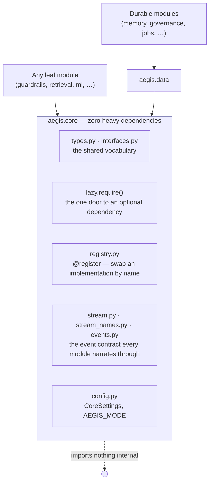

# Core

## What it is

The one package every other Aegis module is allowed to depend on: shared
types, a Protocol-based contract system, a registry, and a "fail loud, not
silent" way of handling optional dependencies. If you have never seen a
codebase organised this way: most Python projects let any module import any
other freely, which over time produces a tangle where you cannot install
"just the guardrails part" without pulling in every dependency the whole
project has ever accumulated. `aegis.core` is the deliberate exception to
that tangle — the one package with **zero heavy dependencies**, that
everything else can safely assume is already present.

## Why it exists here

Aegis's stated goal is to be **importable, not forkable** — a team building
an unrelated agentic system should be able to `pip install aegis[guardrails]`
and get a real, production-shaped component, not a stub tightly wired to
Aegis's own backend. That only works if there is a boundary: a leaf module
(say, `aegis.forecast`) can depend on `aegis.core` and nothing else internal,
so installing it never drags in Docling, Temporal, or a database driver it
does not need.

## Diagram



## The architecture

```
aegis/src/aegis/core/
  lazy.py         require() — the ONE sanctioned way to reach an optional dependency
  registry.py     the @register decorator + lookup, so a host can swap implementations
  interfaces.py   Protocols (ChatCompleter, etc.) — structural typing, no inheritance required
  types.py        shared value types (GuardVerdict, GuardResult, ModelRole, ...)
  models.py       shared Pydantic models
  config.py       CoreSettings, AegisMode (lite/full/auto)
  events.py       AegisEvent hierarchy — the streaming event contract every module emits through
  stream.py       AegisEmitter — the streaming interface
  stream_names.py the closed set of canonical CustomEvent names
  health.py       the boot-time store probes AEGIS_MODE=full refuses to start without
  run_context.py  the per-run context every module reads its scope from
  cache_stats.py  shared cache-hit accounting
  deprecation.py  the deprecation shim used when a public name moves
```

## What is actually in Aegis

### `require()` — fail loud, never `except ImportError: pass`

The entire function, quoted, because it is short and it is the whole idea:

```python
def require(extra: str, module: str) -> ModuleType:
    try:
        return importlib.import_module(module)
    except ImportError as exc:
        raise ImportError(
            f"This feature needs '{module}'. Run: pip install {extra}"
        ) from exc
```

This is used everywhere an optional dependency (NeMo Guardrails, Docling,
Presidio) is reached. The alternative — a silent `except ImportError: pass`
that degrades to some fallback behaviour with no signal — is exactly what
this function exists to prevent. A missing dependency is always a loud,
named `ImportError` telling the caller the exact `pip install` command to
fix it.

### The boundary rule, concretely

`aegis.core` imports nothing internal to Aegis. Every other module may
import `aegis.core`, and (for a defined set of "durable" modules that need
persistence) `aegis.data`, but not each other's internals freely. This is
what makes the module map in `docs/module/MODULE_REFERENCE.md` a real
dependency graph rather than aspiration — a module declared to need only the
`guardrails` extra genuinely cannot import, say, `aegis.jobs`'s Temporal
dependency, because nothing wires that import in.

### `@register` — swappable implementations, not hardcoded classes

Modules that a host might want to swap (the guardrail pipeline, for
instance) are registered under a name (`@register("guardrail", "default")`)
rather than imported by class name directly — a host can register an
alternative implementation under the same key and every caller resolving
through the registry gets the swap without changing their own imports.

## How it runs

`aegis.core` is not itself something that "runs" — it is the substrate
every other module's code executes against: its Protocols define what a
"chat completer" or "guard result" looks like structurally, its event types
define what every module streams, and `require()` is the gate every optional
dependency passes through.

## What is not here

- **No business logic of any kind.** If a file in this package is doing
  something domain-specific (screening text, chunking a document), it is in
  the wrong package by the project's own rule.
- **No database or network dependency.** `aegis.core` has zero heavy
  dependencies by design — anything needing a database is in `aegis.data`
  or above it.
