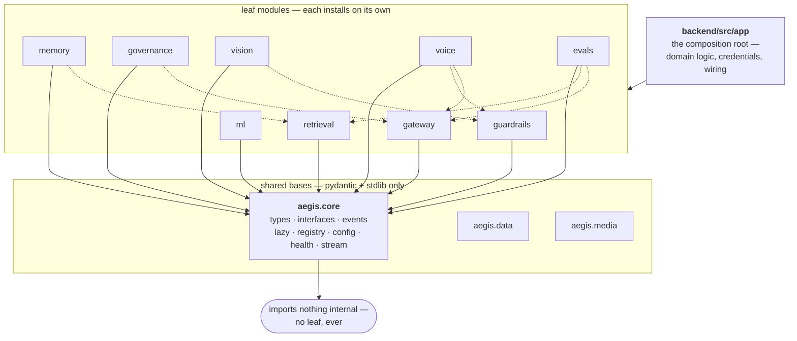
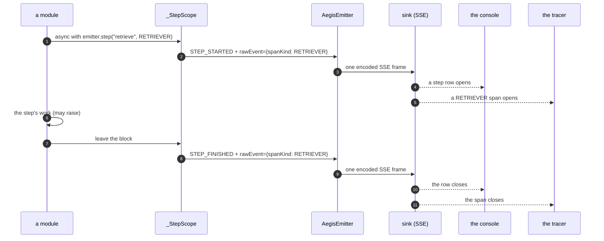
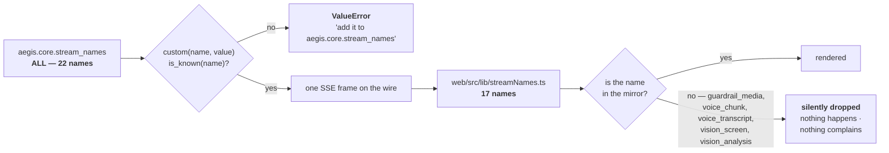
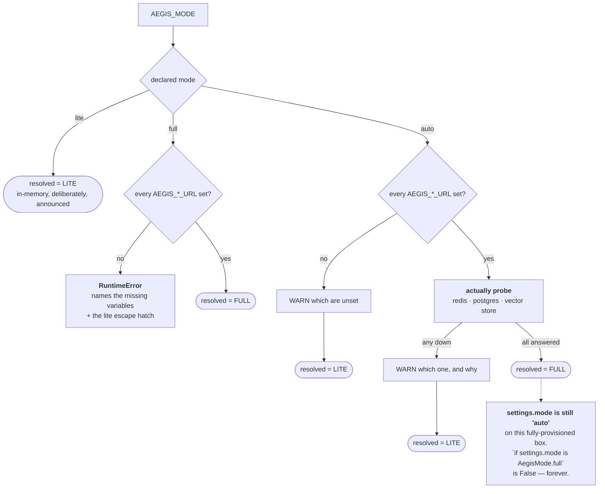

# The core — the diagrams

Five diagrams. The one worth reproducing from memory is **the dependency graph** — if you can
draw the layers and say which edges are allowed, you can explain why any module in this system
installs on its own.

Everything else about this module is in [`10-guide.md`](10-guide.md); a picture is only here when
it shows something prose cannot.

---

## 1. The dependency graph, and the edges that shouldn't exist

*Look at the dashed edges. Every one of them is a leaf importing a sibling.*

Solid edges are the contract: the app composes leaves, leaves depend only on a shared base, the
base depends on nothing internal. Draw only those and it is a star.

The dashed edges are real imports in the tree today, found by walking the AST. The architecture
doc names two of them; there are at least seven among the leaves, plus `ops → evals`,
`redteam → guardrails`, and the composition-layer modules `agent` and `security` which reach into
several siblings by design.

The lesson is not the count. The count was documented, correct when written, and went stale
because the isolation tests check **heaviness** — does importing this pull torch — and never
**topology**.

---

## 2. What happens when a control's library is missing

*Follow the top path to its end state. That is the one this codebase bans.*

```mermaid
flowchart TB
    START["an operator enables the image-PII rail;<br/>the presidio extra is not installed"] --> WHICH{"how does the<br/>code react?"}

    WHICH -->|"try / except ImportError<br/>HAS_PII = False"| S1["the rail becomes a no-op"]
    S1 --> S2["every image reaches the model<br/><b>unredacted</b>"]
    S2 --> S3["the verdict says PASS"]
    S3 --> S4(["nothing logs · the dashboard is green ·<br/>discovered at audit, months later"])

    WHICH -->|"require('aegis&#91;media&#93;', …)"| R1["ImportError:<br/>'This feature needs …<br/>Run: pip install aegis&#91;media&#93;'"]
    R1 --> R2(["loud · local · fixed in fifteen seconds"])

    WHICH -->|"a weaker engine exists<br/>(text PII: regex)"| D1["fall back to regex"]
    D1 --> D2["log WARNING on every selection ·<br/>active_engine() reports which is live ·<br/>AEGIS_PII_ENGINE=presidio makes it raise"]
    D2 --> R2
```

Degradation is not the banned thing. **Silent** degradation is. The bottom path is legitimate
because it announces itself and can be pinned closed; the top path is not, because a deployment
error has become a security downgrade with no evidence anywhere.

---

## 3. One step, two consumers

*Look at where the span kind is attached, and where it is read.*

**Step 8 happens whether or not the body raised**, because it is emitted from `__aexit__`. With
manual start/finish calls an exception skips it and the console spins forever.

**The `rawEvent` on steps 2 and 7 is the bug that was fixed.** The span kind used to be stored on
the scope object and never put on the wire — every call site declared it correctly, nothing
errored, and every span still rendered as a generic chain. The regression test asserts on the
*decoded frame*, not the scope object, because that is the only boundary the consumer actually
reads.

---

## 4. Where an event name can vanish

*Compare the two checks. One side raises; the other side has nothing.*

The server side cannot emit a name it does not know. The client side has no equivalent guard, and
the mirror is five names behind — all five of them live emissions from the media, voice and
vision rails.

The file's own header says *"parity is asserted by the count below"*. The count is
`STREAM_NAME_SET.size`, derived from the TypeScript list itself, so it can only count what is
already there. A comment claiming a check is not a check.

---

## 5. Declared mode is not resolved mode

*Look at the two boxes on the right. They are different values, and only one of them is true.*

`resolve_mode()` is `async` because probing is I/O, so the resolved mode is a **return value**,
not a field. It exists only where a caller kept it.

Both values are deliberately preserved: *"the operator asked for auto and we resolved to lite"* is
a more useful statement than *"the mode is lite"*. The cost is that callers must know which of
the two they are holding.

**Next:** [`50-interview.md`](50-interview.md) — the questions you'll be asked.
