# Core — the diagrams

Diagram 1 is the whole architecture. If you can draw the star and state the three rules,
you can explain why any module in this system is installable on its own.

---

## 1. The Module Contract — a star, not a mesh

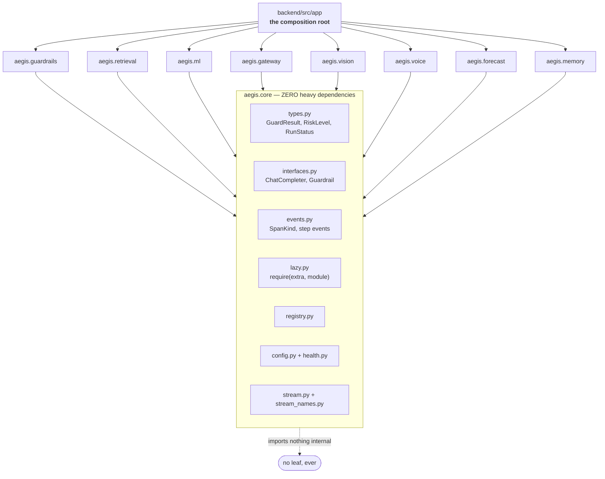

**Three rules.** The core imports nothing internal. A leaf imports only the core. No
leaf-to-leaf imports. Anything two modules must agree on goes into the core — which is
the *only* thing that stops the graph becoming a mesh.

---

## 2. Where the invariant is actually violated

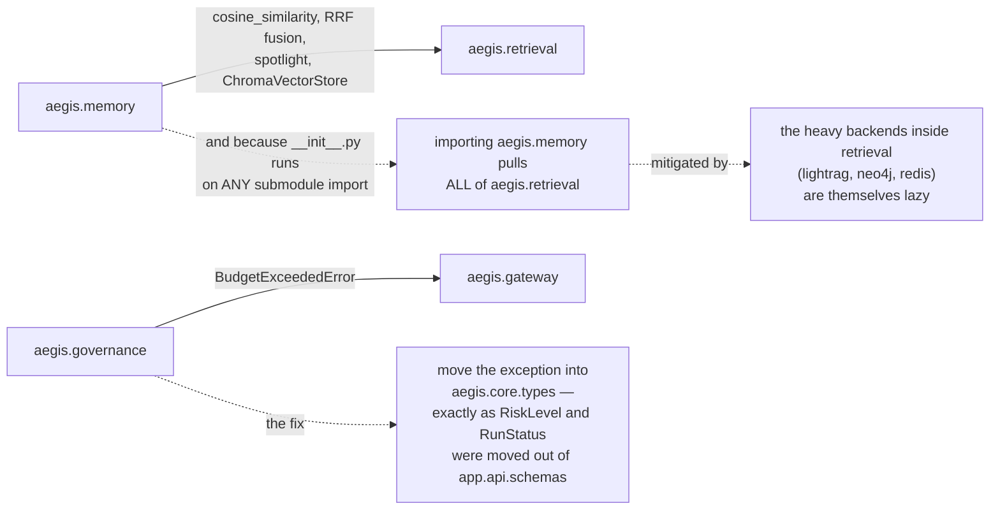

**Both are documented rather than smoothed over**, because *"the whole point of honest
infra is not claiming an invariant holds when the code says otherwise."*

What would make it structural: a test that walks the AST of every leaf, collects
`import aegis.<other>`, and asserts the set matches a small explicit allowlist.

---

## 3. `require` — the only sanctioned optional import

```mermaid
flowchart TB
    CALL["require('aegis&#91;forecast&#93;', 'statsforecast')<br/><i>inside a function body</i>"] --> TRY{"importlib.import_module"}

    TRY -->|ok| MOD["the module"]
    TRY -->|ImportError| RAISE["ImportError:<br/>'This feature needs statsforecast.<br/>Run: pip install aegis&#91;forecast&#93;'<br/><b>raise ... from exc</b>"]

    RAISE --> CHAIN["the chain shows the REAL missing<br/>transitive module underneath"]
    RAISE --> FIX["the message carries the COMMAND,<br/>not a category"]

    BAD["try: import x<br/>except ImportError: HAS_X = False"] -.->|"the banned pattern"| HARM
    HARM["1 · a DEPLOYMENT error becomes<br/>a runtime behaviour change<br/>2 · two paths, no signal which ran<br/>3 · unobservable — nothing logs<br/>4 · if x is a CONTROL, a silent downgrade<br/>5 · fails late, in production"]
```

**Placement matters as much as the mechanism.** At module top level the import would be
mandatory and the extra would be an extra in name only.

---

## 4. Structural seams — depend on shapes, not packages

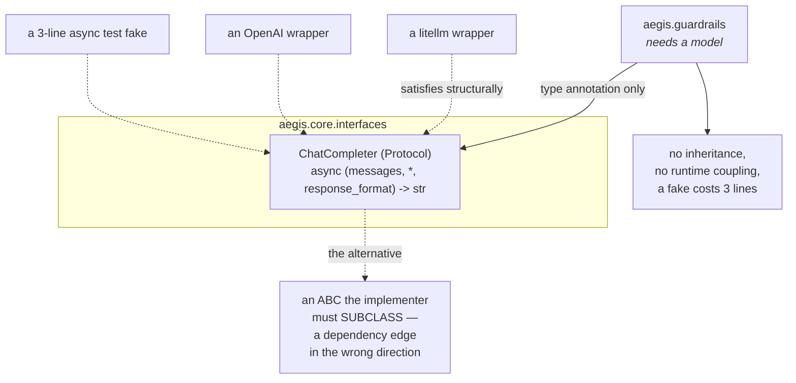

**Not every seam is a Protocol.** A rail is `Callable[[MediaPayload], GuardResult | None]`
because there is nothing keyword-only to express. `VisionAnalyst` *is* a Protocol because
it must return usage as well as text; `TranscribeCallable` is one because it takes a file
handle, not messages.

---

## 5. The streaming spine — one way to emit

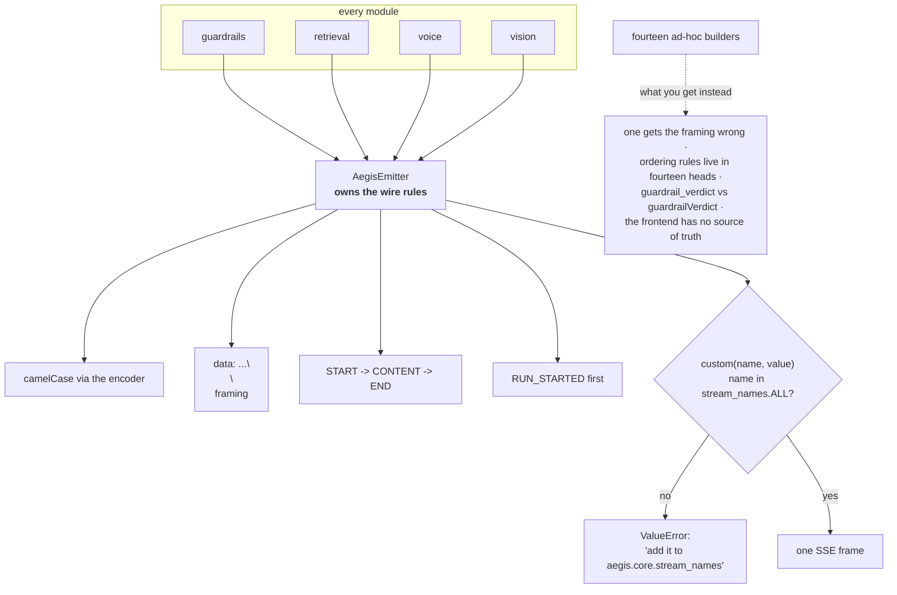

**Why raising on an unknown name matters:** an unregistered name reaching the frontend is
a **silent no-op**. Nothing happens and nothing complains — the hardest class of bug.

---

## 6. Bracketing that cannot be forgotten

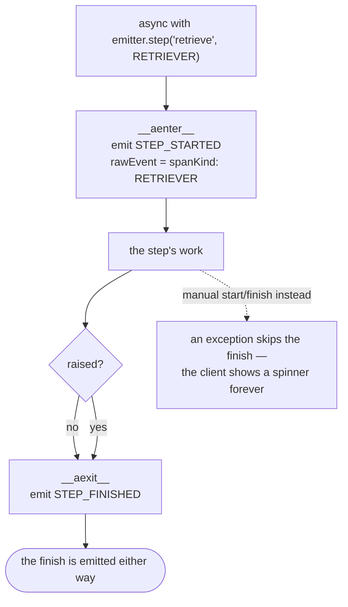

---

## 7. The span kind that was inert

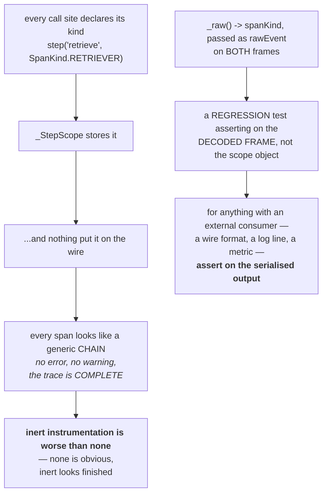

---

## 8. Infra mode — three postures, none silent

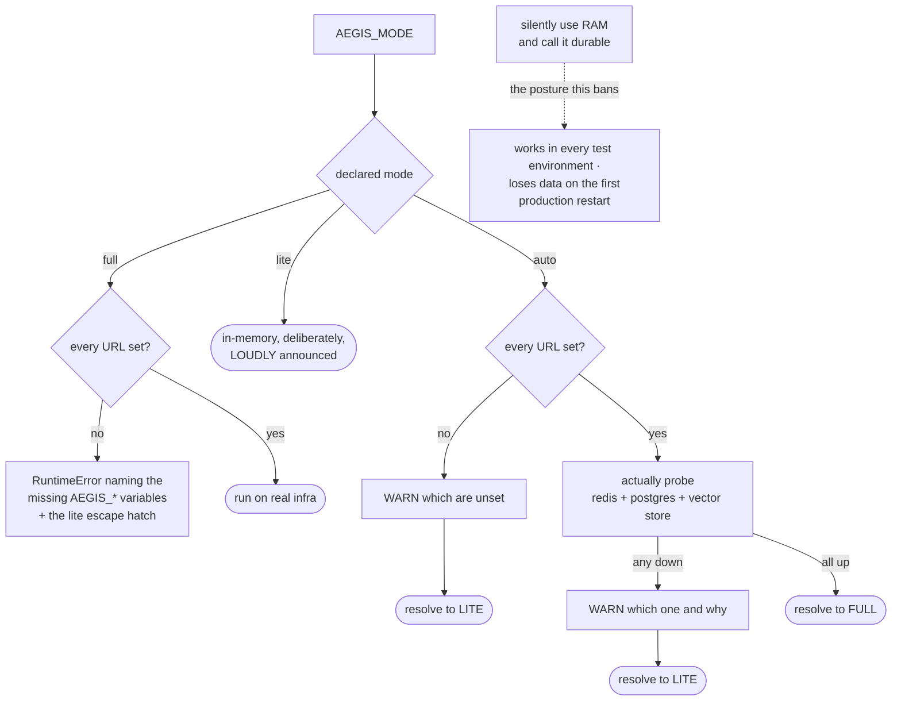

**The footgun:** in `auto`, `settings.mode` is the string `"auto"` **forever**. The
resolved mode is the *return value* of an async probe. Code reading the declared one when
it means the resolved one takes the lite branch on a fully-provisioned box.

---

## 9. Health probes — measured, never guessed

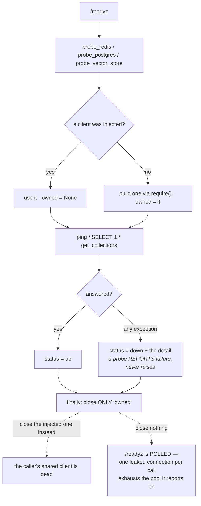

---

## 10. Imported, not forked

```mermaid
flowchart LR
    subgraph FORK["fork it"]
        F1["copy the repo"] --> F2["delete, edit, diverge"]
        F2 --> F3["upstream fixes never arrive ·<br/>your changes never go back ·<br/>two systems in six months"]
    end

    subgraph IMPORT["import it"]
        I1["pip install pkg&#91;guardrails&#93;"] --> I2["call it from your app"]
        I2 --> I3["upgrades are a version bump ·<br/>your code stays yours"]
    end

    IMPORT --> REQ["requires all three:"]
    REQ --> R1["no domain logic in the package"]
    REQ --> R2["each module installs independently"]
    REQ --> R3["dependencies INJECTED, not imported"]

    R1 --> PAY["retargeting the platform at a<br/>NEW problem = writing one adapter"]
    R2 --> PAY
    R3 --> PAY
```

**The payoff is a capability, not a tidiness benefit:** the difference between "we could
rebuild this for another domain in a few weeks" and "we can retarget it by implementing
one interface."

---

## 11. Isolation, tested per module

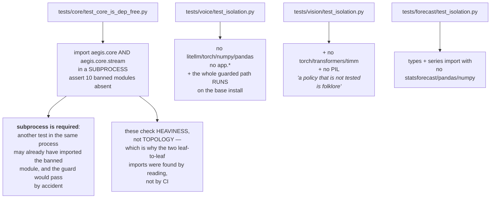

---

**Next:** [`50-interview.md`](50-interview.md).
