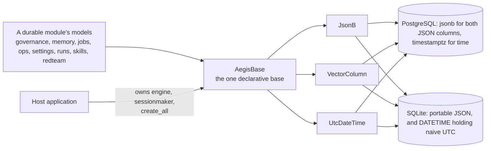

# Data

## What it is

`aegis.data` is the portable ORM foundation every durable Aegis module builds its
tables on. It is one declarative base, three cross-dialect column types, and one
constant. That is the whole package.

## Why it exists

Aegis runs on PostgreSQL in production and on SQLite in the unit-test suite, which
must run with no database server. A table declared with a Postgres-only type will
not materialise on SQLite. Without a shared foundation, every module needing a
JSON column, an embedding column or a timestamp would solve that separately — and
each separate solution is a chance to get UTC handling or dialect fallback wrong.
`aegis.data` solves it once, so every module gets it right by construction.

## Diagram



## How it works

**`AegisBase`** is a SQLAlchemy 2.0 `DeclarativeBase`. Modules register their
mapped classes on it, and the host application calls
`AegisBase.metadata.create_all` once at bootstrap. This module owns the *shape* of
the tables and nothing about their lifecycle — no engine, no session, no host
imports.

Its `type_annotation_map` maps `datetime` to `UtcDateTime`, so every
`Mapped[datetime]` on this base gets the correct timestamp type automatically
rather than by each author remembering.

**`JsonB`** is one line:

```python
JsonB = JSON().with_variant(JSONB, "postgresql")
```

SQLAlchemy's `.with_variant()` swaps the type per dialect. Production gets native,
indexable Postgres `jsonb`; SQLite gets portable `JSON` that round-trips the same
values.

**`VectorColumn`** stores an embedding as a JSON array of floats — `jsonb` on
Postgres, `JSON` elsewhere. It is deliberately **not** a pgvector `vector` column.
Approximate-nearest-neighbour search runs on Qdrant, the embedded vector engine;
this SQL column is the durable source of record that the memory mirror reads and
that a reindex replays from, never a search index. It carries no distance
operators. The `dim` argument is documentary — JSON storage does not enforce it,
and the mirror skips off-dimension rows at query time.

**`UtcDateTime`** is the timestamp contract. A plain `Mapped[datetime]` would map
to `TIMESTAMP WITHOUT TIME ZONE`, which is wrong in two ways on Postgres: asyncpg
refuses to encode a timezone-aware datetime for a naive column, and
`server_default=func.now()` on a naive column stores the server's local wall
clock rather than UTC. `UtcDateTime` closes both:

| Dialect | Column type | Behaviour |
|---|---|---|
| PostgreSQL | `TIMESTAMP WITH TIME ZONE` | Real instants; `now()` is correct regardless of the server's `TimeZone`. |
| Everything else | `DATETIME` | Holds naive UTC, because SQLite has no aware type. |

Binding normalises either input form (naive input is read as UTC). Loading always
returns an **aware UTC** datetime, so `datetime.now(UTC) - row.created_at` can
never raise a naive/aware `TypeError`.

**`EMBED_DIM = 3072`** is the dimensionality of the platform's one embedding model,
`genailab-maas-text-embedding-3-large`. Every `VectorColumn` is sized against it,
and it is re-exported through `aegis.retrieval` and `app.data.models` so there is
one number, not four.

## What it stores

This module stores nothing of its own. It declares no tables — it declares the
base and the column types that other modules' tables are made of. The tables built
on `AegisBase` are owned by the modules that declare them:

| Owner | Tables |
|---|---|
| `aegis.governance` | `tenants`, `users`, `budgets`, `usage_ledger`, `audit_log` |
| `aegis.memory` | `memory_session`, `memory_message`, `memory_fact`, `memory_profile`, `memory_write_log`, `memory_consolidation_job` |
| `aegis.jobs` | `job_runs`, `documents`, `chunks`, `table_summaries` |
| `aegis.ops` | `eval_results`, `prompt_versions` |
| `aegis.runs` | `runs`, `run_events` |
| `aegis.settings` | `settings` |
| `aegis.skills` | `agent_skills` |
| `aegis.redteam` | `redteam_runs` |

The backend keeps a second, separate `Base` in `backend/src/app/data/models.py`
for the platform-owned tables (`approvals`, `chat_sessions`, `chat_messages`,
`mcp_servers`, `notifications`). Both metadatas are created by
`app.data.session.bootstrap`.

## Security and tenant isolation

No tenant-scoped data. This package defines column types, not rows, and holds no
policy. Tenant isolation is enforced by `aegis.governance` — Postgres row-level
security plus an application-level predicate — on the tables that modules declare
on this base.

One shape here does matter downstream: because both metadatas share the same
`UtcDateTime` contract, a timestamp comparison in a tenant-scoped query behaves
identically across every table the policy covers.

## API surface

No HTTP routes.

## Configuration

No environment variables. `aegis.data` reads none — the host supplies the engine
and the connection URL. Its only install requirement is the `aegis[data]` extra,
which is `sqlalchemy[asyncio]`.

## Where it lives

| File | What it does |
|---|---|
| `aegis/src/aegis/data/base.py` | `AegisBase`, `JsonB`, `VectorColumn`, `UtcDateTime`, `EMBED_DIM`. |
| `aegis/src/aegis/data/__init__.py` | Re-exports all five names. |

## What it does not do

- **No pgvector.** The embedding column is a durable JSON record for replay, not a
  query index. Vector search runs on Qdrant.
- **No connection or session management.** The host owns the engine, the
  sessionmaker and the transaction boundaries.
- **No migrations.** `create_all` is `CREATE TABLE IF NOT EXISTS` and never alters
  an existing table. Additive column drift is reconciled by
  `aegis.governance.schema.reconcile_additive_columns` at host bootstrap.
- **No dimension enforcement.** `VectorColumn(3072)` records the number; JSON
  storage does not check it.
